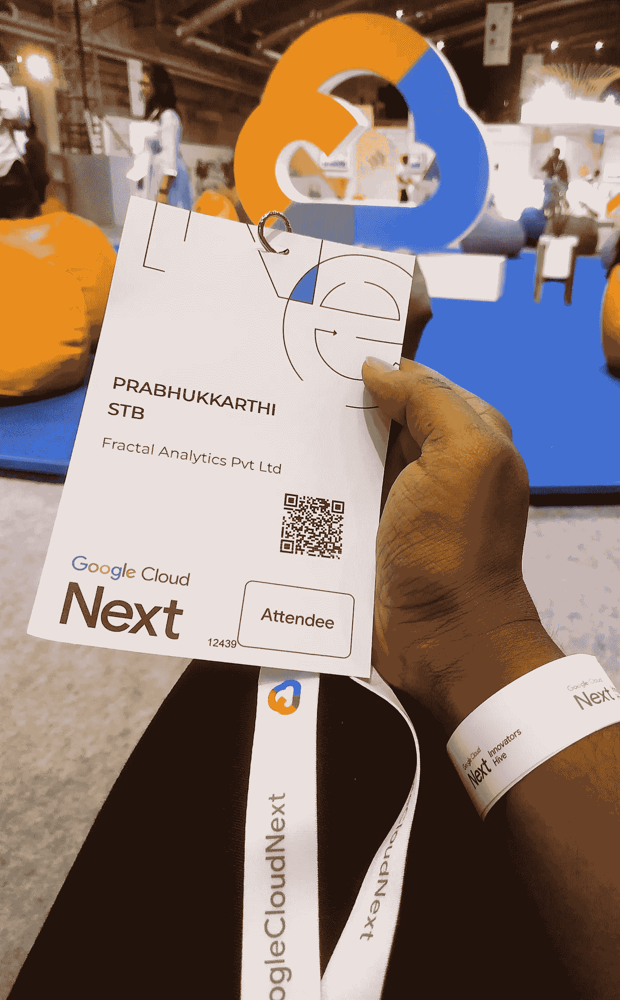

# GOOGLE CLOUD NEXT 的 10 大要点 22

> 原文：<https://medium.com/google-cloud/10-key-take-aways-from-google-cloud-next22-d5def84a3cf4?source=collection_archive---------0----------------------->

谷歌云，以前被称为谷歌云平台(GCP)，最近举行了年度技术大会-# Google Cloud next 22，以推出他们的最新功能，并为他们的未来计划创造一个热门话题！

它发生在世界各地的网上和网下。

作为一名狂热的谷歌云数据工程师，由于我的雇主 Fractal Analytics，我有机会参加了在 Bengaluru 举行的这个小型技术会议，并有机会会见了会议的主题发言人——云女孩——谷歌负责人——Priyanka verga dia，她以漫画式的谷歌云草图笔记而闻名，还有 Justyna Gnyp——亚太地区关系负责人！！！

谷歌以世界级的标准作为他们的旗舰活动举办了这次会议，我真的很喜欢这次会议，它对我来说是一次很好的学习经历！

# **我的十大收获是:**

⚫在 BigQuery 上取得重大突破，支持针对音频、视频文件和流数据的非结构化数据分析功能

⚫ BigQueryML 模型可以与顶点人工智能管道集成

⚫ SPARK 工作负载可以在 BigQuery 接口本身上执行，并引入了细粒度的数据治理

云日志中新发布的⚫日志分析功能

⚫现在，架构图表工具在一键式基础架构部署的基础上，在后台生成 Terraform 代码

⚫数据工作室已更名为 Looker 工作室

⚫ Looker 工作室-专业作为一个付费版本，将很快推出增强功能

⚫在谷歌云中启动 Looker 的选项将很快推出

⚫火花作业也可以在 Dataplex 中执行

⚫星火任务可以在顶点人工智能管道中运行

正如预期的那样，Google Cloud Next22 通过提供与所有其他服务的高级集成和执行新内容的附加功能，再次证明了 BigQuery 是 Google Cloud 的旗舰技术堆栈！！！

谷歌已经在#GoogleCloudNext22！

PFB 官方链接了解更多:

 [## Google Cloud Next’22 总结| Google Cloud 博客

### 想更深入吗？以下是所有 123 个(！)我们本周发布的公告，都在一个地方。企业…

cloud.google.com](https://cloud.google.com/blog/topics/google-cloud-next/google-cloud-next22-wrap-up)