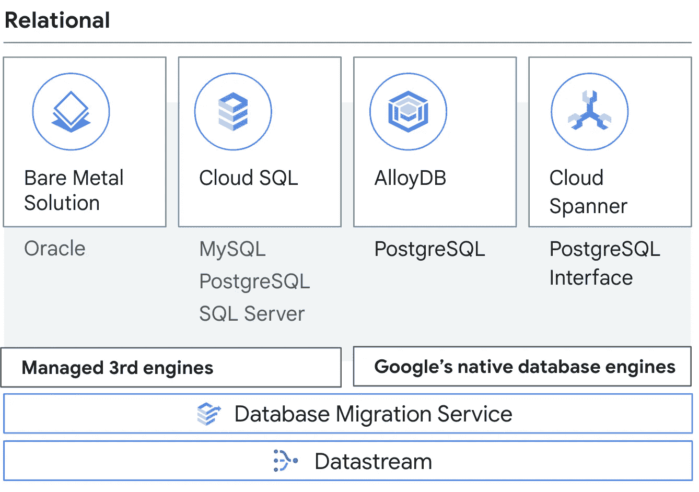
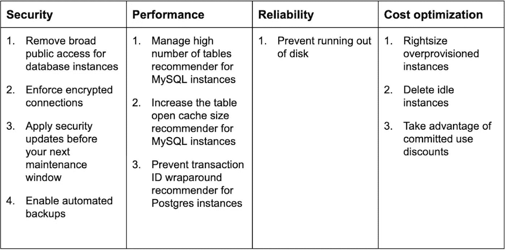

# Google Cloud 2022 十大必看数据库新版本和新特性。

> 原文：<https://medium.com/google-cloud/10-must-see-new-database-releases-and-features-from-google-cloud-in-2022-95f1e0347984?source=collection_archive---------2----------------------->

随着我们接近 2022 年底，很明显，今年充满了来自谷歌云数据库的令人兴奋的新发布和新功能。从我的角度来看，最突出的版本是在关系数据库领域，以及它们向 Google 云平台的迁移。考虑到这一点，我编制了一份我最喜欢的 10 个新版本的列表，包括预览版中真正改善了我们客户旅程的功能。当然，这些选择是基于我自己的偏见和偏好。



关系数据库——谷歌云

看看我列出的今年你不想错过的 10 大新特性和新版本，这是一种 SQL 语言

```
CREATE DATABASE AlloyDB FOR PostgreSQL;
CREATE DATA MIGRATION SERVICE FOR PostgreSQL TO AlloyDB;
CREATE DATASTREAM FROM PostgreSQL TO BigQuery;
CREATE DATA MIGRATION SERVICE FOR Oracle TO PostgreSQL;
ALTER  CLOUDSQL PASSWORD POLICIES FOR AUTHENTICATION SECURITY;
CREATE CASCADING READ REPLICA IN CloudSQL FOR PostgreSQL AND MySQL;
CREATE CLOUDSQL RECOMMENDERS AND QUERY INSIGHTS FOR MySQL;
CREATE INTERFACE FOR Cloud Spanner IN PostgreSQL;
CREATE FREE TRIAL INSTANCES AND HarbourBridge 2.0 IN Cloud Spanner;
CREATE REAL TIME STREAMINGS OF DML CHANGES IN Cloud Spanner;
CREATE NEW EXTENSIONS IN CloudSQL FOR PostgreSQL;
```

# 1.AlloyDB for PostgreSQL 是 GA

我是**对 AlloyDB 发布最激动的**，对我来说肯定是最激动的**。我更喜欢称之为**PostgreSQL 兼容的复仇者**，许多超级功能结合在一起，为最苛刻的企业级工作负载创建差异化的数据库服务。**

**完全托管的 PostgreSQL 兼容数据库服务，适用于要求最苛刻的企业数据库工作负载。 [**AlloyDB**](https://cloud.google.com/blog/products/databases/announcing-the-general-availability-of-alloydb-for-postgresql/) 是一个结合了 PostgreSQL 和 Google 的工程实践的最佳特性的数据库。它将计算和存储分开，允许水平扩展读取。它的列引擎非常适合 HTAP(混合事务和分析处理)工作负载，并且它集成了对人工智能/机器学习、跨区域读取副本和数据库咨询功能的支持。这些特性使它成为数据库行业的首选。**

**查看我的一些关于 AlloyDB 特性的博客。**

**[*释放 AlloyDB 上索引咨询扩展的威力，提升性能。*](/google-cloud/alloydb-and-advisory-extension-for-improving-performance-90f0b06192be)**

**[*利用 AlloyDB 跨区域复制实现全球可靠性*](/google-cloud/achieving-global-reliability-with-alloydb-cross-region-replication-3a67c6130c27)**

# **2.PostgreSQL 到 AlloyDB 迁移的数据库迁移服务—预览。**

**对于客户来说，升级到 AlloyDB 对于充分利用其功能至关重要。DMS 通过用户友好的界面和最小的中断，在为客户促进这种迁移方面发挥着至关重要的作用。**不要错过 AlloyDB 的优势——现在就在 DMS 的帮助下实现转变！****

**DMS 通过促进无缝、低影响地迁移到 AlloyDB，使客户能够满足他们对 PostgreSQL 的苛刻工作负载要求。使用 DMS，通过将本机复制与 pglogical 复制结合使用来增强保真度和可靠性，使同构迁移变得简单而快速。此外，DMS 还提供持续监控，以确保平稳过渡和最佳性能。**

**查看我发表的一些关于 Google Cloud 上的同构迁移的博客。**

**[*将具有凭证的用户从 CloudSQL 迁移到 AlloyDB 或另一个 CloudSQL 实例。*](/google-cloud/migrate-users-with-credentials-from-cloudsql-to-another-instance-or-alloydb-for-postgresql-e377a222d3f8)**

**[*PostgreSQL 中的迁移后任务:迁移授权和重新分配所有者*](/google-cloud/migrate-grants-and-reassign-owner-in-alloydb-for-postgresql-post-dms-610393731024)**

# **3.数据流直接支持 PostgreSQL 作为源，BigQuery 作为目标—预览。**

**作为一名 PostgreSQL 爱好者，我很高兴 Datastream 现在支持 PostgreSQL 作为源代码。对于任何使用 PostgreSQL 并希望通过 Google Cloud 将其分析提升到新水平的人来说，这是一个游戏规则改变者。**

**借助 Datastream 对 PostgreSQL 的支持，包括 AlloyDB，我们现在可以轻松地设计流式解决方案，直接将数据发送到 BigQuery 或 GCS 进行实时分析。Datastream 以最小的延迟无缝复制来自交易源的数据，使其成为任何希望最大化其数据价值的人的强大工具。此外，作为一种无服务器服务，Datastream 可以自动扩展或缩小以满足您的需求，而不会增加任何复杂性。**

**查看一些以 PostgreSQL 为来源的博客和有趣的真实用例。**

**[*为 PostgreSQL 和 BigQuery 解决数据流上的真实世界场景。*](/google-cloud/solving-real-world-scenarios-on-datastream-for-postgresql-and-bigquery-b79334a065fc)**

**[*只为 PostgreSQL 上的某些 DML 配置数据流作为源。*](/google-cloud/configure-google-cloud-datastream-for-only-certain-dmls-on-postgresql-as-source-16e4ad789ef8)**

**[*使用 Datastream 配置从 PostgreSQL 中分区表到 BigQuery 中非分区的流。*](/google-cloud/configure-streams-from-partition-table-in-postgresql-to-non-partition-in-bigquery-using-datastream-3238fe3321d9)**

**[*使用 PostgreSQL 的 BigQuery 中预定义的表配置数据流中的流作为源*](/google-cloud/configure-streams-in-datastream-with-predefined-tables-in-bigquery-for-postgresql-as-source-528340f7989b)**

# **4.Oracle 到 PostgreSQL 的数据库迁移服务—私有预览。**

**我真的**享受异构数据库迁移的挑战和回报**。Google Cloud Database Migration Service(DMS)通过提供对整体迁移流程和连续数据移动的支持，使得从 **Oracle 迁移到 Google Cloud** 上的 PostgreSQL 变得非常容易。这使得它成为在 Google Cloud 上迁移到 PostgreSQL 兼容数据库的一个便利选择。**

**客户远离传统商业数据库的主要原因之一是打破许可限制，在谷歌云中采用流行的开源选项，如 PostgreSQL。Google Cloud Database Migration Service(DMS)使移动数据变得容易，而不必设置和维护服务器，它包括监控和与 Ora2pg 工具的集成，用于模式转换。如果你有兴趣了解更多，请查看谷歌云博客了解更多细节。**

**[*借助数据库迁移服务将您的 Oracle 工作负载升级到 PostgreSQL，现已发布*](https://cloud.google.com/blog/products/databases/migrate-oracle-to-postgresql)**

# **5.CloudSQL 密码策略，增强 PostgreSQL 和 MySQL 的内置认证安全性。**

**W 对于我工作过的所有客户来说，**安全性是需要与数据库结合在一起的关键部分**。定义密码策略，加强身份验证，并帮助客户对所有数据库用户实施规则。**

**CloudSQL for PostgreSQL 和 MySQL 都支持通过使用密码策略的内置身份验证来增强安全性。例如，密码策略可以包括**

*   ****最小长度****
*   ****密码复杂，包含多种字符、数字和非字母数字****
*   ****限制密码重复使用****
*   ****不允许用户名作为密码****
*   ****设置密码更改间隔**(仅适用于 PostgreSQL)**

**查看我的博客了解更多信息。**

**[*使用 CloudSQL for PostgreSQL 实现更强的安全性:实施密码策略。*](/google-cloud/password-policies-with-cloudsql-for-postgresql-adf7f7e18cca)**

# **6.用于 PostgreSQL 和 MySQL 的 CloudSQL 中的级联读取副本。**

**R **ead 副本**已经改变了关系数据库的整个范式，允许**水平缩放读取**。我们鼓励客户更新应用程序逻辑，以利用读取副本来扩展读取用例的应用程序。级联读取复制副本通过将读取复制副本放在读取复制副本的顶部，使其更进一步。**

**级联复制允许您创建一系列读取副本，其中一个读取副本充当另一个读取副本的源。这在各种情况下都很有用，例如**灾难恢复、性能改进、扩展读取和降低成本**。**

**级联复制副本还可以通过在多个读取复制副本之间分配复制工作来帮助减轻主实例的负担，并且可以通过增加可用于处理读取请求的复制副本数量来扩展读取。此外，使用带有**跨区域复制的单个级联副本可以帮助您降低网络成本**，尤其是当您有来自多个区域的用户访问您的数据库时。**

**查看谷歌云[文档](https://cloud.google.com/sql/docs/postgres/replication#cascading-replicas)了解更多信息。**

# **7.MySQL 的 CloudSQL 推荐器和查询洞察。**

**O 生产就绪性的关键要素之一是**数据库可观察性**，主动建议**提高成本、性能和增强安全性**。高效的监控和故障排除服务建立可靠性和信任。主动协助和查询洞察为推荐者提供了动力，为客户提供了谷歌云上的可靠性。**

****CloudSQL 推荐器**通过主动协助，围绕安全性、成本和性能提供主动建议，增强客户体验。可用推荐人的综合列表如下(一些也将在私人预览)。**

****

**主动辅助— CloudSQL 推荐器。**

**查看 [*谷歌博客*](https://cloud.google.com/blog/products/databases/proactive-database-wellness-with-active-assist) 获取更多见解。**

****查询洞察**，数据库可观察性的一个特性，允许客户调查性能或资源匮乏问题，并识别有问题的语句。最初可用于 PostgreSQL，现在也支持 MySQL 。这使客户能够提高数据库性能，更有效地解决问题。查看 [*谷歌云文档*](https://cloud.google.com/sql/docs/postgres/using-query-insights) 了解更多信息。**

# **8.云扳手的 PostgreSQL 接口— GA**

**和我一样，谷歌云对 PostgreSQL 有着强烈的亲和力，这在他们的产品中显而易见，如 CloudSQL、AlloyDB 和 Cloud Spanner 的 PostgreSQL 接口。PostgreSQL 正在成为企业关系数据库的流行选择，而 Google Cloud 是运行 PostgreSQL 工作负载的好地方。**

**云扳手的 PostgreSQL 接口，为 PostgreSQL 兼容数据库的运行打开大门，并利用云扳手的全球可用性、99.999% SLA、无限读写规模以及零 RPO 和零 RTO。PGAdapter 是一个代理，允许您使用云扳手的 PostgreSQL 接口。它与您的应用程序运行在同一台计算机上，并提供一个可通过 localhost 访问的端点，并支持 PostgreSQL wire 协议。这允许您的应用程序使用 PostgreSQL 接口与 Cloud Spanner 通信。
2022 年新增的一些 PostgreSQL 方言支持包括。**

*   **支持**返回**子句，将数据作为 DML 的一部分返回，用于获取默认值或生成值，作为数据操作的一部分。**
*   **【PostgreSQL 接口的离开时间(TIL) 。**
*   **对 **JSONB** 的数据类型支持**

**请查看[谷歌云文档](https://cloud.google.com/spanner/docs/postgresql-interface)了解更多细节。**

# **9.云扳手免费试用实例和 HarbourBridge 2.0 版本。**

**M 迁移对我来说是一个非常重要的话题，我对开源的 Harbour Bridge 工具非常感兴趣，该工具通过评估、模式转换和数据移动等特性为最短停机时间迁移提供支持。如果您正在考虑迁移到 Cloud Spanner，我强烈建议您尝试一下。**

**C loud Spanner 是重新定义了现代关系数据库的 Google 云原生数据库产品，它的免费试用对于希望评估 Google 标准 SQL 或 PostgreSQL-dialect 数据库以进行迁移或绿地开发的客户来说是一个促进。**

****HarbourBridge** 是一款开源工具，旨在帮助您评估和迁移到 Cloud Spanner。它处理来自各种类型数据库的数据，包括 PostgreSQL、MySQL、SQL Server、Oracle 和 Amazon DynamoDB。它旨在简化评估和迁移到 Cloud Spanner 的过程。**

**查看关于其使用的详细博客，获得关于整体迁移的深刻见解。**

**[*使用 HarbourBridge 2.0 最大限度减少迁移到云扳手的停机时间*](https://cloud.google.com/blog/topics/developers-practitioners/minimal-downtime-migrations-cloud-spanner-harbourbridge-20)**

**云扳手免费试用实例允许您免费学习和探索该服务 **90 天**。在试用期间，您可以创建数据库并存储高达 **10 GB** 的数据。试用后如果想继续使用云扳手，可以随时升级。这是一个尝试该服务并了解它如何为您的组织带来益处的绝佳机会。**

**查看[谷歌云文档](https://cloud.google.com/spanner/docs/free-trial-instance)了解更多信息。**

# **10.云扳手—更改流**

**C 发布关于数据操作的流事件的能力使客户能够设计和构建实时分析解决方案，根据业务用例对变化做出反应。**

**更改流监视和发出数据库更改事件，包括 IUD(插入/更新/删除)。它有助于使用 BigQuery 复制数据，根据变化或业务逻辑触发下游应用程序，或将数据存储在云存储中以供存档或将来参考。更改流还增加了对 NEW_VALUES 和 NEW_ROW 选项的支持，以便只捕获新的更改进行更新。它还允许与 Kafka 连接器集成。**

**查看谷歌云博客了解更多见解。
[*变流为云扳手:现在一般可用*](https://cloud.google.com/blog/products/spanner/change-streams-for-cloud-spanner-now-generally-available)**

**在我的列表中增加一个，它必须支持新的 PostgreSQL 扩展。**

# **11.CloudSQL for PostgreSQL —新的扩展。**

**ostgreSQL 扩展为数据库增加了额外的功能，并且几乎总是出现在 PostgreSQL 服务器上。事实上，过程语言扩展“pl/pgsql”本身就是一个扩展。AlloyDB 数据库包括对列引擎、数据库咨询服务和机器学习集成的扩展。**

**2022 年，CloudSQL for PostgreSQL 增加了对以下新扩展的支持，使客户能够在数据库中使用许多功能。**

*   ****pg_bigm :** 启用全文搜索，并允许双元(bigram)索引以加快全文搜索。**
*   ****refint :** 启用外键约束、引用表和被引用表的检查。**
*   ****decoderbufs :** 一个逻辑解码器，将输出数据作为协议缓冲区，适用于 Debezium。**
*   ****pg_wait_sample :** 收集等待事件的抽样统计，为服务器上的进程提供等待事件数据。**
*   ****pgRouting :** 通过网络路由和分析，增强 PostGIS 的地理空间处理。**
*   ****plv8 :** 提供了一种支持使用 JavaScript 的过程语言。**
*   ****amcheck :** 启用 pg_amcheck 应用程序来检查 PostgreSQL 数据库中的损坏。**

**查看由 CloudSQL 支持的扩展的[完整列表](https://cloud.google.com/sql/docs/postgres/extensions#miscellaneous-extensions)。我还发表了一篇关于扩展如何促进从遗留商业数据库中迁移出来的迁移模式的博客。**

**[*将 Oracle 自治事务迁移到 CloudSQL for PostgreSQL。*](/google-cloud/migrate-oracle-autonomous-transaction-to-cloudsql-for-postgresql-adbc35152ba2)**