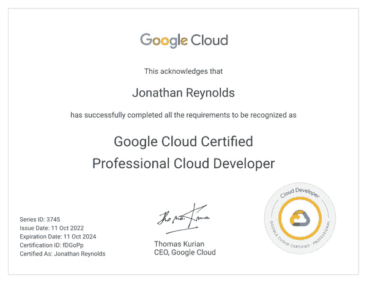
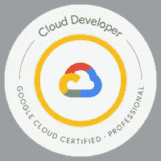

# 2022 Google Cloud 专业云开发者认证回顾

> 原文：<https://medium.com/google-cloud/2022-google-cloud-professional-cloud-developer-certification-review-c6a1e27767dc?source=collection_archive---------2----------------------->

[凯文泽尔](https://unsplash.com/@kai_wenzel?utm_source=medium&utm_medium=referral)在 [Unsplash](https://unsplash.com?utm_source=medium&utm_medium=referral) 上拍照

**TL；博士**——我强烈推荐这个认证给任何想要验证他们在 GCP 开发和部署现代应用程序的知识的人。滚动到底部，可以看到考试涉及的主要话题，以及我用来学习的资源。

## 为什么我决定获得认证？

今年 7 月，我刚刚开始在谷歌担任云顾问。在谷歌之前，我所有的云体验都是在 AWS 上完成的。因此，我知道我需要快速提升谷歌云，才能在我的岗位上取得成功。

我最喜欢的学习方法之一是通过认证。我已经制定了个人目标，要获得所有可用的 GCP 认证，以此来获得更多关于 GCP 的知识。虽然我知道证书只是证书，不能代替经验，但我相信它为积累额外的知识提供了坚实的基础。

作为一名软件工程出身的人，我认为云开发者认证是最好的选择。

## 我的考试经历

2022 年 10 月 4 日，专业云开发者(PCD)考试最新版本发布。我在 2022 年 10 月 7 日尝试并通过了，所以我想我是第一批尝试新版本的人之一。

在官方认证发布公告中，他们解释说*新的专业云开发人员考试更加重视云运行、GKE 和无服务器架构，而不太重视基础架构任务和传统服务*。*新考试没有案例分析。根据我的经验，我认为这在很大程度上是一个非常准确的描述。*

我已经在下一部分列出了考试中涉及的主要话题。

考试形式与其他 GCP 考试相当标准。有 60 个问题需要在 2 小时内完成。每个问题大概有两分钟时间。我在还剩 22 秒的时候提交了试卷。

通过排除过程，你通常可以在多项选择和多项回答问题中排除至少两个可能的选项。我的一般经验是，尽量不要在任何一个问题上花超过 90 秒的时间，如果我不确定，就把它标记为复习，稍后在提交考试之前再回来。

**注:**最近一个多月一直在学习专业云 DevOps 工程师(PCDE)认证。我听说 PCDE 实际上是**专业云开发者+ SRE** 。我也同意这一点。在参加 PCD/PCDE 实践考试时，我注意到两个认证之间有很多重叠。对于已经获得 PCDE 认证的人，我建议他们也尝试 PCD 认证。另一方面，在获得 PCD 后，学习 PCDE 认证也是值得的。

我还注意到一件事。**在开始考试之前，上面提到有一个案例研究。这个可以忽略。我认为还没有更新来反映新的考试版本。**

## 学习技巧

我对学习的建议是看一看[考试指南](https://cloud.google.com/certification/guides/cloud-developer)，这是对考试内容的一个很好的高层次概述。因为我来自 AWS 背景，所以参加为 AWS 专业人员设计的[介绍性谷歌云课程](https://www.cloudskillsboost.google/course_templates/38)很有帮助。就我而言，我也会关注下一部分列出的主题，因为这些都是我在考试中遇到的。

## 涵盖的主要主题

对于下面列出的每个主题，我建议对每个项目及其主要特征有一个扎实的理解。

对于部署策略、测试策略、计算选项和存储选项等主题，我还建议密切关注每种方法的优缺点，并真正理解适当的使用案例。

花时间熟悉通过云操作进行应用程序调试也是有益的。

**谷歌 Kubernetes 引擎(GKE)**

**部署策略**

*   **A/B 测试**
*   **金丝雀部署**
*   **蓝绿部署**

**部署云资源**

*   **云构建**
*   **工件注册表**

**测试策略**

*   **特征标志**
*   **API 开发中的向后兼容性**
*   **使用仿真器进行单元测试**
*   **模仿谷歌云服务进行本地应用开发**
*   **集成测试**

**通过云操作套件排除应用故障**

*   **云日志**
*   **云迹**
*   **云廓线仪**
*   **云调试器**

**计算选项(*每个*的正确用例是什么时候:**

*   **GKE**
*   **云运行**
*   **云功能**
*   **计算引擎**

**微服务架构**

**IAM /安全最佳实践**

*   **最小特权原则**
*   库伯内特的秘密
*   **身份感知代理**
*   **服务账户**

**存储选项(*每个*的正确使用情形是什么时候):**

*   **云存储**
*   **云 SQL**
*   **云扳手**
*   **Bigtable**
*   **Firestore/Datastore**
*   **BigQuery**

**发布/订阅最佳实践**

## 资源/学习材料

*   云大师实践考试
*   Whiz 实验室练习考试
*   [面向 AWS 专业人员的谷歌云基础知识](https://www.cloudskillsboost.google/course_templates/38)
*   [可视化谷歌云:云工程师和架构师的 101 个图解参考](https://www.amazon.com/Visualizing-Google-Cloud-Illustrated-References/dp/1119816327)
*   [谷歌云技术 Youtube 页面](https://www.youtube.com/user/googlecloudplatform/videos)
*   [GCP 产品文档](https://cloud.google.com/products)