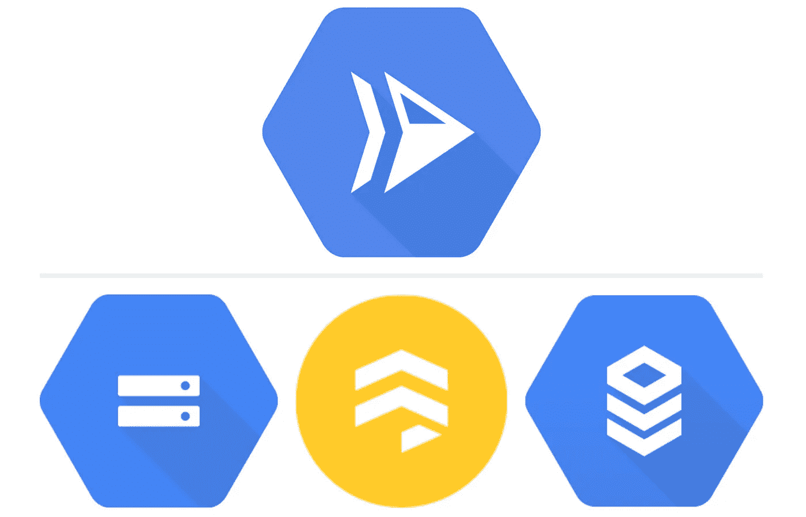

# 云运行持久存储的 3 大选择

> 原文：<https://medium.com/google-cloud/3-great-options-for-persistent-storage-with-cloud-run-f1581ee05164?source=collection_archive---------0----------------------->

使用云存储、云 Firestore 和云 SQL 运行云

Cloud Run 是一个托管计算平台，可以自动扩展您的无状态容器。云运行是无服务器的:它将所有基础设施管理抽象化，因此您可以专注于最重要的事情—构建优秀的应用程序。

然而，大多数应用程序都是**有状态的**。作为开发人员，如何永久存储图像、数据库记录和其他数据？

在本文中，我们将讨论 3 种使用 Cloud Run 在 Google 云平台上存储数据的示例方法。

# 谷歌云存储

根据应用程序的需求，在 Google Cloud 上存储数据有多种方式。在这个假想的应用程序中，让我们创建一个电子商务鞋店。以下是我们将用于存储不同类型数据的三种存储选项:

## 云存储

对于存储**文件/对象**，如图像和视频，或存档备份，[谷歌云存储](https://cloud.google.com/storage/docs)是这类数据的绝佳选择。以下是 Node 中可用于云运行的示例代码片段:

将文件上传到 Google 云存储

## 云 Firestore

对于存储**非结构化**数据，或者创建灵活的 NoSQL 云数据库， [Cloud Firestore](https://firebase.google.com/docs/firestore) 是移动、web 和服务器开发的绝佳解决方案。在这个示例中，我们希望为鞋子数据存储灵活的 JSON 对象:

向 Firestore 添加 doc/JSON 记录

## 云 SQL

对于在 RDBMS 中存储**结构化**数据，比如 MySQL、PostgreSQL、SQL Server， [Cloud SQL](https://cloud.google.com/sql/) 可以连接到一个很好的接口来存储和查询你的数据。这里创建了一个客户表，我们可以使用熟悉的 SQL 来创建强大的查询:

从云 SQL 表中读取

> 注意:有关如何连接和一起使用这些服务的完整文档，请参见 [*从云运行连接到云 SQL(完全托管)*](https://cloud.google.com/sql/docs/mysql/connect-run) 。

这是在 GCP 存储数据的 3 个存储选项。其他产品包括[云文件存储](https://cloud.google.com/filestore/)、【Firebase 云存储、[其他数据库](https://cloud.google.com/products/databases/)中的[云存储](http://Cloud Memorystore)。

# 其他提示

有时，您的数据存储可能需要更多配置。这里有两个提示:

*   Cloud Run 的**“Max Instances”**特性可以限制处理运行服务的实例数量。这反过来会限制对存储服务的请求数量。[阅读更多🔗](https://cloud.google.com/run/docs/configuring/max-instances)。
*   **具有每个队列速率限制的云任务**可以放在云运行服务之前，以平滑快速或不稳定的请求。[阅读更多🔗](https://cloud.google.com/tasks/)。

# 参考

感谢阅读。如果您想了解更多关于使用 GCP 存储数据的信息，请点击以下链接:

*   🗃 [解决方案:谷歌云的数据管理产品](http://cloud.google.com/solutions/data-management)
*   🖼 [教程:使用云运行和云存储处理图像](https://cloud.google.com/run/docs/tutorials/image-processing)