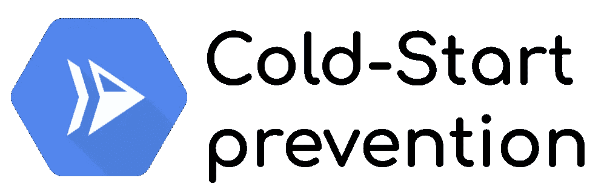
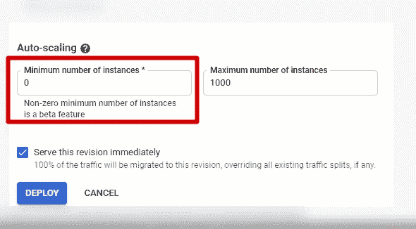
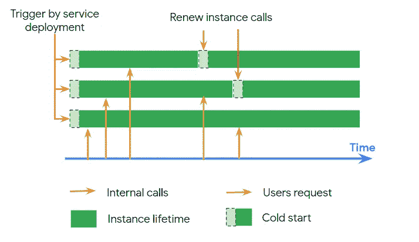
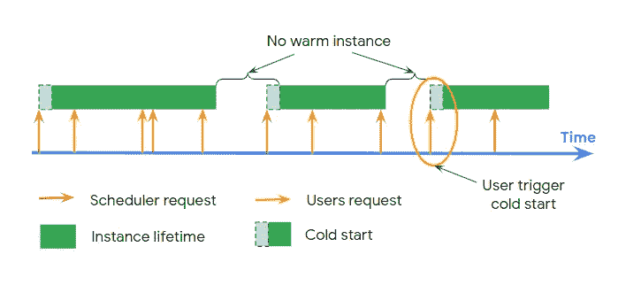
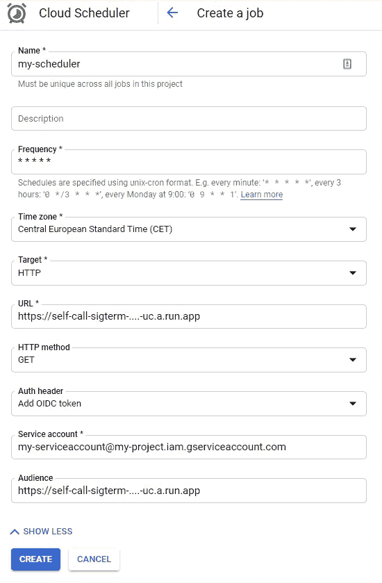
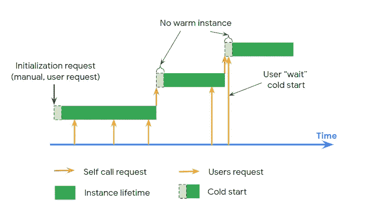

# 减轻云运行冷启动的 3 种解决方案。

> 原文：<https://medium.com/google-cloud/3-solutions-to-mitigate-the-cold-starts-on-cloud-run-8c60f0ae7894?source=collection_archive---------0----------------------->



无服务器模式，在其终极设计中，只允许**在你使用服务**时付费。使用 Cloud Run，您只需支付正在处理的请求。剩下的**时间里，你什么都不用付出**。其他服务如**云函数**、 **App Engine (standard)** 也是如此，甚至在其他云上 Azure 函数或 AWS Lambda 也是如此。

为了使这成为可能并可持续，云提供商**需要在服务空闲时保存资源**，从而**停止空闲实例**，因此**缩减至 0** 。
从 0 开始，当一个新的请求进来时，你的应用需要被加载到一个实例上，启动/初始化，然后准备好服务流量。**该初始化比已经初始化的实例(*热启动*)花费更多的时间(*冷启动)*** )。

> 如何减轻或消除云运行中的这种冷启动？

我将介绍 3 种可能的解决方案及其利弊。

# 最小实例特征

第一个解决方案是一个**内置的**和新鲜的[新特性:最小实例](https://cloud.google.com/run/docs/configuring/min-instances)。它允许**定义保持温暖的最小实例数量**，即使服务不服务任何请求，因此**减少/避免冷启动。**

因为是内置的特性，**用起来很轻松简单。[使用`gcloud` CLI *(目前为测试版)*或直接通过 UI 使用](https://cloud.google.com/sdk/gcloud/reference/beta/run/deploy#--min-instances) `[--min-instance](https://cloud.google.com/sdk/gcloud/reference/beta/run/deploy#--min-instances)s` [参数](https://cloud.google.com/sdk/gcloud/reference/beta/run/deploy#--min-instances)部署您的服务**



该解决方案**防止冷启动从 0 到 1，但也达到最小实例值**。因此，需要 1 个以上的实例来服务流量，**扩大规模更平滑**。



但是，这个**特性是有代价的:** [空闲实例在不服务流量时被计费](https://cloud.google.com/run/pricing#tables) **。
*服务流量时，适用标准费率。***

简而言之，**空闲实例的成本**:

*   vCPU 标准费率的约 10%。
*   内存标准速率的 100%。

# 预定轮询请求

第二种解决方案**使用** [**云调度器**](https://cloud.google.com/scheduler) **来定期轮询**云运行服务并**保持实例预热**。

该解决方案**仅防止从 0 到 1** 的冷启动。此外，这只是**配置，不需要额外的代码**。



与解决方案 1 相比，这个**解决方案是免费的**(或者至少非常实惠)。然而，它的主要问题是可能的“无实例”期。
*事实上，即使您将调度程序设置为每分钟轮询一次(云调度程序的最低周期)，当前实例也可以在轮询后立即终止，并且在长达 60 秒的时间内，用户可以冷启动。*

该解决方案**易于配置:**

*   转到[云调度程序页面](https://console.cloud.google.com/cloudscheduler)
*   创建新工作
*   命名你的工作，选择你的频率，粘贴你的云运行服务网址。*你可以在这里添加你想要的路径*
*   然后选择 HTTP 作为目标并配置 HTTP 谓词

**就这些！！**
如果您有**私有云运行服务，则需要额外配置**

*   点击`SHOW MORE`扩展验证能力
*   选择`Add OIDC Token`，填写您的服务账户(必须有`roles/run.invoker`)
*   将云运行服务根 URL *(* ***)无多余路径*** *)* 粘贴到受众字段。



# 无限循环

第三种方案采用 [**优雅终止**](https://cloud.google.com/blog/topics/developers-practitioners/graceful-shutdowns-cloud-run-deep-dive) **特征**。它允许应用程序**接收 SIGTERM 通知**，捕捉它并**在接下来的 10 秒内执行操作**。

即使宽限终止时间很短，它也留出了执行动作的时间，比如**自己调用服务**！像这样，

1.  当一个**实例关闭时，**会发送一个 SIGTERM 通知
2.  通知运行优雅终止过程，该过程**调用当前服务的 URL**
3.  如果当前没有运行其他实例，则会创建并启动一个新实例。像这样，总是有一个实例 warm 来服务流量*(除了在新实例创建的冷启动期间)*。综上，***SIGTERM 通知上的无限循环。***

该解决方案**仅防止从 0 到 1** 的冷启动。



*   如果在冷启动期间发送用户请求，用户**可以等待更长时间。*冷启动时间越短，用户在冷启动期间发送请求的可能性就越小。***
*   没有解决方案 2 中的长“无实例”期，因此用户请求冷启动的可能性更小。
*   没有方案 1 中的**成本**。*自由层包括这个过程。*
*   有额外的代码来实现(Go 中大约 100 行)

事实上，一个**实例不知道如何称自己为**服务 URL。我们必须**检索这个信息**。为此，需要

*   **部署服务的区域**。我们可以从具有`/instance/region`端点的 [**元数据服务器**](https://cloud.google.com/compute/docs/storing-retrieving-metadata) 中获取**。*注:t* ***他的端点是针对云运行*** *的，对于计算引擎来说是不存在的。***
*   **项目 ID 或项目编号**，两者皆有可能。碰巧的是，**元数据服务器也提供了项目编号**，并且与区域值同时提供。

```
func getProjectAndRegion() (prNb string, region string, err error) {
   resp, err := metadata.Get("/instance/region")
   if err != nil {
      return
   }
   // response pattern is projects/<projectNumber>/regions/<region>
   r := strings.Split(resp,"/")
   prNb = r[1]
   region = r[3]
   return
}
```

*   **服务名**。它由[云运行默认环境变量](https://cloud.google.com/run/docs/reference/container-contract#env-vars)提供

有了这些值，**就可以执行对** [**云运行 REST API**](https://cloud.google.com/run/docs/reference/rest/v1/namespaces.services/get) `[namespaces.services.get](https://cloud.google.com/run/docs/reference/rest/v1/namespaces.services/get)`的调用，并让**获取服务的 URL**。为此，必须授予云运行服务帐户`roles/run.viewer`。

```
func getCloudRunUrl(region string, projectNumber string, service string) (url string, err error) {
   ctx := context.Background()
   client, err := google.DefaultClient(ctx)

   cloudRunApi := fmt.Sprintf("https://%s-run.googleapis.com/apis/serving.knative.dev/v1/namespaces/%s/services/%s", region, projectNumber, service)
   resp, err := client.Get(cloudRunApi)

   if err != nil {
     ...
   }
   defer resp.Body.Close()
   body, err := ioutil.ReadAll(resp.Body)
   if err != nil {
      ...
   }
   cloudRunResp := &CloudRunAPIUrlOnly{}
   json.Unmarshal(body, cloudRunResp)
   url = cloudRunResp.Status.URL
   return
}// Minimal type to get only the interesting part in the answer
type CloudRunAPIUrlOnly struct {
   Status struct {
      URL string `json:"url"`
   } `json:"status"`
}
```

有了云运行服务 URL，现在**调用这个 URL** 就很简单了。在我的例子中，我在根路径`/`上执行了一个`GET`。但是您可以自定义调用路径和 HTTP 方法。
*注意:即使您调用了一个不存在的路径，并且您得到一个 404 HTTP 错误，服务已经被调用并且实例已经被创建！*

对于一个**更通用的解决方案**，我实现了一个 [**服务对服务调用**。](https://cloud.google.com/run/docs/authenticating/service-to-service#go)对于公有云运营服务来说**没用，但是**涵盖了私有云运营服务**的情况。
*在私有云运行服务的情况下，云运行服务账户必须有* `*roles/run.invoker*` *被授予对自身进行呼叫的授权。***

我也**循环，直到我有一个 2XX HTTP 代码**。*这个循环可以无限但是，不要紧，****10s 后实例被杀死*** *！*

```
func selfCall(url string) {
   tokenURL := fmt.Sprintf("/instance/service-accounts/default/identity?audience=%s", url)
   idToken, err := metadata.Get(tokenURL)
   if err != nil {
      ...
   }

   req, err := http.NewRequest("GET", url, nil)
   if err != nil {
      ...
   }
   req.Header.Add("Authorization", fmt.Sprintf("Bearer %s", idToken))
   for resp,err := http.DefaultClient.Do(req); err != nil || resp.StatusCode>=300; {
      fmt.Println("self call not successful, retry")
   }
   fmt.Println("Self call success. Goodbye")
   os.Exit(0)
}
```

*你可以在 GitHub 资源库****上找到* [*完整代码:我在万圣节晚上创造了这个僵尸代码！*](https://github.com/guillaumeblaquiere/cloudrun-sigterm-selfcall)**

该代码**可适用于任何语言**。我将很乐意帮助你实现这个目标。

# 选择你需要的

最后，你有三个不同约束和期望的解决方案。

*   **最小实例**内置解决方案是**最贵的**，也是**企业级解决方案**，只需 ***一键*配置**即可**防止 1 个以上实例**冷启动。
*   **计划轮询**非常经济实惠，并且**只需要配置**和云调度程序。然而，该解决方案仅涵盖从 0 到 1 的情况，并且也是**防止冷启动最差的解决方案。**
*   **短期管理**解决方案是**成本(最便宜的解决方案)和冷启动预防之间最平衡的解决方案**。然而，与前一个解决方案一样，该解决方案仅覆盖**从 0 到 1 实例的情况以及所需的代码更新** *(以及维护、测试……)*

根据你的需求、预算和技能，**选择最适合的**！