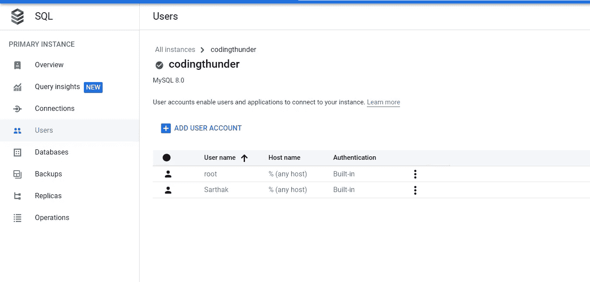

# Google 云中的三层应用部署

> 原文：<https://medium.com/google-cloud/3-tier-application-deployment-in-google-cloud-d474339bccad?source=collection_archive---------0----------------------->


如果你正在学习任何云平台，在学习技术的同时获得一些实践经验是非常必要的。在这篇博客中，我将帮助您在 GCP 上部署一个示例 Flask 应用程序，集成不同的 Google 云服务，如 **GCE、Cloud SQL、load balancing、**和 **Cloud NAT。**


三层应用程序的架构

在继续之前，让我们看看我们要遵循哪些步骤:-

- **VM 设置**
- **Nat 配置**
- **代码集成**
- **负载均衡器设置
-云 SQL 集成**
- **VPC** **网络设置
-测试**

让我们开始学习吧…..

# **步骤 1 :-虚拟机设置**

对于演示，我们将在一个 VM 实例中托管我们的应用程序，这类似于在您的本地机器上运行您开发的应用程序。

让我们从使用 Google Cloud 中的计算引擎服务创建一个 VM 实例开始。

```
google cloud console — > In search bar type "GCE" and click on VM instances — > click on **Create Instance**
```

1.  给你的实例起一个合适的名字，然后**允许完全访问所有的云 API**，然后让一切保持默认。


2 .在**防火墙设置**部分下，启用**允许 http** 复选框。

3.在**高级选项**下选择**网络接口**现在**禁用**外部 IPv4 地址。

4.点击 C **创建**。


# 步骤 2:- NAT 配置

由于我们已经禁用了虚拟机中的外部 ip，它无法连接到互联网进行不同的目的，如软件包安装等。所以这里我们需要配置 **NAT** 以便我们的虚拟机可以访问互联网。

1.  转到顶部的搜索栏，搜索**网络服务**并点击它。
2.  点击屏幕左侧的**云 NAT** 选项。
3.  输入一个**网关名称**，然后选择我们的虚拟机所在的网络，并选择一个区域 **us-west1(Oregon)** ，就像我们的例子**一样。**


4.创建一个路由器并给它命名 **flask-mig-cr，** cilck **create** 然后再次点击 **create** 用默认网络配置 NAT。


创建路由器

# 步骤 3:-代码集成

在这一步中，我们将了解如何在我们的 VM 中集成应用程序代码，就像在本地开发应用程序一样。您需要先安装和配置您的环境，比如编程语言的依赖性和兼容性，然后才能使用它。

1.  使用 **gcloud compute scp** 命令将所有文件从 google cloud shell 传输到虚拟机，如下图所示。
2.  或者，您可以使用 git clone 命令 ssh 到虚拟机上。

```
gcloud compute scp --recurse /path/of/folder/at/cloud/shell vmuser@hostname:/path/to/folder
```


```
###SSH into your VM and to the installation
##if you don't want to use scp command just git clone the repo inside the VM

sudo apt update -y
sudo apt install python3-pip python3-dev build-essential libssl-dev libffi-dev python3-setuptools -y 

pip install flask -y
pip install wheel -y 
pip install gunicorn flask -y 

sudo apt-get install python3-mysqldb -y 
```

要下载代码，请点击[***github URL***](https://github.com/operator670/blogapp)

# 步骤 4:-负载平衡器设置

在这一步中，我们将了解针对基于虚拟机的工作负载(应用程序)的端到端负载平衡器设置。

## 非托管例程组(UMIG)设置

正如我们所知，我们将在这一步中设置负载平衡器，但这里我们无法将虚拟机直接连接到负载平衡器，因此我们需要创建一个 UMIG(非托管实例组)或 MIG(托管实例组)来将我们的应用程序链接到负载平衡器。

为了简单起见，我用的是 **UMIG** 你也可以用 **MIG** 但是过程会稍有不同。

1.  点击 GCE 仪表板左侧的**实例组**。
2.  点击**创建实例组**。
3.  单击**新的未管理实例组**，它将使用我们之前创建的虚拟机。在这种情况下，当我们不需要时，我们可以毫无问题地轻松停止我们的虚拟机以节省成本。我们将为演示选择此选项。
4.  在选择虚拟机选项下，选择先前创建的虚拟机**烧瓶-机器。**
5.  点击**创建**。


让我们为我们的应用程序设置负载平衡器。我们将使用 **HTTP(S)负载平衡**在非托管实例组的虚拟机上分配流量(在我们的例子中，它只是一个虚拟机)。

1.  在搜索栏顶部输入**网络服务**并点击它。
2.  点击左侧的**负载平衡**并选择**开始配置。**


3.选择如上图所示的选项。

4.点击**继续。**


5.为前端配置选择上图中给出的所有选项。

6.转到后端配置并创建一个**后端服务**确保使用您之前在实例组选项中创建的**非托管实例组**，并且**取消选中**启用 CDN 选项，因为不需要 CDN。

7.按照下面的图像。


8.单击“查看并完成”并创建负载平衡器。

9.现在检查负载平衡器，并获取稍后将用于访问应用程序的 **ip 地址**。在我们的例子中，IP 是 34.110.175.200 的

****

**如果您成功地完成了这一旅程，那么恭喜您成功地将应用程序与服务集成在一起。现在让我们继续将云 SQL 实例与我们的 flask 应用程序集成。**

# **步骤 5:-云 SQL 集成**

**对于大多数应用程序，我们需要某种数据库来存储数据。在我们的例子中，我们存储的是结构化数据，因此我们需要一个关系数据库。在 Google Cloud 中，我们有一个完全托管的数据库服务，称为 Cloud SQL，我们可以在其中存储我们的数据。**

1.  **进入顶部的搜索栏，输入**云 SQL** ，选择云 SQL 服务。**
2.  **点击**创建实例。****
3.  **选择 **MySQL** 作为您的数据库引擎**

****

**4.输入您的云 SQL 实例的 I **实例 ID** 并生成一个密码。**

**5.选择最新的数据库版本，并选择低成本的**开发**模式，因为这是本项目的需要。**

****

**6.转到连接并选择**私有 ip** ，这是一种更安全的访问数据库的方式，因为它没有公共 ip 地址，不可能从外部连接。**

****

**7.点击**添加网络**，因为我们想要指定哪个 IP 地址可以访问数据库。**

**8.输入负载平衡器的 **frontend-IP** (应用程序 IP ),因为我们将使用我们的应用程序发布数据。**

****

**9.点击**创建实例**。**

**10.现在转到**用户**并创建一个新用户，如下所示。**

****

**11.点击**添加。****

****

**创建实例后，我们必须确保用于连接 SQL 实例的端口是打开的。**

# **步骤 6:- VPC 网络设置**

1.  **在搜索栏中输入 VPC 网络，然后进入 VPC 网络页面。**
2.  **点击左边的**防火墙**。**

****

**3.单击创建防火墙规则。**

****4。**输入名称 **default-allow-db** ，因为我们稍后将使用云 SQL 连接到这个端口 3306。
5。**目标:网络中的所有实例**只是为了简单起见，在现实世界中最好使用**指定的目标标签**以获得更好的安全性。**

****

**6.如上图所示，选择其余选项。**

**7.点击**保存**。**

# **步骤 7:-测试**

1.  **使用命令 **python3 __init__ 启动服务器。py****

****

**2.转到您网站的**/联系人**页面，在表格中填写详细信息**

****

**3.登录到您的**数据库**转到**云外壳**并使用此命令:-**

```
mysql --host=IP_address of CloudSQL instance -u 'username' -p
```

**4.为用户输入**密码**按**回车键。****

**5.一旦进入 mysql shell >**

```
show databases;
use database_name;  #Replace database_name with codingthunder as in my case
show tables;
select * from contacts;
```

********

****注意:-** 插入第一行数据后，进入 **__init__。py** 文件和**注释掉**的 **create_table()** 函数调用行，因为我们已经创建了表，不需要它们。**

**感谢您的阅读。如果你喜欢这篇文章，并希望看到更多类似的内容，请考虑关注它。如果您有任何问题或需要任何帮助，请随时给我发电子邮件或通过 [**LinkedIn**](https://www.linkedin.com/in/sarthak-kesarwani/) 与我联系。**

**我想对 **CodewithHarry** 和**[**Guysinthecloud**](https://www.youtube.com/@guysinthecloud/videos)**的烧瓶应用代码大声疾呼。如果你有兴趣了解更多关于代码如何工作的信息，请查看 CodewithHarry 的 [**播放列表**](https://www.youtube.com/watch?v=DD3ou9sa3Z8&list=PLu0W_9lII9agAiWp6Y41ueUKx1VcTRxmf) 。我只包含了演示该项目工作所需的最少代码。******

****谢谢，
[**萨尔萨克·凯萨瓦尼**](https://www.linkedin.com/in/sarthak-kesarwani/)****