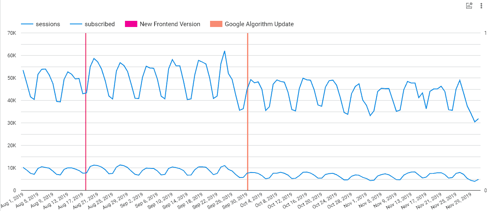

# 向 Data Studio 时间序列图表添加注释的 3 种方法

> 原文：<https://medium.com/google-cloud/3-ways-to-add-annotations-to-data-studio-time-series-chart-2e5c2c368027?source=collection_archive---------0----------------------->

在撰写本文时，Data Studio 不提供时间序列图表的现成注释。但是，您可以通过简单的方式添加注释，如下所示。

应用了两个批注的时间序列图

我们将介绍如何添加 **Data Studio 注释**的 3 种方式:

*   使用计算字段添加
*   使用 CSV 文件和数据源混合