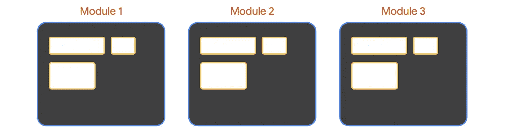

# 优化云运行响应时间的 3 种方法

> 原文：<https://medium.com/google-cloud/3-ways-to-optimize-cloud-run-response-times-4504ed0e6804?source=collection_archive---------0----------------------->

## 规模季节


# 规模季节

“规模季节”是一个博客和视频系列，旨在帮助企业和开发人员在设计模式中构建规模和弹性。在这一系列文章中，我们计划向您介绍一些创建具有弹性和可伸缩性的应用程序的模式和实践，这是许多现代架构实践的两个基本目标。

在第二季中，我们将介绍如何优化您的应用程序以缩短实例启动时间！如果你还没看过第一季，在这里看看吧[。](/google-cloud/scale-and-resilience-arent-just-buzzwords-ce748360e80)

1.  [如何改善计算引擎启动时间](/google-cloud/investigate-and-solve-compute-engine-cold-starts-like-a-detective-️-66a03736cb03)
2.  [如何提高 App 引擎启动次数](/@swongful/improve-app-engine-startup-times-through-warmup-requests-b424504bde14)
3.  如何缩短云运行启动时间(本文)

Critter Junction 在计算引擎、应用引擎和云运行之间创建了一个非常多样化的计算基础架构。我们在[第一季](/google-cloud/where-to-scale-your-workloads-6420150bf825)中了解到，他们决定用 [Cloud Run](https://cloud.google.com/run) 做他们的布局应用。刷新一下，布局 App 是游戏的关键部分。你可以与其他玩家分享房屋布局。现在，他们希望优化云运行以实现可扩展性。


布局应用程序

# 看看这个视频

# 回顾

自从将 Node.js 应用程序容器化后，他们决定在 Cloud Run 上运行它，因为它具有可移植性、无状态性和自动伸缩性，甚至可以扩展到零。


与运行在 App Engine 上的[在线网站不同，他们不需要在代码中编写预热包装器，因为 Cloud Run 可能会保留一些空闲实例来处理流量高峰。](/@swongful/improve-app-engine-startup-times-through-warmup-requests-b424504bde14)

## 云运行时冷启动

事实是，云运行将在一段时间后终止未使用的云运行容器…这意味着冷启动仍然可能发生。

在查看了 Layout 应用程序的最新部署后，我们注意到了一些可以改进的地方，以最大限度地减少冷启动延迟。

*   首先，他们碰巧使用了带有依赖库的动态语言，比如在 Node.js 中导入模块。
*   他们没有使用全局变量。
*   他们的容器基础映像大约有 700 兆字节。

这意味着总的来说，他们在容器启动时面临更长的加载时间，或者在服务器开始监听请求之前需要额外的计算。相反，他们希望优化他们的服务启动速度，以最大限度地减少导致这些问题的延迟。

让我们深入了解其中的每一项。

## #1 创建更精简的服务

首先，在云运行时，容器映像的大小不会影响冷启动或请求处理时间。

> ***然而，大型容器映像意味着更慢的构建时间和更慢的部署时间。***

当涉及到用动态语言编写的应用程序时，您需要格外小心。例如，如果您使用 Node.js 或 Python，进程启动时发生的*模块加载*将增加冷启动期间的延迟。



还要注意一些*在导入时运行初始化* *代码*的模块。


**要构建更精简的服务，您可以:**

*   如果你使用动态语言，尽量减少依赖的数量和大小。
*   不要在启动时计算，而是懒洋洋地计算。
*   缩短初始化时间，加快启动 HTTP 服务器的速度。
*   并使用代码加载优化，如 PHP 的 composer autoloader 优化。

## #2 使用全局变量

在云运行中，你不能假设服务状态在请求之间被保留。但是，Cloud Run 确实重用了单个容器实例来服务正在进行的流量。

> ***这意味着你可以声明一个全局变量。当新的容器旋转起来时，它可以重新利用它的价值。***

还可以在内存中缓存对象。将它从请求逻辑转移到全局范围意味着更好的性能。

现在，这对冷启动时间没有确切的帮助，但是一旦容器被初始化，缓存的对象可以帮助减少后续正在进行的请求的延迟。

例如，如果您将每个请求的逻辑移动到全局范围，它应该使冷启动持续大约相同的时间(如果您添加热请求中没有的额外缓存逻辑，它将增加冷启动时间)，但是由该热实例服务的任何后续请求将会改善延迟。

```
// Global (instance-wide) scope// This computation runs at instance cold-startconst instanceVar = heavyComputation();/*** HTTP function that declares a variable.** @param {Object} req request context.* @param {Object} res response context.*/exports.scopeDemo = (req, res) => {// Per-function scope// This computation runs every time this function is calledconst functionVar = lightComputation();res.send(`Per instance: ${instanceVar}, per function: ${functionVar}`);};
```

> 这在很大程度上归结为创建一个更精简的服务。

## #3 使用较小的基本图像

你想通过一个精简的基础映像来构建一个最小的容器，比如: [alpine](https://hub.docker.com/_/alpine) 、[distroles](https://github.com/GoogleContainerTools/distroless)或 [scratch](https://hub.docker.com/_/scratch) 。

这些图像将 Critter Junction 的图像大小从 **700** mb 减少到 **65** mb！他们还确保只安装映像中严格需要的东西。

> ***换句话说，不要安装你不需要的额外的包*。**

一旦 Critter Junction 能够移除依赖性，使用全局变量，交换到更精简的基础映像并移除额外的包，他们就能够减少任何云运行冷启动的延迟。

这是第三季的收官之作！关于云运行的可伸缩性和性能，还有很多其他的最佳实践，所以一定要查看下面的链接。

记住——永远做架构设计。

# 后续步骤和参考:

*   在[谷歌云平台媒体](https://medium.com/google-cloud)上关注这个博客系列。
*   参考:[云运行通用开发提示](https://cloud.google.com/run/docs/tips/general)。
*   关注《T4》系列视频，订阅谷歌云平台 YouTube 频道。
*   想要更多的故事？给我在[中](/@swongful)，和[推特](http://twitter.com/swongful)上喊一声。
*   与我们一起享受这个迷你系列的旅程，并了解更多关于可伸缩的 GCP 最佳实践。