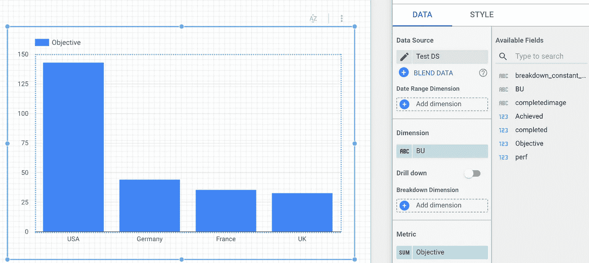
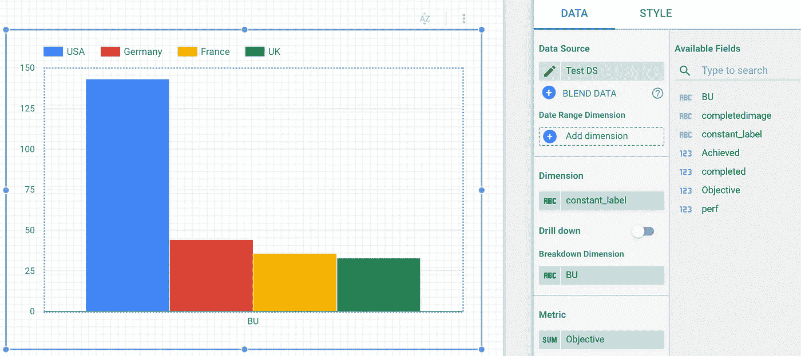

# 4 个数据工作室技巧

> 原文：<https://medium.com/google-cloud/4-data-studio-tricks-for-nice-looking-reports-422cfc1657d6?source=collection_archive---------1----------------------->

我定期构建或帮助人们构建 Data Studio 报告，重点关注良好的 UX 和完美的用户界面。为此，我开始编制一份可以帮助改进 Data Studio 报告的技巧列表。这里有四个:

*   透明的可点击区域
*   一维图表的维度颜色
*   目标显示(常量计算字段)
*   缩放地图

# 透明的可点击区域

目前，在 Data Studio 中创建链接的唯一方法是使用文本元素:

这很好，但是有几个问题:

*   Data Studio 中的链接样式不能更改，无论我们在“样式”面板中选择什么颜色和字体样式，链接都将始终以默认的 1990 年代的带下划线的蓝色超链接样式显示:

哎呀！

*   如果我们想在其他元素上创建链接呢？

解决方案是在大的空字符(比如说，一些空格)上创建一个链接:

然后，设置溢出设置为隐藏，瞧！我们有一个透明的可点击区域，可以放在任何元素的上面。

透明的可点击区域

# 一维图表的维度颜色

Data Studio 有一个特性，允许根据[尺寸值](https://support.google.com/datastudio/answer/9210313#color-by-value)显示颜色。出于我无法理解的原因，该选项仅适用于具有细分维度的图表。

一维图表:无维度颜色: (

要启用一维图表的功能，请创建一个“假”维度，其中包含一个对所有行都相同的常量标签。然后在尺寸设置中使用它，同时在分解设置中设置“真实”尺寸:

添加了一个常量标签维度(此处 value = "BU ")，现在我的维度上有颜色: )

# 目标显示(常量计算字段)

显示数据是好的，但是能够辨别数据是好是坏更好。最好的方法是在图表上尽可能地沿着数据显示引用。这种引用通常是客观的。有时，目标位于数据源中，可以与数据一起显示。但如果不是，我们可以用计算字段手动添加。问题是计算字段不接受常量值:

尝试添加 200 美元目标:失败

诀窍是将任何指标乘以 0，然后加上常数值:

你觉得这个数据工作室怎么样？

请注意，为了正确显示目标，需要将其聚合设置为最大、最小或 AVG(因为常数的最大、最小或平均值等于常数)。

结果

基于 CASE 函数可以定义更复杂的目标。

# 缩放地图

Data Studio 地图的最小缩放级别有限。有时我们只想关注一个地区一部分。我们可以通过增加地图的大小，将大部分地图移出报告画布，仅将感兴趣的部分留在画布内来解决这个问题，例如:

马萨诸塞州地图的大部分在本报告之外，在左侧，我们关注该州的东部。

我们还可以将此与元素顺序(置于底层/移至顶层)相结合，用与报表背景颜色相同的矩形形式隐藏部分地图，例如:

与报告背景颜色相同的矩形形式隐藏了地图的一部分，顶部是间隙。

而你，你最喜欢的数据工作室招数是什么？

**更新:**正如在评论和 Twitter 上提到的，这里描述的一些技巧已经被另一个用户[迈赫迪·乌吉达](https://medium.com/u/6c55cf407ca4?source=post_page-----422cfc1657d6--------------------------------)在他的博客上发表了(这里是[这里是](https://www.wissi.fr/blog/analytics/20190529/google-data-studio-internal-links/)和[这里是](https://www.wissi.fr/blog/analytics/20190527/google-data-studio-create-a-single-dimension-bar-chart-with-color-by-dimension-value/))，虽然解决方案略有不同，但我在撰写本文时还不知道。

# 感谢阅读！如果你喜欢这篇文章，不要犹豫，分享它。

我每天都在学习，如果我有任何错误，请随时纠正我，并在评论区添加您的建议。