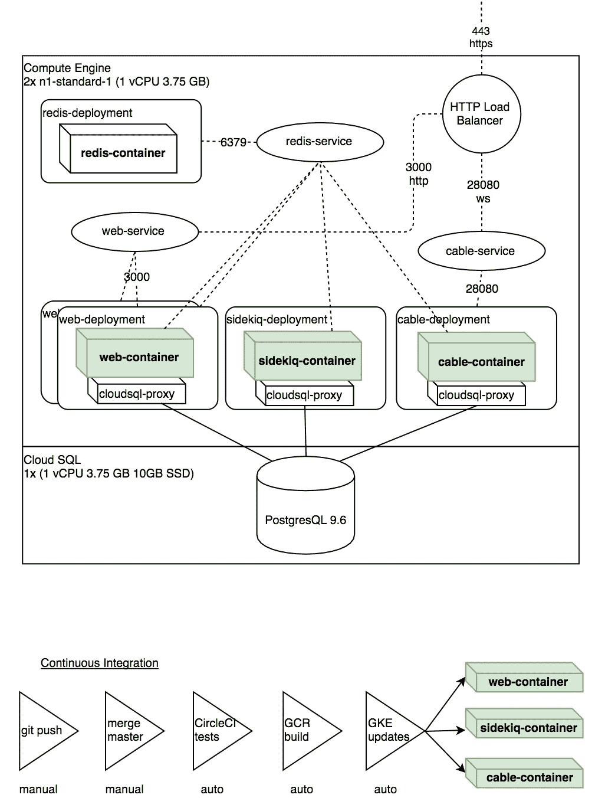

# GKE Rails 5 的 4 个 pod

> 原文：<https://medium.com/google-cloud/4-pods-for-rails-5-in-gke-9f375ab4c9f7?source=collection_archive---------2----------------------->

# 背景

我一直很喜欢将 PoC 或 MVP 部署到 Heroku 的简单性。我也听到了那些在其上扩展生产应用的人对成本的抱怨。削减成本的一个措施是转向 AWS 或 GCE 这样的平台，这样公司可以通过拥有自己的虚拟基础设施来节省大量成本。 [Kubernetes](https://kubernetes.io/) 是一款开源工具，可以通过在一组节点或主机上编排分级应用来优化虚拟机或物理机的计算能力。我最近有机会探索如何在谷歌的 [Kubernetes 引擎](https://cloud.google.com/kubernetes-engine)平台上部署和资助一个 Rails 应用。这需要一个学习曲线和对应用程序配置的最小调整，但看到垂直或水平扩展应用程序是多么容易，这很快就变得有趣了。

# 入门指南

设置一个帐户并初始化一个有 2 个`n1-standard-1`节点的 GKE 集群太简单了。这样我们只有 2 个 vCPU 和 7.5 GB 的内存。我在谷歌云控制台的初始设置中犯了一个错误，因为我不知道在集群启动时需要配置节点以拥有某些权限——有些权限不能在以后添加(看着你，Stackdriver Monitoring)。

我在文档页面上读过 Kubernetes，所以我对基本概念很有信心:集群、部署、pod 和服务等等。我的 vanilla Rails 5 应用程序由 3 个容器组成:puma HTTP 应用程序、用于 ActionCable 的 puma websocket 应用程序和 Sidekiq 容器。我可以这样配置:1 个 pod 包含所有 3 个容器，或者 3 个 pod 各包含 1 个容器。我决定使用 3 个 pod，每个 pod 一个容器，这样我可以单独扩展服务，以免容器闲置。

# 云 SQL + GKE

在配置我的部署和服务时，我犯了一个错误，那就是弄清楚如何从集群网络内部利用云 SQL 这样的托管数据库。[这篇博文](https://cloud.google.com/sql/docs/mysql/connect-kubernetes-engine)向我透露了 sidecar 方法，我尝试了几次，才在几分钟内重建了我的集群。sidecar 方法背后的基本思想是在任何需要访问云 SQL 实例的 pod 内部运行一个代理容器(所有 3 个容器都需要这样)。现在我有 3 个 pod，每个 pod 定义了 2 个容器，1 个 pod 运行所有 3 个 pod 共享的主 Redis 实例:

```
$ kubectl get pods
NAME                                  READY     STATUS    RESTARTS   AGE
cable-deployment-ddd7699d6-jnrbs      2/2       Running   0          16d
redis-master-6767cb984b-fpx9v         1/1       Running   0          17d
sidekiq-deployment-686dd47976-rtxnt   2/2       Running   0          16d
web-deployment-869559b4b9-hxftm       2/2       Running   0          16d
```

# Redis，让我们加密，和 Stackdriver

随着应用程序的扩展，我设想为每个服务添加一个专用的 Redis 实例。Sidekiq 需要很多连接，作为持久性存储比作为缓存性能更好。另一方面，web 部署确实以多种方式使用 [Redis 作为缓存](https://github.com/redis-store/redis-rails)(缓存静态资产不是其中之一)。ActionCable 实例使用 Redis 的发布/订阅功能。目前，考虑到每分钟的最小请求数，这个测试很棒。

让我们按照手动安装过程加密工作像一个魅力。现在所有的流量都是 HTTP 和 WSS。我测试了 Auto Scale 功能，该功能允许您配置集群来根据资源使用情况管理节点。有几次，我添加并随后删除了副本集，以体验管理 pod 的数量是多么快速和容易。



组件图和持续集成流程图

这次经历中值得一提的最后一点是免费的 stackdriver 监控工具。这非常令人印象深刻，因为我可以看到它取代了我通常使用的一些订阅服务，如 Sentry，Papertrail。我很想试驾一下 [Stackdriver Trace](https://cloud.google.com/trace/docs/setup/ruby) ，看看不花钱买 NewRelic 或 Skylight 能得到什么样的详细性能监控。不幸的是，我无法将`stackdriver` gem 安装在我的容器所基于的 Alpine Linux 发行版上。在 gem 的依赖升级之前，这有点令人失望。

# 底线

这种体验是值得的，但如果您推断每月 1 日至 15 日期间云 SQL 实例的成本为 25 美元，2 个虚拟机的成本为 35 美元，网络负载平衡器流量的成本为 10 美元(很小，甚至为零),则成本看起来大约为每月 140 美元。但是，嘿，当你注册一个新账户的时候，他们会给你 300 美元的信用。如果你能在你的十亿美元想法实现之前承担成本，我强烈建议你尝试一下，但现在我会坚持使用 Heroku，或者甚至尝试一下这个 [CaptainDuckDuck](https://github.com/githubsaturn/captainduckduck) 作为我的下一个概念证明。