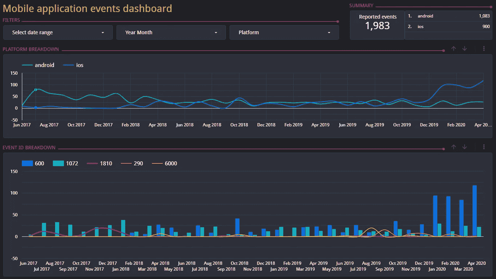

# 使用谷歌云和营销工具进行数据分析的 5 个步骤

> 原文：<https://medium.com/google-cloud/5-steps-for-data-analytics-using-google-cloud-and-marketing-tools-4ef345fc8229?source=collection_archive---------1----------------------->

## 如何利用 CSV、云存储和 Data Studio 来支持快速数据驱动的决策


卢克·切瑟在 [Unsplash](/s/photos/dashboard?utm_source=unsplash&utm_medium=referral&utm_content=creditCopyText) 上的照片

听到“数据驱动”，你会想到什么？昂贵的 BI 系统许可证？准备数据以填充仪表板的复杂 ETL 流程？阻止您访问相关数据以做出决策的公司或技术限制？或者是随时可用的经济实惠的工具，甚至是指导简单决策的工具？我希望你回答了“*最后一个选项！”但是我给你带来了好消息，以防你没有。*

嗯，[“数据驱动”长期以来一直是一个热门话题](https://trends.google.com/trends/explore?date=today%205-y&q=%2Fg%2F11bv3ggxwd)，不难理解其中的原因。众所周知，人、小工具和设备(又名“东西”)日复一日地产生越来越多的数据；幸运的是，使用这些数据支持决策的工具更容易、更方便获得。虽然通常与大数据相关联，但这并不意味着我们不能依靠其中一些工具来分析小规模数据集。

我写这篇文章的目的是分享我一直用来支持基于数据的决策制定的简单工作流程的想法，特别是在需要我尽早获得洞察力的快速变化的场景中。这个工作流程是我努力锻炼我的数据驱动思维的一部分。不需要复杂或昂贵的东西来通过用户友好的仪表板开始可视化和共享数据: [**CSV**](https://en.wikipedia.org/wiki/Comma-separated_values) 文件，一个 [**谷歌云存储**](https://cloud.google.com/storage) 桶或 [**谷歌工作表**](https://www.google.com/sheets/about/) ，以及 [**数据工作室**](https://developers.google.com/datastudio) 应该足够了。

为了演示其工作原理，我将使用一个包含时间戳、事件 id 和生成事件的平台的 3 列样本数据集，如下所示:

```
| **timestamp**           | **event_id** | **platform** |
| =================== | ======== | ======== |
| 2019-06-22 01:15:03 | 600      | ios      |
| 2019-06-25 22:34:46 | 1072     | android  |
| 2019-06-26 07:36:51 | 1810     | android  |
| 2019-06-26 21:04:50 | 290      | ios      |
...
```

这个虚构的数据集表示从移动应用程序收集的事件。您可以将它们解释为应用程序用户报告的可跟踪错误，或者任何其他可识别的事件，比如新安装、新用户订阅等等。我不会集中讨论这些事件意味着什么，而是讨论如何使用 Data Studio 来研究它们。因此，要记住的最重要的事情是:我们可以在几分钟内将 3 列原始数据转换成 [**一个交互式仪表板**](https://datastudio.google.com/reporting/060170e6-6a88-4d51-ae10-cac6eea742bc) 。



用 Google Data Studio 制作的基于 3 列数据集的仪表板

因为有许多选项可以将数据添加到 Data Studio 仪表板，所以我需要做出一些选择。我决定选择 **CSV +云存储**，因为它们让我可以清楚地演示如何手动处理数据，并在文章结尾留下一些关于自动化的想法。

关于 CSV 文件的更多详细信息:

*   它们作为一种简单的标准格式在信息系统之间交换数据。
*   许多工具，如电子表格和数据库管理系统，可以以这种格式导出数据。
*   任何拥有基本文本编辑器的人都可以操作 CSV 文件。

我希望这些决定能让读者更容易地完成这 5 个步骤。这是一个实践指南，所以有样本文件可供下载，我们稍后会用到它们。

嘿，里卡多，我能从谷歌工作表中读取数据吗？

—当然！还有来自 [BigQuery、CloudSQL、MySQL，以及来自 Data Studio 可用的 230 多个连接器的 500 多个数据集](https://datastudio.google.com/data)。事实上， [Data Studio 甚至允许我们混合来自多个数据集的数据，并使用它们来填充仪表板](https://support.google.com/datastudio/answer/9061420)，但在这篇介绍性的博客文章中，我不会深入介绍。

让我们开始工作吧！

# 步骤 1:将数据导出为 CSV 文件

免责声明:在实际场景中，访问数据通常是工作中最困难的部分！大多数时候不是因为技术限制，而是因为业务、隐私和安全问题。

话虽如此，请注意以下提示:

*   如果您的目标是使用属于任何第三方的数据，首先要寻找控制访问这些数据的策略。
*   仅请求您执行分析所需的内容。
*   避免请求个人身份信息(PII)，因为它们受到更严格的访问控制。
*   通过确保你做到了以上几点，你就最大化了获取数据的机会。

此外，我还遇到过数据根本不存在的情况，所以我需要采取行动来收集/生成数据:有时通过检测信息系统，有时通过做一些简单的事情，比如要求人们通过 [Google Forms](https://www.google.com/forms/about/) 提供信息。使用案例可能会有很大不同…

一旦获得访问权限，就可以将数据导出为 CSV 格式了。这在大多数工具中非常简单，正如您在下面的例子中看到的。警告:第一行必须包含列名。

*   LibreOffice 或 Microsoft Excel:单击*文件* > *另存为…* ，然后选择`Text CSV (*.csv)`或类似的文件类型。
*   MySQL:执行查询。

将数据输出到 CSV 文件的 MySQL 查询

*   Google Sheets:尽管可能，但没有必要导出为 CSV 格式——Data Studio 可以直接从电子表格中读取。在这种情况下，您可以跳过将文件上传到 Google 云存储(步骤 2)，在步骤 3 中使用`Google Sheets`连接器，继续步骤 4。

为了简单起见，我已经在这个文件夹中分享了样本数据集:[https://drive . Google . com/drive/folders/132 ardn 2 ez3 GFS 8 hoax 0 ajinqbaxgyied？usp =分享](https://drive.google.com/drive/folders/132ardN2eZ3GFS8HOax0AJINqbAXGYIEd?usp=sharing)。请下载三个 CSV 文件:`2017–202004.csv`、`202005.csv`和`202006.csv`。

# 第二步:上传到谷歌云存储

是时候将第一个文件上传到 Data Studio 可以读取的地方了。我假设你有一个谷歌云账户，并且熟悉[云存储](https://cloud.google.com/storage)，所以请到云控制台:[https://console.cloud.google.com](https://console.cloud.google.com/)。

1.  在导航菜单中查找*存储器* > *存储器*。
2.  点击*创建桶*并按照指示操作。选择`Standard`作为默认存储类，因为仪表板将多次从存储桶中检索数据，这是此用例中最具成本效益的类。
3.  点击*创建*。
4.  在**存储浏览器**屏幕中，点击您刚刚创建的存储桶。
5.  将`2017–202004.csv`锉放入桶中。暂时不要修改其他两个文件。

# 步骤 3:将 Data Studio 连接到云存储

现在，去数据工作室:[https://datastudio.google.com](https://datastudio.google.com/)。

1.  点击主屏幕上的*空白报告*，您将被重定向至**添加数据至报告**页面。
2.  在**谷歌连接器**部分选择`Google Cloud Storage`。
3.  检查`Use all files in path`选项。
4.  键入您在步骤 2.3 中创建的存储桶的名称，然后单击*添加*。
5.  在**弹出的**中点击*添加到报告*。
6.  Data Studio 可能会要求您提供 Google Cloud 凭据，以便访问数据集。

然后，您应该会看到一个带有简单表格的仪表板，如下所示:


Data Studio 中的单表仪表板

# 步骤 4:向仪表板添加组件

一旦我们连接到数据集，我将使用一个简短的视频来演示如何添加和设置所有的交互式 UI 组件——由下面缩略图中的黄色气球表示。注意:为了更加简洁，静态组件，如标签和线条，将不在本指南中介绍。但重要的是要记住它们给用户体验带来了实质性的改善。

示例仪表板的交互式字段

点击几次后，交互式组件设置完成！对于那些可能感兴趣的人来说，[在 YouTube](https://youtu.be/j-itBX1P1zE) 上的视频描述中有一个分步指南。

我尝试演示了几个特性，让读者可以开始使用，但是强烈建议稍后阅读说明，并尝试其他组件和配置。我很确定你会发现 Data Studio 提供的一堆很酷的东西！

# 第五步:调查数据

组件就位后，我们可以开始最有趣的部分:查看数据！我将混合使用**年月过滤器**和**向下钻取箭头**来探索一些场景。请点击屏幕上方的*查看*按钮。


使用示例仪表板的过滤器和深入查看控件

请注意，随着 2020 年 4 月`600`事件的爆发，该应用在 iOS 中的使用有所增加。让我们了解一下那个月发生的更多细节:

1.  在**年月**字段中，只点击`Apr 2020`行中的*。你会注意到图表会显示奇怪的线条。发生这种情况是因为他们仍在按月汇总数据(请记住，我们为两者都设置了`Year Month` **粒度**),而我们刚刚要求从一个月中收集数据，这“打破”了时间序列图。*
2.  *点击**平台分解图**右上角的*向下箭头*。现在你可以看到每天的数据。*
3.  *对**事件 ID 分解图**进行同样的操作。请注意，整个月都有一些`600`事件的高峰。*

*因此，根据事件的含义，负责的团队可以采取适当的行动。例如:如果它代表了高级使用计划的新订阅，营销团队可能会认为他们在针对 iOS 用户的活动中做得很好，因此他们应该继续投入资金。另一方面，安卓用户看起来很困惑，可能需要更多的关注。*

*这里我们完成了最后一步。我希望你同意建立一个数据驱动的工作流程是很容易的，并且从现在开始可以利用它来指导你的决策。记住这仅仅是开始。你练习得越多，你就越能看到根据数据做决定的好处和安全性。*

# *下一步是什么？*

*我们已经接近文章的结尾了，但是因为我们已经介绍了基础知识，我邀请您参加一个新的练习:开始头脑风暴，看看可以做些什么来改进工作流。有很多可行的改进，所以让我简单地分享至少三个，以促进进一步的讨论。*

## *不断添加新数据*

*我们分析了 2017 年 6 月到 2020 年 4 月的数据。但是我在六月的最后一周写这篇文章。五月和六月初发生了什么？要回答这个问题:我们需要更多的数据…*

*还记得你下载了但没用的那两个文件，`202005.csv`和`202006.csv`吗？是时候将它们上传到您创建的云存储空间了。*

*上传文件后，在仪表板处于查看模式时:*

1.  *点击每个图表右上角的*向上箭头*。*
2.  *取消选择**年月**字段中的*2020 年 4 月*项。*
3.  *点击屏幕顶部的*刷新数据*按钮，发现新数据。*

*新数据带来新见解。保持数据更新至关重要。*

## *自动生成和上传 CSV 文件*

*虽然 **CSV +云存储**允许手动更新，就像我们刚刚做的那样，但这种架构的一个关键优势是它还支持自动更新——无需进行大量设置。添加这样的功能很可能需要一些编码和系统管理技能，但是由此带来的便利绝对值得。*

*工作流的第 1 步和第 2 步会直接受到这种改进的影响，所以首先要考虑的是如何自动生成 CSV 文件。如果您从数据库中获取数据，可能会简单一些，如果您依赖于其他类型的工具，可能会复杂一些。*

*Google Cloud SDK 附带了`[gsutil](https://cloud.google.com/storage/docs/gsutil)`，这是一个命令行工具，允许我们安全地将文件上传到云存储。可以安排它不时运行，并将新数据推送到存储桶。*

## *使用更强大的数据存储工具*

*希望随着时间的推移，您将有更多的数据需要处理。云存储连接器在处理大数据集时可能会变慢。如果发生这种情况，考虑将底层数据存储改为更健壮的工具，例如 MySQL 等 RDMS 或 BigQuery 等数据仓库。*

# *包扎*

*如果您读到这里，您已经掌握了开始使用 Data Studio 的基本技能，并利用这个神奇的工具来推动您的数据驱动之旅。我现在的建议是探索更多的组件和配置。向样本数据集中添加一个新的业务变量并比较结果怎么样？您还可以创建和使用对您的业务更有意义的数据集。*

*是的，无论是从数据集的角度还是从解决方案的架构来看，都有很多机会。好好享受吧！*

*感谢阅读，希望有帮助。*