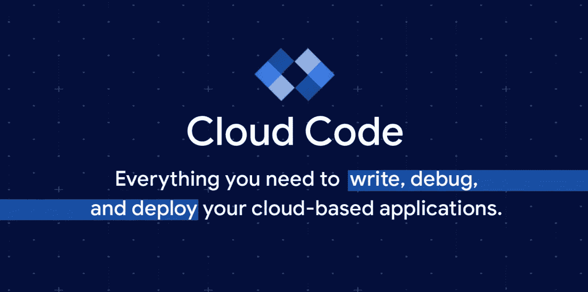

# 利用云代码最大化 Kubernetes 开发者体验的 5 个技巧

> 原文：<https://medium.com/google-cloud/5-tips-to-maximize-your-kubernetes-developer-experience-with-cloud-code-4b626b544d64?source=collection_archive---------2----------------------->

启动一个部署到 Kubernetes 的新项目可能是一个耗时且令人生畏的过程。很容易陷入配置基础设施的困境，而不是实际编写应用程序的业务逻辑。开发人员工具和实践有助于简化 Kubernetes 工作流，同时让您专注于代码，这是提高生产力的关键。

Cloud Code 是 VS Code 和 JetBrains IDEs 的 IDE 扩展，它利用多个以 Kubernetes 为中心的工具，将 UI 添加到您的 IDE 中，以加速和简化您的 Kubernetes 开发工作流。

在您开始 Kubernetes 应用程序开发之旅时，请记住以下一些提示。

你也可以试试这个[交互式 Kubernetes 教程](https://shell.cloud.google.com/?walkthrough_tutorial_url=https%3A%2F%2Fwalkthroughs.googleusercontent.com%2Fcontent%2Fgke_cloud_code_create_app%2Fgke_cloud_code_create_app.md&show=ide&environment_deployment=ide)来看看云代码的运行。如果你在 IDE 中开发，考虑为 [VS Code](https://marketplace.visualstudio.com/items?itemName=GoogleCloudTools.cloudcode) 或 [IntelliJ](https://plugins.jetbrains.com/plugin/8079-cloud-code) 安装云代码并尝试一下。

# 1.在你最舒服的地方发展

作为一名开发人员，您可能大部分时间都在自己喜欢的 IDE 中度过。为了简化 Kubernetes 开发，请用扩展来增强您的 IDE。扩展可以使构建、部署、扩展和管理 Kubernetes 基础设施和应用程序的过程变得轻而易举。为了提高您的工作效率并准备好您的 IDE Kubernetes，可以考虑安装[云代码](https://cloud.google.com/code)。它是一个 IDE 扩展，可用于 VS 代码和 Intellij，帮助您更快地编写、调试和部署基于容器的应用程序。

如果您不熟悉 Kubernetes，并且不喜欢消耗本地机器的资源，那么基于浏览器的开发就绪环境是一个很好的选择。

基于浏览器的 IDE 的一个例子是[云壳编辑器](https://cloud.google.com/shell)。云壳编辑器是一个在线开发和操作环境，可从浏览器的任何位置访问。为了减少设置开销，Cloud Shell Editor 预装了一些工具，如 [kubectl](https://kubernetes.io/docs/reference/kubectl/overview/) 、Docker 和 Skaffold。还预装了云代码，因此您可以轻松地部署到您的应用程序，并直接从基于浏览器的 IDE 管理您的 Kubernetes 基础架构。

无论您使用的是 Cloud Shell Editor 还是本地 IDE，请选择最适合您的开发环境，并且您认为使用该环境效率最高。

# 2.减少上下文切换

上下文切换非常耗时，并且会打断您的工作流程。在开发 Kubernetes 应用程序时，您可能会在 IDE、云控制台、文档和日志之间切换。为了让您专注于编码，请考虑您添加到 IDE 中的扩展如何减少上下文切换。

云代码自带减少上下文切换的内置功能。例如，使用 Cloud Code 的 Kubernetes explorer，您可以可视化、监控和查看有关集群资源的信息，而无需运行任何 CLI 命令。只需几次点击，您就可以查看集群的日志。

我们的开发人员最喜欢减少上下文切换的是我们在 Cloud Shell Editor 中提供的上下文相关教程。你不再需要在文档和代码之间切换，在这里了解更多。

# 3.简化本地开发

一般来说，IDE 扩展应该使处理代码和获得本地更改反馈的过程更容易、更简化。

作为一名开发人员，您更愿意专注于编写您的业务逻辑，而不是如何让它在容器中运行。 [**Buildpacks**](https://cloud.google.com/blog/products/containers-kubernetes/google-cloud-now-supports-buildpacks) 是一项开源技术，让您可以快速轻松地从源代码中创建安全的、生产就绪的容器映像，而无需编写和维护 docker 文件。

云代码使得用 Buildpacks 构建容器并部署到 Docker Desktop 或者 [**Minikube**](http://minikube/) 变得很容易。Minikube 在您的机器上创建一个本地集群，为您提供一个运行应用程序和使用 Kubernetes 进行实验的平台。云代码还支持远程集群从您的机器上卸载 CPU 和内存资源。

在 Kubernetes 应用程序上进行本地迭代需要构建容器映像、更新 Kubernetes 清单和重新部署应用程序。手动完成这项工作可能会很麻烦。云代码是简化这些重复性任务的关键，并利用 [**Skaffold**](https://skaffold.dev/) 在每次代码更改时自动运行这一过程。

ska fold 是一个命令行工具，可以简化您在 Kubernetes 上开发时执行的常见操作任务。为了加速和简化您的开发循环，Skaffold 的监视模式监视本地源代码的变化，并实时地将应用程序重新构建和重新部署到您的集群中。最近，Skaffold 引入了它的[文件同步](https://skaffold.dev/docs/pipeline-stages/filesync/)功能，让你跳过重建和重新部署，在几秒钟内看到你的代码变化。

# 4.花更少的时间写 YAML

习惯使用 Kubernetes YAML 语法和模式需要时间，而且大部分时间都是反复试验。得益于其 [YAML 创作支持](https://cloud.google.com/code/docs/vscode/yaml-editing)特性，云代码让你花更多时间写代码。云代码的内联文档、片段、完成和模式验证，也称为“林挺”让编写 YAML 文件成为一种更愉快的体验。

随着 Kubernetes 变得越来越流行，许多开发人员用新的操作符和自定义资源定义( [CRDs](https://kubernetes.io/docs/concepts/extend-kubernetes/api-extension/custom-resources/) )扩展了 Kubernetes API。这些新的运营商和 CRD 通过持续集成和交付、机器学习和网络安全等新功能扩展了 Kubernetes 生态系统。

云代码为超过 400 个现成的 Kubernetes CRDs 提供 YAML 创作支持，使编写、理解和查看 YAML 文件中的错误变得更加容易。云代码还支持集群上安装的所有 CRD。

# 5.实时调试

我们经常听说调试 Kubernetes 集群上运行的应用程序可能很难设置。有多种方法可以用来[调试您正在运行的 pods](https://kubernetes.io/docs/tasks/debug-application-cluster/debug-running-pod/) ，但是在您的 IDE 中模拟本地调试体验是很难配置的，并且需要暴露调试端口和端口转发 t。因为云代码利用了 Skaffold，所以您可以简单地在代码中放置断点。一旦触发了断点，您就可以单步执行代码，将鼠标悬停在变量属性上，并从容器中查看日志。如果您正在寻找一种从 IDE 调试应用程序的方法，请尝试云代码。如果您喜欢命令行，Skaffold 可能是您的一个选择。

在 Kubernetes 集群上进行本地调试意味着您将能够在运行时错误进入 CI、登台或生产之前发现它们。您越早发现这些错误，解决问题的时间就越快。这加快了整体开发时间。

# 结论

集成到您的工作流程中以简化 Kubernetes 开发过程的最佳工具是那些提高您的生产力的工具。今天，我们分享了一些在 Kubernetes 上开发时需要记住的技巧。用开发人员友好的扩展增强您的 IDE 是最大化您的生产力的容易的第一步。