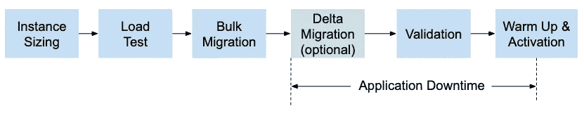

# 迁移到云扳手的 6 个步骤

> 原文：<https://medium.com/google-cloud/6-steps-to-migrate-to-cloud-spanner-8b83d497c847?source=collection_archive---------3----------------------->

雅利安·辛格在 [Unsplash](https://unsplash.com?utm_source=medium&utm_medium=referral) 上的照片

*这是迁移到 Cloud Spanner 的必要步骤的概述，其中有一些应用程序停机时间(使用 Cloud Spanner 也可以实现零停机时间迁移，但不在本文讨论范围之内)。我们假设您已经评估了 Cloud Spanner(也许使用我们的免费模拟器—* [*在这里试试吧！*](https://cloud.google.com/spanner/docs/emulator) *)并确定它最适合您的用例。这篇博客旨在为迁移过程提供一个框架。根据您的特定源数据库，有些步骤可能比其他步骤更复杂。*

# 步骤 1:确定实例大小并准备应用程序

根据您的 QPS 和数据大小要求，确定您将需要的扳手节点的数量。您可以使用每个 spanner 节点 10，000 次 QPS 读取/ 2，000 次 QPS 写入作为起点，但请注意，实际 QPS 会根据您的请求大小和读写混合情况而有所不同。

要准备您的应用程序进行迁移，请为您的原始数据库创建一个数据库访问对象，并为 spanner 创建一个数据库访问对象。您应该能够通过一个标志轻松地在这两者之间切换。这将在迁移过程中对您有很大帮助。或者，您可以设置双重写入(写入原始数据库和 spanner ),以在迁移不成功的情况下减少对用户的影响。注意:这种双重写入的目的是作为一种后备机制，而不是减少应用程序经历的停机时间。

# 步骤 2:负载测试

为了确保您已经为您的工作负载提供了足够的实例，您将需要在具有一些合成代表性工作负载的实例上执行负载测试。需要注意的是 QPS、P50、P95、P99 读写延迟、吞吐量、CPU 利用率以及您感兴趣的任何其他指标。如果您发现区域性实例的 CPU 利用率超过 65%,或者多区域性实例的 CPU 利用率超过 45%,那么您将需要扩展您的实例。负载测试需要运行很长一段时间(几个小时)才能获得可靠的结果。这是因为实例需要时间来调整自身以适应工作负载，从而获得最佳性能。我们还建议在更大和更小的实例大小上重新运行测试。当有疑问时，宁可在实例中有更多的节点。

# 步骤 3:批量迁移

获取当前数据库的快照/导出，并将其导入到 spanner 中(如果您只是在没有增量的情况下进行批量迁移，那么您应该在获取快照之前关闭应用程序)。如果您正在从另一个 Google 云数据库(或另一个 Cloud Spanner 实例——比如从一个区域实例迁移到一个多区域实例)迁移，我们建议您使用数据流来完成这一任务。按照这里的说明，如何从你的原始数据库[导出](https://cloud.google.com/spanner/docs/export)和[导入](https://cloud.google.com/spanner/docs/import)到扳手。如果您从非 Google 云资源迁移，请参考您当前数据库的文档，了解如何最好地执行此步骤。

如果移动整个数据集所需的时间超过了应用程序允许的停机时间，您将需要执行一次批量迁移和一次增量迁移。

> *提示 1:在这个阶段，您可以扩大 spanner 实例的规模，以减少数据迁移所需的时间，并在迁移后缩小规模。进行一些测试，了解随着节点数量的增加，迁移时间是如何变化的。*
> 
> 技巧 2:一次性批量迁移比批量+增量迁移简单得多。将您的数据库想象成一个表的集合，确定在应用程序仍然运行时是否可以预先迁移一些表，并计算允许的停机时间是否只适合那些将经历快速变化的表。例如，可以预先移动日志数据/只写数据。

如果需要增量迁移，您将需要打开变更数据捕获(CDC ),或者找到一种方法来计算自批量迁移完成以来哪些数据发生了变更(时间戳等)。

步骤 3b:增量迁移(可选—仅适用于允许停机时间少于整个数据集移动时间的应用程序)

批量迁移完成并通过验证后，关闭应用程序。通过移动自快照/导出以来传入的新数据开始增量迁移。我们建议您为此也使用数据流模板来并行化迁移。

# 第四步:验证

增量迁移完成后，我们建议您运行一些验证查询，以确保迁移成功。如果出现任何问题，您可以回到您的原始数据库。

# 步骤 5:预热扳手+激活应用程序

如果您可以分阶段向用户激活您的应用程序(例如，只允许 10%的用户访问，增加到 20%，等等)，那么您就不需要预热 Spanner。否则，我们建议您在激活您的应用程序之前，使用模拟生产流量运行 30 分钟到 1 小时(注意:非代表性流量可能最终会使延迟变得更糟)。这是为了让 Spanner 调整自己，以最好地服务于您的工作负载。如果没有预热，您可能会在激活应用程序后立即体验到很高的尾部延迟，尽管它最终会稳定下来。

读取和写入现在应该完全由 Spanner 提供。或者，如果您激活了双重写入，则在出现问题时，您可以回退到原始数据库。您还可以验证 Spanner 和您的原始数据库是否返回相同的结果。

*如果您还有其他问题，请联系我们* [*这里*](https://cloud.google.com/contact) *！*