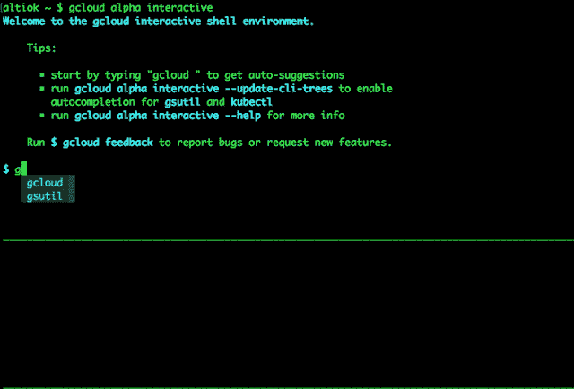

# 你可能不知道的 7 个云技巧

> 原文：<https://medium.com/google-cloud/7-gcloud-tricks-you-probably-didnt-know-7f64a16869e7?source=collection_archive---------1----------------------->


Cloud SDK 包括一组用于与 Google Cloud 产品和服务交互的工具和库，其中`gcloud` CLI 工具是主要命令。

以下是我经常使用的一些命令/技巧:

# 1.阻止提示。设置默认值。

为您的`gcloud` CLI 设置默认配置会阻止`Y/n`提示:

```
gcloud config set compute/region us-west1
gcloud config set run/platform managed
```

使用`gcloud config list`或[查看您的现有配置查看所有配置📄](https://cloud.google.com/sdk/gcloud/reference/config/set)。

# 2.获取/更改项目 id

使用`gcloud`时，大多数命令使用*当前配置的项目*发出 API 请求。有些命令要求在命令参数中包含项目名称。

我喜欢将当前项目保存在这样的环境变量中:

那么在命令中使用这个名字就很容易了。例如:

```
gcloud builds submit --tag gcr.io/$PROJECT/helloworld
```

# 3.查看是否启用了计费

许多云服务要求在使用之前启用计费。

快速检查您当前在`gcloud`的项目是否已启用计费:

# 4.认证测试云运行

未经授权的请求无法访问未部署有`--allow-unauthenticated`的云运行服务。测试服务的一个快速方法是在`gcloud`的帮助下添加一个 HTTP 授权承载令牌:

# 5.谷歌云项目 _ID🔁项目编号

有时一个 API 需要一个项目编号，但是你只有一个项目 id。用一点`gcloud`符，你就可以从另一个中得到一个值:

## ID 到号码

*需要设置* `*PROJECT_ID*` *。*

## 要标识的号码

*需要设置* `*PROJECT_NUMBER*` *。*

# 6.查看原始 HTTP 请求

每个调用服务的`gcloud`命令都使用 Google API。通过记录原始的 HTTP 请求，很容易准确地看到我们正在调用的 API。

这里有一个例子:

你会得到这样的回应:

# 7.对话方式

Cloud SDK 有一个交互式 CLI 模式，这是学习和编写轻量级命令的一个很好的工具。此模式显示提前键入自动完成以及终端内文档。

只需键入`gcloud alpha interactive`即可开始。



Cloud SDK 交互模式的预览。

那就是“你可能不知道的 7 个 gcloud 招数”。你可能知道一些，但是我希望你能学到一两个新的技巧！

格兰特

如果您喜欢这篇文章，您可能也会喜欢阅读这些备忘单:

*   [https://github.com/dennyzhang/cheatsheet-gcp-A4](https://github.com/dennyzhang/cheatsheet-gcp-A4)
*   [https://gist . github . com/pydevops/cffbd 3c 694d 599 c6ca 18342d 3625 af 97](https://gist.github.com/pydevops/cffbd3c694d599c6ca18342d3625af97)