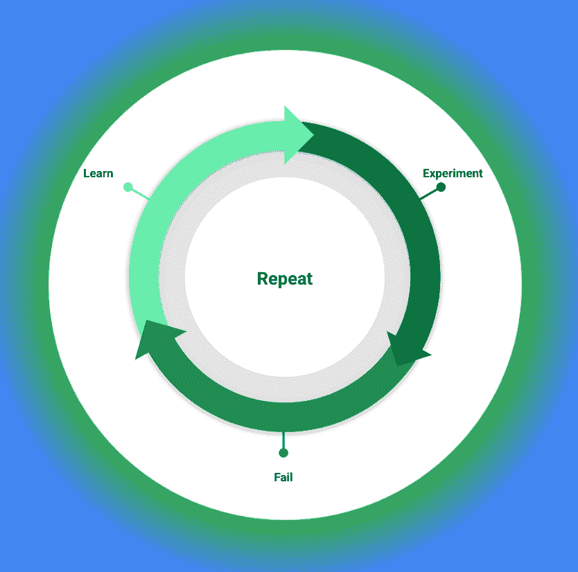
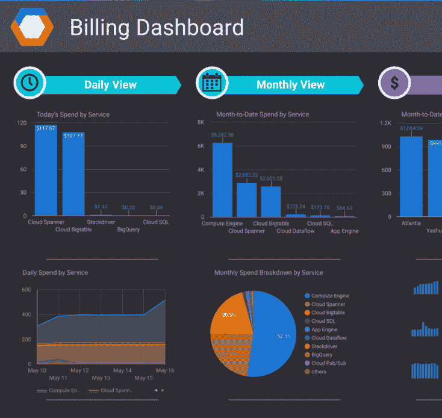
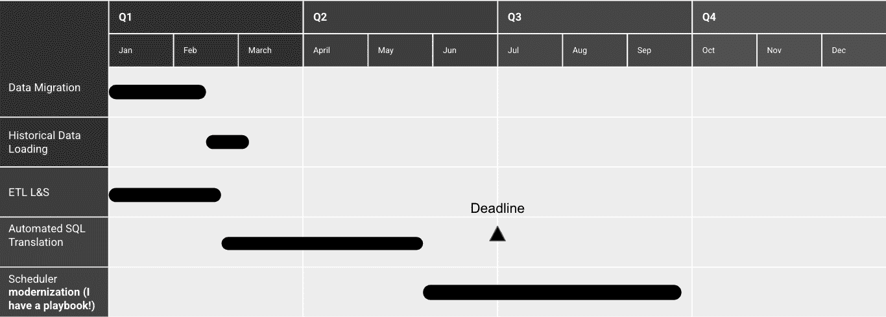
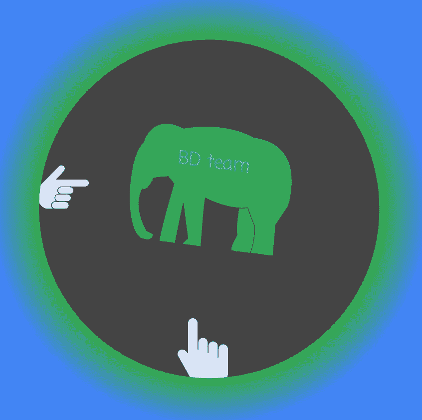
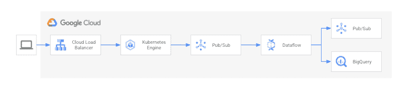
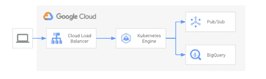
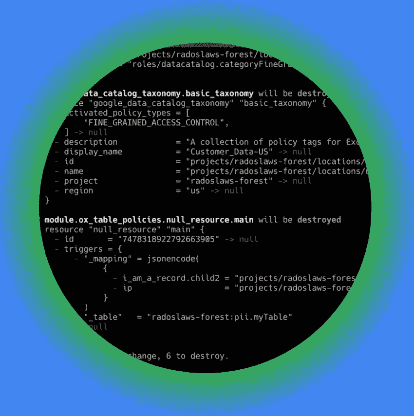
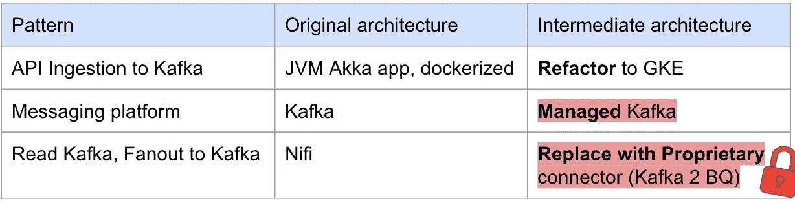

# 让您的大数据平台(BDP)云迁移面临风险的 9 种方式

> 原文：<https://medium.com/google-cloud/9-ways-to-put-your-big-data-platform-bdp-cloud-migration-at-risk-983b0a337b92?source=collection_archive---------4----------------------->

作为一名战略云工程师(SCE ),去年我有机会参与了几个大数据平台迁移项目。我们将它们命名为 ScrollMarkt、HugeCart 和 BrowseNSwipe。他们是全球性的电子商务公司。在我的支持下，他们开始了这个项目，并完成了最小可行产品——MVP(满足业务需求的端到端用例)。

作为一名专业服务顾问，我正在帮助客户解决他们最大的挑战。有些客户是第一次迁移。他们想学习最佳实践。其他人过去试图迁移到云，但失败了。另一个需要加快行程。在这些类型的项目中，我的角色不是执行迁移，而是通过教育、提高技能和分享来自其他项目的最佳实践和经验教训来帮助工程团队取得成功。

学习的方式就是在安全的环境中失败。MVP 就是其中之一。团队可以实验、学习、失败，学习如何在大规模迁移中取得成功。

在这 3 个项目中，客户的决策将他们的项目置于风险之中。以下是对您的迁移影响最大的 9 个因素。

# 1.在提升和移位或现代化选项之间进行选择

这就是 BrowseNSwipe 的故事。在这个项目中，该公司有时间限制，并希望在做升降机和转移(L&S)和现代化之间取得平衡。如果由于时间限制，他们会选择 L&S，稍后他们会被迫进行第二次迁移以实现现代化。这会影响业务，因为团队关注的是技术迁移，而不是通常的业务。另一个风险是价格——运行使用 HDFS 作为存储或 HBase 的长寿命 Hadoop 可能会很昂贵。如果他们把重点放在现代化上，那么他们就有赶不上最后期限的风险。现代化需要学习、重构、重写，这可能无法自动化。

BrowseNSwipe 对大部分 ETL(data proc 上的 Spark SQL)尝试了 lift & shift，并用 BigQuery 使分析部分现代化。

了解你的约束，聪明点，专注于什么是重要的，你能接受什么样的技术债。

# 2.不先学习就搭载他人

理解和学习新的技巧需要时间。从本地平台(如 Hadoop)迁移到云不仅是技术堆栈(BQ、Dataproc、Dataflow)或新工具(治理、自动化)的变化，也是一种新的运营模式。团队不再受固定能力的束缚，需要了解每个行动背后都有成本。

HugeCart 在不了解平台如何工作的情况下就让用户加入进来，导致一大笔账单和迁移项目被搁置。预防措施缺失，适当的监控不到位，适当的培训也不到位。

当进行迁移时，我和团队一起计划如何进行适当的 MVP，这样第一个团队就可以理解和学习一切是如何工作的。之后，他们可以提升公司其他人的技能。这第一个团队将建立基础，学习平台，记录典型问题，建立仪表板。就像训练训练员一样。

HugeCart 团队正在走向成功。

# 3.在迁移中保留手动步骤

我与客户一起进行的部分评估是概括他们的应用程序、解决方案，并讨论如何大规模迁移它们。比如如何快速地将 Spark 工作从在本地 Hadoop 上运行调整到 Dataproc(这通常很容易)，或者将本地调度程序改写为 Composer(这很难)。

大多数公司为以下活动带来自动化:

*   数据迁移—例如通过使用 Hadoop 分布式拷贝
*   数据加载——例如通过编写定制的 Spark 作业或 Bash 脚本
*   SQL 翻译——例如使用 Compilerworks(最近被谷歌收购)
*   验证—例如通过创建 SQL 生成器或运行我们的[数据验证工具](https://github.com/GoogleCloudPlatform/professional-services-data-validator)

至于其他人——他们写剧本。迁移时间可以通过迁移一个实例*多个实例(由团队成员划分)的工作量来快速计算。考虑额外的测试以降低人为错误的风险。

时间有限的 BrowseNSwipe 公司已经成功验证了上述大部分活动的自动化，但仍不足以满足苛刻的截止日期。要么是不可行(太长)，要么是太昂贵(一个大团队)。很明显，他们需要更多的自动化。

这家公司已经创建了从专有 ETL 解决方案到 Cloud Composer 的自动转换，因此我创建了一个符合时间限制的计划迁移。

# 4.让数据团队迁移所有人

我与构建原始大数据堆栈的核心团队进行了交流。是这个团队带来了平台消费者。他们依赖和依靠他们。

这是一个期望——核心团队将所有东西迁移到目标平台。但是数据团队比消费者团队小得多，无法扩展迁移。

在与 ScrollMarkt company 合作时，我们必须特别关注如何扩展迁移。第一步是将消费者团队纳入迁移计划，他们需要在数据团队的支持下进行自我迁移。

# 5.坚持 5r(重组、重构、修订、重建和替换)而不是走捷径

HugeCart 有典型的进食模式。点击流应用程序将数据写入主题(Kafka 或 PubSub ), Nifi pipeline 从中读取消息，进行验证，并在许多主题和表格中分发这些消息(扇出模式)。

在规划迁移时，团队正在努力重构应用程序，并使用基于 Apache Beam 的新处理框架重建管道。

这个提议引入了风险，因为他们必须学习一个新的框架。

他们采用了推荐的方法，淘汰了 Nifi，并扩展了应用程序的职责。

这里，添加到消息传递平台的读写成本(不是免费的！)帮助推动了这个决定。

# 6.从一开始就不关注自动化

HugeCart 团队缺乏自动化。有一个适当的过程，但最终，有人执行了更改(数据库、DDL、ETL 作业、权限)。

迁移是带来更多自动化的绝佳机会。从第一天开始带来它将加速项目。手动步骤会减慢速度。

逆向工程 IaaC 是可能的， [terraformer](https://github.com/GoogleCloudPlatform/terraformer) 可能有帮助，但是你已经浪费时间了。

# 7.忽略生态系统

ScrollMarkt 是封闭的，不信任顾问。很难获得任何信息—规模、用例或架构图。获得信任需要时间。

合伙人不是来抢你生意的。我在这里带来了如何迁移的知识和咨询。其他人希望专注于数据平台迁移。

合作伙伴可以比您的人力资源团队更快地扩展您的迁移。一旦你建立了一个迁移工厂，给他们一个 backlog，让他们大规模地工作。您的团队可以像往常一样关注监督、设计或业务。

# 8.在迁移中忽略业务用户

对于数据团队来说，迁移到云是一个有趣的项目。每个人都在学习新技能。你可以更新平台，消除部分技术债务。对于商业来说，这并不有趣，这是商业冻结改变的结果。

他们会过来给你添麻烦，问你为什么要花这么长时间，或者他们甚至不允许开始迁移。

将业务用户带入 MVP，他们需要看到为什么您要向云的 BDP 迁移的价值。无论是更快的分析，更短的创新时间，还是新的 ML 平台。一旦他们理解了价值，他们就会帮助您进行迁移。

商业用户也会告诉你对他们来说什么是重要的。您可以帮助解决他们面临的实际难题或挑战。它们将提供您需要在架构中构建额外弹性的视角。

对于 ScrollMarkt 公司，寻找商业用户是我们仍在努力解决的最大难题。

# 9.锁定临时解决方案

你可能听过这样一句话，没有什么比暂时的解决办法更永久的了。

我们在 HugeCart 找到了它——它是临时解决方案中的一个临时解决方案。

HugeCart 是一个快乐的卡夫卡用户。对于迁移，他们接受了一个有管理的迁移作为中间步骤。他们计划在重构所有应用程序后迁移到 PubSub。

当团队依赖提供的专有连接器时，问题就出现了。它锁定了它们，并使向最终架构的过渡更加困难。

客户决定不依赖这个工具，因为它不够灵活。

# DIY——不要参加 PSO(或合作伙伴)

提到的公司很晚才和 PSO 谈过。

BrowseNSwipe 在他们开始 PoC 后开始了咨询项目，使其面临失败的风险。HugeCart 在截止日期前 6 个月开始讨论，导致时间表不确定。ScrollMarkt 公司在和我们一起开始项目之前就开始了 MVP。我们与这位客户合作过，可以改变它。

自己动手是一种勇敢的方法，但是有风险。想到了就跟我说。