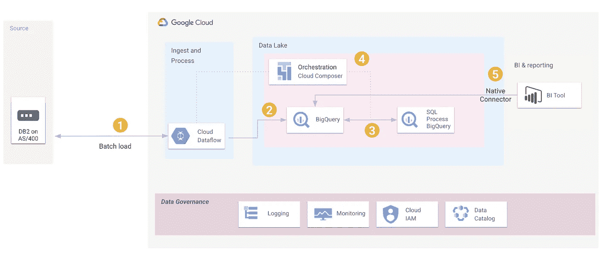

# 使用 Google 云平台的批量驱动 CDC(变更数据捕获)方法

> 原文：<https://medium.com/google-cloud/a-batch-driven-cdc-change-data-capture-approach-using-google-cloud-platform-5595fe6f98f4?source=collection_archive---------0----------------------->

# 通常

如今，大多数数据库都有自己的功能，或者可以与合作伙伴的解决方案协同工作，以便实时识别数据变化。这允许某人创建变更数据捕获(CDC)流，并不断向云数据仓库系统(如 [BigQuery](https://cloud.google.com/bigquery) )提供数据，从而实现实时和预测性分析。启用 CDC 功能通常需要在源上进行额外的配置，但它提供了一种高效的方法来识别数据更改并将其级联到下游系统和应用程序。

如果没有内置的实时 CDC 解决方案可用于所讨论的源系统，那么通常可以通过执行增量批处理作业、基于时间戳或某种“增量 id”列从源表中读取记录来识别“更改了哪些行”。例如，增量批处理作业可能每小时执行一次，并选择 last_updated 列大于“last_job_run_timestamp”的所有记录。“增量 id”列可以由应用程序代码或通过数据库触发器来填充。这种方法在传统的基于 ETL 的 DW 解决方案中并不少见，但是当使用基于触发器的方法时，下游解决方案上的数据的新鲜度或源上的性能问题通常会促使组织考虑实时 CDC 解决方案。

# 有离群值

然而，在有些情况下，实时 CDC 和增量批次变更识别都是不可能的。有时，无论出于什么原因，源系统都不能被修改:安全性、风险、关键程度、缺乏知识等等。然而，变更仍然需要被识别并加载到数据仓库目标系统中。

这个特殊的工件试图记录这个特殊案例的方法和解决方案，在这个案例中，您不能实现事实上的 CDC 解决方案并寻找替代方法。我不得不说，这种方法可能不适用于非常大的数据库、大表或网络连接缓慢的地方，但在某些情况下，它可能是适用的。

# 基于真实的用例

下面是我最近与一位客户合作时遇到的一个真实的用例:想象一个关键的 OLTP 数据库(在非常旧的 AS/400 上的 DB2 ),其中根本不允许任何更改。例如，像 IBM replicator to MQ 这样的解决方案没有启用，在不久的将来也不可能启用，因为每个人都害怕接触现有的系统。此外，这些表没有“最后更新的时间戳列”来执行增量“变更数据捕获”逻辑。也不能实施基于触发器的解决方案，因为任何更改都需要全面的回归测试，并且会给这个复杂的环境带来风险。

面临的挑战是:我们如何识别 DB2 随时间的变化，并将变化的行与 BigQuery 中的最终数据集表合并？

使用 Google 云平台构建了一个定制解决方案来实现这一特定的业务目标。该解决方案采用 ELT(提取-加载-转换)方法，使用以下 Google 云服务:

*   Cloud [Composer](https://cloud.google.com/composer) 作为工作流、编排和调度工具
*   [用于提取/加载到 BigQuery 的数据流](https://cloud.google.com/dataflow)
*   [BigQuery](https://cloud.google.com/bigquery) 用于 CDC 识别和附加转换

# 提取-加载-转换解决方案架构:

**解决方案主要步骤:**

1 =部署了一个预定的 [Cloud Composer DAG](https://cloud.google.com/composer/docs/how-to/using/writing-dags) 来管理整个工作流，首先是一个快速的“truncate BigQuery staging table 命令”，然后是数据流加载作业初始化和执行。

2 = Dataflow 使用标准的 [JDBCtoBigQ](https://cloud.google.com/dataflow/docs/guides/templates/provided-batch#jdbctobigquery) uery 模板来执行“从 DB2 表中选择”,同时将选择的结果插入到之前截断的 BigQuery 临时表中。这里提到的数据流步骤不需要实际的代码开发。这只是将正确的参数传递给可用的标准数据流模板的问题。

3 =由 Cloud Composer 编排，在 BigQuery 内部执行了一些基于 SQL 的步骤，使用了 BigQuery 的强大功能和无限的可伸缩性:

*   BigQuery 将临时表(最近加载的)的内容与另一个表(最终表)的内容进行了比较，并确定了不同之处
*   BigQuery 将这些差异记录到一个日志表中，创建一段时间内所有更改的踪迹，并允许在特定日期/时间精确定位特定行的值
*   最后，BigQuery 通过 ANSI-SQL 命令将确定的更改与最终表的内容合并

4 = Cloud Composer 监控整个工作流的执行，并在执行所有工作流步骤时发送电子邮件

5 =客户的 BI 工具随后能够连接到 BigQuery 并观察业务仪表板上最新版本的数据

# 想自己实践这个解决方案？

## 让您更快入门的注意事项:

*   **对于源服务器**:您可能想考虑使用 MySQL 或 Postgres 实例作为源服务器，在本练习中模拟 DB2 服务器。整个解决方案使用基于 JDBC 的标准 SQL，所以只要您的数据库平台有一个可用的 JDBC 驱动程序，就没问题。谷歌已经通过[云 SQL](https://cloud.google.com/sql) 完全管理 MySQL/Postgres/SQLServer 选项。例如，你也可以决定在谷歌计算引擎上直接安装一个 MySQL 实例，利用来自[谷歌云市场](https://cloud.google.com/marketplace)的一个预建映像。如果使用市场镜像，不需要手动安装 MySQL。只需安装预配置的映像。
*   代理服务器:如果更改防火墙规则以允许数据流和您的源数据库之间的通信是一个挑战，您可以考虑为这一步使用反向代理解决方案，因为这是一个非生产练习。例如，使用 [nginx](https://console.cloud.google.com/marketplace/product/click-to-deploy-images/nginx?q=search&referrer=search) ，数据流和源数据库之间的防火墙配置可能会变得非常简单。仍然需要修改防火墙规则，但是因为 Google Cloud services 和源数据库之间的所有通信都将通过反向代理，所以您只需要允许代理服务器 IP 和您的源之间的通信。我想强调的是，由于这是一个概念验证环境，因此可扩展性、性能、HA 和其他问题都不适用。对于生产，建议在 Google 云和您的源系统之间部署 CloudVPN 或专用的互连管道，完全消除反向代理组件。

# 准备好动手了吗？以下是主要步骤:

# 1.使用 Google Cloud Marketplace 部署一个 MySQL 计算映像并准备它

*   **通过使用谷歌云市场启动**预装了 [MySQL 的计算引擎。记下默认的 root 密码](https://console.cloud.google.com/marketplace/product/bitnami-launchpad/mysql)
*   **通过调整 my.cnf 启用 mysql 远程连接**

> *VI/opt/bitnami/MySQL/conf/my . CNF*
> 
> *#用您的 IP 地址 bind-address = xxx.xxx.xxx.xxx 替换 xxx 或对所有 IP 使用 0 . 0 . 0 . 0*
> 
> 重启 mysql

*   **在 mysql 中创建一个测试数据库、用户和一个新表**

> mysql -u root -h <your_db_ip>-p</your_db_ip>
> 
> 创建数据库 testdb
> 
> 创建由“<your_password>”标识的用户“USER 1”@“%”；</your_password>
> 
> 在*上授予全部权限。*到“用户 1”@“%”；
> 
> 刷新权限；
> 
> 创建表 testdb.table1
> 
> (
> 
> id INT，
> 
> col1 VARCHAR(10)，
> 
> col2 VARCHAR(10)，
> 
> col3 VARCHAR(10)，
> 
> col4 VARCHAR(10)
> 
> );

*   **在新创建的表上插入一些测试数据**

> 将值插入 testdb.table1，' col 1–1 '，' col 2–1 '，' col 3–1 '，' col 4–1 ')；
> 
> 将值插入 testdb.table1，' col 1–2 '，' col 2–2 '，' col 3–2 '，' col 4–2 ')；
> 
> 将值插入 testdb.table1，' col 1–3 '，' col 2–3 '，' col 3–3 '，' col 4–3 ')；
> 
> 将值插入 testdb.table1，' col 1–4 '，' col 2–4 '，' col 3–4 '，' col 4–4 ')；
> 
> 将值插入 testdb.table1，' col 1–5 '，' col 2–5 '，' col 3–5 '，' col 4–5 ')；
> 
> 提交；

# 2.使用 GCE 和 Marketplace 配置 NGINX 反向代理(一旦设置了 CloudVPN 和/或互连，就不再需要)

*   **部署**来自[谷歌云市场](https://console.cloud.google.com/marketplace/product/click-to-deploy-images/nginx?q=search&referrer=search)的 nginx 服务器
*   **将** nginx 反向代理配置为直通

> sudo su -
> 
> CP/etc/nginx/nginx . conf/etc/nginx/nginx . conf . orig
> 
> vi /etc/nginx/nginx.conf
> 
> —用以下内容替换整个文件(/etc/nginx/nginx.conf)的内容，将 **10.150.0.2:3306 更改为 MySQL 数据库在**运行的任何 IP:PORT 组合
> 
> ########
> 
> 用户 www-data；
> 
> worker_processes 自动；
> 
> PID/run/nginx . PID；
> 
> 包括/etc/nginx/modules-enabled/*。conf
> 
> 事件{
> 
> 工人 _ 连接 1024；
> 
> }
> 
> 溪流{
> 
> 上游 sqlvm {
> 
> 服务器 10 . 150 . 0 . 2:3306；
> 
> }
> 
> ###在这种情况下，代理将监听 1433
> 
> 服务器{
> 
> 听 1433；
> 
> proxy _ pass sqlvm
> 
> }
> 
> }
> 
> ############
> 
> 重启 nginx 并检查它的进程
> 
> systemctl 停止 nginx
> 
> systemctl 启动 nginx
> 
> 系统控制状态 nginx

# 3.使用刚刚配置的 nginx 代理测试与 MySQL 的连接

> 下面的例子:
> 
> —相应调整 nginx IP 和端口
> 
> mysql -u 用户 1 -h 10.128.0.5 -P 1433 -p
> 
> MySQL > select * from testdb . table 1；
> 
> + — — — + — — — — + — — — — + — — — — + — — — — +
> 
> | id |列 1 |列 2 |列 3 |列 4 |
> 
> + — — — + — — — — + — — — — + — — — — + — — — — +
> 
> | 1 |列 1–1 |列 2–1 |列 3–1 |列 4–1 |
> 
> | 2 |列 1–2 |列 2–2 |列 3–2 |列 4–2 |
> 
> | 3 |列 1–3 |列 2–3 |列 3–3 |列 4–3 |
> 
> | 4 |列 1–4 |列 2–4 |列 3–4 |列 4–4 |
> 
> | 5 |列 1–5 |列 2–5 |列 3–5 |列 4–5 |
> 
> + — — — + — — — — + — — — — + — — — — + — — — — +
> 
> 一组 5 行(0.00 秒)

# 4.创建大查询数据集和表

*   **通过 Google [云控制台](https://cloud.google.com/bigquery/docs/datasets#console)或 [gcloud](https://cloud.google.com/bigquery/docs/datasets#bq) 等效命令创建一个 BigQuery 数据集**(本例中使用 Google_CarlosAugusto)
*   **创建 BigQuery 表**来处理定制的 CDC 方法

**描述**:

*表 1* =结束/最终表(CDC 数据将被合并到其中)

*Table1_log* =将保存/捕获加班表 1 的所有更改……将其视为一个审计表，保存所有行更改

*table 1 _ Staging*= Staging table，来自源的原始数据将使用数据流加载到该表中

> 创建或替换表格
> 
> ` Google_CarlosAugusto.table1 '
> 
> (
> 
> id INT64，
> 
> col1 字符串，
> 
> col2 字符串，
> 
> col3 字符串，
> 
> col4 字符串
> 
> )
> 
> ;
> 
> 创建或替换表格
> 
> ` Google _ Carlos augusto . table 1 _ log '
> 
> (
> 
> op 字符串，
> 
> id INT64，
> 
> col1 字符串，
> 
> col2 字符串，
> 
> col3 字符串，
> 
> col4 字符串，
> 
> changetime 日期时间
> 
> )
> 
> ;
> 
> 创建或替换表格
> 
> ` Google _ carlosaugusto . table 1 _ staging '
> 
> (
> 
> id INT64，
> 
> col1 字符串，
> 
> col2 字符串，
> 
> col3 字符串，
> 
> col4 字符串
> 
> )
> 
> ;

# 5.创建 GCS 存储桶，包括一个存储适当的源 jdbc 驱动程序(供数据流使用)的存储桶

> gsutil mb gs://drivers-bucket
> 
> gsutil MB GS://composer _ output _ bucket
> 
> gsutil CP/dev/null GS://drivers-bucket/tmp _ dir/log
> 
> gsutil CP/dev/null GS://composer _ output _ bucket/tmp/log
> 
> gsutil CP MySQL-connector-Java-5 . 1 . 49-bin . jar GS://drivers-bucket

# 6.使用云控制台创建云合成器实例

[https://cloud . Google . com/composer/docs/how-to/managing/creating](https://cloud.google.com/composer/docs/how-to/managing/creating)

# 7.下载下面的 DAG(有向无环图),做相应的调整。然后将其部署到 Composer 并执行它

*   **下载** [这个 DAG](https://github.com/caugusto/g-code/blob/main/BQ-ELT-CDC/CDC-DAG-v1.py) python 示例文件到你的工作站，因为你需要根据你的设置修改一些东西
*   **在 Composer** /Airflow 中定义以下环境变量。根据您的设置使用适当的值

> gcp _ 项目
> 
> gcs_bucket
> 
> gce _ 区域
> 
> gce _ 区域
> 
> 电子邮件
> 
> 数据集标识

*   **修改**下载的 DAG 文件，替换与您的设置相关的值的“< CHANGEME >”引用

*ps:如果数据集或表的名称/定义被更改，则除了标有“*<change me>*”*的 DAG 行之外，还需要修改其他 DAG 行

*   **将修改后的 DAG** 文件上传到 Cloud [Composer 的 DAG 文件夹](https://cloud.google.com/composer/docs/how-to/using/managing-dags)
*   **点击如下所示的“触发 DAG”按钮，执行 DAG**

*ps:此 DAG 将使用 BQ 执行整个加载(使用数据流)、表 1 的 CDC 识别，然后合并 BQ 表 1。*

*ps:注意 loadbq_table1_dataflow 步骤(蓝色)将创建/启动一个数据流作业。数据流作业运行后，您可以随时查看 GCP 控制台，了解其执行细节。*

*ps:这一步相当于初始加载。成功执行后，BigQuery 的*Google _ carlosaugusto . table 1*的内容应该与源表的内容相匹配。*

***ps:虽然我们在这个例子中是手动执行 DAG 的，但是您可以通过调整 DAG(.py)之前共享的文件*** *。*

# 8.假设 Cloud Composer 作业成功完成，检查 BigQuery 中的 table1_log 和 table1 表以验证负载:

> —检查自上次作业运行以来发生了什么变化(CDC)
> 
> **select * from Google _ carlosaugusto . table 1 _ log where change time in(select max(change time)from Google _ carlosaugusto . table 1 _ log)order by id；**
> 
> 示例:

> —检查最终表(表 1)并将内容与 mysql 源进行比较。此时，源和目标应该是相同的
> 
> **select * from Google _ carlosaugusto . table 1 order by id；**

# 9.回到源上，执行一些数据更改

> 从 testdb.table1 中删除，其中 id = 1；
> 
> 更新 testdb . table 1 SET col 2 = ' 2–2 '其中 id = 2；
> 
> 更新 testdb . table 1 SET col 3 = ' 3–2 '其中 id = 2；
> 
> 更新 testdb . table 1 SET col 4 = ' 4–3 '其中 id = 3；
> 
> 向 testdb.table1 中插入值(6，' 6 '，' 1000 '，' c '，' d ')；
> 
> 提交；
> 
> MySQL > select * from testdb . table 1；
> 
> + — — — + — — — — + — — — — + — — — — + — — — — +
> 
> | id |列 1 |列 2 |列 3 |列 4 |
> 
> + — — — + — — — — + — — — — + — — — — + — — — — +
> 
> | 2 |列 1–2 | 2–2 | 3–2 |列 4–2 |
> 
> | 3 |列 1–3 |列 2–3 |列 3–3 | 4–3 |
> 
> | 4 |列 1–4 |列 2–4 |列 3–4 |列 4–4 |
> 
> | 5 |列 1–5 |列 2–5 |列 3–5 |列 4–5 |
> 
> | 6 | 6 | 1000 | c | d |
> 
> + — — — + — — — — + — — — — + — — — — + — — — — +
> 
> 一组 5 行(0.05 秒)
> 
> 请注意，第 1 行不见了

# 10.重新运行 Cloud Composer 作业(在步骤 7 中介绍)并检查 BigQuery 中的表(步骤 8)

假设一切正常，BigQuery 的 Google _ carlosaugusto . table 1*的*内容应该与源表(testdb.table1)的内容匹配。*Google _ carlosaugusto . table 1 _ log 还应准确反映哪些行发生了更改(插入、更新或删除了行)。*

ps:根据步骤 9 中执行的 DML 更改，值可能与上图不同。无论如何，在 Cloud Composer 完成执行后，源表和目标表应该是同步的。

# **总之**

在将数据移动到分析仓库时，实时变更数据捕获(CDC)解决方案并不少见。然而，有时需要在源环境之外的其他地方识别变更。上面的解决方案将为您提供这种能力，利用 [BigQuery](https://cloud.google.com/bigquery) 和 ANSI SQL 的无限能力和可伸缩性来识别哪些行发生了更改，并保持源表和目标表同步。感谢阅读这篇文章！回头见！

# 放弃

我是谷歌公司(Google Cloud)的数据专家。这里陈述的观点是我自己的，而不是谷歌公司的。