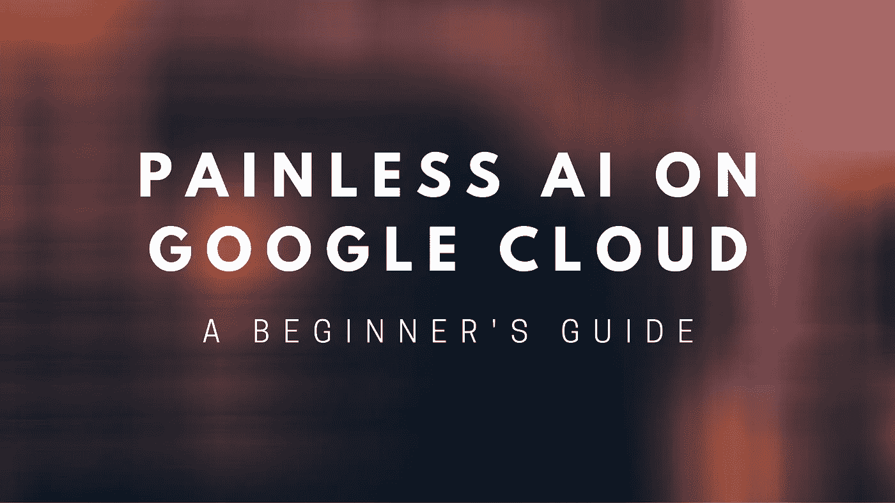
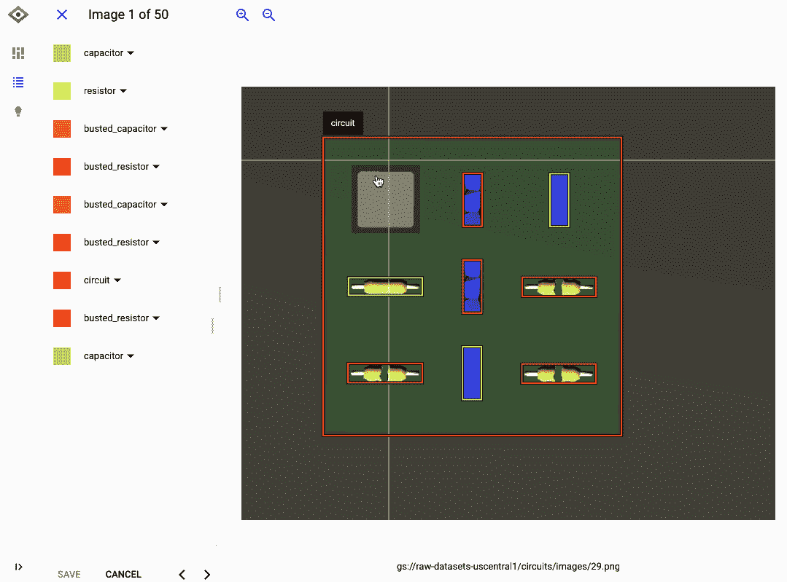
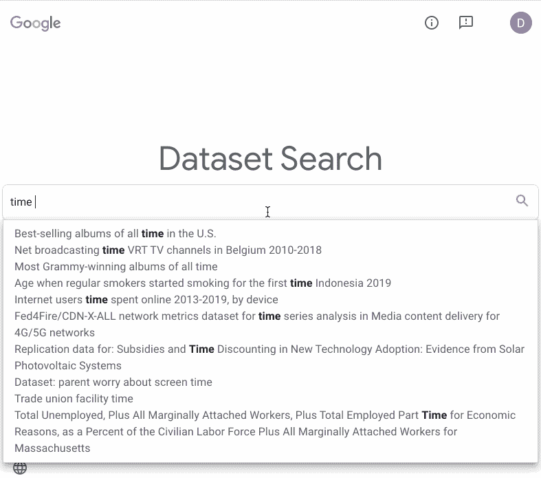
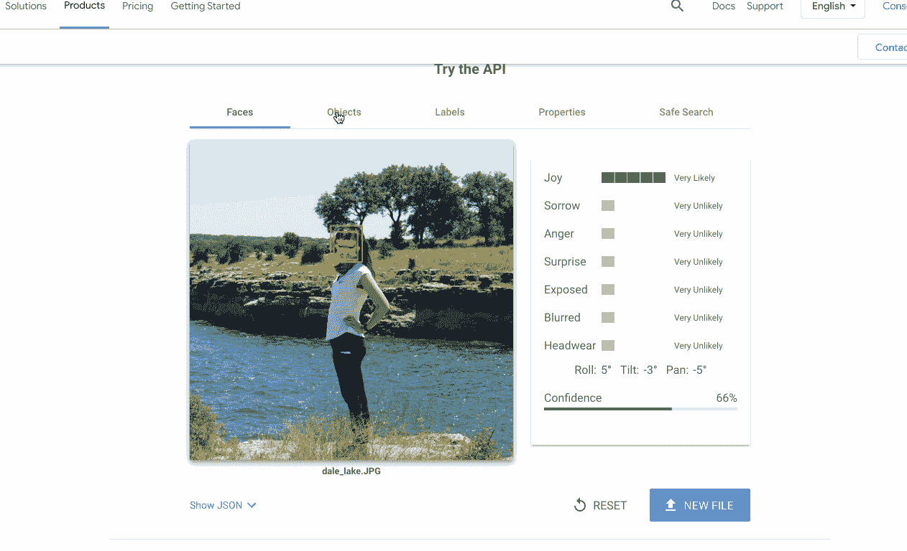
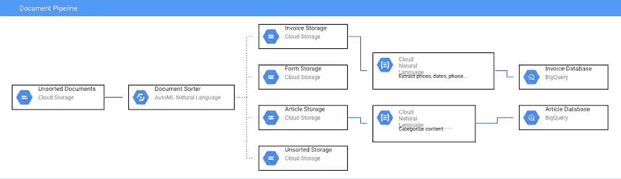

# 谷歌云无痛 ML 初学者指南

> 原文：<https://medium.com/google-cloud/a-beginners-guide-to-painless-ml-on-google-cloud-8453575f357e?source=collection_archive---------3----------------------->

构建人工智能驱动的应用可能会很痛苦。我知道。我已经忍受了很多痛苦，因为使用这项技术的回报通常是值得的。

令人高兴的是，在过去的五年里，由于用户友好的工具，使用机器学习进行开发变得更加容易。如今，我发现自己花在构建和调整机器学习模型上的时间很少，而花在传统应用开发上的时间却多得多。

在这篇文章中，我将带你浏览一些我最喜欢的无痛谷歌云人工智能工具，并分享我快速构建人工智能应用的技巧。我们开始吧。

# 使用预先训练的模型

机器学习项目中最慢、最不愉快的部分之一是收集带标签的训练数据——机器学习算法可以从中“学习”的带标签的例子。

但是对于许多常见的用例，您不需要这样做。你可以利用*预先训练的*模型，而不是从零开始构建你自己的模型，这些模型已经被其他人构建、调整和维护过了。谷歌云的人工智能 API 就是一个例子。

云人工智能 API 允许您使用机器学习来做以下事情:

驱动这些 API 的机器学习模型类似于许多谷歌应用程序中使用的模型(如照片)。他们在庞大的数据集上接受训练，而且往往非常准确！例如，当我使用[视频智能应用编程接口](https://cloud.google.com/video-intelligence)到[分析我的家庭视频](https://cloud.google.com/blog/products/ai-machine-learning/building-an-ai-searchable-archive-for-30-years-of-family-videos)时，它能够检测出特定的标签，如“新娘送礼会”、“婚礼”、“球棒和球类游戏”，甚至“婴儿微笑”

云人工智能应用编程接口在云中运行。但如果你需要一个免费的离线解决方案， [TensorFlow.js](https://www.tensorflow.org/js/models) 和 [ML Kit](https://firebase.google.com/docs/ml-kit) 提供了一系列预先训练好的模型，你可以直接在浏览器或移动设备上运行。在 [TensorFlow Hub](https://tfhub.dev/) 中有一组更大的预训练 TensorFlow 模型。

# 带 AutoML 的简易定制模型

尽管您可以为许多用例找到一个预先训练好的模型，但有时您需要构建一些真正定制的东西。也许你想建立一个模型来分析 X 射线等医学扫描，以检测疾病的存在。或者你可能想在装配线上从小物件中挑选小部件。或者，当你向客户发送目录时，预测他们中的哪一个最有可能购买。

为此，您需要构建一个定制模型。AutoML 是一个谷歌云人工智能工具，它使这个过程尽可能地无痛。它可以让你根据自己的数据训练一个定制的模型，你甚至不用写代码就能做到(除非你*希望*这么做)。

在下面的 gif 中，你可以看到我如何使用 AutoML Vision 训练一个模型来检测电路板上损坏的组件。标记数据的界面是点击-拖动，训练模型就像点击“训练新模型”按钮一样简单当模型完成训练时，您可以在“评估”选项卡中评估它的质量，并查看它在哪里出错。

它处理图像( [AutoML 视觉](https://cloud.google.com/vision/automl))、视频( [AutoML 视频](https://cloud.google.com/video-intelligence/automl/docs))、语言( [AutoML 自然语言](https://cloud.google.com/natural-language/automl/docs)和 [AutoML 翻译](https://cloud.google.com/translate/automl/docs))、文档和表格数据( [AutoML 表格](https://cloud.google.com/automl-tables))，就像你可能在数据库或电子表格中找到的一样。

AutoML Vision 允许您拖放标签数据，然后单击一个按钮来训练自定义模型。

尽管 AutoML 界面很简单，但它生成的模型通常质量非常高。在引擎盖下，AutoML 训练不同的模型(如神经网络)，比较不同的架构和参数，并选择最准确的组合。

在你的应用中使用 AutoML 模型很容易。您可以让 Google 在云中为您托管模型，并通过标准的 REST API 或客户端库(Python、Go、Node、Java 等)访问它，或者将模型导出到 TensorFlow，以便您可以离线使用它。

因此，或多或少，使模型训练变得容易。但是你从哪里得到一个大的训练数据集呢？

# 永远不要给自己的数据贴标签

我是认真的。

当我开始一个 ML 项目时，我首先检查是否已经存在一个预先训练好的模型来做我想要的事情。

如果没有，我会问自己同样的关于数据集的问题。在数据集托管和竞赛网站 [Kaggle](https://www.kaggle.com/datasets) 上，几乎任何你能想象到的数据集都存在。从[关于新冠肺炎](https://www.kaggle.com/gpreda/covid19-tweets)的推文到[一系列墨西哥小吃店的位置](https://www.kaggle.com/jeffreybraun/chipotle-locations)到[一系列假新闻](https://www.kaggle.com/clmentbisaillon/fake-and-real-news-dataset)文章，你经常可以在 Kaggle 上找到至少*一些*数据集，让你为你的问题训练一个概念验证模型。[谷歌数据集搜索](https://datasetsearch.research.google.com/)也是一个寻找数据集的有用工具，可以查询 Kaggle 和其他来源。

数据集搜索是数据集的谷歌！

当然，有时候你必须给自己的数据贴上标签。但是在你雇佣数百名实习生之前，考虑使用谷歌的[数据标签服务](https://cloud.google.com/ai-platform/data-labeling/docs)。要使用这个工具，你需要描述你希望你的数据如何被贴上标签，然后谷歌将它发送给贴标签的团队。产生的标记数据集可以直接插入 AutoML 或其他人工智能平台模型进行训练。

# 从模型到可用应用

很多时候，构建(或找到)一个有效的机器学习模型并不是项目中棘手的部分。它使你团队中的其他人能够在他们自己的数据上使用这个模型。我们在谷歌云人工智能中经常遇到这个问题，这就是为什么我们决定[在我们的 API 产品页面中添加互动演示](http://cloud.google.com/vision)，这样你就可以上传我们的 API 并快速试用它们。

*我们将此演示添加到视觉产品页面，以便人们可以在他们的数据上试用我们的模型。*

领导一个成功的机器学习项目往往需要能够快速构建原型。为此，我有一些常用的工具和架构:

*   **将 ML 添加到 Google Sheets** 。*通过[应用脚本](https://developers.google.com/apps-script)框架，可以使用 JavaScript 轻松扩展工作表、文档和表格等 G 套件应用。例如，您可以构建一个文本分类模型，每当您在 Google 工作表中添加一行时，就会运行这个模型。或者，你可以[构建一个谷歌表单](https://developers.google.com/gsuite/solutions/feedback-sentiment-analysis)，让你上传图片，用 ML 模型分析它们，然后将结果写入谷歌表单。
*   **谷歌云存储+云功能二重奏**。大多数 ML 项目都是数据输入，数据输出。你上传一些输入数据——图像、视频、录音、文本片段等——然后一个模型对其进行预测(“输出数据”)。构建这类项目原型的一个好方法是使用[云存储](https://cloud.google.com/storage)和[云功能](https://cloud.google.com/functions)。云存储就像云中的一个文件夹:一个存储所有格式数据的地方。云函数是一种在云中运行代码块的工具，不需要专门的服务器。您可以将这两者配置为协同工作，方法是让上传到云存储的文件“触发”云功能运行。

我最近在构建文档 AI 管道时使用了这个设置

当一个文档被上传到一个云存储桶时，它触发一个云功能，该云功能按类型分析该文档，并将它移动到一个新的桶。这触发了一个新的云函数，它使用自然语言 API 来分析文档文本。点击查看完整代码[。](https://github.com/dalequark/document-pipeline)

# 后续步骤

希望这能让你相信，开始机器学习并不一定是痛苦的。这里有一些有用的教程和演示，可以帮助你开始使用 ML:

*   [软件开发者:你在颠倒着学习机器学习](https://daleonai.com/software-developers-youre-learning-machine-learning-upside-down)
*   [用机器学习对国会法案进行分类](/@srobtweets/classifying-congressional-bills-with-machine-learning-d6d769d818fd)
*   [探索云视觉 API](/@srobtweets/exploring-the-cloud-vision-api-1af9bcf080b8)
*   [用 ML 制作 YouTube 系列(ft your humble author)](https://www.youtube.com/playlist?list=PLIivdWyY5sqLsaG5hNms0D9aZRBE7DHBb)
*   [云艾与国玉峰的冒险](https://www.youtube.com/playlist?list=PLIivdWyY5sqJxnwJhe3etaK7utrBiPBQ2)
*   [人工智能、机器学习、深度学习 TensorFlow 简介](https://www.coursera.org/learn/introduction-tensorflow)

*原载于 2020 年 10 月 19 日*[*https://daleonai.com*](https://daleonai.com/painless-gcp-ml)*。*