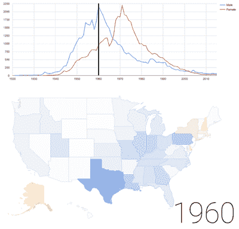
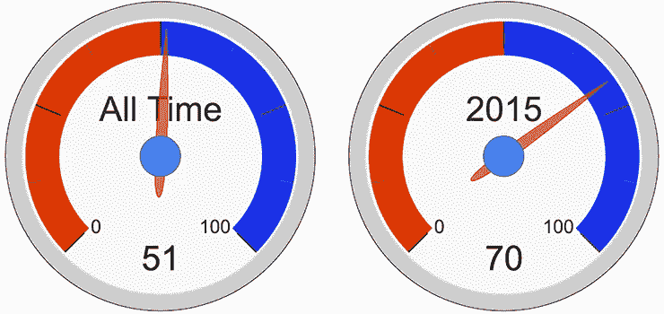
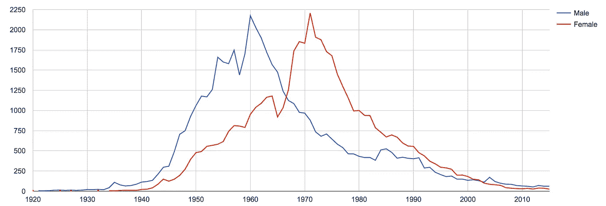
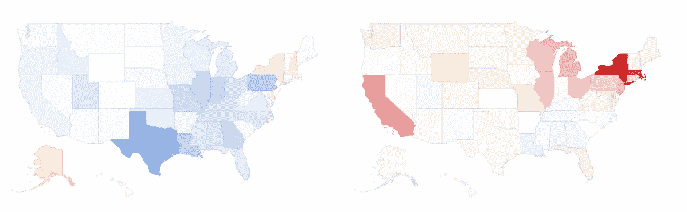

# 男孩名还是女孩名？问 BigQuery！

> 原文：<https://medium.com/google-cloud/a-boys-name-or-a-girls-name-52a52a9acc1?source=collection_archive---------0----------------------->

## 简单的问题往往有复杂的答案

> 最近我一直在玩 [BigQuery](https://cloud.google.com/bigquery/) 上的[公共数据集](https://cloud.google.com/bigquery/public-data/)。我在写我实验时的那些经历，因为——为什么不呢？本文是该系列的一部分。

问题的框架——或者它的答案——会导致截然不同的结果。我对“开放数据”充满热情，因为它允许更多的人分析一个给定的问题，并查看任何答案是如何得出的。

> 假设你想回答一个简单的问题:***这是女孩的名字还是男孩的名字*？”**

男孩和女孩都有很多名字。最受欢迎的五个(至少有 10，000 个男孩和女孩)，差异最小的是凯瑞、莱利、克里斯、以利沙和罗比——一个孩子的婴儿增加不到 5%。

## 凯丽是典型的女孩名还是男孩名？

> 想查其他名字？跳到本文末尾，您可以自己查看 BigQuery SQL 语句。

问任何 50 岁以下的人，他们可能会说这是一个女孩的名字。

简单的问题可以有复杂的答案，所以我喜欢良好的可视化所提供的数据密度。这意味着我能提供的最佳答案就是这张信息图。



叫凯瑞的男孩和女孩几乎一样多——事实上男孩稍微多一点。从 50 年代到 70 年代，这是一个很流行的名字，但是现在对男孩和女孩来说，这是一个很少见的名字。在南方，它最初是一个男孩的名字，但是在北方，T8 一直是女孩的名字。

## 展示我的作品

我们可以获得自 1900 年以来在美国出生的婴儿的所有男孩和女孩的名字，所以快速查询显示，到目前为止，共有 97，958 个克里，男孩略多(51%比 49%)。2015 年，70%的克里新生儿是男孩。



这可能预示着一种趋势——也许凯瑞越来越像一个男孩的名字？另一个简单的查询结果是，没有那么多:



那些双峰令人惊讶。让我们来看看 1960 年和 1971 年的地区细分:



在东北部，它一直是一个女孩的名字——在南部，它开始，并且很大程度上一直是一个男孩的名字。把所有的东西放在一起，你得到了这个动画，展示了从 1960 年到 1971 年男孩名字到女孩名字的变化。


我选择 Kerry 是因为这是最受欢迎、性别最模糊的名字——有近 98000 名婴儿出生，男孩和女孩的数量只有 1%的差异。

拥有至少 10000 个男婴的最受欢迎的女孩名(和总名)是拥有 276000 个男婴的杰西(女孩比男孩多 20%)。)

拥有至少 10，000 个女婴的最受欢迎的男孩名是凯西，有 184，000 个男婴的名字比女婴多 18%。

# 使用 BigQuery 检查其他名称

这个 [USA Name 数据集](https://cloud.google.com/bigquery/public-data/usa-names)非常小(~128Mb)，所以你并没有真正利用 BigQuery 快速分析 Pb 级数据的能力。另一方面，数据已经加载到那里了——有了一个慷慨的免费层，您真的不必担心运行这些查询会被收费。

这些是我用过的查询——把*凯瑞*换成你想要的任何名字。

## 比较给定名字的男婴和女婴的总数

```
SELECT name, sum(number), gender
FROM [fh-bigquery:popular_names.usa_summary_1880_2015] 
WHERE name=’Kerry’
GROUP BY name, Gender
```

## 比较给定年份中给定名字的男婴和女婴的总数

```
SELECT name, sum(number), gender
FROM [fh-bigquery:popular_names.usa_summary_1880_2015] 
WHERE name=’Kerry’ AND year=2015
GROUP BY name, Gender
```

## 用图表表示一段时间内给定名字的男孩和女孩的数量

```
SELECT year, name, gender, number
FROM [fh-bigquery:popular_names.usa_summary_1880_2015] 
WHERE name=’Kerry’
```

我将结果导出到 Google Sheets 并做了一个简单的数据透视表，其中列为年份，行为性别，值为数字。那么就很容易绘制成两个线形(或条形)图。

## 用图表表示给定时间段内不同州的同名男婴和女婴的数量

```
SELECT year, state, name, gender, number
FROM [fh-bigquery:popular_names.usa_1910_2013] 
WHERE name='Kerry' AND year>1959 AND year<1972
```

对于这一个，我们需要使用包括州人口统计的不同的表。我将结果输出到 Google Sheets 并再次创建了一个数据透视表——这个数据透视表以州为行，以性别为列，以数字为值。

为了创建一个更有用的地图，我绘制了每年男婴和女婴数量之间的差异。