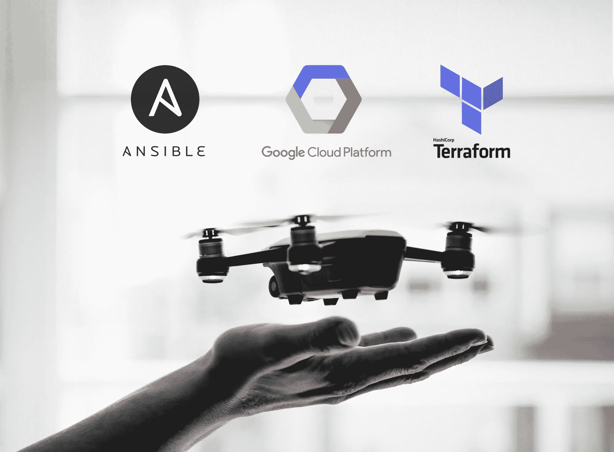
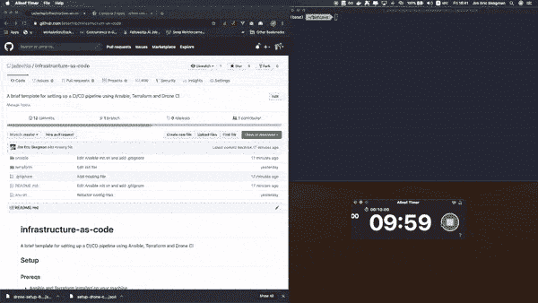
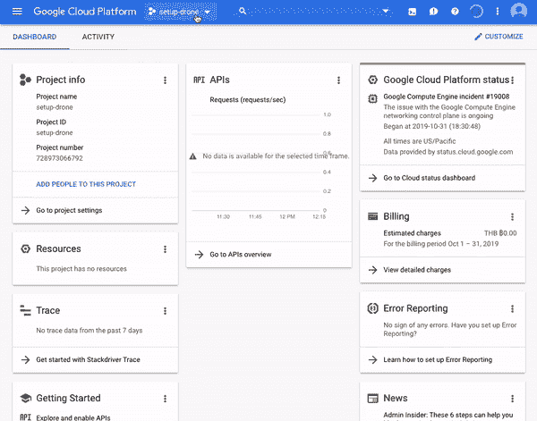
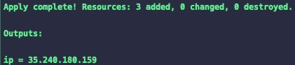
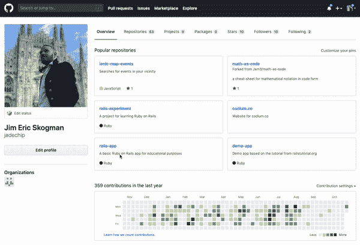
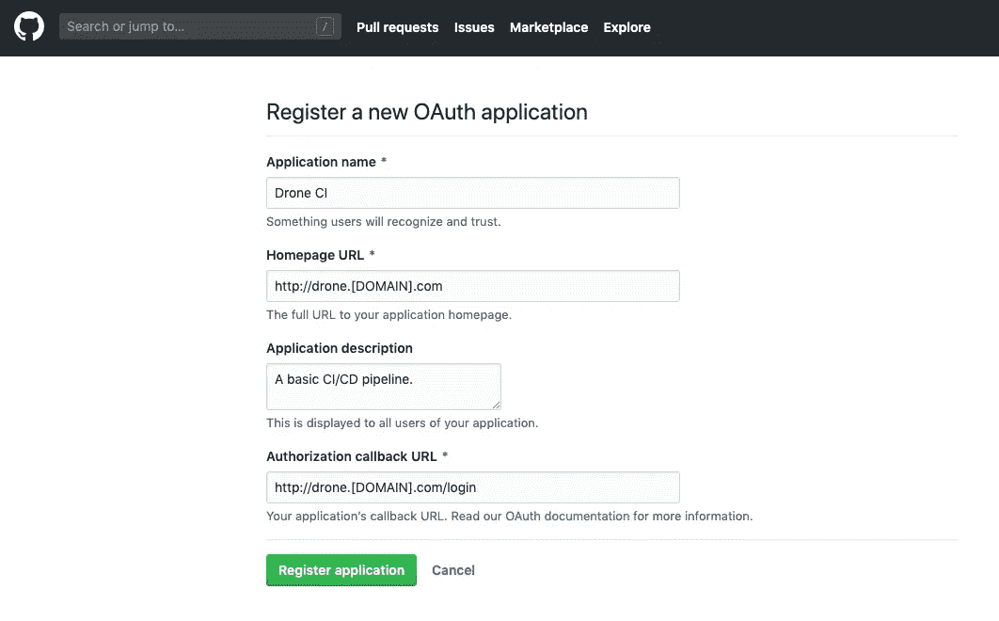
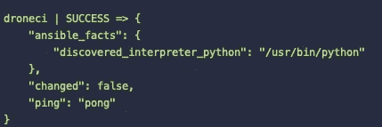
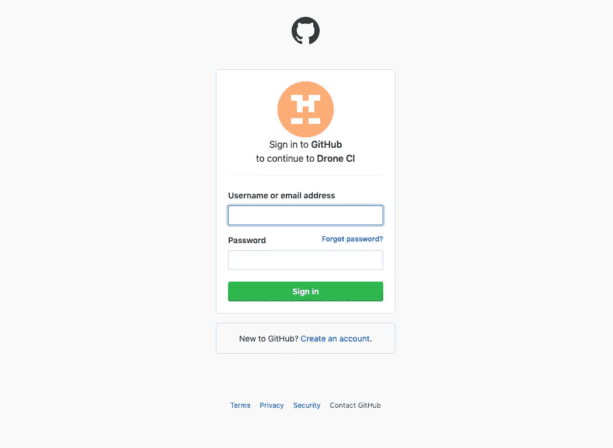
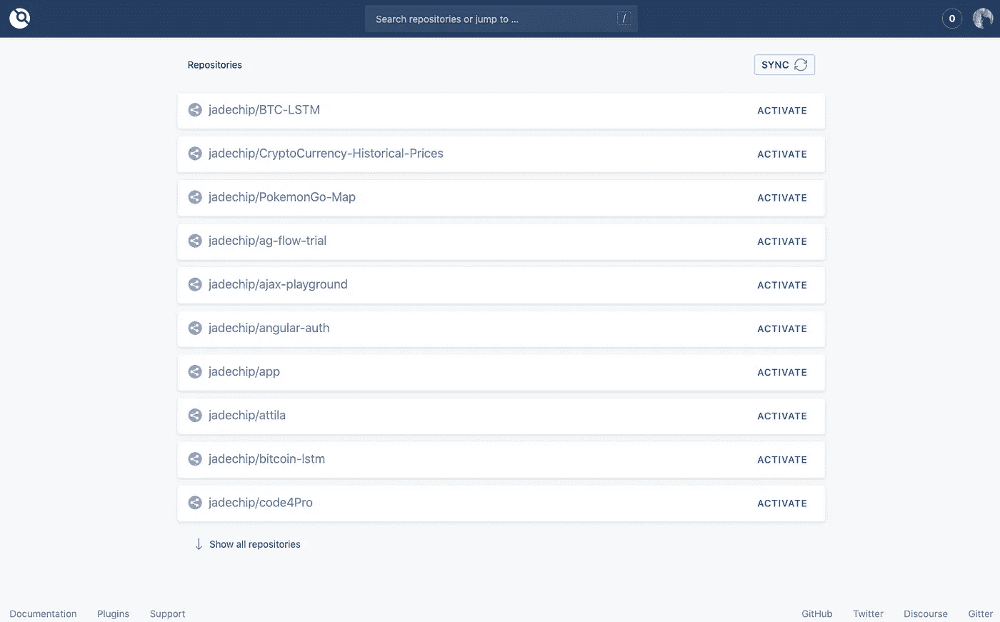

# 使用 GCP 的 Terraform & Ansible 在 10 分钟内完成 CI/CD 解决方案

> 原文：<https://medium.com/google-cloud/a-ci-cd-solution-in-under-10-minutes-featuring-terraform-ansible-and-drone-ci-on-gcp-16bba497c655?source=collection_archive---------0----------------------->



随着项目的成熟和复杂性的增加，集成 CI/CD 解决方案是非常有意义的。

然而，建立和运行这样一个系统可能是一个惊人的技术和耗时的过程。

接下来是部署 Drone CI 的实践指南，这是一个轻量级、以容器为中心的 CI/CD 解决方案，只需几分钟，而不是几天。

为了实现这一点，我们将利用 Terraform 和 Ansible 的强大功能，这是一个用于自动化基础设施资源的创建和供应的强大组合。

我们不会深究任何特定的技术或低级的概念，因为已经有大量的资源可以解决这些问题。

相反，我们将采取更务实的方法，关注真实世界的场景，旨在强调自动化的好处，并提供对“基础设施即代码”世界的深刻见解。

然而，如果您喜欢更直接的方法，请前往 [Github](https://github.com/jadechip/infrastructure-as-code) 并遵循附带的说明。整个过程不会超过 10 分钟。



无论如何，如果你觉得内容有用，一定要给我几个掌声，或者在 Github 上打个星🤩

# 先决条件

我们将使用谷歌云提供商(GCP)，但是，下面的说明可以很容易地修改为其他云提供商。如果你还没有账户，GCP 为新用户提供价值 300 美元的信用。

我们还需要 [Terraform](https://www.terraform.io/) 和 [Ansible](https://docs.ansible.com/ansible/latest/installation_guide/intro_installation.html) 来满足我们的编排和供应需求，所以在继续之前请确保安装好这些。

最后，我选择使用 Github，但是 Drone CI 也支持其他版本控制解决方案，包括 Bitbucket、GitLab、Gitea 和 Gogs。查看[文档](https://docs.drone.io/installation/overview/)了解更多信息。

# 周密计划的行动方案

我们现在准备开始，这是我们的游戏计划:

1.  使用 **Terraform** 生成所需的基础架构:单个虚拟机，或 GCP 方言中的计算实例。
2.  给我们的机器添加一个静态 IP 并配置基本的防火墙设置。
3.  在 Github 上设置 OAuth 应用程序。
4.  安装任何必要的依赖项，并使用 **Ansible** 行动手册运行 Docker。
5.  从 Docker Hub 下载并运行**无人机**代理和服务器映像。
6.  庆祝🎉(可选)。

# 证明

为了让 Terraform 安全地与 GCP 互动，我们首先需要设置一个**服务帐户。**

## 服务帐户

> 使用 Terraform 配置资源的首选方法是使用 GCP 服务帐户，这是一个“机器人帐户”，可以被授予有限的 IAM 权限集。

前往[谷歌云控制台](https://console.cloud.google.com/)，创建一个新项目或选择一个现有项目。

在主菜单的*API&服务*部分下，点击*凭证*。从*创建凭证*下拉菜单中选择*服务账户密钥*，并填写所需的详细信息。最后，点击 *create* 下载生成的 JSON 文件。



有关在 GCP 上设置身份验证的更多信息，请查看下面的链接。

 [## 认证入门|认证|谷歌云

### 本文展示了认证云 API 的推荐方法。认证是指…的过程

cloud.google.com](https://cloud.google.com/docs/authentication/getting-started) 

## 嘘

我们还需要通过向 Terraform 元数据添加一个**公共 SSH** 键来授予对我们的 VM 的可编程访问权。

我们可以通过运行以下命令并在提示时输入密码来轻松生成一对密钥。

```
ssh-keygen -t rsa -f ~/.ssh/[KEY_FILENAME] -C `whoami`
```

让我们也限制对我们的私钥的访问，以防止其他人修改它。

```
chmod 400 ~/.ssh/[KEY_FILENAME]
```

有关为 GCP 上的资源创建 SSH 密钥的更多细节，请查看下面的链接。

 [## 管理元数据中的 SSH 密钥|计算引擎文档|谷歌云

### 编辑描述

cloud.google.com](https://cloud.google.com/compute/docs/instances/adding-removing-ssh-keys) 

# 将（行星）地球化（以适合人类居住）

Terraform 使用机器可读的定义文件来定义、创建、管理和更新基础设施资源，如物理硬件、虚拟机、容器等。这使我们能够创建可复制的环境，与其他开发人员共享配置，并使我们的基础设施受到版本控制。

## 基础设施作为代码

让我们首先创建一个名为`terraform`的目录，并添加以下文件。

## **terraform/main.tf**

这里，我们简单地声明几个[输入变量](https://www.terraform.io/docs/configuration/variables.html)，并指定我们选择的提供者。

> 提供者负责理解 API 交互和公开资源。提供商一般是 IaaS(如阿里云、AWS、GCP、微软 Azure、OpenStack)、PaaS(如 Heroku)、或 SaaS 服务(如 Terraform Cloud、DNSimple、CloudFlare)。

请注意，我们引用的是之前生成的凭证文件。

## **terraform/vm.tf**

现在，我们可以继续配置基础架构的主要资源。首先，我们为计算实例指定引导磁盘和机器类型。然后，我们设置一些基本的防火墙设置，并暴露必要的端口。我们还需要附加前面的公共 SSH 密钥。最后，我们指定一个静态 IP 地址，并将其绑定到我们的机器上。

## **terra form/terra form . TF vars**

我们还需要声明 **main.tf** 中变量的实际值。继续用您自己的值替换占位符文本。确保包含您的服务帐户的凭证文件和公共 SSH 密钥。

请注意，*项目名称*需要与您在 GCP 中选择的**项目名称相匹配，否则我们的凭证文件将不会有任何效果。**

要查看完整的地区和区域列表，请查看 https://cloud.google.com/compute/docs/regions-zones/

## 管弦乐编曲

要初始化 Terraform，跳转到 terraform 目录并运行以下命令:

```
terraform init
```

为了测试我们目前所拥有的，我们可以使用`terraform plan`命令来预览 Terraform 最终将创建和/或修改哪些资源。如果一切正常，我们可以继续应用更改:

```
terraform apply
```

如果操作成功，产生的输出应该如下所示:



**请务必记下我们新的计算实例**的 IP 地址，因为我们很快就会用到它。为了方便起见，我们可以将它存储在一个变量中:

```
export VM_IP=$(terraform output ip)
```

# OAuth

为了让 Drone 最终能够访问我们在 Github 上的源代码，我们需要快速绕道并注册一个 OAuth 应用程序。前往 Github 的设置页面，点击*开发者设置*。



选择 *OAuth 应用*选项卡，点击*新建 OAuth 应用，*填写所需的详细信息。



请注意，授权回调 URL 必须与上述格式和路径匹配，并且必须使用您的确切服务器方案和主机。

**如果您没有自定义域，请继续使用我们计算实例的 IP 地址。**

```
echo $VM_IP
```

# Ansible

借助 Ansible，我们可以轻松地自动化各种各样的任务，从应用程序部署到多节点编排，而无需在远程系统上安装任何代理或附加软件。

为了实现这一点，Ansible 将现有的 SSH 守护程序与[剧本](https://docs.ansible.com/ansible/latest/user_guide/playbooks.html)结合使用，剧本是帮助我们轻松管理配置和定义编排流程的指令文件。

## 配置为代码

我们首先需要在所谓的[库存文件](https://docs.ansible.com/ansible/latest/user_guide/intro_inventory.html)中添加一个对我们虚拟机的引用。您可以编辑默认的清单，通常可以在`/etc/ansible/hosts`找到，或者创建您自己的清单文件并用`-i <path>`标志引用它。

继续添加下面一行。

```
droneci ansible_host=[IP]ansible_ssh_private_key_file=[SSH_KEY_PATH]
```

为了测试连接，我们可以使用 Ansible 的内置 ping 命令。

```
ansible droneci -m ping
```

这应该会产生如下所示的输出。



## 环境变量

在我们开始编写行动手册之前，我们需要添加一些环境变量，以便正确配置 Drone CI。

注意， *DRONE_SERVER_HOST* 变量需要匹配我们在 Github 上的 OAuth 应用程序中指定的域，尽管我们不需要指定协议。

通过运行`chmod +x env.sh`然后运行`source env.sh`来执行 bash 脚本。

有关配置无人机所需变量的更多信息，请查看[https://docs.drone.io/installation/reference/](https://docs.drone.io/installation/reference/)。

## 剧本

我们需要一个专门的文件夹来存放行动手册。让我们将它嵌套在另一个名为`ansible,`的目录中，如下所示:

```
.
├── ansible
│   └── playbooks
├── env.sh
└── terraform
    ├── main.tf
    ├── terraform.tfvars
    └── vm.tf
```

我们终于可以开始添加行动手册了。

## **ansi ble/playbooks/install-docker . YAML**

我们的第一本剧本将简单地安装 Docker 和 Docker Compose。我们还指定一个 Python 解释器并安装所需的系统包。

## ansi ble/playbooks/**start-drone . YAML**

安装好一切后，剩下的唯一一步就是运行无人机图像。为此，我们可以使用 Ansible 内置的 Docker Compose 模块。注意我们是如何引用我们之前添加的环境变量的。

## ansi ble/剧本/main.yaml

最后，我们简单地在 **main.yaml** 中添加一个对每个文件的引用，它将作为执行我们剧本的主要入口点。

## 准备金提取

要开始资源调配，请运行以下命令:

```
ansible-playbook playbooks/main.yaml
```

如果您选择使用自定义清单文件，相同的命令可能如下所示:

```
ansible-playbook -i inventory.tpl playbooks/main.yaml -u jimericskogman — private-key ~/.ssh/drone-ci
```

这可能需要几分钟时间。与此同时，为什么不看一眼你的加密组合，绝望地喘息一下呢😱。

为了验证我们最近的努力是否成功，打开浏览器，前往我们之前指定的域/ip。应该会出现以下屏幕提示。



一旦你登录到 Github，你将被重定向到主仪表板，并被要求同步你的存储库。万岁。🎉



# 结论

我们已经完成了一次充满希望的、相对轻松的旅程。我们的 CI/CD 都设置好了，我们就可以开始构建、测试和部署我们的代码了。我们将在以后的文章中讨论这个话题。在此之前，我感谢你的时间，并向你告别！

[](https://github.com/jadechip/infrastructure-as-code) [## jade chip/基础设施即代码

### 在 GCP Ansible 和 Terraform 上使用 Terraform & Ansible，10 分钟内完成 CI/CD 解决方案的配套代码…

github.co](https://github.com/jadechip/infrastructure-as-code)