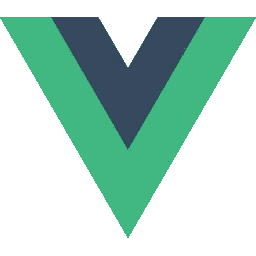
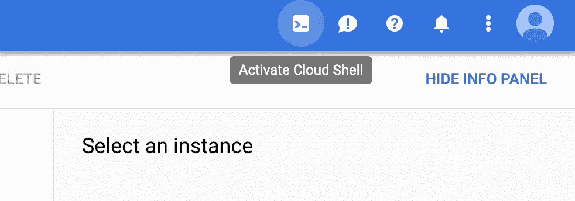
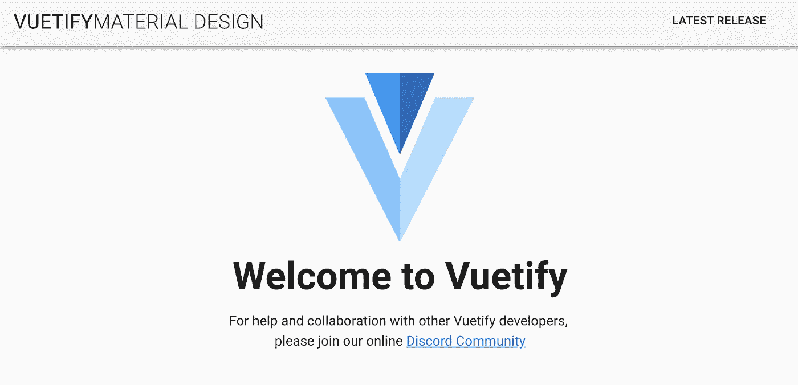
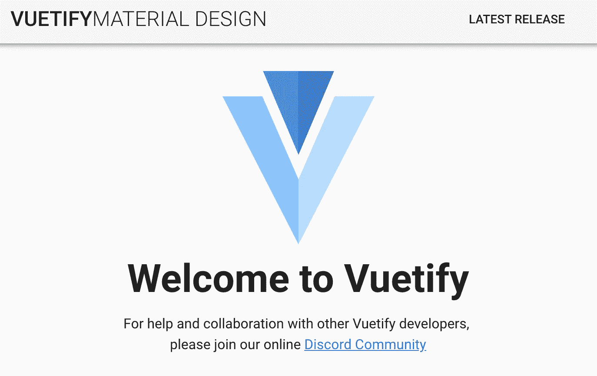

# 谷歌云中更清晰的 Vue

> 原文：<https://medium.com/google-cloud/a-clearer-vue-in-google-cloud-2370a4b048cd?source=collection_archive---------1----------------------->

## **在几分钟内将 Vue.js 应用部署到谷歌云平台**

*在本文中，我们将使用* ***Vue.js*** *，* ***节点*** *，****Docker****和* ***谷歌云平台*** *来部署到谷歌计算引擎(GCE)。*



[vue . js](https://vuejs.org/)。一个直观的 Javascript 前端开发框架，用于构建简单、干净的用户界面、组件等等。


[**谷歌云平台**](https://cloud.google.com/) **。**提供广泛服务的云计算平台。在本文中，GCP 将用于部署和托管 Vue 应用程序。

# 我们开始吧

如果你还没有使用过谷歌云，你可以前往 https://console.cloud.google.com 注册一个免费账户，起点是 300 美元。

# 先决条件

*   一个谷歌云平台账户和谷歌云项目
*   Node.js (v10.x)
*   npm(版本 5.6.0)
*   Docker (v18.x)
*   [gcloud](https://cloud.google.com/sdk/) (v219.0.1)

作为参考，我在上面包含了库和 SDK 的版本。我也是在 MacOS Mojave 上运行，但是也用云壳(Google Cloud 的内置终端)验证了这些步骤。

# 1)创建并运行 Vue 应用程序

如果您在 Mac 上，请打开终端并开始。或者，您也可以使用 Google Cloud Shell，它是 Google Cloud 的集成终端。



谷歌云控制台

1.  设置本地文件夹
2.  创建我们的 vue 应用
3.  向 vue 应用添加 vue 化
4.  运行应用程序

```
# let's create our workspace
mkdir vue-google-cloudcd vue-google-cloud/# install vue
npm install @vue/cli -g# create the vue-app (select default settings)
vue create vue-appcd vue-app/# add vuetify (select default settings)
vue add vuetify# let's test out the app locally
npm run serve
```

基本的 vue app 应该在本地托管在 [http://localhost:8080/](http://localhost:8080/) 。



[上的 vue app http://localhost:8080/](http://localhost:8080/)

# 2)使用 Docker 在本地运行我们的应用程序

让我们配置一个简单的 Dockerfile 文件

[参考来自 Vue 网站的[简单示例的修改]](https://vuejs.org/v2/cookbook/dockerize-vuejs-app.html)

在这里，我们将:

1.  创建 Dockerfile 文件
2.  建立 Docker 形象
3.  运行 Docker 映像
4.  测试我们的应用程序正在运行
5.  停止本地 Docker 映像

```
cat > Dockerfile << EOF
FROM node:9.11.1-alpine# install simple http server for serving static contentRUN npm install -g http-serverWORKDIR .# copy both 'package.json' and 'package-lock.json' (if available)COPY package*.json ./# install project dependenciesRUN npm install# copy project files and folders to the current working directory (i.e. 'app' folder)COPY . .# build app for production with minificationRUN npm run buildEXPOSE 8080CMD [ "http-server", "dist" ]EOF# now let's use docker to build a docker image
docker build -t vue-google-cloud/vue-app .# let's run it to verify it all works.  
docker run -d -p 8080:8080 --rm vue-google-cloud/vue-app# check to see that it's working
open localhost:8080# get the running docker containers
docker ps# stop the container.  the id will look similar to 386ab1e23ecd
docker stop [YOUR_CONTAINER_ID from docker ps here]
```

# 3)从 Docker 到 Google 容器注册表

Google Cloud 通过 Google Container Registry (gcr.io)内置了对图像的注册表支持。

我们将把 docker 图像的标签推送到 gcr.io。

```
# set the current project id
PROJECT_ID=$(gcloud config get-value core/project)
echo $PROJECT_ID # just so you know which project you're pushing to# configure gcloud docker auth, if this hasn't been configured
gcloud auth configure-docker# create a tag
docker tag vue-google-cloud/vue-app gcr.io/$PROJECT_ID/vue-app:v1# enable the containerregistry.googleapis.com service
gcloud services enable containerregistry.googleapis.com# push our docker image to gcr.io
docker push gcr.io/$PROJECT_ID/vue-app:v1
```

# 4)部署到 GCE(谷歌计算引擎)

现在让我们将 gcr.io 映像部署到 Google Cloud GCE 虚拟机。

在本节中，我们将:

1.  创建防火墙规则以允许流量流向端口 8080
2.  为默认计算服务帐户添加 IAM 策略绑定
3.  使用“使用容器创建”部署标志创建一个 GCE VM
4.  打开端口 8080 上的外部 IP 地址

```
# set the current project id
PROJECT_ID=$(gcloud config get-value core/project)# create a new service account to be run with the VM
SA_NAME="vue-app-sa"
SA_EMAIL="$SA_NAME@$PROJECT_ID.iam.gserviceaccount.com"
gcloud iam service-accounts create $SA_NAME \
 --display-name $SA_NAME \
 --project $PROJECT_ID# we will need a FW rule to expose tcp:8080
gcloud compute firewall-rules create vue-fw --allow tcp:8080,icmp# grant the default compute service account view permission to the project to pull the gcr.io image
gcloud projects add-iam-policy-binding $PROJECT_ID \
 --member=serviceAccount:$SA_EMAIL \
 --role='roles/viewer'# create the VM with create-with-container
gcloud compute instances create-with-container vue-app-vm \
 --container-image=gcr.io/$PROJECT_ID/vue-app:v1 \
 --service-account=$SA_EMAIL \
 --scopes=https://www.googleapis.com/auth/cloud-platform \
 --zone us-west1-a# to see the VMs in our project
gcloud compute instances list# get the external ip
EXTERNAL_IP=$(gcloud compute instances list --format="get(networkInterfaces[0].accessConfigs[0].natIP)" --filter="name='vue-app-vm'")# in your browser, navigate to the echoed address.  NOTE: the deployment may take about a minute.
echo http://$EXTERNAL_IP:8080
```

希望万岁！这些步骤应该已经起作用了(部署可能需要一分钟，所以您可能需要刷新页面几次)。

通过 Docker 运行我们的 Vue 应用程序的浏览器窗口应该已经弹出，并且可以在互联网上公开访问。



托管在外部 IP 地址上的 Vue 应用程序

# 5)清理

我们可以清理实例，以节省继续运行虚拟机的成本。

```
gcloud compute firewall-rules delete vue-fw
gcloud compute instances delete vue-app-vm --zone=us-west1-a
gcloud iam service-accounts delete $SA_EMAIL
```

# 结论

我们已经介绍了使用 Docker、Google Container Registry 和 Google Compute Engine 将 Vue.js 应用程序简单部署到 Google Cloud 中托管的外部 IP 地址。Google Cloud 提供了一些补充服务，可以将我们的应用推向生产就绪状态。(即[云 DNS](https://cloud.google.com/dns/) 、[云负载均衡](https://cloud.google.com/load-balancing/)、 [Stackdriver](https://cloud.google.com/stackdriver/) 等。).