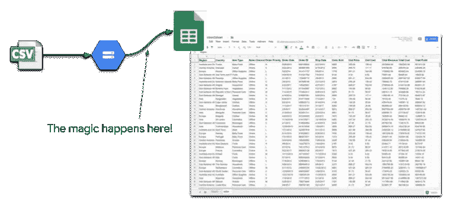
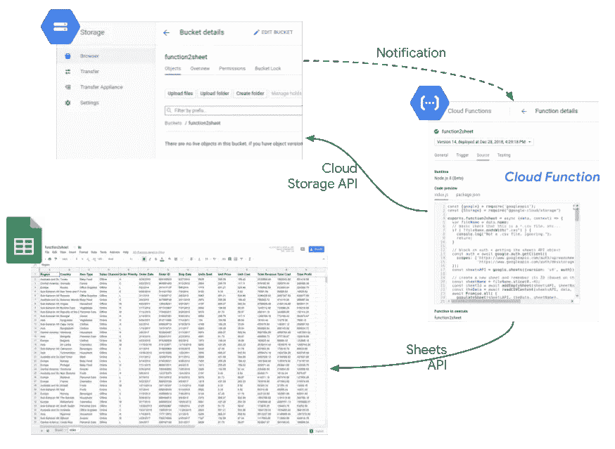
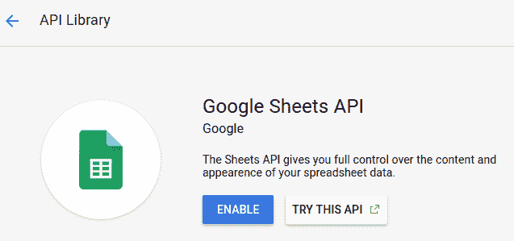
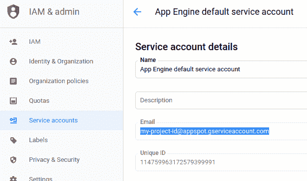
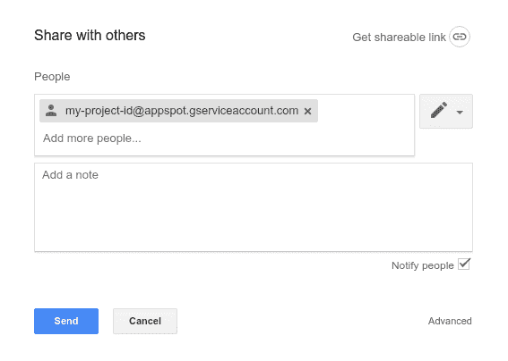
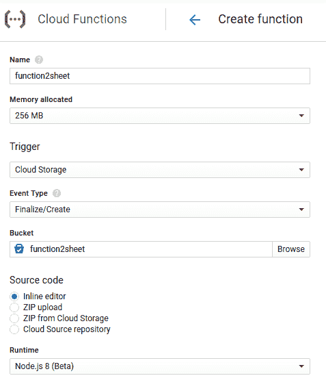
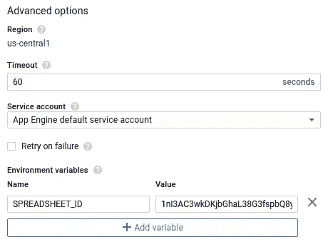
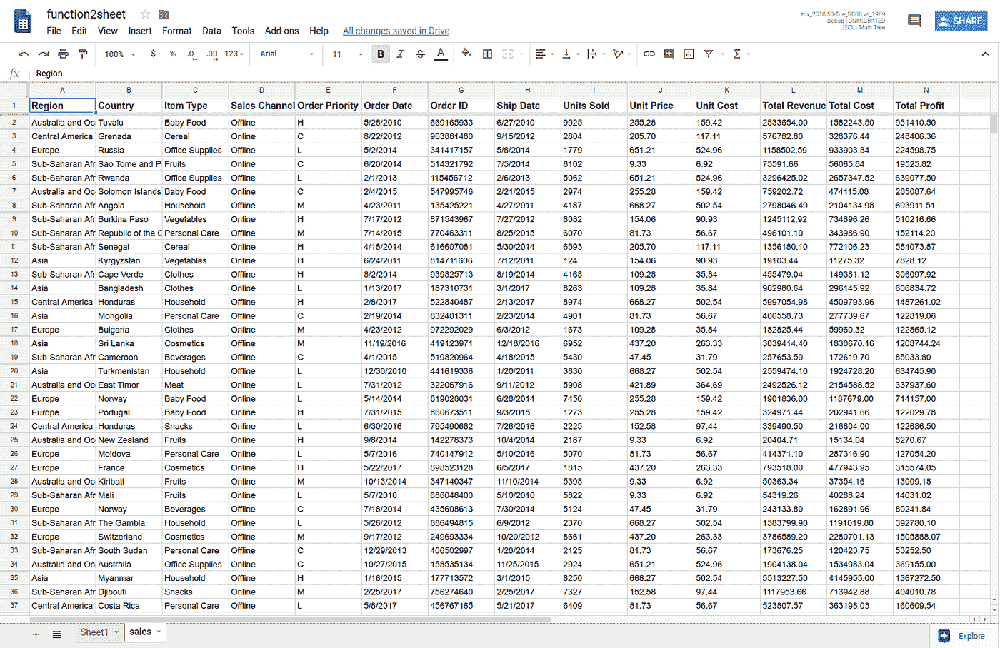

# 自动导入 Google 电子表格 CSV 的云功能

> 原文：<https://medium.com/google-cloud/a-cloud-function-to-automate-google-spreadsheet-csv-import-d2ffb8fbe9b4?source=collection_archive---------0----------------------->

***更新*** *:这个帖子现在有一个* [*循序渐进的 codelab*](https://codelabs.developers.google.com/codelabs/cloud-function2sheet) *(最后一次更新 2020 年 5 月)。*

当然，您可以将 [CSV](https://en.wikipedia.org/wiki/Comma-separated_values) 内容粘贴或导入到 Google Sheets 中，但是自动化这个过程，从而能够在文件上传到 bucket 时用文件内容更新工作表，这不是很好吗？这将确保您可以在电子表格中分析可用的数据(可能由另一个团队产生):

在这篇文章中，我将带你了解如何编写一个[云函数](https://cloud.google.com/functions/)，它对上传到[云存储](https://cloud.google.com/storage/)桶的 CSV 文件做出反应，然后使用 [Google Sheets API](https://developers.google.com/sheets/api/) 用 CSV 数据更新你的一个电子表格。

实现如下所示:

***只是一点(安全)设置***

首先，让我们创建一个新的 Sheets 文档。一旦创建，记住它的标识符；它将被用作我们将要编写的函数的环境变量:

从 [GCP 控制台](http://console.cloud.google.com)，创建一个新项目并启用 [Google Sheets API](https://console.cloud.google.com/apis/library/sheets.googleapis.com) (点击链接或转到控制台“API 和服务”部分) :

在“IAM & admin”部分，导航至“服务帐户”,记下 App Engine 默认服务帐户的电子邮件。它的形式应该是`*your-project-id*@appspot.gserviceaccount.com`。当然，您也可以创建自己的服务帐户专门用于此操作。

现在，只需授予该服务帐户对您的电子表格的编辑权限:

此时，配置为使用该服务帐户的云功能将能够请求对该电子表格文档的写访问。

***创建云函数***

我们现在可以创建一个名为`csv2sheet`的云函数，它在文件上传到特定的云存储桶时被触发。代码将使用[异步函数](https://developers.google.com/web/fundamentals/primers/async-functions)在 Node.js 8 中编写。

更改函数体以使用云存储和工作表 API，将`csv2sheet`函数标记为`async`，从云存储事件元数据中获取`fileName`，并为我们将创建的新工作表派生一个名称:

这里使用`async`需要用到`await`，我们马上就会看到。

该功能的几个重要选项包括:

*   使用的服务帐户(应该与上面讨论的相同)
*   名为`SPREADSHEET_ID`的环境变量应该与您之前创建的工作表文档相匹配:

作为最后的设置步骤，这里是我们将使用的云存储和 Google Sheet APIs 作为两个依赖项的`package.json`内容:

一旦你按照描述配置好一切，继续，点击“创建功能”！

如果你想直接跳到完整的代码，这里有[和](https://gist.github.com/alexismp/86315a74cdf887003b11f4ceade924de)。否则，跟着走！

**Auth**

在我们进一步编码之前，我们需要阻止创建一个具有适当存储和工作表范围的 Google 客户端 API(记住，这是一个`async`函数的一部分) :

在这里，我们可以创建一个 Sheets API 客户端:

***创建空表***

使用 Sheets API 客户端，我们可以在文档中创建一个简单的新表，但在我们继续之前，这里有一个关于词汇的快速注释:

*   一个*电子表格*是实际的文档，由它的标识符引用(如上所述，在文档 URL 中可见)
*   *表单*是文档中的选项卡之一，可以通过其名称(选项卡名称)或创建表单时生成的标识符来引用

考虑到这一点，这里有一个函数使用 Sheets API 客户机在位置 2(通常在默认的“Sheet1”之后)创建一个空表，有 26 列，2000 行，第一行被冻结:

请注意，我们如何依赖先前创建的`SPREADSHEET_ID`环境变量，而不是对电子表格的引用进行硬编码。

我们需要记住对这个特定工作表的进一步请求的`sheetId`。此外，工作表名称需要是唯一的，如果已经有一个名为`sheetName`的工作表，创建将会失败。

工作表 API 中的`batchUpdate`函数是与文档交互的一种常见方式，在这里[对其进行了描述](https://developers.google.com/sheets/api/guides/batchupdate)。

***从存储 CSV 文件中读取数据***

现在我们有了转储数据的地方，让我们使用云存储 API 从刚刚上传的文件中获取实际数据，并将其存储在一个字符串中:

***填充新创建的工作表***

现在是时候使用相同的工作表客户机 API 和我们刚刚收集的数据来填充我们已经创建的工作表了。我们将借此机会为工作表的列添加一些样式(更改顶行的字体大小并将其加粗) :

注意数据和样式是如何用多个`requests`组合成一个单一的表 API `batchUpdate`调用的。这有助于更有效的原子更新。

还要注意，我们定义了一个与我们创建的工作表大小相匹配的编辑范围。这意味着超过 26 列的内容将因该特定代码而失败。

如果一切顺利，此时您可以:

1.  保存更新的功能
2.  将 CSV 文件放入桶中
3.  查看电子表格中弹出的相应数据！

***将所有内容放在一起并测试流程***

对我们刚刚讨论的函数的调用可以在`csv2sheet`函数中进行，如下所示:阻塞新工作表的创建，然后阻塞从云存储中的数据检索。然后用数据填充工作表，并修改工作表的样式:

一旦一切就绪，只需将一个 CSV 文件上传到正确的存储桶，就可以看到您的电子表格被一个包含文件内容的新工作表更新。如果你手头没有的话，这里有一个[样本 CSV 文件](https://storage.googleapis.com/alexismp-csv-demo/random-sales.csv)

尝试将几个文件上传到 bucket，看看会发生什么！

完整的函数源代码可在[这里](https://gist.github.com/alexismp/86315a74cdf887003b11f4ceade924de)获得。