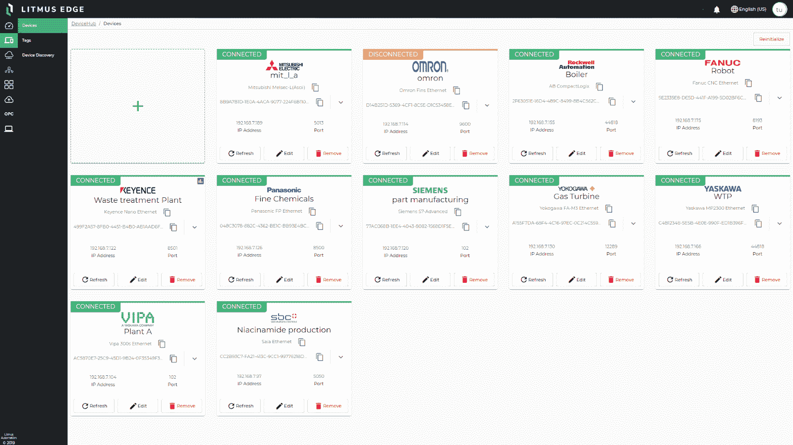

# 完整的边缘到云制造解决方案|工业 4.0 | GCP |第 1 部分-边缘平台

> 原文：<https://medium.com/google-cloud/a-complete-edge-to-cloud-manufacturing-solution-industry-4-0-gcp-part-1-edge-platform-592ae6e070d?source=collection_archive---------1----------------------->

这是谷歌云制造解决方案 3 部分系列的第 1 部分。这篇博客的重点将是谷歌云提供的集成套件的边缘平台。

# **背景:**

**工业 4.0** 正在彻底改变企业制造、改进和分销产品的方式。制造商正在推进他们的数字化转型之旅，将**工业物联网(IIoT)****云计算和分析、人工智能**和机器学习中的最佳技术创新运用到他们的生产设施和整个运营过程中，以**降低成本、提高运营效率**，改进产品和服务，增强竞争力并实现可持续增长。

成功实施后，这些解决方案将带来不可抗拒的回报。在广泛的行业中，我们经常看到**机器停机时间减少了 30%-50%******10%-30%****生产量增加了 19%**15%-30%**劳动生产率提高了 23%****

# ****挑战:****

**据麦肯锡称，近三分之二的制造商已经使用云解决方案。然而，他们面临的最大挑战是**将数字化转型项目从概念验证扩大到生产**。**

**可扩展性挑战围绕以下关键要求:**

1.  ****IIoT 平台:**需要一个企业级、**全连接**、**可扩展、**、**边缘到云**工业 4.0 平台。**
2.  ****边缘连接**:边缘平台能够**将**连接到所有工业资产，如各种品牌、型号和版本的传感器、PLC、SCADA、MES，这是关键。**
3.  ****可扩展的中央数据平台**:一个中央的、可扩展的数据平台，它提供了一个**公共数据模型**，具有内置的数据规范化和**上下文丰富**功能。**
4.  ****高级人工智能&分析:**平台提供集成高级**分析和人工智能**能力的能力，以在车间建立和部署机器学习模型。**

# ****介绍谷歌云的制造解决方案:****

**为了确保制造商能够将他们的数字化转型努力扩展到生产中，谷歌云在今年年初宣布了一个新的制造解决方案套件，该套件专注于解决上面强调的关键因素。**

****

**智能制造套件**

**让我们跟随数据之旅，从工厂车间到云，看看新的解决方案:**

1.  ****Manufacturing Connect:** 是与 [Litmus Automation](https://litmus.io/) 共同开发的 factory edge 平台，通过 UI 配置，借助 **250 多种现成支持的机器协议**的庞大库，可以快速连接几乎任何制造资产。它将机器数据转化为可消化的数据集，并将其发送到制造数据引擎进行处理、上下文化和存储。通过支持集装箱化的工作负载，它允许制造商直接在边缘运行**低延迟数据可视化、分析和 ML** 功能。**
2.  ****制造数据引擎:**是处理、组织和存储工厂数据的基础云解决方案。云平台可以通过 edge 和云之间的私有、安全和低成本连接，从任何类型的机器获取数据，支持从遥测到图像数据的各种数据。凭借内置的数据标准化和**上下文丰富功能，它提供了一个通用数据模型，**提供了一个工厂优化的数据存储库。**
3.  ****分析:**基于制造数据引擎，是与 **Looker** 模板的现成集成，提供仪表板和分析体验。作为一个**易于使用、无代码的数据和分析**模型，它使制造工程师和工厂经理能够快速创建和修改**定制仪表板，自动添加新的机器、设置和工厂**。该解决方案支持根据 KPI 或按需深入数据，以发现整个工厂的新见解和改进机会。**
4.  ****人工智能驱动的运营优化:**整合了谷歌人工智能和机器学习平台和服务的精华，以解决关键制造用例，如**预测性维护、机器级异常检测、视觉检测**等。这些 ML 模型可以在几周内被训练并无缝地部署到车间，用于实时的低延迟推断。**

**让我们深入了解一下**制造连接**解决方案，这是来自谷歌云的**企业级边缘平台**。**

# **边缘平台- **制造连接****

**由谷歌和 Litmus Automation 共同开发的 Manufacturing Connect Platform 提供了一个高度可扩展的、专门构建的边缘平台，为工厂车间的分析和人工智能提供动力。**

****

**以下是 MCE 平台的主要优势:**

# ****1。连通性:****

**MCE 带有一个内置的库，支持 250+机器协议，可以连接成千上万的工业资产，如不同品牌、型号和版本的传感器、PLC、SCADA、mes 系统。这是该平台的最大优势之一。**

**印度的一些大型企业集团已经能够使用 MCE 连接到极其陈旧的 PLC。使用 MCE，他们现在能够利用多年来无法访问的数据，并将这些资产纳入其工业 4.0 计划。**

****

****用于连接的直观用户界面:****

**MCE 提供了一个完整的**无代码门户**来配置与工业资产的连接，并设置资产内的所有标签。**

**附件是 MCE 门户的示例视图。“ **DeviceHub** ”部分允许通过输入设备类型、驱动程序 IP 和端口向 MCE 平台添加新设备。**

****

**顾名思义，DeviceHub 是连接工厂各种资产的枢纽。一旦连接，设备显示绿色的**连接**状态，如下所示。UI 还在设备级别提供了停止和启动选项。**

****

****标签:**一旦设置好设备，特定设备的所有标签(例如，下图所示的车身冲压 m/c)可以逐个添加，也可以作为 csv 文件批量上传。**

****

**可以为每个标签分配自己的消息传递主题，IIoT 有效负载将在该主题中传递。**

****

**总之，MCE 提供了一个非常易于使用的 UI 来设置资产和标签，并通过 250 多个现成的连接器将它们连接起来。**

# **2.边缘智能:**

**边缘智能提供了 MCE 内部的核心数据和人工智能功能。以下是推动工厂车间智能化的平台的关键组件。**

****

1.  ****本地存储:**存储层由本地**消息代理**系统组成。在连接部分配置的所有标签都可以配置为将 IIoT 有效载荷传递给它们对应的**主题**。MCE 还提供了**influx db****time series**数据库来本地存储数据。**
2.  ****数据处理:** MCE 提供了一个丰富的基于 **UI 的无代码分析工作流**构建器，非常类似于 ETL 工具，用于构建数据管道来收集、清理、合并、转换和存储数据。它还提供了各种内置的**统计函数**，用于异常检测、Arima 过滤器等。**

****

****3。分析:** MCE 允许任何 dockerized 应用程序安装在其平台上。因此，像 **Grafana、Nagios** 等流行的分析工具可以被安装并用于高级分析。以下是 **OEE、停工期和异常检测**上 Grafana 仪表盘的一些示例。**

****

**4 . **AI-ML:** 在 Google 云平台上创建的 AI-ML 模型可以导出，**作为 Docker 容器托管**集成到 MCE edge 中。将在本系列的第 2 部分对此进行更多的讨论。**

**总之，MCE 提供了一个广泛的**边缘智能平台**来收集、存储、处理、分析和可视化工厂数据，以便在工厂车间进行大规模分析和人工智能。**

# **3.无缝谷歌云集成:**

**MCE 与 Google 云平台完全集成，为大规模构建和部署工业 4.0 案例研究提供完整的端到端、边缘到云解决方案。**

****

**谷歌云集成**

**“ **Integrations** ”选项卡允许通过一个易于使用的 UI 创建与 Google Cloud **PubSub** 的集成。一旦建立了集成，MCE Edge 主题可以根据需要一对一或一对多地直接映射到 Google Cloud **PubSub 主题**。这将允许 IIoT 数据从边缘到云的无缝流动。**

**MCE 还在每个标签上提供了一个拨动开关，用于选择用户是想将数据发送到云还是只是将数据保存在 Edge 中。**

**一旦数据流入 **PubSub —** ，它就可供**谷歌云生态系统的其余部分用于高级分析和人工智能。****

# **完成图片！**

**正如这篇博客的标题一样，这是端到端、边缘到云的企业级谷歌云制造解决方案的全貌！**

****

**边缘到云的集成平台**

**请继续关注本系列的第 2 部分，它将关注该解决方案的最基础的元素— **Google 云数据引擎。****

# ****结论:****

**谷歌云的新制造解决方案提供了一个集成的解决方案，以解决复杂的大规模制造挑战。重点是让关键技术(如云和人工智能)变得可访问、更易于使用并深深嵌入制造商的日常运营中，以全新的方式揭示新的见解并优化运营。**

**更多详情请访问:[https://cloud . Google . com/solutions/manufacturing-data-engine](https://cloud.google.com/solutions/manufacturing-data-engine)**