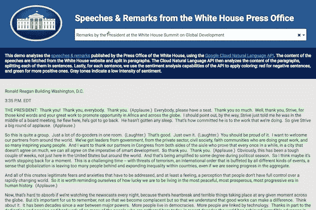

# 谷歌云平台开发者倡导者的一天

> 原文：<https://medium.com/google-cloud/a-day-in-the-life-of-a-developer-advocate-for-google-cloud-platform-fe681c8645cf?source=collection_archive---------0----------------------->

如果你是一名开发者，支持像谷歌云平台这样丰富的环境，那就没有常规可言了。这不会是一篇赞扬 GCP 之类的长文，但会很快给你一个我生命中的一天的例子，[，自从我加入谷歌](http://glaforge.appspot.com/article/joining-google-as-developer-advocate-for-the-google-cloud-platform)。

有时候，我会专注于一个特定的话题一小会儿，比如准备一个关于谷歌[云端点](https://cloud.google.com/endpoints/)的演讲，创建一个[演示](http://glaforge.appspot.com/article/sentiment-analysis-on-tweets)或[云](http://glaforge.appspot.com/article/natural-language-api-and-javascript-promises-to-bind-them-all)[自然语言](https://cloud.google.com/natural-language/) API 的两个等等。有些日子，比如星期一，我会在一天之内做大劈腿，触及很多地方！那我玩的是什么？

我开始了我的一天，成为我的同事们的小白鼠，他们正在准备一个关于云数据流的代码实验室，启动有趣的数据流来分析纽约数十亿次的出租车出行。

我继续回答即将发布的 Web API 文档白皮书的采访，在那里我有机会谈了一点关于 Google 的 Web API 和支持[开放 API 规范](https://openapis.org/)的新[云端点](https://cloud.google.com/endpoints/)。

我回答了一个关于我们的[云自然语言 API](https://cloud.google.com/natural-language/) 的内部问题，我最近用它玩了不少，用于[分析推特](http://glaforge.appspot.com/article/sentiment-analysis-on-tweets)和[白宫演讲](http://glaforge.appspot.com/article/natural-language-api-and-javascript-promises-to-bind-them-all)的情绪。

然后，为了回答一个客户的问题，我写了一篇关于 GCP 云网络的防火墙配置的博客，以了解如何根据请求者的 IP 地址来过滤对计算引擎虚拟机的访问。

为了结束这一天，从繁忙的日程中放松一下，我读了一些关于扳手的[论文](http://research.google.com/archive/spanner.html)，谷歌的“*内部可扩展、多版本、全球分布和同步复制的数据库*”。这有点拗口，但真的很棒的技术！

有些日子比这要轻松得多，但是有时候，你知道，能够接触这么多的主题真的很棒:机器学习、网络、数据库、Web APIs 等等。一天之内！太酷了。