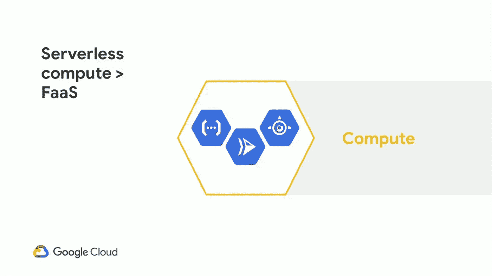
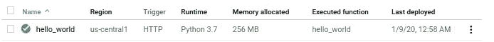
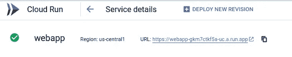

# 在云上构建无服务器应用程序的开发人员指南——第 1 部分(部署)

> 原文：<https://medium.com/google-cloud/a-developers-guide-to-building-serverless-applications-on-the-cloud-part-1-deployment-b1f5d824facd?source=collection_archive---------4----------------------->



基于谷歌云的无服务器计算

在这个系列中，我将讨论一些对使用 Google Cloud 构建无服务器应用程序至关重要的主题，它们将跨越部署、CI/CD、工具、后端即服务等等。

> 在这篇文章中，我将讨论 DevShopZ 的开发人员如何轻松地从本地开发转移到云计算。这涵盖了简单的功能、基于 web 的应用程序和包含代码示例的容器化应用程序。

如果你是无服务器新手，看看[这篇文章](https://fullstackgcp.com/journey-to-serverless-on-google-cloud-platform-ck101zpb2005ek7s1rcsgqnug)

DevShopZ 最近为一个客户启动了一个新项目，她的工程师在构建项目方面取得了很大的进展，但是，项目经理希望对项目进行部署，这样客户就可以知道他得到了什么，并向团队提供反馈。

DevShopZ 的开发人员通过构建简单的 API 端点来启动该项目，然后继续集成前端和 Docker 等其他工具。我们将看到在项目的每个阶段部署是如何进行的。

# 开始之前:

*   开发者免费使用谷歌云账户，详情[见](https://fullstackgcp.com/cloud.google.com/free)
*   他们创建了一个新的 GCP 项目，你也可以在这里做同样的
*   开发人员使用 [Google Cloud Shell 终端](https://cloud.google.com/shell/)来执行部署命令。

# 部署功能

工程师们构建了第一个简单的端点，这是一个返回 JSON 消息的 Python 函数。*提示:你可以选择任何一种语言*

功能代码

*端点功能部署到云功能*

> [*Google Cloud Functions*](https://cloud.google.com/functions/)*是一个轻量级计算解决方案，开发人员可以创建单一用途的独立功能来响应云事件，而无需管理服务器或运行时环境。*

```
gcloud functions deploy hello_world --runtime python37 --trigger-http
```

从 [Gist](https://gist.github.com/Timtech4u/c6b701830cc4ab2bef09d8f0f4d52766) 中克隆示例代码或设置自己的代码后，在 Cloud Shell 上执行上面的命令。



*部署功能*

# 部署 Web 应用程序(没有容器)

该项目已经发展成为一个使用 Flask Web 框架构建的完整的 Web 应用程序，现在包括静态文件。
*提示:你可以选择使用任何框架*

Web 应用程序代码

*Web 应用被部署到应用引擎*

> [*App Engine*](https://cloud.google.com/appengine/) *是一个完全托管的无服务器平台，用于大规模开发和托管 web 应用。您可以从几种流行的语言、库和框架中进行选择来开发您的应用程序，然后让 App Engine 负责根据需求配置服务器和扩展您的应用程序实例。*

```
gcloud app deploy
```

在克隆了来自 [Gist](https://gist.github.com/Timtech4u/7b420b74d83cf9e42ab0d7bfce60c8b6) 的示例代码或者设置了您自己的代码之后，在 Cloud Shell 上执行上面的命令


*已部署的 Web 应用程序*

# 部署容器

该团队决定通过对现有的 Web 应用程序进行 Dockerizing 来采用容器化技术。更新了源代码，以包含用于构建容器映像的 *Dockerfile* 。

Web 应用程序容器代码

*在 Google Cloud 上部署容器映像有多种选择，* [*看这个短视频*](https://www.youtube.com/watch?v=jh0fPT-AWwM)

> [*云运行*](https://cloud.google.com/run/) *是一个托管计算平台，可以自动部署和扩展您的无状态容器。云运行是无服务器的；它将所有基础架构管理抽象化，因此您可以专注于最重要的事情—构建优秀的应用程序。*

```
gcloud builds submit --config cloudbuild.yaml
```

**cloudbuild.yaml** 文件是 [Google Cloud Build](https://cloud.google.com/cloud-build/) 的配置文件，包含两个步骤:
一是构建容器镜像&上传到 [Google 容器注册表](https://cloud.google.com/container-registry)；第二步是将映像部署到云上运行。

从 [Gist](https://gist.github.com/Timtech4u/fda016845505878fe412e8c1881f804b) 中克隆示例代码或设置自己的代码后，在 Cloud Shell 上执行上面的命令



*已部署的容器化 Web 应用*

# 有用的链接

*   [谷歌云——选择无服务器选项](https://cloud.google.com/serverless-options/)
*   [云功能—功能框架](https://cloud.google.com/functions/docs/functions-framework)
*   [应用引擎—选择应用引擎环境](https://cloud.google.com/appengine/docs/the-appengine-environments)
*   [Ahmetb —云运行常见问题解答](https://github.com/ahmetb/cloud-run-faq)
*   [非官方——谷歌云计算选项指南](https://github.com/Timtech4u/gcp_compute_options_guide)

> 请继续关注下一篇文章，在那里我将讨论一个更令人兴奋的无服务器主题。