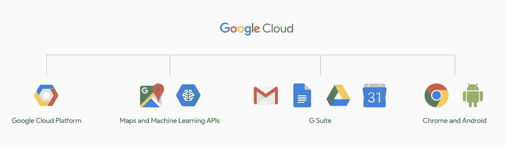
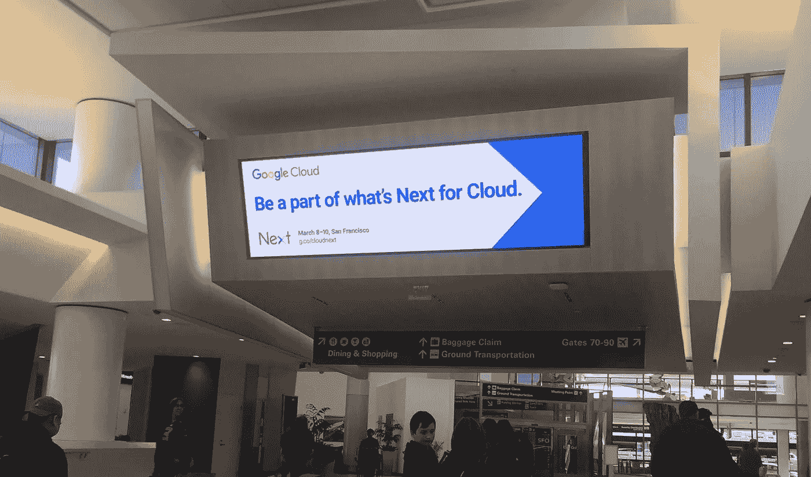
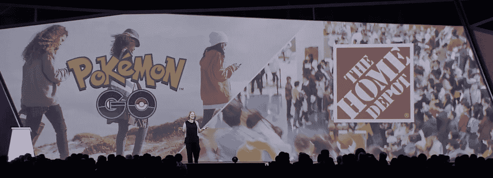
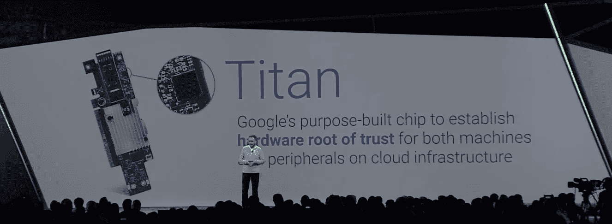
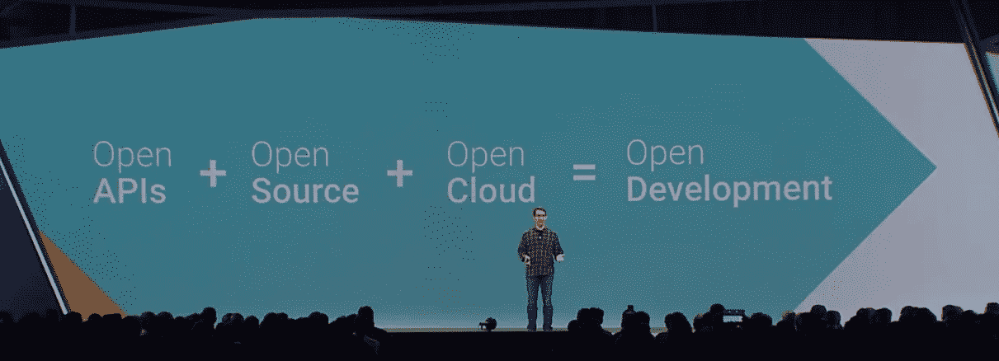
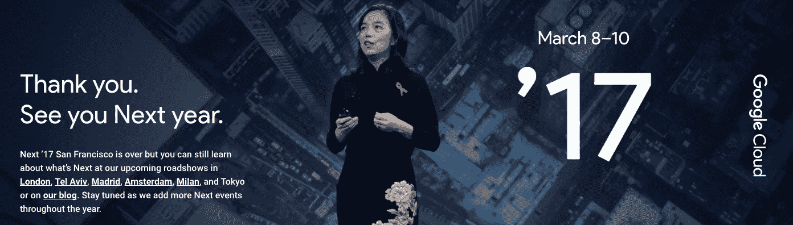

# 剖析 Google Cloud Next 17——下一步是什么？

> 原文：<https://medium.com/google-cloud/a-dissection-of-google-cloud-next-17-whats-next-c32f4d803750?source=collection_archive---------0----------------------->

TL；dr；你还在等什么？要么上飞机，要么被落在灰尘里。

让我们从头开始。当活动宣布时，品牌完全不同。下一个不是 GCP，而是下一个谷歌云。嗯（表示踌躇等）..是时候戴上我的思考帽了。

# 为什么要更改活动的品牌名称？

观看谷歌事件的发展总是很有趣。虽然谷歌 IO 曾经是我最喜欢的一个，但谷歌似乎已经把它变成了一个以终端消费者为中心的活动。在这些努力中，他们将 GSuite 和谷歌云平台(GCP)结合成一个谷歌云产品，从而使谷歌云成为与云相关的一切。对于部分开源的技术，已经远远超出了谷歌自己的基础设施，现在有峰会，最著名的是 Chrome，Android 和最近的 Tensorflow 峰会。随着 GCP 更名为 Google Cloud Next，谷歌现在在该组织的云工作和其他硬件工作上下了很大的赌注。虽然 Chrome 和 Android 在 Google Next 中没有得到太多提及，但请记住，它的硬件部分是 Google 自己的，其余部分主要是开源的。

# 好吧，那又怎样？

嗯，你看，当你改变品牌，你也改变了品牌发生了什么。谷歌在 2016 年 GCP 会议结束时开始了这些变化，很明显，谷歌正在越来越多地向企业推进。[黛安·格林成了 SVP](https://www.forbes.com/sites/roberthof/2016/05/08/google-cloud-chief-diane-greene-heres-how-well-catch-amazon-and-microsoft/#627d9ee92270) ，开始了她在 GCP 发展企业的使命。与此同时，[乌尔斯·霍尔茨一直在做他最擅长的事情](https://research.google.com/pubs/author79.html)，建设和扩展谷歌运行的令人惊叹的基础设施。但是，在这段时间的某个时候，谷歌意识到谷歌的开源努力，尤其是 Kubernetes 和 TensorFlow 上的开源努力已经有了很大的发展，如果他们不将开源纳入其中，产品战略可能仍然不完整。所以他们继续前进，得到了最好的一个，萨姆·拉姆奇在船上。然后他们又一次快乐起来。但是等等..到了年底，他们意识到，在机器学习领域，有两类人被他们忽略了，一类是学术界人士，另一类是爱好者。[费-李非](http://vision.stanford.edu/feifeili/)和[卡格尔](https://www.kaggle.com/)被获得来补充缺失的部分，现在谜题被解决了。暂时如此。

# 嗯..我们在做什么离题太远了？

好吧，让我们乘飞机去旧金山，仔细看看。在活动的前一天，萨姆·拉姆奇和 GCP 团队将与谷歌云内部人员(一群 GCP 的用户、传道者和专家)举行一次活动。做这个活动有什么特别的？嗯，有一点是关于山姆的，他的方法是建立在坚实的事实基础上的。这次活动是谷歌向拥抱开发者迈出的一步。大多数开发人员/极客不习惯被拥抱，他们的反应摇摆不定，要么喜欢你，要么抱怨很多。不，开发者不讨厌人，他们讨厌那些人使用的技术。在这里，山姆的魅力发挥了重要作用。他的回答又长又有解释性，而不是被剪短。他会听完你的话，不仅会解释他们在做什么，还会解释为什么。他亲自与开发者联系，他阅读我们读过的书籍，如果可能的话，他会让所有的谷歌对你开放。他让整个团队都行动起来。如果你不喜欢谷歌的支持，让我们谈谈。不是 Kubernetes 方向的粉丝，我们在这里。在 App Engine Standard、Flex 和 Cloud 功能之间困惑，让我们召集专家。

# 等待..我们必须到达莫斯康，先不要发射到太空。

在这种规模的活动中，排长队总是一个问题。这就是为什么他们提前一天给徽章。下次计划好一点。在舞台上，我们看到大量的企业在使用谷歌云，包括计算、数据或 GSuite 产品。随着主题演讲的展开，很明显 Greene 也兑现了让 Google Cloud 在企业市场上具有竞争力的承诺。她让企业不仅从基础设施上转移，也从竞争中转移。她不仅建立了内部团队来帮助支持这一点，还为合作伙伴和其他提供商奠定了基础，从而丰富了围绕谷歌云的整个生态系统。但是由于 GCP 的观众通常是开发者，部分观众在内心尖叫(给我看一些代码！！).好吧，他们的呼吁得到了回应，费来到了舞台上。她不仅展示了谷歌机器学习的前景路线图，她还联系到观众对机器学习是一个陌生概念的困境(以正确实施)。视频智能 API 和 Kaggle 的收购巩固了谷歌正在投资 ML 和大众民主化的事实。

# 但是..公告都在哪里？发生了什么事？

你看，每个人都在抱怨 GCP 没有企业。这是一个有效的投诉。进取慢。他们移动是因为有人在移动。现在，格林展示了一些大型组织转向谷歌云的情况。这将把所有在谷歌和其他公司之间徘徊的企业拉向谷歌云。但是..在策划这场从核心开发者中心事件到全技术事件的惊人表演时，人们错误地判断了开发者对行动的热爱。仅仅一次演示不足以满足你的胃口，希望下次能考虑一下。

# 如果节目和昨天一样，我可能会睡着。

你得到一辆车，你得到一辆车，你也会得到一辆车。每个人都有收获！*虽然不是泰坦*。Urs Holzle 和他的团队上演了一场壮观的表演，送出了人们(几乎)要求的所有东西。更多的区域，更好的安全性，GPU，更多的机器学习 API，甚至更多的安全服务，核心机器学习，数据库和数据产品，更多的平台，go serverless，NoOps，没有废话的事实和惊人的现场演示。开发人员希望的一切都在那里，他们很高兴。你忘了吗，我们现在不仅仅是 GCP，也从 GSuite 团队获取一些更新。确保无论你是在 Chromebook 上与你的团队一起工作，还是与他们一起闲逛，或者只是与他们一起玩，你都可以毫不费力地完成所有这些工作，并始终保持高效率。与此同时，合作伙伴在舞台上来来往往，表明这些不仅仅是谷歌使用的技术，企业已经从中受益并大获全胜。在主题演讲的最后，Urs 做了总结性陈述:“我们知道这不仅仅是关于技术，而是关于帮助每个人成功地使用它。”

# 我今天必须起床吗？他们已经宣布了一切。

希望山姆能给我们惊喜。他做到了！开源和谷歌的完整历史正在舞台上毫不费力地上演。从互联网之父温顿·瑟夫本人开始。回忆互联网的早期，他让每个人都意识到开源是互联网的关键，并将继续如此。在基金会帮助我们开放治理、信任和开源安全的时候，我们走得更远。然后当然是谷歌如何参与开源项目，不仅仅是他们自己的，还有整个生态系统。谷歌在这里下的赌注是，他们会冒险使用开源软件，因为他们对自己的创新和执行速度充满信心。现在有了生态系统，我们也欢迎合作伙伴。哦，别忘了，我们也致力于开放机器学习和开放数据。开源和云必须相互合作，才能发挥出彼此的优势，Sam 肩负着实现这一目标的使命。我们正在建立一个开放的生态系统，用户将在其中获胜，我们欢迎你们所有人参与到这个过程中来。让我们从延长你的信用开始，给你一些总是免费的服务。此外，我们喜欢初创公司，希望帮助你建立伟大的机器学习产品，并给你大量的信贷和资金。我们开始吧！

# 我们终于完成了！这是怎么回事？

一切都是为了任务。我们的使命不仅仅是成为伟大的企业或令人惊叹的工程平台，而是所有这些实体的集合，同时让开源、终端开发者和创业公司与我们同行。用山姆的话说:“负面反馈是一份礼物，它是对所缺少的东西的声明”。谷歌听到了我们的心声。他们重新思考和构建了他们的产品和方法，以涵盖所有人。

# 嗯（表示踌躇等）..那么下一步是什么？

看看[市场对](https://aws.amazon.com/blogs/aws/new-instance-size-flexibility-for-ec2-reserved-instances/)谷歌的反应，如何采用，谷歌兑现承诺的速度，准备好被进度报告、新产品和功能[明年](https://cloudnext.withgoogle.com/)所震惊吧。

我绝不会就这样离开哈哈。给你:

*   这个节目是由一些技术界的女强人主持的。仅举几个例子，黛安·格林、费·李非和莎拉·瓦特尼。
*   [全部 100(！！)公告](https://blog.google/topics/google-cloud/100-announcements-google-cloud-next-17/)
*   [所有主题演讲和其他视频](https://www.youtube.com/playlist?list=PLIivdWyY5sqI8RuUibiH8sMb1ExIw0lAR)
*   [别跟着我，我喋喋不休](https://twitter.com/Vikram_Tiwari)
*   尽情享受吧！:)

声明:我不是谷歌人，所有这些只是观察。