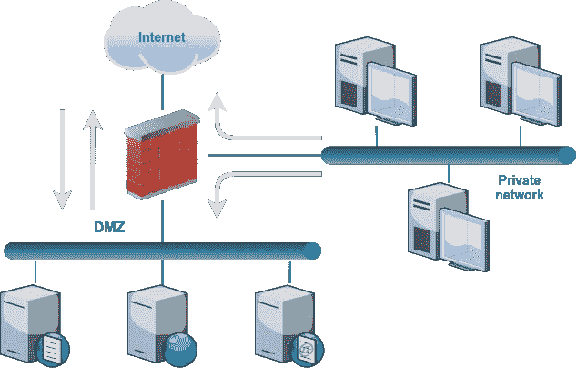

# 非军事区，那是什么？

> 原文：<https://medium.com/google-cloud/a-dmz-what-is-that-acc3b21b9653?source=collection_archive---------0----------------------->


尽管名不副实，但大多数观众可能真的知道网络安全中的 DMZ(非军事区)是什么。在这篇文章中，我将对此进行详细分析。我们将看到这个概念如何转化为 GCP(谷歌云平台),为此我们不仅需要理解 DMZ 的设计，还要理解它的意图。我的目标是分析 dmz 和更广泛的网络分段概念。

# 非军事区

DMZ 是一种网络，通常在与公司内部网络分离的子网中公开 web、DNS 或电子邮件功能等公共服务。这种子网分离的主要目的是保护内部系统，同时向不受信任的网络(如互联网)提供这些服务。

对这些服务的外部访问使它们成为试图从网络中泄漏数据或以某种方式造成损害的恶意人员的目标。他们可以利用软件中的漏洞来访问系统，从那里他们可以对其他内部系统发动进一步的攻击。通过将这些公共服务与 DMZ 或外围网络中的专用网络隔离开来，我们可以提供一个安全层来阻止此类攻击。

控制这种分割的基本要素是防火墙。防火墙用于过滤子网之间的流量，根据一组规则允许或拒绝流量，这些规则将查看数据包地址、端口、报头字段甚至消息内容。

创建 DMZ 的基本防火墙部署架构基于两层设计。下图显示了一个示例。



图一。基本非军事区设计

防火墙有三个接口，每个接口都连接到一个网络。DMZ 中的主机需要穿过防火墙才能访问专用网络中的系统，但是防火墙不允许任何传入连接。专用网络可以访问互联网和 DMZ 以使用其服务或管理服务器。

其他 DMZ 设计使用两个串行防火墙，中间是 DMZ。这种设置更复杂，但增加了另一层安全性。在第一种设计中，如果防火墙由于漏洞而受到损害，或者由于某种原因配置错误，专用网络可能会受到攻击。由于在外部网络和私有网络之间有两个防火墙，现在两个设备需要被破坏才能访问。我们可以通过使用两个不同的防火墙供应商来增加更多的安全性，因此在一个供应商中发现的漏洞不太可能出现在另一个供应商中，尽管这也增加了更多的复杂性。

有时，公司需要连接到第三方网络，或者他们可能使用多层设计，在其应用程序的每一层之间都有防火墙。现实世界的网络可能会变得复杂，但一般来说，这里显示的概念将适用。

# GCP 世界

我们能在 GCP 实施这样的非军事区设计吗？是的。防火墙设备将是部署在虚拟专用云(VPC)网络上的软件设备，我们将看到，代替子网隔离，每个网络将需要不同的 VPC。下图显示了一个示例。


图二。GCP 非军事区的基本设计

你可能对 GCP 不够熟悉，但我想你会理解上图。它与图 1 非常相似，行为也很相似，只是主机被虚拟机(VM)所取代，并且我们不仅仅使用子网，而是使用完全 VPC 网络，这些网络是隔离和独立的网络域。

问题是:这是在 GCP 实施非军事区概念的正确方式吗？嗯，那是另一个故事了。您可能听说过 GCP 与众不同，它不仅仅是您数据中心的延伸。我会确切地告诉你。你可能会认为这只是一个简单的推销，但事实是，GCP 真的非常非常不同。让我解释一下为什么。

GCP 使用软件定义网络(SDN)方法。这种模式意味着它与传统的数据中心网络有很大的不同，其中一些我将在这里介绍。

首先，GCP 是第 3 层(L3)网络，而不是第 2 层(L2)网络。传统网络使用子网划分来创建多个逻辑网络，子网中的主机可以直接相互通信，如果与不同的子网通信，还可以通过路由器在 ARP 的帮助下发现相应的 MAC 地址。


图 3。经典网络中的通信路径

在 GCP，我们有 VPC 网络、子网和虚拟机实例，但这里的子网只是一个组织工具，用于对实例进行分组并控制您的 IP 地址空间。子网划分对一台虚拟机能否或如何到达另一台虚拟机没有影响，因为 VPC 中的所有虚拟机都可以直接看到彼此，无论它们位于哪个子网中。的确，无论他们在世界的哪个地区。VPC 网络提供了全球可达性的完整网格，因此从实例的角度来看，任何其他虚拟机都只有一跳之遥。在每个虚拟机的主机中运行的 SDN 或网络虚拟化堆栈在内部处理这一问题。


图 4。GCP 的通信路径。子网划分对路由没有影响

这并不意味着整个 VPC 网络是一个广播域，恰恰相反。我们可以通过检查应用于虚拟机的网络掩码来观察这一点。如果我们创建一个子网范围 10.0.0.0/24，并将虚拟机连接到它，则每个虚拟机都将被分配一个/32 掩码，就好像它是子网中唯一的主机一样:

```
$ ifconfig
eth0      Link encap:Ethernet  HWaddr 42:01:0A:00:00:02  
          inet addr:10.0.0.2  Bcast:10.0.0.2  **Mask:255.255.255.255**
```

发送数据包时，实例会将它发送到子网的网关 MAC 地址，而不管目的 IP 是在子网范围之外还是之内(记住它被声明为/24)。该实例将发出一个 ARP 请求来解析网关的 MAC 地址，这就是 ARP 将用于的一切:

```
$ ping 10.0.0.5
PING 10.0.0.5 (10.0.0.5) 56(84) bytes of data.
64 bytes from 10.0.0.5: icmp_seq=1 ttl=64 time=2.01 ms
...$ arp
Address        HWtype  HWaddress           Flags Mask    Iface
10.0.0.1       ether   42:01:0a:00:00:01   C             eth0
```

实际上，在 VPC 的子网中没有单独的网关，一切都通过 SDN 堆栈，该堆栈将数据包路由到目的地，但这满足了虚拟机网络堆栈中的 L3 和 L2 要求。

因此，您可以看到 GCP 网络中没有网桥或交换机。有一些不同的路由，和[云路由器](https://cloud.google.com/network-connectivity/docs/router)，但我不会在这方面做更多的扩展。

全球可达性是网络设计的一大优势，我们不需要连接不同的区域子网。这也有明显的后果，特别是全网状意味着 VPC 内的流量不能被重定向或拦截。以 DMZ 为例，仅使用子网划分不可能在单个 VPC 内实施它，因为 DMZ 子网和私有子网可以相互看见，并且 SDN 路由不能被覆盖。为了使防火墙能够过滤网络之间的流量，每个网络都应该位于不同的 VPC，并且防火墙设备都连接到这两个网络，如图 2 所示。

# GCP 防火墙

与传统网络中的防火墙相比，GCP 防火墙代表了另一个巨大的不同。与路由一样，防火墙也在 SDN 堆栈中实施。我们已经在 DMZ 示例中看到了使用防火墙设备/装置的设计。GCP 防火墙不是一种设备，而是在每个虚拟机中强制实施的分布式防火墙功能。


图 5。GCP 防火墙在每台虚拟机上强制实施

如您所见，一个虚拟机要到达另一个虚拟机，流量需要穿过两个防火墙，而不是一个，即使它们在同一个子网内。当然，从网络外部到任何虚拟机的流量也总是通过防火墙。就好像每个虚拟机都在自己的隔离区中一样！

这与经典的 L2 网络的工作方式完全不同，后者需要使用不同的网络或子网，以便防火墙能够过滤流量。它们无法防范子网内的流量。但是在 GCP，子网划分对防火墙没有任何作用。

值得注意的是，每个 VPC 网络都有两个隐含规则，允许出口规则和拒绝入口规则。出口规则允许任何实例将流量发送到任何目的地，尽管有一些考虑，例如，您将需要一个公共 IP 来访问互联网。入口规则会阻止所有实例的任何传入连接，因此您需要明确允许所需的流量。

利用 GCP 防火墙，让我们重新设计 DMZ 示例。


图 6。GCP 非军事区概念的基本再设计

非军事区本身已经消失了！公共服务器和内部系统在同一个 VPC 中，它们可以互相访问，中间没有防火墙设备，也不面向互联网。尽管如此，所有的流量都要经过 GCP 防火墙的检查。将此与图 2 进行比较。

使用 GCP 防火墙有更多的优势。这是一个具有强大抽象的云原生解决方案。除了基于 IP 范围编写传统防火墙规则的可能性之外，您还可以使用网络标签(或服务帐户)来定义防火墙规则如何应用于虚拟机。网络标签是一种属性，您可以将它与实例相关联，以便过滤流量。例如，您可以创建一组实例来为带有标签“web-server”的 web 流量提供服务，并创建一个防火墙规则来允许 HTTPS 流量到达所有这些实例。


您可以对 IP 地址进行类似的操作，但是您需要仔细组织 IP 分配，以尽量减少要编写的规则数量。随着网络的发展，这变得更加复杂。当然，基于 IP 地址的规则不像标签那样具有表现力，它们很难推理出来，并且很容易出错。


使用像 GCP 防火墙这样的云原生解决方案有更多好处:

*   这是一个集中式解决方案，您不需要配置每个实例。规则适用于 VPC 中的每个虚拟机，甚至是未来的虚拟机。
*   作为 GCP 的一部分，它与 [IAM](https://cloud.google.com/iam) 集成在一起，因此您可以用一种统一的方式控制谁可以访问它以及其余的云资源。无需处理设备上的系统管理员登录。
*   GCP 的设计是健壮和可扩展的，谷歌会为你负责它的管理和安全。
*   规则的配置作为版本控制下的代码成为基础设施的一部分，它可以很好地与您的 CI/CD 流程集成。您可以控制变更、编写安全策略、要求批准，并在出现问题时快速回滚变更。
*   与[云操作](https://cloud.google.com/products/operations)(以前的 Stackdriver)集成的日志、监控和审计。您可以记录感兴趣的事件、监控防火墙活动，并编写运行时策略来检测违反策略或合规性的情况。

# 其他考虑

## 网络分段

正如我们所见，dmz 是分段网络，旨在通过隔离流量和用户对这些网段的访问来提供安全性。但是网络分段有助于改善网络的其他方面。

将经常在同一网段通信的系统和很少在不同网段通信的系统分组，可以提高性能。可以减少拥塞等通信问题，并且可以更好地隔离网络设备故障或广播风暴。

有时，公司很想在 GCP 重建他们的网络，因为他们在设计网络拓扑时已经应用了这些知识。但上述担忧主要与 L2 网络有关，我们已经解释过，GCP 不是 L2 网络。它们并不直接适用于 GCP。

但是，考虑一下分段如何在云中发挥作用是有好处的。VPC 网络是一个全球性的网络，分为地区和区域。虽然可达性是全局的，但是跨区域和地区的流量将比停留在同一区域内的流量延迟更长。谷歌会对离开某个区域的流量收费。因此，将经常在同一区域交互的系统分组将提高性能和成本。

此外，一些 VPC 功能(如 NAT 或网络流日志)是按子网配置的，因此您可能需要使用额外的子网来使用这些功能。

## 高级防火墙

GCP 防火墙是 L3/L4 状态防火墙，这意味着如果允许连接，它将允许双向通信。每个规则都有几个组成部分，像常见的 5 元组匹配:源 IP，目的 IP，协议，源端口，目的端口。

GCP 防火墙不像状态检测防火墙或应用级防火墙那样提供高级防火墙功能。前面展示的设计示例很容易解释概念，但很多时候公司需要更高级的安全功能，如 URL 过滤、威胁检测或防止 L7 攻击，如跨站点脚本(XSS)或 SQL 注入。在这些情况下，除了 GCP 防火墙规则之外，还可以使用来自谷歌云市场的第三方解决方案。这可能会导致多 VPC 设计和 DMZ 分割模型。

然而，即使有高级安全需求，有时也可以实现不需要 DMZ 分段的网络拓扑:

*   在某些情况下，并非所有流量都需要高级防火墙，可能只有面向公众的服务才需要。通常情况下，这些服务不会直接暴露，而是通过负载平衡器，如 [GCLB](https://cloud.google.com/load-balancing) ，这已经通过将您的系统隐藏在由谷歌管理的强化组件后面增加了一些安全保护。然后，您可以引导流量在到达您的服务之前通过您的第三方安全设备。运行公共和内部服务的实例可以生活在同一个 VPC 中，利用 GCP 防火墙规则来控制允许的连接。


图 7。GCLB 和高级防火墙设备保护面向公众的服务

*   如果符合你的需求，你可以使用[云装甲](https://cloud.google.com/armor)来代替第三方的入口流量解决方案。Cloud Armor 为您提供 DDoS 保护，并帮助保护您的工作负载免受 OWASP 十大风险的影响。在这种情况下，网络设计得到了进一步简化，当然，您也获得了托管解决方案的好处。


图 8。GCLB 和云装甲保护面向公众的服务

# 结论

dmz 和网络分段是完善的技术，可以改善网络的各个方面，如效率和安全性。我们已经审查了如何将这些概念翻译到 GCP。

dmz 是依赖于 L2 网络如何工作的安全边界，但是 GCP 是一个虚拟的 L3 网络，具有足够的差异来重新考虑这些技术的适用性。在某些情况下，可以通过一种使 DMZ 模型变得不必要的方式来实现安全边界。GCP 产品会随着时间的推移而改进，因此，未来新一代云安全工程师可能会问:“隔离区是什么？”；)