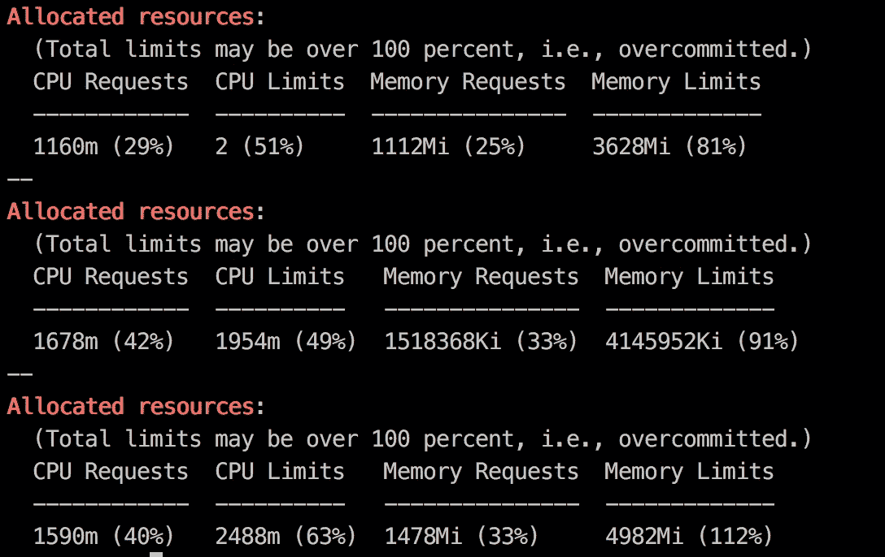
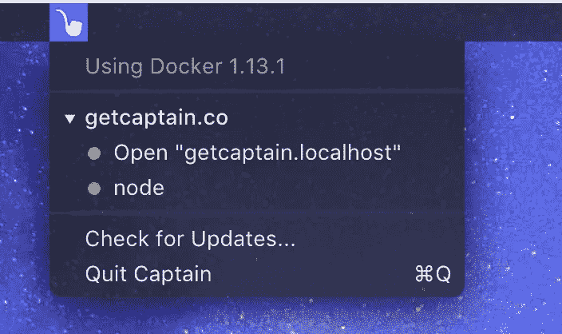

# 使用 Docker、Git 和 Google 云平台开发时，一些有用的 CLI 片段

> 原文：<https://medium.com/google-cloud/a-few-helpful-cli-snippets-when-developing-with-docker-git-google-cloud-platform-5761b6102f3d?source=collection_archive---------0----------------------->

> **前言** *我主要是给自己记下这些，也是为了和社区分享。随着时间的推移，我会组织、记录并将其转移到 Github repo。我也很乐意收集你用过的，留下评论，我会把它们加进去。*

这些是我在使用 Node.js 开发 dockerized 应用程序时使用的随机 CLI 片段，部署在 Kubernetes 上，通常在 Google 云平台上。您可以假设它们都是单行 CLI 命令。

我通常会在我的`.zshrc`(或`.bashrc`)文件中为一些更常用的命令添加一个别名(CLI 快捷方式)。

例如，要为用于检查 pod 的常见 Kubernetes 命令添加别名:

```
# original CLI command:
$ kubectl get pods# shorter alias
$ kp
```

要创建这个，打开`~/.zshrc`并添加下面一行

```
# Example aliases
# alias zshconfig="mate ~/.zshrc"
# alias ohmyzsh="mate ~/.oh-my-zsh"alias kp="kubectl get pods"
```

然后你只需要输入`kp`来检查你的豆荚。

从当前文件夹中获取当前的 github 项目名称

```
export DEPLOYMENT=$(basename -s .git `git config --get remote.origin.url`)
```

获取当前的谷歌云项目

```
export PROJECT_ID=$(gcloud config get-value project)
```

在当前启用 git 的文件夹中构建一个 docker 映像，用 project-id、git repo 名称和当前 git 头进行标记

```
export IMAGE_NAME=gcr.io/$(gcloud config get-value project)/$DEPLOYMENT:$(git rev-parse HEAD)
```

从上面您刚刚创建的自定义图像名称构建一个 Docker 容器

```
docker build -t $IMAGE_NAME .
```

运行一个 Docker 容器，从自定义镜像名，自动从当前文件夹命名为 github repo name

```
export DPORT=5000 && docker run --rm -p $DPORT:$DPORT --name $(basename -s .git `git config --get remote.origin.url`) $IMAGE_NAME
```

或者，如果您设置了部署环境:

```
export DPORT=5000 && docker run --rm -p $DPORT:$DPORT --name $DEPLOYMENT $IMAGE_NAME
```

再进一步，打开浏览器自动到 [http://localhost:5000](http://localhost:5000) (或者你设置的端口)。docker 启动后如果没有自动刷新浏览器。

```
export DPORT=5000 && open [http://localhost:$DPORT](http://localhost:$DPORT) && docker run --rm -p $DPORT:$DPORT --name $(basename -s .git `git config --get remote.origin.url`) $IMAGE_NAME
```

将新的 Docker 映像推送到 Google Cloud container 注册表

```
gcloud docker -- push $IMAGE_NAME
```

用容器的新版本更新正在运行的部署

```
kubectl set image deployment/$DEPLOYEMENT $DEPLOYMENT=$IMAGE_NAME
```

查看节点的当前分配资源的清理摘要

```
kubectl describe nodes | grep -A 4 "Allocated resources"
```



观察某个舱的日志。如果 pod 中有多个容器，您需要在末尾添加容器名称。

```
kubectl logs -f pod-name-here
```

使用[**船长**](https://getcaptain.co/) 轻松启动/停止码头集装箱。在 MacOS 上的任务栏中提供最近容器的菜单。(我不是附属机构或赞助商)



从当前路径中递归删除所有的`node_modules`目录。当你需要备份你的项目，或者移动到一台新的笔记本电脑上时，这是一个很好的选择。通过 usb 备份成千上万的小文件需要很长时间。这不会搜索您的整个计算机，只在当前路径下，所以从单个项目根运行它，只删除那个项目的 node_modules，或者更高，做您的所有项目。

```
find . -name “node_modules” -type d -prune -exec rm -rf ‘{}’ +
```

把 MacOS 上那些烦人的`.DS_Store`文件都删了。这将搜索您的整个硬盘驱动器，而不仅仅是当前路径。这不会阻止它们随着时间的推移被重新创造出来。

```
sudo find / -name ".DS_Store" -depth -exec rm {} \;
```

这只是一个随机纱线(npm)提示，用于以图形方式检查应用程序 package.json 中的包更新。添加`--latest`标志以强制检查最新的主要版本。

> **侧提示(或 bug *？* )** — *当您运行此命令时，它不会列出 beta/@next 版本，但如果您当前安装了某个软件包的 beta 版本，并且该 beta 版本有更新，它会在列表中弹出，但会提供升级到最新的主(非 beta)版本。如果你看到这个，不要从那里更新，但你会知道一个新的测试版出来了。查看下面关于* `*npm dist-tags*` *的提示，看看如何查看最新的测试版。*

```
yarn upgrade-interactive --latest
```

当检查所有的库发布标签时，包括 beta 等，这个是有用的(npm/Node.js)。因为`yarn upgrade-interactive`命令不会显示测试版标签。将`<package name>`换成实际名称，示例如下:

```
npm dist-tags ls <package name> 
```

检查`typescript`的发布标签

```
npm dist-tags ls typescript# output:beta: 2.0.0
insiders: 2.9.1-insiders.20180525
latest: 2.9.1
next: 3.0.0-dev.20180608
rc: 2.9.0-rc
```

您也可以使用下面的`yarn info`命令，但是与`npm dist-tags ls`相比，输出略显荒谬

```
# for version specific info:
yarn info typescript versions# or all package info:
yarn info typescript
```

**在 Kubernetes/GCP 上轻松部署**新版本的应用**。**这篇文章太长，参见[这篇文章](/google-cloud/easily-deploy-new-versions-of-code-to-kubernetes-on-gcp-with-a-single-command-ff920a367cf1)。

> 请在评论中发表任何补充意见！