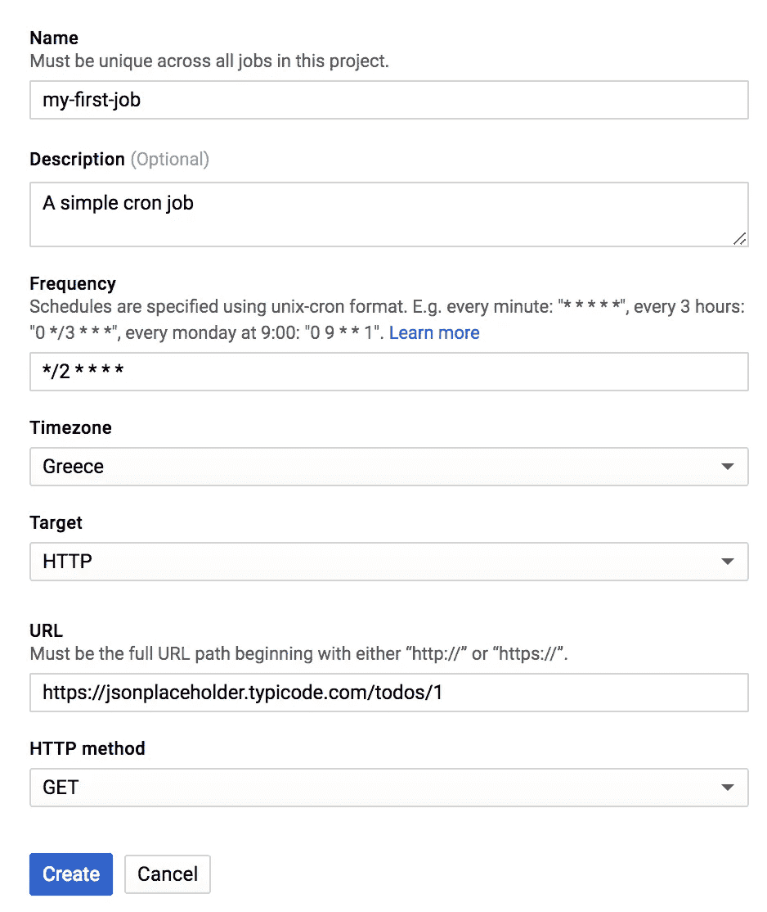

# 谷歌云调度器一瞥

> 原文：<https://medium.com/google-cloud/a-first-glance-at-google-cloud-scheduler-60554bc3cff7?source=collection_archive---------0----------------------->

下面你可以找到一些信息和我们从新的 Google Cloud Scheduler 服务中获得的快速见解，我们已经玩了几分钟了。

云调度程序是一种区域资源，您可以选择将其部署在以下区域之一:

*   美国中部
*   欧洲-西方
*   亚洲-东北 1

**注意**:该区域以后不能更改。

选择区域后，您可以看到为该区域设置了云调度程序。这大约需要一分钟。下一步是定义名称(对于项目中的 cron 作业是唯一的)、描述、unix-cron 格式的时间表、时区和目标。目标可以是下列之一:

*   超文本传送协议
*   应用引擎
*   发布/订阅

对于这个例子，我们使用 HTTP。我们将向其发出 GET 请求的端点将是 [JSONPlaceholder](https://jsonplaceholder.typicode.com/) ，它可以为我们提供简单的 JSON 响应，特别是跟随端点的[:](https://jsonplaceholder.typicode.com/todos/1)

计划作业创建菜单

我们观察到的一件好事是，在输入 cron 表达式后，它会被验证，如果无效，您会收到一条消息。当长时间后试图编写 cron 表达式时，我通常会刷新表达式。不知道是不是只有我一个人，但是如果有一个助手能对我放进去的 cron 时间表做一个简短的解释，那就太好了！

创建作业后，您将被定向到一个视图，在该视图中您可以看到所有作业以及以下信息:

*   日程安排
*   如果他们跑了还是没跑
*   上次执行的结果
*   点击一个按钮，在 Stackdriver 中显示作业日志的简单方法
*   手动调用作业的按钮

已创建的计划作业的列表视图

在 Stackdriver 日志中，您可以看到每个作业执行的以下信息:

*   一个*scheduler . logging . attempt started*事件，记录调度作业的调用，以及关于作业的一些信息(目标、端点、作业名)
*   一个*scheduler . logging . attempt finished*事件，它记录了作业的完成，以及我们从 GET 请求中获得的响应代码(` httpRequest.status` key)。**日志中没有显示的是实际的响应正文。**

**另一个注意事项是不能修改现有的计划作业，必须重新创建才能进行修改。**

# 最初印象

云调度程序目前处于测试阶段，可能会发生变化。它可以作为其余管道的触发器，因为您不能在 Cloud Scheduler 中直接嵌入任何定制逻辑。例如，您可以创建一个云函数，并将其与云调度程序挂钩，这样您就可以在调度中执行任何类型的逻辑。最后，它还在失败时自动重试(对于 HTTP，[失败被认为是](https://cloud.google.com/blog/products/application-development/announcing-cloud-scheduler-a-modern-managed-cron-service-for-automated-batch-jobs)非 2xx 响应，或者对于 Pub/Sub 为非 0)。

快速浏览一下，Cloud Scheduler 看起来非常有趣，因为它可以作为 Google Cloud 中调度作业的初始位置。