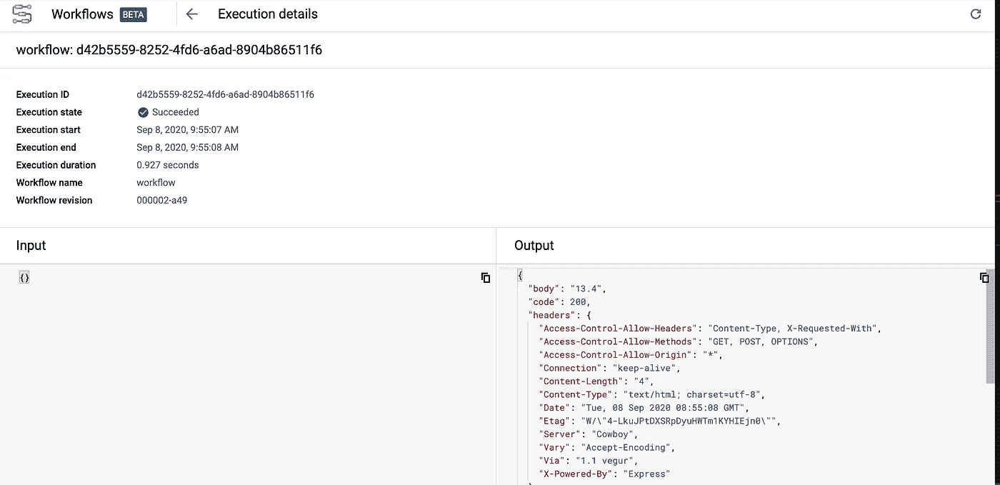

# 工作流的无服务器编排初探

> 原文：<https://medium.com/google-cloud/a-first-look-at-serverless-orchestration-with-workflows-d80e41e9e04f?source=collection_archive---------1----------------------->

# 连接服务的挑战

当我思考我最近的项目时，我可能花了一半时间编写新服务，另一半时间连接服务。服务 A 调用服务 B，或者服务 C 调用外部服务并使用结果反馈给另一个服务 d。

连接服务是“应该很容易”的事情之一，但实际上，这需要花费大量的时间和精力。您需要为服务找出一个通用的连接格式，建立连接，解析结果，并传递结果。我甚至没有提到错误处理、重试以及所有那些您最终需要做的生产就绪型功能。

这就是为什么当我看到来自 [Filip Knapik](https://twitter.com/FilipKnapik1) 的关于一款名为 Workflows 的新产品的测试版发布时，我感到非常兴奋:


# 什么是工作流？

简而言之，[工作流](http://cloud.google.com/workflows)允许你将“事情”连接在一起。什么样的事情？几乎任何有公共 API 的东西。您可以将多个云功能连接在一起，或者使用 Google Cloud APIs 甚至外部 API 将云功能与云运行服务混合使用。

除了连接不同的服务，工作流还处理服务之间的解析和传递值。它有内置的错误处理和重试策略。它是无服务器的，可以根据需求无缝扩展，甚至可以缩减到零。

这听起来很棒，让我们看看我们能做些什么！

# 连接两个云函数

作为第一个示例，让我们使用工作流连接两个云功能。

第一个服务是 [randomgen](https://github.com/meteatamel/workflow-samples/tree/master/randomgen) 。它会生成一个介于 1 到 100 之间的随机数:

```
import random, json
from flask import jsonifydef randomgen(request):
    randomNum = random.randint(1,100)
    output = {"random":randomNum}
    return jsonify(output)
```

部署到云功能:

```
gcloud functions deploy randomgen \
    --runtime python37 \
    --trigger-http \
    --allow-unauthenticated
```

第二个服务是[乘](https://github.com/meteatamel/workflow-samples/tree/master/multiply)。它将接收到的输入乘以 2:

```
import random, json
from flask import jsonifydef multiply(request):
    request_json = request.get_json()
    output = {"multiplied":2*request_json['input']}
    return jsonify(output)
```

部署到云功能:

```
gcloud functions deploy multiply \
    --runtime python37 \
    --trigger-http \
    --allow-unauthenticated
```

使用第一个工作流连接两个服务。创建一个`workflow.yaml`文件:

```
- randomgenFunction:
    call: http.get
    args:
        url: [https://us-central1-workflows-atamel.cloudfunctions.net/randomgen](https://us-central1-workflows-atamel.cloudfunctions.net/randomgen)
    result: randomgenResult
- multiplyFunction:
    call: http.post
    args:
        url: [https://us-central1-workflows-atamel.cloudfunctions.net/multiply](https://us-central1-workflows-atamel.cloudfunctions.net/multiply)
        body:
            input: ${randomgenResult.body.random}
    result: multiplyResult
- returnResult:
    return: ${multiplyResult}
```

请注意，只使用 url 调用不同的服务、解析一个服务的结果并输入到另一个服务中是多么容易。

部署工作流:

```
gcloud beta workflows deploy workflow \
    --source=workflow.yaml
```

执行工作流程:

```
gcloud beta workflows execute workflow
```

这为您提供了查看工作流程进度的命令。在我的例子中，命令是这样的:

```
gcloud beta workflows executions describe bc0e0c53-2b77-438a-a2dc-824be577f5f9 \
   --workflow workflow{
  "body": {
    "multiplied": 34
  },
  "code": 200,
  "headers": {
   ...
```

注意，我们得到了一个`multiplied`值和状态码`200`。很好，我们的第一个工作流已经启动并运行了！

# 连接外部服务

在下一个示例中，让我们连接到 [math.js](https://api.mathjs.org/) 作为工作流中的外部服务。

在`math.js`中，你可以这样计算数学表达式:

```
curl [https://api.mathjs.org/v4/?expr=log(56)](https://api.mathjs.org/v4/?expr=log(56))+4.02535169073515
```

这一次，我们将使用云控制台来更新我们的工作流。在谷歌云控制台中找到`Workflows`:


进入我们的工作流程，点击`Definition`标签:


编辑定义以包括`math.js`:

```
- randomgenFunction:
    call: http.get
    args:
        url: [https://us-central1-workflows-atamel.cloudfunctions.net/randomgen](https://us-central1-workflows-atamel.cloudfunctions.net/randomgen)
    result: randomgenResult
- multiplyFunction:
    call: http.post
    args:
        url: [https://us-central1-workflows-atamel.cloudfunctions.net/multiply](https://us-central1-workflows-atamel.cloudfunctions.net/multiply)
        body:
            input: ${randomgenResult.body.random}
    result: multiplyResult
- logFunction:
    call: http.get
    args:
        url: [https://api.mathjs.org/v4/](https://api.mathjs.org/v4/)
        query:
            expr: ${"log(" + string(multiplyResult.body.multiplied) + ")"}
    result: logResult
- returnResult:
    return: ${logResult}
```

这将指导您编辑和部署工作流。完成后，点击`Execute`执行工作流程。你会看到执行的细节:



注意状态代码`200`。

我们刚刚将一个外部服务集成到我们的工作流中，超级酷！

# 连接经过身份验证的云运行服务

在最后一个示例中，让我们通过调用云运行服务来结束我们的工作流。为了让它更有趣，部署一个内部云运行服务。这意味着需要对工作流进行身份验证才能调用云运行服务。

服务[楼层](https://github.com/meteatamel/workflow-samples/tree/master/floor)返回传入数量的`math.floor`:

```
import json
import logging
import os
import mathfrom flask import Flask, requestapp = Flask(__name__)[@app](http://twitter.com/app).route('/', methods=['POST'])
def handle_post():
    content = json.loads(request.data)
    input = float(content['input'])
    return f"{math.floor(input)}", 200if __name__ != '__main__':
    # Redirect Flask logs to Gunicorn logs
    gunicorn_logger = logging.getLogger('gunicorn.error')
    app.logger.handlers = gunicorn_logger.handlers
    app.logger.setLevel(gunicorn_logger.level)
    app.logger.info('Service started...')
else:
    app.run(debug=True, host='0.0.0.0', port=int(os.environ.get('PORT', 8080)))
```

正如你可能知道的，Cloud Run 部署容器，所以你需要一个`Dockerfile`，你的容器需要绑定到`0.0.0.0`和`PORT` env 变量，因此上面的代码。

可以使用下面的 [Dockerfile](https://github.com/meteatamel/workflow-samples/blob/master/floor/Dockerfile) 。

构建容器:

```
export SERVICE_NAME=floor
gcloud builds submit --tag gcr.io/${PROJECT_ID}/${SERVICE_NAME}
```

部署到云运行。注意`no-allow-unauthenticated`标志。这可以确保服务只接受经过身份验证的呼叫:

```
gcloud run deploy ${SERVICE_NAME} \
  --image gcr.io/${PROJECT_ID}/${SERVICE_NAME} \
  --platform managed \
  --no-allow-unauthenticated
```

## 工作流的服务帐户

在配置工作流以调用云运行服务之前，我们需要创建一个服务帐户供工作流使用:

```
export SERVICE_ACCOUNT =workflows-sa
gcloud iam service-accounts create ${ SERVICE_ACCOUNT }
```

授予服务帐户`run.invoker`角色。这将允许服务帐户调用经过身份验证的云运行服务:

```
export PROJECT_ID=$(gcloud config get-value project)
gcloud projects add-iam-policy-binding ${PROJECT_ID} \
    --member "serviceAccount:${SERVICE_ACCOUNT}@${PROJECT_ID}.iam.gserviceaccount.com" \
    --role "roles/run.invoker"
```

## 更新工作流程

更新`workflow.yaml`以包含云运行服务。请注意，我们还包含了`auth`字段，以确保工作流在其对云运行服务的调用中传递身份验证令牌:

```
- randomgenFunction:
    call: http.get
    args:
        url: [https://us-central1-workflows-atamel.cloudfunctions.net/randomgen](https://us-central1-workflows-atamel.cloudfunctions.net/randomgen)
    result: randomgenResult
- multiplyFunction:
    call: http.post
    args:
        url: [https://us-central1-workflows-atamel.cloudfunctions.net/multiply](https://us-central1-workflows-atamel.cloudfunctions.net/multiply)
        body:
            input: ${randomgenResult.body.random}
    result: multiplyResult
- logFunction:
    call: http.get
    args:
        url: [https://api.mathjs.org/v4/](https://api.mathjs.org/v4/)
        query:
            expr: ${"log(" + string(multiplyResult.body.multiplied) + ")"}
    result: logResult
- floorFunction:
    call: http.post
    args:
        url: [https://floor-wvdg6hhtla-ew.a.run.app](https://floor-wvdg6hhtla-ew.a.run.app)
        auth:
            type: OIDC
        body:
            input: ${logResult.body}
    result: floorResult
- returnResult:
    return: ${floorResult}
```

部署工作流，这次在`service-account`中传递:

```
gcloud beta workflows deploy workflow \
    --source=workflow.yaml \
    --service-account=${SERVICE_ACCOUNT}@${PROJECT_ID}.iam.gserviceaccount.com
```

执行工作流程:

```
gcloud beta workflows execute workflow
```

几秒钟后，您就可以查看工作流执行的结果。它应该是从 floor 函数返回的整数。

# 包裹

希望这篇文章能帮助你对什么是工作流有一个好的认识。这个新产品的潜力给我留下了深刻的印象。我将在以后的博文中尝试一些更复杂的用例。

与此同时，如果你想了解一下，这里有一些链接:

*   [工作流程概述](https://cloud.google.com/workflows)
*   [工作流文档](https://cloud.google.com/workflows/docs)
*   [快速入门](https://cloud.google.com/workflows/docs/quickstarts)
*   [工作流-示例](https://github.com/meteatamel/workflow-samples)用本帖中的代码回购

欢迎在 Twitter [@meteatamel](https://twitter.com/meteatamel) 上联系我，或者阅读我以前在 [medium/@meteatamel](/@meteatamel) 上的帖子。

*最初发布于*[*https://atamel . dev*](https://atamel.dev/posts/2020/09-08_first_look_at_workflows/)*。*