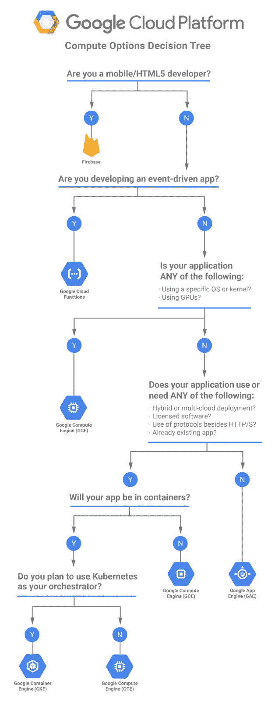
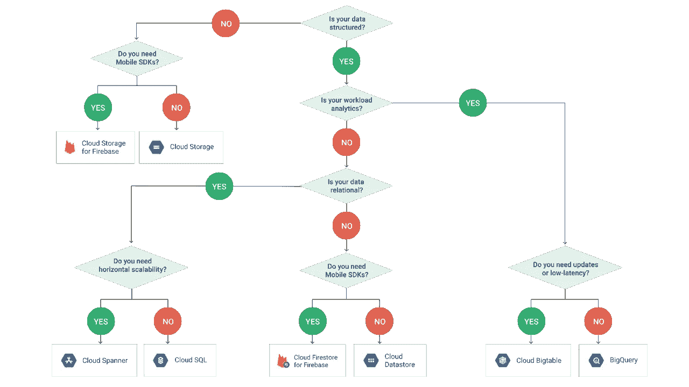
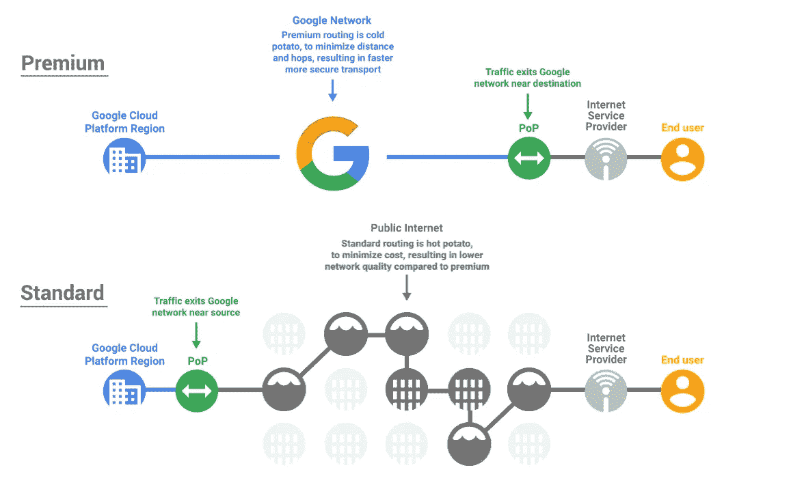
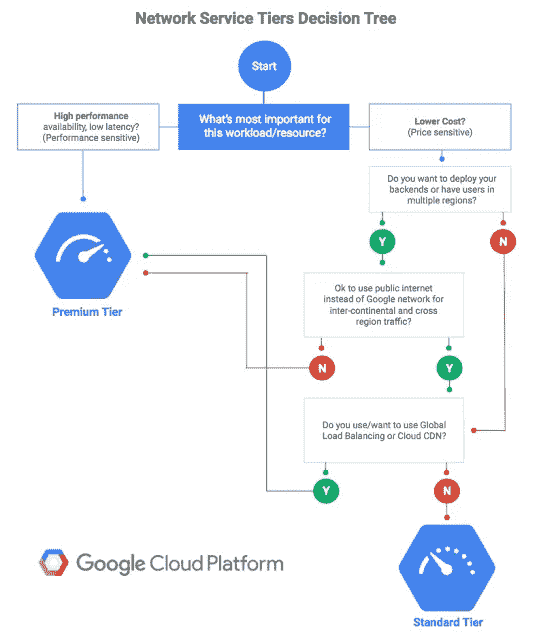
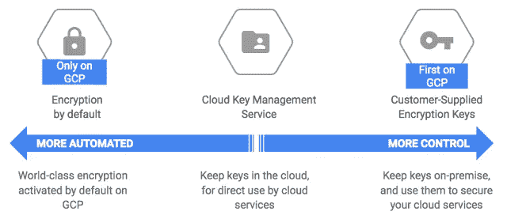
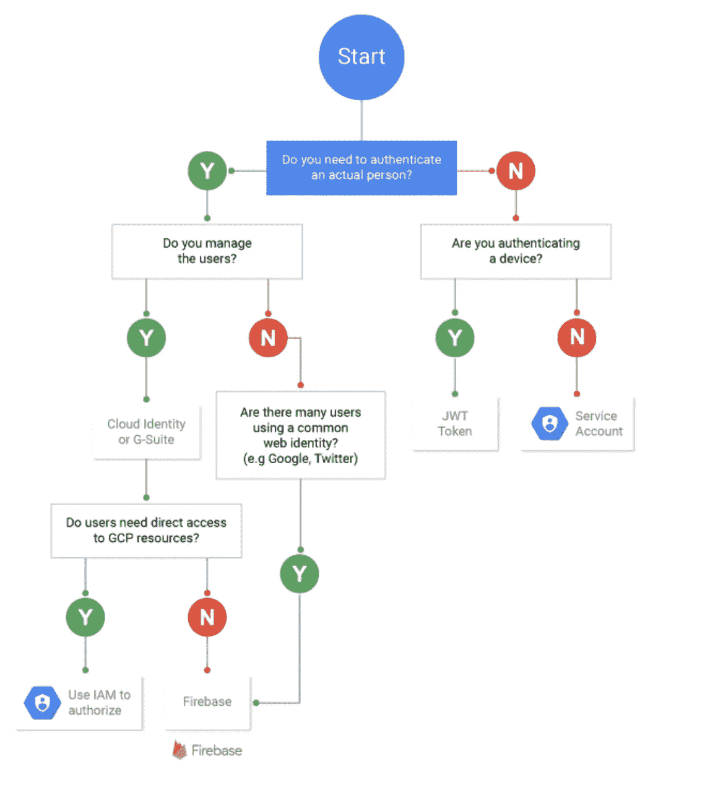

# 一天一张 GCP 流程图

> 原文：<https://medium.com/google-cloud/a-gcp-flowchart-a-day-2d57cc109401?source=collection_archive---------0----------------------->

更新:截至 2019 年 6 月:我在这里维护我的流程图收藏

我与任何培训公司或第三方都没有联系。这些帖子是免费的，可以帮助人们理解谷歌云！

我相信 GCP 努力做到简单易用，但不可避免的是，有时必须做出选择，看看哪种途径或产品适合您的使用案例。因此，当需要做出决定时，流程图就成了它自己的东西。

GCP 今年(2017 年)制作了许多流程图，涵盖了各种用例。不确定如何管理您的加密密钥？哪个互连路径？计算或存储类型？..GCP 有一个流程图可以帮助你。我有几个最喜欢的，但它们都很值得一看。

这里我收集了一些我最喜欢的 GCP 流程图，供你欣赏。(我知道我确实喜欢这个词😀)另外，我想有一个地方可以找到它们。我在每个流程图中都包含了原始文档或博客的链接。所以不要磨磨蹭蹭，希望你和我一样发现这个流程图集很方便。

*归属:所有图形&流程图(除了原来的认证流程图，现已被替换)欣然复制自谷歌* [*云平台*](http://cloud.google.com) *或* [*博客网站*](https://cloudplatform.googleblog.com/)

# 哪个计算选项？

GCP 有一系列的计算选项，可以用图形描述为:

在连续体的两端，你选择哪个选项可能是显而易见的，但在中间，决定变得不那么直截了当，因此，救援流程图如下:

计算流程图和附带的文字可以在[这里](https://cloudplatform.googleblog.com/2017/07/choosing-the-right-compute-option-in-GCP-a-decision-tree.html?m=1)找到，比较计算选项的漂亮表格在[这里](https://cloud.google.com/docs/choosing-a-compute-option#comparing_options)。

# 什么存储类型？

数据数据数据数据数据！(唱到 60 年代[蝙蝠侠主题音乐](https://www.youtube.com/watch?v=1qP-NglUeZU))。我很难想到任何一个应用程序中数据不是一个东西。你可以存储数据的无数方式可能是在考虑了你需要做出的最重要的决定所需要的安全控制之后。GCP 有一个很棒的流程图和表格(我也喜欢表格)，你可以在[这里](https://cloud.google.com/storage-options/)找到

# 哪个网络层？

即使我自己这么说，GCP 的网络也很棒，但人们认识到，并非每个用例都需要针对性能和成本进行优化，这可能是驱动因素。欢迎来到网络层。

你可以在这里看到上图[的有趣的动画 gif](https://2.bp.blogspot.com/-Za3HWtGbQK8/WZ3TuWoVxzI/AAAAAAAAETc/bkqmGj9TBXYGTMO6naL3t_pRh_LIz7XtACK4BGAYYCw/s1600/image2.gif)

与以上搭配的词可以在这里找到[。那里也有一些有用的桌子。](https://cloud.google.com/network-tiers/)

# 如何管理加密密钥

GCP 为您提供了一系列管理加密密钥的方法，图示如下

是的，我知道你可能只需要连续图，但是当宣布 KMS 服务时，他们制作了一个流程图，我必须把它放在这里

与上述内容相关的文字可以在[这里](https://cloudplatform.googleblog.com/2017/01/managing-encryption-keys-in-the-cloud-introducing-Google-Cloud-Key-Management-Service.html?m=1)找到，补充流程图的漂亮表格可以在[这里](https://cloud.google.com/security/encryption-at-rest/)在静态加密登录页面找到。(您想知道的关于 GCP 静态加密的一切，等等！)

# 哪个身份验证选项？

我将偷偷在这里我自己的流程图，因为 GCP 还没有一个这样的！！(提示提示！)

2017 年 12 月 2 日更新:

Neal Mueller 回应了我关于想要一个 GCP 流程图作为认证的暗示，它比我的版本漂亮多了😊请参见下面更新的流程图！谢谢尼尔。

为了确保我们在同一页上，身份验证可以识别您是谁！此流程图侧重于其身份—>应用程序(部署在 GCP 上)还是身份—>直接访问 GCP

由于我还没有写下这个流程图的文字，所以我给你留了几个链接:

[Firebase 认证](https://firebase.google.com/docs/auth/)

[服务账户](https://cloud.google.com/iam/docs/service-accounts)

[GAE 用户认证选项](https://cloud.google.com/appengine/docs/standard/python/oauth/)

[使用 JSON Web 令牌的云物联网](https://cloud.google.com/iot/docs/how-tos/credentials/jwts)

[云身份](https://support.google.com/a/answer/7319251?hl=en)

第二部分有更多流程图，可在此处[找到](/@grapesfrog/more-gcp-flowcharts-for-your-delectation-36b63ebb72ce)，第三部分可在此处[找到](/@grapesfrog/some-more-gcp-flowcharts-dc0bb6f7c94e)