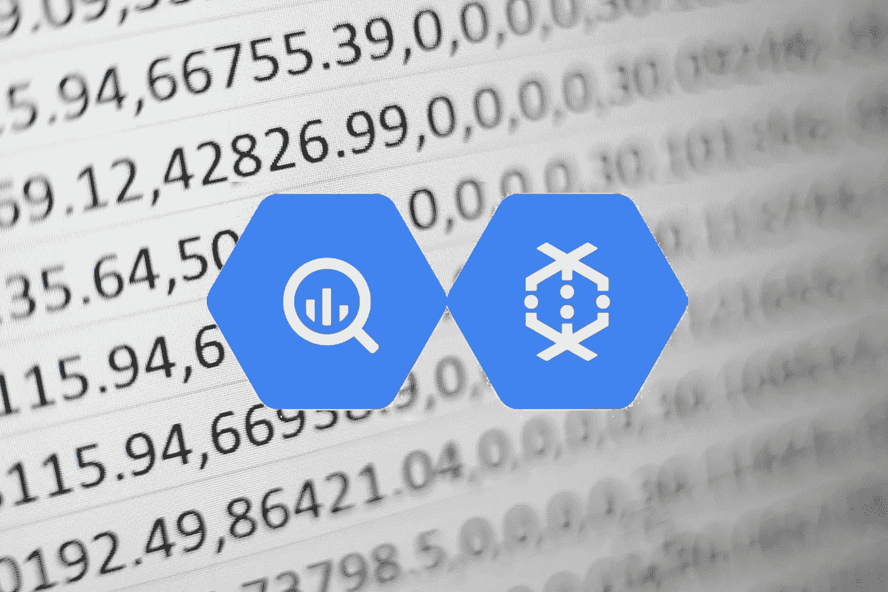
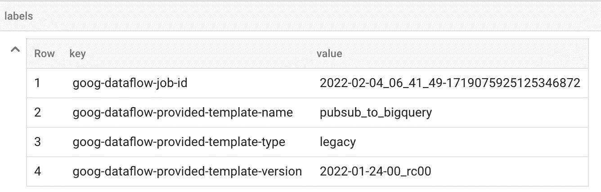
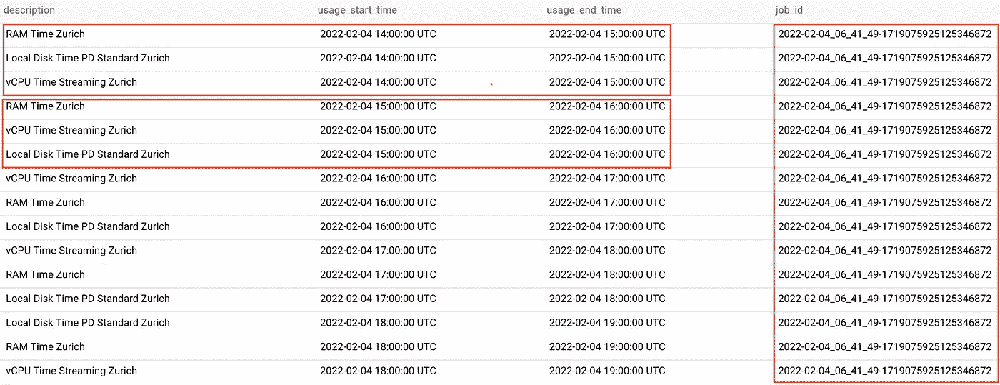
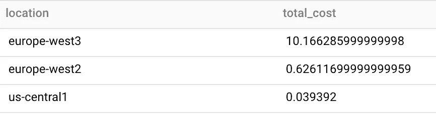
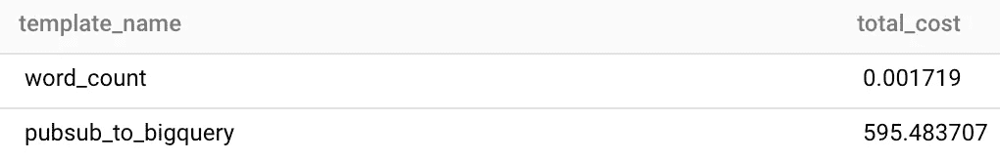
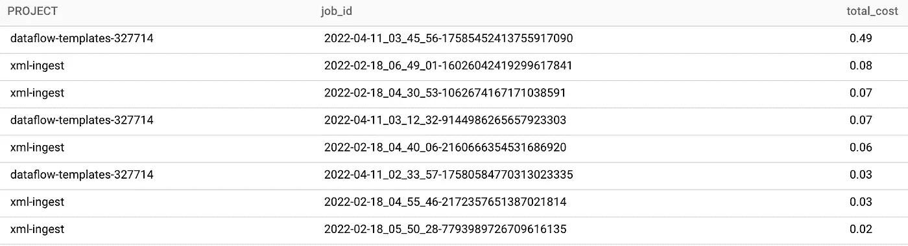
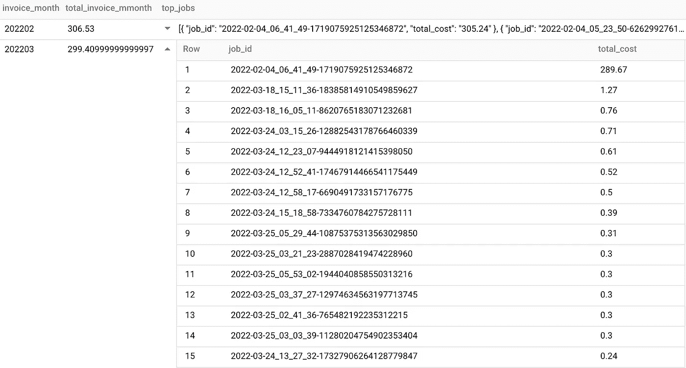

# 通过 BigQuery 计费导出审计云数据流作业成本的指南

> 原文：<https://medium.com/google-cloud/a-guide-to-auditing-cloud-dataflow-jobs-cost-via-bigquery-billing-export-502749813b8b?source=collection_archive---------0----------------------->



在谷歌云平台上，BigQuery [计费导出服务](https://cloud.google.com/billing/docs/how-to/export-data-bigquery)可以成为查询和审计 GCP 资源成本/计费的有用数据集。在这篇文章中，我们将看看数据流相关作业的使用案例，以及我们如何使用该数据集来衡量它们的成本。

如果您还没有一个账单导出设置，请确保在您要审计的项目上激活了 BigQuery 账单导出。为此，在[谷歌云控制台](https://console.cloud.google.com/billing/)中，进入计费>计费导出并激活 BigQuery 计费导出。[https://cloud . Google . com/billing/docs/how-to/export-data-big query](https://cloud.google.com/billing/docs/how-to/export-data-bigquery)

# 计费出口结构和服务

[标准计费导出模式](https://cloud.google.com/billing/docs/how-to/export-data-bigquery-tables#standard-usage-cost-data-schema)具有一组一致的顶级和结构字段，定义如下:

```
+-------------------------------+-----------+
|             Field             |   Type    |
+-------------------------------+-----------+
| billing_account_id            | String    |
| invoice.month                 | String    |
| cost_type                     | String    |
| service.id                    | String    |
| service.description           | String    |
| sku.id                        | String    |
| sku.description               | String    |
| usage_start_time              | Timestamp |
| usage_end_time                | Timestamp |
| project                       | Struct    |
| project.id                    | String    |
| project.number                | String    |
| project.name                  | String    |
| project.ancestry_numbers      | String    |
| project.labels.key            | String    |
| project.labels.value          | String    |
| labels.key                    | String    |
| labels.value                  | String    |
| system_labels.key             | String    |
| system_labels.value           | String    |
| location.location             | String    |
| location.country              | String    |
| location.region               | String    |
| location.zone                 | String    |
| cost                          | Float     |
| currency                      | String    |
| currency_conversion_rate      | Float     |
| usage.amount                  | Float     |
| usage.unit                    | String    |
| usage.amount_in_pricing_units | Float     |
| usage.pricing_unit            | String    |
| credits                       | Struct    |
| credits.id                    | String    |
| credits.full_name             | String    |
| credits.type                  | String    |
| credits.name                  | String    |
| credits.amount                | Float     |
| adjustment_info               | Struct    |
| adjustment_info.id            | string    |
| adjustment_info.description   | string    |
| adjustment_info.type          | String    |
| adjustment_info.mode          | String    |
| export_time                   | Timestamp |
+-------------------------------+-----------+
```

要查看与特定服务相关的数据(例如数据流)，仔细查看几个列及其子字段非常重要:

*   **服务**—描述服务的 ID 和名称的字段
*   **sku** —描述与服务相关的资源类型的字段，如计算、存储、内存等
*   **usage_start_time** —计算给定成本的每小时使用时段的开始时间
*   **user_end_time** —计算给定成本的每小时使用时段的结束时间
*   **标签** —一组键:值对，表示与使用发生的 Google 云资源相关的元数据。这将包括通常由服务设置的默认元数据和用户在使用时设置的自定义元数据
*   **成本** —在任何信用之前的使用成本

# 数据流的作业成本结构

## SKU

典型的数据流作业消耗不同的资源(SKU)。对于同一作业，您可能会找到几行，每一行代表一个 SKU 的消耗指标，包括以下内容之一:

*   本地磁盘时间
*   RAM 时间
*   已处理随机数据
*   vCPU 时间

这种结构在构建成本分析查询时提供了灵活性。您可以选择通过与数据流作业相关的一个或多个 SKU 来获取成本。

## 通过标签识别工作

对于代表数据流成本项目的每一行，我们找到一组标识与该成本相关的作业细节的标签。

除了 **goog-dataflow-job-id 之外，**标签因作业及其类型而异。 **goog-dataflow-job-id** 是在确定成本项目的数据流作业 id 时要寻找的关键字。

更一般地，由 **goog-dataflow-job-*** 前置的标签是由服务附加的标准标签。例如，基于模板的作业会附加与数据流模板相关的额外标签，如下例所示。



BigQuery 计费导出中数据流作业的标签集示例

## 对数据流作业使用自定义标签

虽然标准标签对于成本分解很有用，但是您可以通过在作业上附加自定义标签来获得更多的审计细节。这些标签将与**标签**字段中的其他默认标签一起添加到成本表中。

向任务添加自定义标签的一种方式是通过任务启动时的标签**命令行标志**。标签作为 JSON 字符串传递，每个键代表一个标签名及其对应的值。

```
java -cp ./my_pipeline \
        --runner="DataflowRunner" \
        --project="my-project-id" \
        --inputFile="gs://whatever/input.file" \
        --region="europe-west2" \
        **--labels='{"env": "production", "started_by":"someuser",** "mode": "production"}'
```

也可以将管道代码中的标签**定义为 DataflowPipelineOptions 的一部分。对于某些用例来说，这可能更加“灵活”,但是请记住，这个值是在管道启动之前设置的，启动之后就不能修改了。**

```
private DataflowPipelineOptions options = PipelineOptionsFactory.fromArgs(args).as(DataflowPipelineOptionsImpl.class); 
options.setLabels(ImmutableMap.of("key", "value"));
```

## 长时间运行作业的成本报告(超过 1 小时)

对于运行时间超过 1 小时的数据流作业(例如流作业)，您可能会注意到，对于相同的作业 id，相同的 SKU 项目会重复出现，如下例所示。

用于放大数据流作业成本时间表的示例查询



运行数小时的流式作业的示例 SKU

这应该是正常的行为，可以允许在作业生命周期的特定时间段内测量长时间运行(1h 以上)作业的成本时有一定的灵活性。

## 批处理与流式作业成本报告

默认情况下，没有一个字段可以明确区分作业类型(批处理与流)。这是在作业上设置自定义标签以识别其类型有意义的一个用例。

# 数据流成本审计的有用查询

到目前为止，您已经看到，计费导出表在查询方面提供了很大的灵活性，让我们深入了解一些您可能想要使用的有用的查询思想。

## 按地点列出的总成本

按位置报告就像按`location.location`列汇总并对成本值应用求和函数一样简单。

每个地区的成本 SQL



每个区域的成本结果

## 模板成本

将管道作为模板部署和运行是数据流中的标准做法。在许多情况下，模板可以代表特定的用例。对于这种情况，按模板名称汇总成本对于报告非常有用。

如前所述，数据流模板名称作为字段存储在标签列中，标签列是一个`REPEATED RECORD`列。为此，我们通过`UNNEST`和一个针对其值的[交叉连接](https://cloud.google.com/bigquery/docs/reference/standard-sql/arrays#query_structs_in_an_array)来扩展标签列，从而可以访问每一行上的每个标签键/值。

然后，我们根据我们要寻找的关键字`goog-dataflow-provided-template-name`过滤出行，并根据代表数据流模板名称的行上的相应值列进行分组和应用成本合计。

按模板列出的成本 SQL



按模板列出的成本示例结果

## 每个项目的工作成本

另一个有用且受欢迎的做法是获得每个项目每个工作的成本细目，以及您可能发现有用的任何过滤器，例如按工作运行的特定位置进行过滤。

在下面的例子中，我们使用与上一个例子相同的策略从标签中提取数据流作业 id，这次使用`goog-dataflow-job-id`作为 struct 字段的键。此外，我们从 project 列中提取 id，这是一个不重复的记录字段(这里不需要 unnest)。

然后，在提取作业 id 和项目 id 值的级别上进行聚合，并对成本列进行求和。

按项目列出的成本 SQL



按项目和作业列出的成本实例结果

## 按发票月份列出的成本

最后，还有一个想法是探索数据流的每个发票月的成本，并列出当月成本最高的数据流作业。

在这种情况下，当对成本应用 SUM 函数时，我们可以很容易地按`invoice_month`列分组。

如下面的示例屏幕截图所示，为了获得每个发票月的作业明细，我们在初始查询中扩展了 labels 字段，以提取数据流作业 id，然后在第二个查询中，我们应用上述聚合，并生成一个`REPEATED` `RECORD`列，该列集成了一个小型子查询的结果，以映射和排序 job _ ids 及其成本。

`ARRAY_AGG(STRUCT(job_id, total_cost) ORDER BY total_cost DESC)`

按发票月份列出的成本 SQL



按发票月份列出的成本示例结果

# 那都是乡亲们！

围绕 GCP big query 计费导出表的查询可能是无穷无尽的，我希望你会发现数据流上共享的查询和解释对你自己的计费导出冒险有用。与此同时，我希望听到您的反馈以及与此主题相关的问题。查询愉快！:)