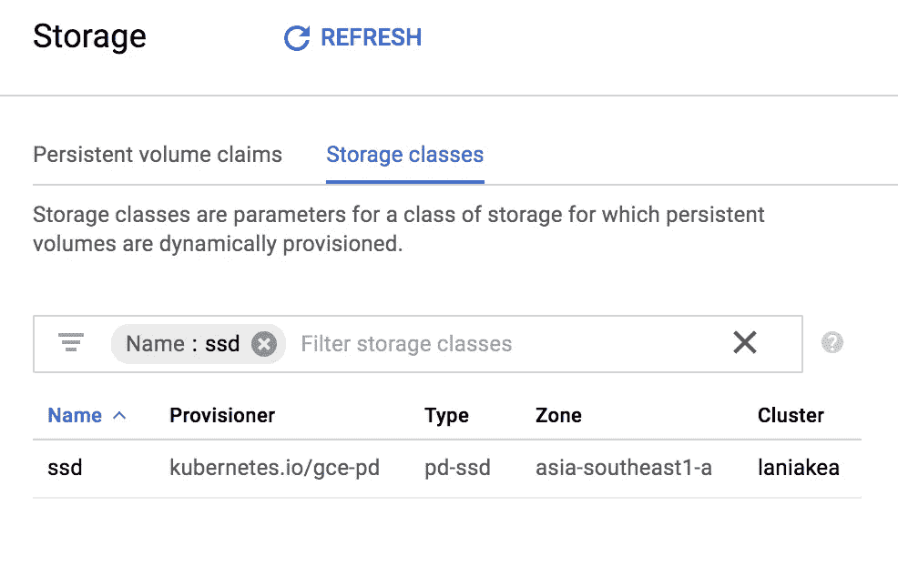
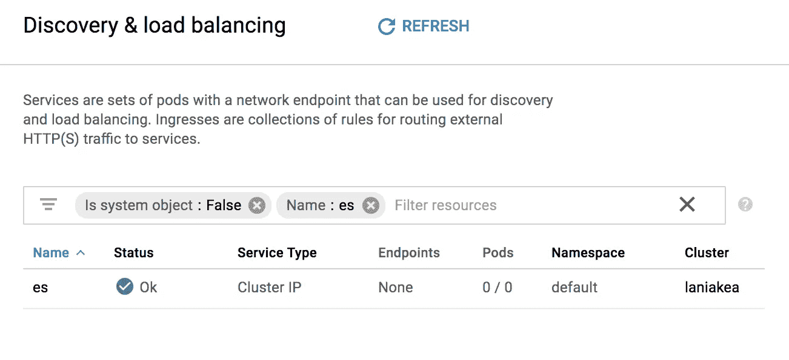

# 在 Google Kubernetes 引擎上部署 Elasticsearch 集群的指南

> 原文：<https://medium.com/google-cloud/a-guide-to-deploy-elasticsearch-cluster-on-google-kubernetes-engine-52f67743ee98?source=collection_archive---------0----------------------->

这是一个简单的指南，帮助你在 Google Kubernetes 引擎上部署 Elasticsearch 集群。本指南应该适用于任何 Kubernetes 集群，只需对持久卷部分进行简单调整。

总体步骤如下所示:

1.  通过[存储类](https://kubernetes.io/docs/concepts/storage/storage-classes/)启用持久卷。
2.  通过[无头服务](https://kubernetes.io/docs/concepts/services-networking/service/#headless-services)启用 Elasticsearch 节点发现。
3.  通过[有状态集](https://kubernetes.io/docs/concepts/workloads/controllers/statefulset/)部署 Elasticsearch 集群。

# 1.持久卷

第一步是在集群上创建一个存储类。用以下内容创建名为`storage.yaml`的新文件:

```
kind: StorageClass
apiVersion: storage.k8s.io/v1
metadata:
  name: ssd
provisioner: kubernetes.io/gce-pd
parameters:
  type: pd-ssd
  zone: asia-southeast1-a
```

请注意，我们使用的存储类`provisioner`是 GCE ( `kubernetes.io/gce-pd`)，具有以下参数:

1.  `type: pd-ssd`启用 SSD 作为持久磁盘。您可以用`type: pd-standard`更新参数类型，使标准磁盘成为持久磁盘
2.  `zone: asia-southeast1-a`为计算区。您可以将其更新到您计算区域。您也可以将`zones`参数用于多个区域，如下所示:`zones: asia-southeast1-a, asia-southeast1-b`。

然后使用以下命令启用存储类:

```
kubectl apply -f storage.yaml
```

您应该能够在[控制面板](https://console.cloud.google.com/kubernetes/storage)上看到存储类:



my Laniakea 集群上的存储类

如果您在非 Google Kubernetes 引擎上部署 Elasticsearch 集群，请更新置备程序和参数。您可以在[这里的](https://kubernetes.io/docs/concepts/storage/storage-classes/#parameters)中看到可用的供应器和参数。本指南的其余部分将适用于任何 Kubernetes 集群。

# 2.弹性搜索节点发现

第二步是通过 headless 服务启用 elasticsearch 节点发现。创建名为`service.yaml`的新文件，内容如下:

```
apiVersion: v1
kind: Service
metadata:
  name: es
  labels:
    service: elasticsearch
spec:
  clusterIP: None
  ports:
  - port: 9200
    name: serving
  - port: 9300
    name: node-to-node
  selector:
    service: elasticsearch
```

然后使用以下命令启用无头服务:

```
kubectl apply -f service.yaml
```

您应该能够在仪表板上看到该服务:



laniakea 集群上的 ES headless 服务

现在，在 kubernetes 集群中，每个带有标签`service: elasticsearch`的 pod 都应该可以通过`$PODNAME.es.default.cluster.local`访问。这将有助于我们的弹性搜索节点发现彼此并形成一个集群。

# 3.弹性搜索集群

最后一步是使用 StatefulSet 部署 elasticsearch 集群。创建名为`elasticsearch.yaml`的新文件，内容如下:

要部署 Elasticsearch 集群，运行以下命令:

```
kubectl apply -f elasticsearch.yaml
```

群集准备就绪可能需要一些时间，这取决于群集的大小。您可以通过访问[工作负载仪表板](https://console.cloud.google.com/kubernetes/workload)来查看集群是否准备就绪。

如果您的集群已准备好，您可以通过 port-forward 访问其中一个 elasticsearch 节点来检查集群是否已创建:

```
kubectl port-forward elasticsearch-0 9200:9200
```

这将把所有对 [http://localhost:9200](http://localhost:9200) 的请求转发到 elasticsearch-0 节点。然后:

```
curl [http://localhost:9200/_cluster/state?pretty](http://10.20.8.3:9200/_cluster/state?pretty)
```

它应该向您显示该集群由 5 个弹性搜索节点组成。

就是这样！现在你可以欣赏我最喜欢的 gif 了:

😊