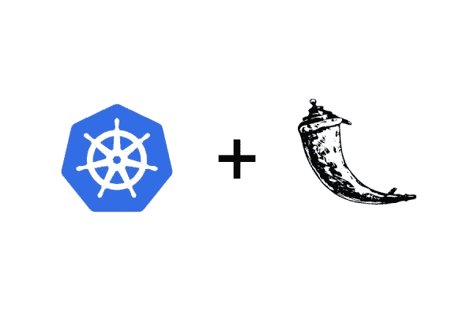

# 在 Google Kubernetes 引擎上部署 Flask 应用程序的指南

> 原文：<https://medium.com/google-cloud/a-guide-to-deploy-flask-app-on-google-kubernetes-engine-bfbbee5c6fb?source=collection_archive---------0----------------------->



这是一个简单的指南，帮助你在[谷歌 Kubernetes 引擎](https://cloud.google.com/kubernetes-engine/)上部署 [Flask](http://flask.pocoo.org/) 应用。本指南应该适用于任何 Kubernetes 集群。

假设我们想将以下 Flask 应用程序部署到 Kubernetes:

```
.
├── app.py
├── config.py
└── requirements.txt
```

这个应用程序是一个简单的 HTTP 服务器，监听指定的`PORT`号。我们可以通过设置`DEBUG_MODE`环境变量来启用/禁用调试模式。我们可以使用以下命令在本地运行 HTTP 服务器:

```
gunicorn app:app --config=config.py
```

# 将烧瓶应用程序归档

在将 Flask 应用程序部署到 Google Kubernetes 引擎之前，我们需要对其进行 dockerize。创建名为`Dockerfile`的新文件，并添加以下配置:

```
FROM python:3.6-jessieRUN apt updateWORKDIR /app
ADD requirements.txt /app/requirements.txt
RUN pip install -r /app/requirements.txtADD . /appENV PORT 8080
CMD ["gunicorn", "app:app", "--config=config.py"]
```

使用以下命令在 Google 云平台上构建 docker 映像:

```
gcloud builds --project YOUR_PROJECT_NAME \
    submit --tag gcr.io/YOUR_PROJECT_NAME/flask-app:v1 .
```

为下一步保存标记名。

# 部署到 Google Kubernetes 引擎

首先，确保您可以访问 Kubernetes 集群。要部署到 Kubernetes，创建名为`app.yaml`的新部署配置，并添加以下内容:

```
apiVersion: apps/v1beta2
kind: Deployment
metadata:
  name: flask-app-tutorial
  labels:
    name: flask-app-tutorial
spec:
  replicas: 1
  selector:
    matchLabels:
      name: flask-app-tutorial
  template:
    metadata:
      name: flask-app-tutorial
      labels:
        name: flask-app-tutorial
    spec:
      containers:
        - name: flask-app-tutorial
          image: gcr.io/kumparan-data-staging/flask-app:v1
          ports:
            - containerPort: 8080
          resources:
            requests:
              memory: 256Mi
            limits:
              memory: 512Mi
          env:
            - name: DEBUG_MODE
              value: "1"
```

使用以下命令将 Flask 应用程序部署到 kubernetes 集群:

```
kubectl apply -f app.yaml
```

使用以下命令公开端口:

```
kubectl expose deployment flask-app-tutorial \
    --type=LoadBalancer --port 80 --target-port 8080
```

您可以使用以下命令获取部署的 Flask 应用程序 URL:

```
kubectl get services -l name=flask-app-tutorial
```

您将获得内部和外部 IP。如果你想在 kubernetes 集群之外访问 Flask 应用，你可以使用外部 IP。

下一步是使用以下命令启用自动缩放:

```
kubectl scale deployment flask-app-tutorial --replicas=NUMBERkubectl autoscale deployment flask-app-tutorial \
    --min=NUMBER --max=NUMBER \
    --cpu-ratio=FLOAT --replicas=NUMBER
```

如果要重新部署，需要构建新的映像，然后运行以下命令:

```
kubectl set image deployment/flask-app-tutorial \
    flask-app-tutorial=NEW_IMAGE_TAG
```

完成了。

# 秘密环境变量

假设您想要存储一些秘密(秘密令牌等)，您可以使用 [kubernetes secrets](https://kubernetes.io/docs/concepts/configuration/secret/) 来处理这些。首先，您需要将您的秘密令牌编码为 base64。您可以使用以下命令:

```
echo -n "YOUR_SECRET_TOKEN" | base64
```

下一步是创建名为`secret.yaml`的 yaml 文件，然后添加以下配置:

```
apiVersion: v1
kind: Secret
metadata:
  name: flask-app-secrets
type: Opaque
data:
  secret_token: $YOUR_ENCODED_BASE64_TOKEN
```

运行以下命令来创建密码:

```
kubectl apply -f secret.yaml
```

现在，您可以通过部署配置中的环境变量访问它，如下所示:

```
apiVersion: apps/v1beta2
kind: Deployment
metadata:
  name: flask-app-tutorial
  labels:
    name: flask-app-tutorial
spec:
  replicas: 1
  selector:
    matchLabels:
      name: flask-app-tutorial
  template:
    metadata:
      name: flask-app-tutorial
      labels:
        name: flask-app-tutorial
    spec:
      containers:
        - name: flask-app-tutorial
          image: gcr.io/kumparan-data-staging/flask-app:v1
          ports:
            - containerPort: 8080
          resources:
            requests:
              memory: 256Mi
            limits:
              memory: 512Mi
          env:
            - name: DEBUG_MODE
              value: "1"
            - name: SECRET_TOKEN
              valueFrom:
                secretKeyRef:
                  name: flask-app-secrets
                  key: secret_token
```

现在，您可以通过`SECRET_TOKEN`环境变量访问您的秘密令牌。

源代码可在此处获得: [pyk/k8s-flask-tutorial](https://github.com/pyk/k8s-flask-tutorial) 。