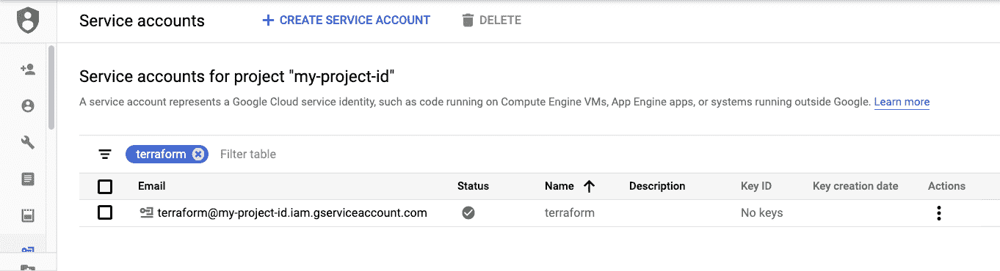
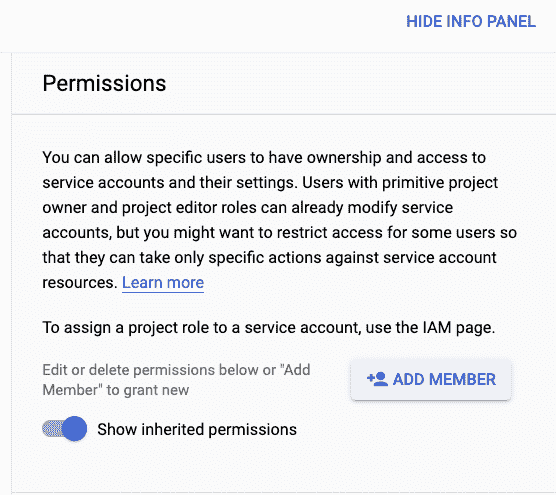
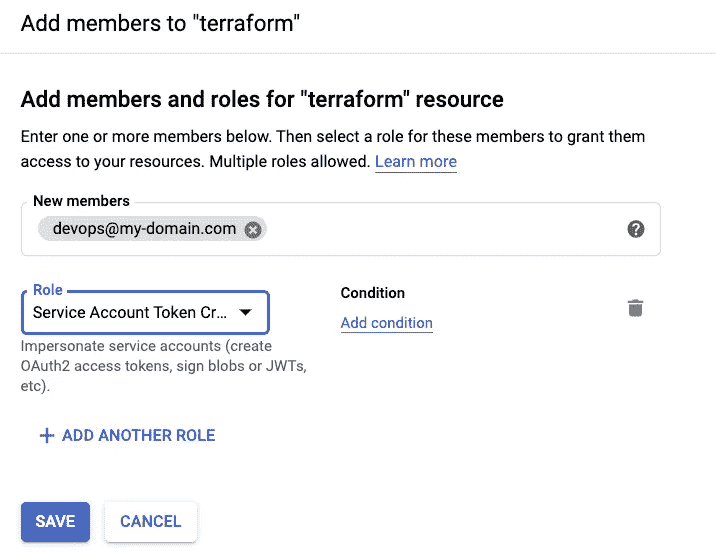
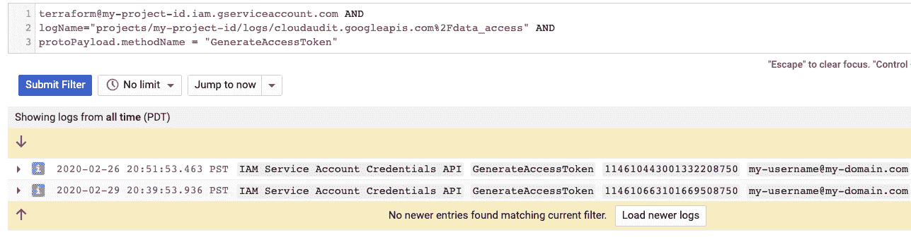

# Terraform 中 GCP 服务帐户模拟的搭便车指南

> 原文：<https://medium.com/google-cloud/a-hitchhikers-guide-to-gcp-service-account-impersonation-in-terraform-af98853ebd37?source=collection_archive---------0----------------------->

围绕机密管理，我不断听到的最常见的 GCP 问题之一是在使用服务帐户密钥时最大限度地降低风险和减少总体攻击面。如果您使用过 Google Cloud Platform，很有可能您已经生成了至少一个(如果不是很多)服务帐户密钥，并将文件存储在本地、存储桶或保险库中(这里存储它们需要+1)。我想讨论的一个主题是通过讨论服务帐户模拟的引入和操作的最佳实践，最大限度地减少潜在的服务帐户密钥暴露。

GCP 服务帐户密钥使用的一个主要用例恰好是大量的 Terraform 示例，建议您使用下面引用的 credentials 属性初始化提供者。

```
provider “google” {
 credentials = file(“account.json”)
 project = “my-project-id”
 region = “us-central1”
}
```

这表明生成用户管理的服务帐户密钥文件和在用户设备上本地存储该密钥文件的必要性。

# 自管理密钥会带来一些潜在风险:

*   服务帐户密钥提交到 Github 或相关 VCS 的可能性
*   用户笔记本电脑上到处都是服务帐户密钥文件
*   围绕服务客户密钥管理的适当治理标准的潜在忽视
*   如果没有适当的服务帐户密钥清理，可能会为同一组服务帐户生成多个密钥

但是嘿。作为代码的基础设施是推荐的方法，如果我必须运行 Terraform，我需要利用本地存储的服务帐户密钥。对吗？不，不完全是。

作为一种直接的替代方法，我们将把服务帐户模拟引入其中。可以利用它来消除拥有服务帐户密钥文件的需要。在这篇博客中，我们将访问专门围绕运行 Terraform 的场景。只要授予了适当的角色，就可以通过用户或服务帐户进行服务帐户模拟。

# 让我们看看利用服务帐户模拟的一些好处:

*   通过消除服务帐户密钥来减少攻击面(针对 Terraform)
*   清楚地确定谁(组、用户、服务帐户)应该能够模拟更高特权的帐户
*   依靠用户身份验证的安全性，而不是密钥文件(通常涉及多因素身份验证)
*   依靠谷歌托管服务账户密钥
*   与短期凭据一起使用，允许对服务帐户拥有的角色进行有时间限制的访问。

# 因此，我们今天使用服务帐户密钥来运行 Terraform…我们如何过渡？

我将重点介绍三个步骤。

**第一步。设置注意事项**

假设我们今天在 GCP 项目中有一个基础设施部署(通过 Terraform)的服务帐户。该帐户通常拥有更高的特权集。

1.  移除 GCP 项目中特定于 Terraform 服务帐户的现有用户管理密钥
2.  接下来，删除在 GCP 项目中生成服务帐户密钥的功能
3.  我们希望删除角色，如**角色/所有者**、**角色/编辑**或**角色/iam.serviceAccountKeyAdmin**
4.  确定应该有权模拟的**用户、组或服务帐户**，并在 **Terraform 服务帐户的 iam 策略**上授予其角色**roles/IAM . serviceaccountokencreator**。
    **注意:**这不是一个项目 IAM 绑定；这是一个**服务帐户** IAM 绑定。
5.  假设我们已经有一个定义了“足够权限”来部署基础设施的 terraform 服务帐户，我们将把该帐户指定为我们将模拟的帐户。



*   点击“添加成员”(在页面右侧的信息面板上)



*   将关联的组、用户或服务帐户添加为成员，并添加两个角色:**roles/iam . serviceaccountokencreator**。



**步骤二。更新并运行你的地形代码**

现在，我们已经完成了上述步骤，让我们更新我们的 Terraform 代码。我们的示例文件 **main.tf** 的一组简单步骤将使我们开始利用模拟。

1.  使用[应用默认凭证](https://cloud.google.com/docs/authentication/production) (ADC)

*   您需要作为有权模拟 Terraform 服务帐户的用户或服务帐户进行身份验证。使用`gcloud auth application-default login`登录后，Terraform 将作为您的 ADC 执行。

2.在有限的时间内模拟服务帐户

*   需要更新一些 cookie cutter 提供程序定义来引用 google.tokengen 提供程序。此外，在第 12 行的“Google _ service _ account _ access _ token”块中，有一个“lifetime”属性，它允许我们指定在模拟期间请求的访问令牌将持续的时间长度。根据基础设施部署的规模，我们可能需要相应地修改生命周期。对于大多数情况，用访问令牌模拟服务帐户 600 秒或 10 分钟就足够了。

```
provider "google" {
  version = "~> 2.0, >= 2.5.1"
  alias   = "tokengen"
}data "google_client_config" "default" {
  provider = "google.tokengen"
}data "google_service_account_access_token" "sa" {
  provider               = "google.tokengen"
  target_service_account = "[terraform@my-project-id.iam.gserviceaccount.com](mailto:terraform@my-project-id.iam.gserviceaccount.com)"
  lifetime               = "600s"scopes = [
    "[https://www.googleapis.com/auth/cloud-platform](https://www.googleapis.com/auth/cloud-platform)",
  ]
}/******************************************
  GA Provider configuration
 *****************************************/
provider "google" {
  version      = "~> 2.0, >= 2.5.1"
  access_token = data.google_service_account_access_token.sa.access_token
  project      = "my-project-id"
}/******************************************
  Beta Provider configuration
 *****************************************/
provider "google-beta" {
  version      = "~> 2.0, >= 2.5.1"
  access_token = data.google_service_account_access_token.sa.access_token
  project      = "my-project-id"
}resource "google_storage_bucket" "test" {
  name     = "my-project-id-test-bucket"
  location = "us-west1"
}
```

*   作为安慰，我们将部署一个简单的 GCS 测试桶。

3.现在，您已经准备好运行您的 Terraform 代码了。

*   `地形初始化'
*   `地形图'
*   `应用地形'

你现在应该有一个 GCS 桶了！

**第三步。审计**

我们不要忘记，当用户开始模拟服务帐户(生成访问令牌)时，我们要确保能够验证适当的审计跟踪。

*   首先，我们应该确认为我们的项目启用了[数据访问日志](https://cloud.google.com/logging/docs/audit/configure-data-access)。
*   其次，只需导航到 Stackdriver > Logging 并运行查询，如下所示:

```
terraform@[MY-PROJECT-ID].iam.gserviceaccount.com AND logName=”projects/[MY-PROJECT-ID]/logs/cloudaudit.googleapis.com%2Fdata_access” AND protoPayload.methodName = “GenerateAccessToken”
```

*   接下来，我们将得到一个包含一组日志的响应，这些日志包含 IAM 服务帐户凭据 API 何时被触发以及临时访问令牌何时生成的详细信息。



**总之**

最后，我想强调一下在您的 GCP 环境中实施服务帐户模拟的好处和高级概述。服务帐户模拟使我们能够依靠 Google 托管密钥来利用用于 Terraform 基础设施部署目的的服务帐户。

另一个主要好处是，它消除了用户围绕密钥轮换、创建和删除实施密钥管理过程的负担。服务帐户模拟的配置也迫使我们考虑哪些帐户应该能够在我们的项目中利用更多特权的服务帐户，并更好地让我们考虑在我们的项目中实现最少特权。实现服务帐户模拟还有许多其他好处，并且开销相当低，所以我建议您试一试。