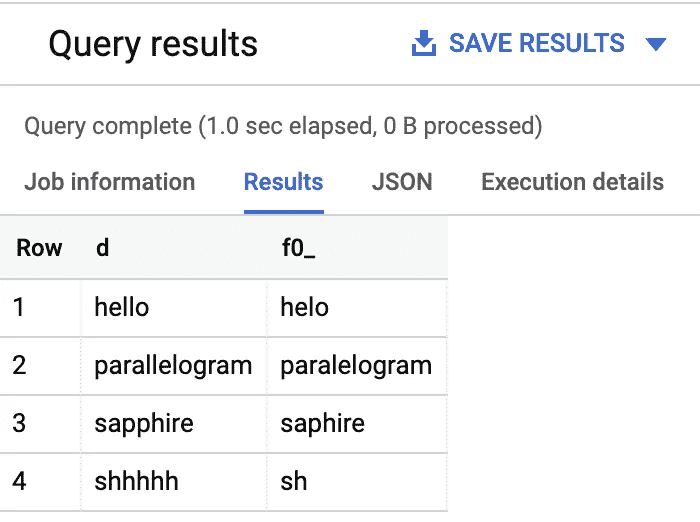
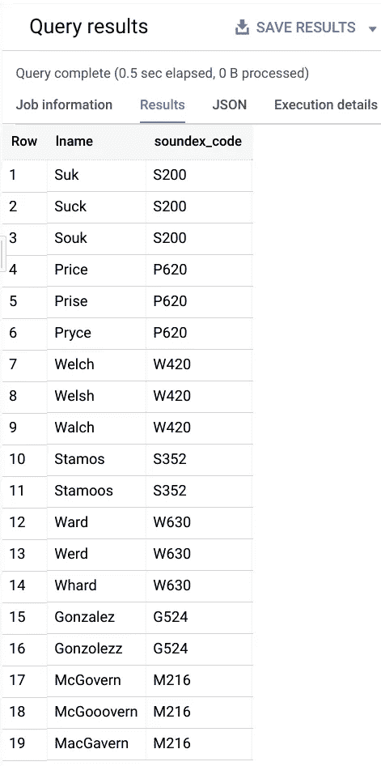
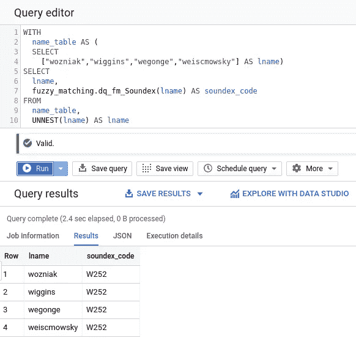

# BigQuery 模糊匹配之旅—1/1，∞) — Soundex

> 原文：<https://medium.com/google-cloud/a-journey-into-bigquery-fuzzy-matching-1-of-1-soundex-b5b89087eae2?source=collection_archive---------0----------------------->

# “我的名字不是这样拼写的”

在人们周围做决定时，取一个正确的名字是很重要的。这适用于处理一个公司与一个人交往的方方面面。人力资源、定向营销和客户参与中的用例就是取对名字很重要的例子。


回想一下上一次咖啡师在杯子上写你的名字是什么时候。

当它进入企业系统的上下文时，匹配相似名称的需要就更加重要了。当单个事务孤立地发生时，可能会有一点误差容限。当我的杯子上写着“布莱恩”而不是“布莱恩”时，我就能释怀了(通常情况下)。如果我以多种排列出现在 CRM 系统中，这将成为一个更大的问题。银行收购就是一个很好的例子。

我曾经是一家地区性零售银行的客户，拥有一个支票和储蓄账户。它被一家更大的地区性银行收购了。后来被一家大型银行控股公司收购，这家公司同时也进行了其他大型收购，其中一些我也是客户。其结果是，我将被直接推销给储蓄账户、支票账户和信用卡，而我已经通过另一项收购成为这些账户的客户，并且我的名字有所变化和拼写错误。单个实体缺乏统一的标识符是一个被称为[主数据管理(MDM)](https://en.wikipedia.org/wiki/Master_data_management) 的问题，这个问题已经存在了一段时间。

很长一段时间以来，供应商一直试图开发应用程序来解决这个问题。MDM 和身份解析系统并不新鲜。一种更常见的架构利用中间件来批量执行模糊匹配和合并，并将合并后的数据写入目标存储库。虽然这些算法已经过时间的考验，但最大的问题之一总是围绕着性能。您往往会受到运行中间件应用程序的基础设施的限制。

我已经在[企业信息管理](https://en.wikipedia.org/wiki/Enterprise_information_management)领域工作了一段时间，也在销售数据集成(DI)/质量(DQ)和 MDM 工具的供应商那里工作过，这是我一直感兴趣的话题。

我也开始欣赏将转换下推到数据库层的能力。随着 Google BigQuery 成为一个完全托管的 Pb 级数据平台，我想到了一个问题:我们是否可以在开始执行这些任务的同时，能够利用 BigQuery 带来的所有超酷的东西？

所以，为什么不试一试。

我不打算设计出一个完整的 MDM 系统(至少目前是这样)。作为整体 DQ 和/或 MDM 策略的一部分，您将需要一个清理和匹配策略的工具包来为您的特定问题提供解决方案，这正是我希望帮助提供的。我总是很想知道某件事是否有效，以及如何改进它的任何反馈。此外，我不知道我能得到多少，因为有一大堆算法可以解决不同的问题。生活充满了小小的冒险，让我们看看它会走向何方。

一般来说，我总是会尽可能地坚持使用 [BigQuery 标准 SQL](https://cloud.google.com/bigquery/docs/reference/standard-sql/) 。我一直认为坚持使用本地方言和数据结构是最快的，因为它不需要额外的引擎，并且允许 BigQuery 以最佳方式完成它的工作，而且需要了解的语言越少，就越容易被采用。

所以让我们试一试。

# 桑迪克斯

该算法由[于 1918 年](https://patents.google.com/patent/US1261167A/en)首次申请专利，是常用的简单算法之一。我们的目标是处理名字，使那些有相同语音发音的名字有相同的代码。这是为了使人们可以识别和分组可能具有不同拼写的条目，这可以克服打字错误和拼写错误。

这是[算法的样子，来自维基百科](https://en.wikipedia.org/wiki/Soundex):

> 1-保留名称的第一个字母，删除所有其他出现的 a、e、I、o、u、y、h、w。
> 
> 2 —用数字替换辅音，如下所示(第一个字母后):
> 
> b，f，p，v → 1
> c，g，j，k，q，s，x，z → 2
> d，t → 3
> l → 4
> m，n → 5
> r → 6
> 
> 3-如果在原始名称中有两个或两个以上相同数字的字母相邻(在步骤 1 之前)，则只保留第一个字母。
> 
> 4-如果单词中的字母太少，无法分配三个数字，请添加零，直到有三个数字。如果超过 3 个字母，只保留前 3 个数字。

对于字符替换，我发现只需包装成一系列的`[REPLACE()](https://cloud.google.com/bigquery/docs/reference/standard-sql/functions-and-operators#replace)`(用于单字符替换)和`[REGEX_REPLACE()](https://cloud.google.com/bigquery/docs/reference/standard-sql/functions-and-operators#regexp_replace)`(用于多字符替换)函数就可以了。这可以抽象成一个[用户定义的函数(UDF)](https://cloud.google.com/bigquery/docs/reference/standard-sql/user-defined-functions) ，它可以处理这两种情况，但是实际上只有六种情况，并不能完全清理查询。

我遇到的另一个问题是删除重复的相邻字母。有一些解决方案可以消除字符串中的重复字符，但是它们必须是连续的，这是我的难点。这时，BigQuery engineering 的聪明人之一 Elliott Brossard 提出了一个使用偏移量的解决方案。我们还将使用[持久 UDF](https://twitter.com/ElliottBrossard/status/1145764485711290369)，一个新发布的功能，让我们的生活变得更加轻松。

```
CREATE OR REPLACE FUNCTION
  dq.dq_hf_gh_RemoveDuplicateChars(s STRING) AS ( 
/*
 * (Helper) Data Quality Function
 * dq_hf_gh_RemoveDuplicateCharacters
 * input: Any string to clean up.
 * returns: String with duplicate characters removed. This
 *   refers to consecutively repeated characters.
 */
(SELECT
  STRING_AGG(
    IF
      (c = SPLIT(s, '')[SAFE_OFFSET(off - 1)],
        NULL,
        c), '' ORDER BY off)
FROM
  UNNEST(SPLIT(s, '')) AS c
  WITH OFFSET off) );
```

让我们用几根绳子做个快速测试。

```
WITH
  input_data AS (
  SELECT ["hello", "parallelogram", "sapphire", "shhhhh"] AS words)
SELECT
  words, dq.dq_hf_gh_RemoveDuplicateChars(words)
FROM
  input_data, UNNEST(words) AS words
```



重复数据删除…非常成功！

我们还需要创建几个助手函数。在这个实现中，如果翻译的第一个字母与开头的数字相同，我们需要删除第一个数字。这是因为我们不能单方面删除第一个数字。比如经过去重翻译，“冈萨雷斯”的全名是 25242。g 转化为 2，所以我们需要删除它。然而，像“Ward”和“Hasnain”这样的名字分别翻译成 63 和 255，W 和 H 都不匹配数字，我们必须保留所有的数字。

让我们创建几个助手函数。第一个是接受一个字母并返回对应的 Soundex 数字映射。如果没有找到匹配，它将返回 7。

```
CREATE OR REPLACE FUNCTION
  dq.dq_hf_soundex_GetSoundexNumber(inchar string) AS (
/*
 * (Helper) Data Quality Function
 * dq_hf_soundex_GetSoundexNumber
 * input: Single letter.
 * returns: Equivalent Soundex code.
 */
CASE
  WHEN STRPOS('bfpv', LOWER(inchar)) > 0 THEN '1'
  WHEN STRPOS('cgjkqsxz', LOWER(inchar)) > 0 THEN '2'
  WHEN STRPOS('dt', LOWER(inchar)) > 0 THEN '3'
  WHEN STRPOS('l', LOWER(inchar)) > 0 THEN '4'
  WHEN STRPOS('mn', LOWER(inchar)) > 0 THEN '5'
  WHEN STRPOS('r', LOWER(inchar)) > 0 THEN '6'
  ELSE '7'
END
);
```

然后我们创建另一个函数，如果找到匹配项，它将返回不带前导字符的字符串。

```
CREATE OR REPLACE FUNCTION
  dq.dq_hf_gh_CheckRemoveFirstChar (full_numbers string,
    first_letter string) AS(
/*
 * (Helper) Data Quality Function
 * dq_hf_gh_CheckRemoveFirstChar
 * input: String
 * returns: Input string without the first character if the
 *   stored first character is the same.
 */
IF
  (STARTS_WITH(full_numbers, first_letter),
    SUBSTR(full_numbers, 2, LENGTH(full_numbers)),
    full_numbers) );
```

因此，随着`dq_hf_RemoveDuplicateChars()`、`dq_hf_GetSoundexNumber()`和`dq_hf_CheckRemoveFirstChar()`UDF 的工作，是时候在它的基础上添加其余的字符替换了。

```
CREATE OR REPLACE FUNCTION dq.dq_fm_Soundex(instring string) AS (
/*
 * Data Quality Function - Fuzzy Matching
 * dq_fm_Soundex
 * input: String to encode.
 * returns: Soundex code of the string.
 */
CONCAT(SUBSTR(UPPER(instring), 0, 1),
rpad(SUBSTR(`dq.dq_hf_gh_CheckRemoveFirstChar`(
  REPLACE(`dq.dq_hf_gh_RemoveDuplicateChars`(
    REPLACE(
      REGEXP_REPLACE(
        REPLACE(
          REGEXP_REPLACE(
            REGEXP_REPLACE(
              REGEXP_REPLACE(
                REGEXP_REPLACE(LOWER(instring),'[aeiouyhw]', '0'),
              '[bfpv]', '1'),
            '[cgjkqsxz]', '2'), 
          '[dt]', '3'), 
        'l', '4'), 
      '[mn]', '5'), 'r', '6')),
    '0', ''), `dq.dq_hf_soundex_GetSoundexNumber`(substr(instring, 0, 1))),
0, 3), 3,'0')))
```

创建完成后，让我们给它取几个名字，试一试吧！

```
WITH
  name_table AS (
  SELECT
    ["Suk","Suck","Souk",
    "Price","Prise","Pryce",
    "Welch","Welsh","Walch",
    "Stamos","Stamoos",
    "Ward","Werd","Whard",
    "Gonzalez","Gonzolezz",
    "McGovern","McGooovern","MacGavern"] AS lname)
SELECT
  lname,
  dq.dq_fm_Soundex(lname) as soundex_code
FROM
  name_table,
  UNNEST(lname) AS lname
```



现在，虽然 Soundex 使用和实现起来既快又容易，但它有时在精确度方面会受到影响。我们在这里使用的基本编码通常被称为“American Soundex”，因为在 20 世纪 30 年代，原始的 Russell Soundex 被修改为我们在这里显示的形式，并被美国人口普查局用于索引英语字母表中的姓名。不同语言的名字，如朝鲜语、日语或汉语，首先需要进行音译，这也带来了挑战。

即使在英语中，由于精确度的损失，我们有时仍然会遇到[假阴性和假阳性](https://en.wikipedia.org/wiki/Sensitivity_and_specificity)。就拿“沃兹尼亚克”、“威金斯”、“韦贡格”和“韦斯莫夫斯基”这些名字来说吧。至少从语音意义上来说，你不会期望它们被归为同一类。然而…

```
WITH
  name_table AS (
  SELECT
    ["wozniak","wiggins","wegonge","weiscmowsky"] AS lname)
SELECT
  lname,
  dq.dq_fm_Soundex(lname) AS soundex_code
FROM
  name_table,
  UNNEST(lname) AS lname
```



哼。*抓抓头*

因此，虽然 Soundex 仍然很有帮助，而且速度很快，但它肯定不是绝对可靠的。这是属性的一个维度，可用于快速创建实体的分组，这是模糊匹配难题的一大块。通常，在数据质量流中，许多不同的算法将根据用例以不同的权重相互结合使用，以便真正确定是否可以解决重复，希望这是 BigQuery 中的第一个难题。

[现在开始下一个…](/google-cloud/a-journey-into-bigquery-fuzzy-matching-2-of-1-more-soundex-and-levenshtein-distance-e64b25ea4ec7)

[](/@hoffa/new-in-bigquery-persistent-udfs-c9ea4100fd83) [## BigQuery 中的新特性:持久性 UDF

### 用户定义的函数是扩展 BigQuery 的一种强有力的方法，但直到现在，它一直是一个必须复制粘贴的累赘…

medium.com](/@hoffa/new-in-bigquery-persistent-udfs-c9ea4100fd83)