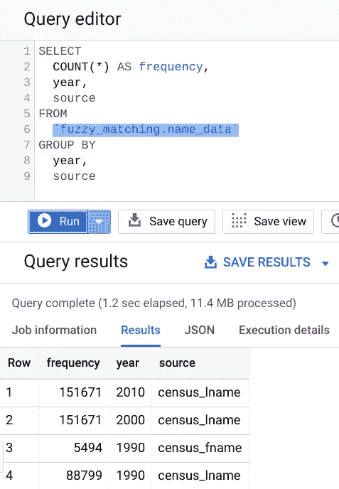
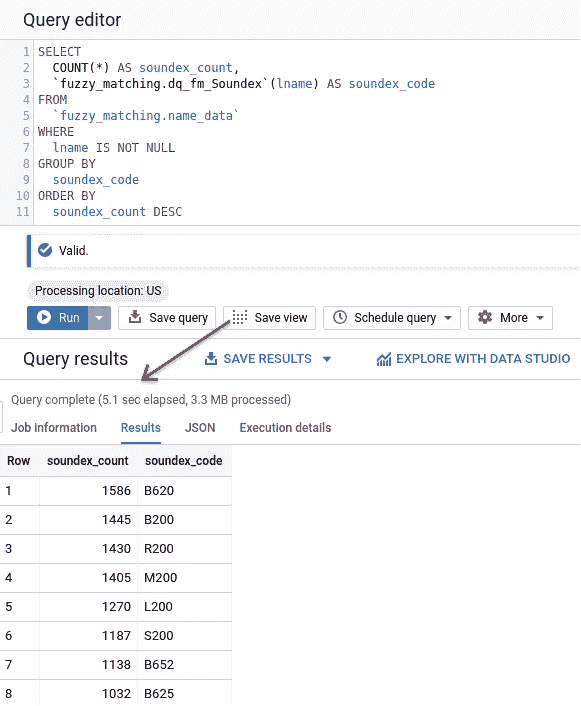
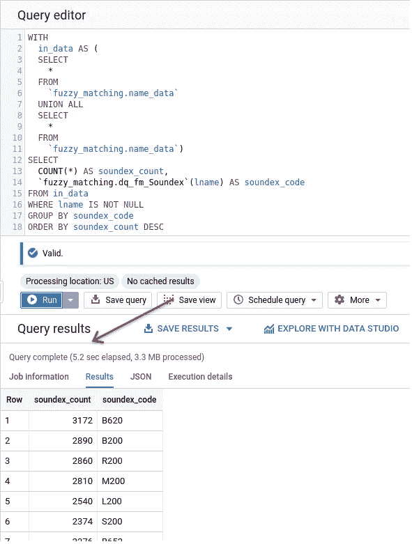
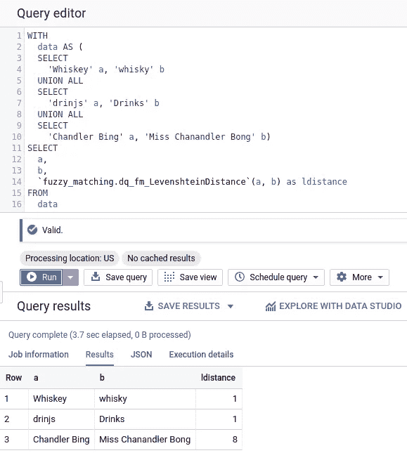
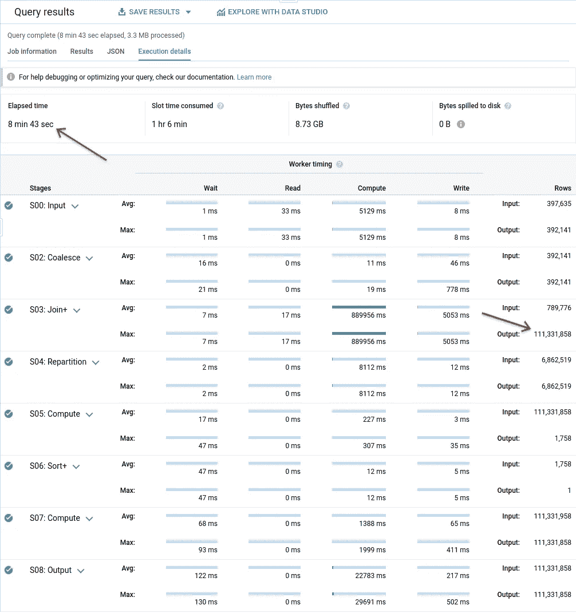
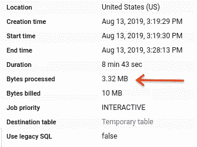
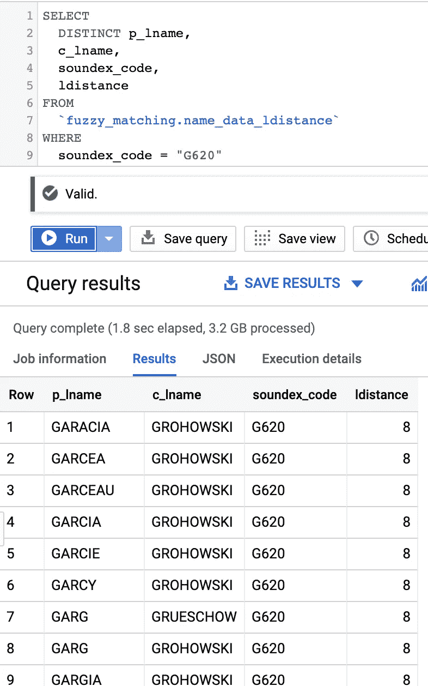
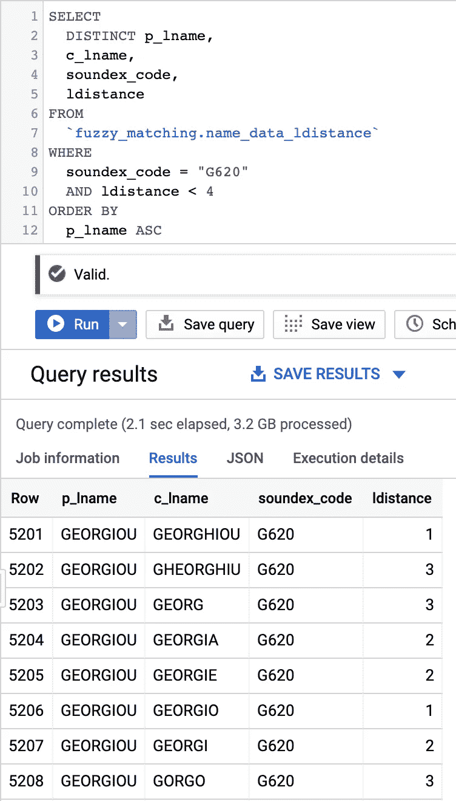

# BigQuery 模糊匹配之旅-[ 1，∞)之二-更多 Soundex 和 Levenshtein 距离

> 原文：<https://medium.com/google-cloud/a-journey-into-bigquery-fuzzy-matching-2-of-1-more-soundex-and-levenshtein-distance-e64b25ea4ec7?source=collection_archive---------0----------------------->

在关于这个主题的第一篇帖子中，我们讨论了如何构建一系列[用户定义函数](https://cloud.google.com/bigquery/docs/reference/standard-sql/user-defined-functions) (UDF)来实现 [Soundex 算法](https://en.wikipedia.org/wiki/Soundex)。概括地说，这里的想法是构建一个工具箱，可用于解决模糊匹配和主数据管理方面的挑战。现在 Soundex 是我们拥有的第一个！

自从我写了那篇文章后，我就被一封邮件淹没了，询问它的性能方面。Soundex 的一个好处是它相当快。当您添加 BigQuery 的大规模并行处理能力时，您最终会发现 Soundex 并不是很重。

# 必须听起来更快

以前，我们使用一些名字对算法本身进行抽查。让我们在名单上再加几个名字，看看会发生什么。我们去取一些数据！

搜索一些姓名数据将我带到了美国人口普查局的家谱数据网站。根据最近两次人口普查(2010 年和 2000 年)汇编了一份经常出现的姓氏清单。1990 年的人口普查给了我们男性和女性的名字和姓氏。我将所有公开发布的数据放入一个 BigQuery 表中。总之，我们能够收集近 400，000 个姓氏来运行我们的查询。



按年份和姓名类型分列的姓名细目。

现在，这些中的一些将被重复，所以模糊匹配算法本身的真实世界适用性有点有限。但在这里，我们试图看看它有多快。40 万比 20 万多一点。戴上我的内部数据集成/数据质量软件帽一秒钟，我通常认为这可能需要一个小时？几十分钟？不过，这是个大问题，所以肯定至少要几分钟吧？



比“几分钟”快一点。

当处理近 50 万个名字时，5 秒钟是相当快的。将这个数字增加一倍，达到 100 万个名字，似乎对总的处理时间没有太大的影响。



数据加倍并不一定意味着处理时间加倍。

这里的要点是，将已经相当大的名字列表的大小加倍所导致的处理时间增加是微不足道的，这可能只是由于计算预热而不是所处理数据的增加。利用数据库能力来执行这样的操作的想法并不新鲜，但是能够在没有基础设施和工具的情况下如此快速地获得这些结果是非常棒的，如果我自己这么说的话。

此外，如果您想自己运行这些，我已经将合并到单个表中的人口普查数据作为 [CSV 导出](https://storage.cloud.google.com/happy-little-buckets-external/medium-posts/census_name_data/census_names.csv)提供。

现在我们已经有了一些基本的语音分类，接下来呢？我们应该很好，对吗？不完全是。让我们来讨论为我们的工具箱构建另一个工具。

# 介绍弗拉基米尔·莱文斯坦

[Vladimir Levenshtein](https://en.wikipedia.org/wiki/Vladimir_Levenshtein) 是一位俄罗斯科学家，他专攻信息理论。这是一种叫做[编辑距离](https://en.wikipedia.org/wiki/Edit_distance)的距离度量形式，它在较高层次上是关于比较将一个字符串变成另一个字符串所需的变化数量。Levenshtein 距离产生于 1965 年，用来衡量一个字符串与另一个字符串之间有多少插入、替换和删除。这里有几个这样的例子:

*   “威士忌”——威士忌:Levenshtein 距离，1。增加了一个 e。
*   “drin js”——饮料:Levenshtein 距离:1。“k”被替换为“j”。
*   [《钱德勒·宾》——《钱德勒·邦小姐》](https://www.imdb.com/title/tt0583600/characters/nm0000098):莱文斯坦距离，8。加“小姐”(5)，加“安”(2)，用“我”代替“o”(1)。

请记住，这是对插入、替换和删除赋予同等权重的基本算法。对于不同的操作有不同的权重，这取决于您的使用情况(例如，在 OCR 使用情况下，您可能希望对“l”/“1”和“O”/“0”替换赋予较低的权重)。如果你对算法是如何工作的很好奇，有一篇极好的[中篇文章会带你通过矩阵运算得到正确的距离](/@ethannam/understanding-the-levenshtein-distance-equation-for-beginners-c4285a5604f0)。绝对值得一读！当通过算法运行两个字符串时，计算的输出是一个数字，它给出了编辑的净次数。

那么我们如何让它工作呢？另一个 [UDF](https://cloud.google.com/bigquery/docs/reference/standard-sql/user-defined-functions) ！在 Soundex 函数中，我们能够将一系列 SQL 语句串在一起，但是现在我们正在寻找循环，所以我们将不得不使用一些 JavaScript。如果你不喜欢阅读之前链接的详尽解释，匹兹堡[大学的人们将其归结为以下步骤](https://people.cs.pitt.edu/~kirk/cs1501/Pruhs/Spring2006/assignments/editdistance/Levenshtein%20Distance.htm):

> 1 —将 *n* 设置为 *s* 的长度。将 *m 设定为* t *的长度。*
> 
> 如果 *n = 0* ，返回 *m* 并退出。
> 如果 *m = 0* ，返回 *n* 并退出。
> 构造一个包含 *0 的矩阵..m* 行和 *0 行..n* 列。
> 
> 2 —将第一行初始化为 *0..n* 。将第一列初始化为 0..m 。
> 
> 3 —检查 *s* 的各个字符(从 *i* 到 *1 到 n* )。
> 
> 4 —检查 *t* ( *j* 从 *1 到 m* )的每个字符。
> 
> 5 —如果 *s[i]* 等于 *t[j]* ，则成本为 0。如果 *s[i]* 不等于 *t[j]* ，则成本为 1。
> 
> 6-将矩阵的单元 *d[i，j]* 设置为等于以下最小值:
> 
> a.正上方的单元格加 1: *d[i-1，j] + 1* 。
> b .紧邻左侧的单元格加 1: *d[i，j-1] + 1* 。
> c .左上角的单元格加上代价: *d[i-1，j-1] +代价*。
> 
> 7-迭代步骤(3，4，5，6)完成后，在单元格 *d[n，m]* 中找到距离。

解释算法如何工作的前一个链接也有一步一步的矩阵图来显示它如何遍历数据，并且[也有在线代码用 JavaScript](https://gist.github.com/andrei-m/982927) 实现了该算法。因为它是在麻省理工学院 OSI 许可下发布的，所以让我们把它放到一个大查询 UDF 中！

```
CREATE OR REPLACE FUNCTION
  dq.dq_fm_LevenshteinDistance(in_a string,
    in_b string)
  RETURNS INT64
  LANGUAGE js AS 
"""/*
 * Data Quality Function - Fuzzy Matching
 * dq_fm_LevenshteinDistance
 * Based off of [https://gist.github.com/andrei-m/982927](https://gist.github.com/andrei-m/982927)
 * input: Two strings to compare the edit distance of.
 * returns: Integer of the edit distance.
 */
var a = in_a.toLowerCase();
var b = in_b.toLowerCase();

if(a.length == 0) return b.length; 
if(b.length == 0) return a.length;
var matrix = [];// increment along the first column of each row
var i;
for(i = 0; i <= b.length; i++){
  matrix[i] = [i];
}// increment each column in the first row
var j;
for(j = 0; j <= a.length; j++){
  matrix[0][j] = j;
}// Fill in the rest of the matrix
for(i = 1; i <= b.length; i++){
  for(j = 1; j <= a.length; j++){
    if(b.charAt(i-1) == a.charAt(j-1)){
      matrix[i][j] = matrix[i-1][j-1];
    } else {
      matrix[i][j] = 
        Math.min(matrix[i-1][j-1] + 1, // substitution
        Math.min(matrix[i][j-1] + 1, // insertion
        matrix[i-1][j] + 1)); // deletion
    }
  }
}return matrix[b.length][a.length];
"""
```

让我们试一试吧！

```
WITH
  data AS (
  SELECT
    'Whiskey' a,
    'whisky' b
  UNION ALL
  SELECT
    'drinjs' a,
    'Drinks' b
  UNION ALL
  SELECT
    'Chandler Bing' a,
    'Miss Chanandler Bong' b)
SELECT
  a,
  b,
  `dq.dq_fm_LevenshteinDistance`(a, b) as ldistance
FROM
  data
```



看起来很管用！

所以让我们做几件事来看看这两者是如何协同工作的。

# 一起更好！

使用 Soundex，我们本质上是将元数据附加到现有的数据元素上，所以这非常简单。对于编辑距离，我们正在进行逐个比较。将原始数据集中的全部 380，000 个姓名与新数据集中的全部 379，999 个(ish)姓名进行比较，将会比我们想要或需要做的要多得多。这就是将 Soundex 和编辑距离结合起来使事情变得更简单的地方。获取每个元素并将编辑距离与同一 Soundex 代码中的所有其他元素进行比较，这大大减少了需要进行比较的次数。它可能看起来有点像这样:

```
WITH
  # Create base table of last names with Soundex codes
  name_data AS (
  SELECT
    lname,
    `dq.dq_fm_Soundex`(lname) soundex_code
  FROM
    `dq.name_data`
  WHERE
    lname IS NOT NULL),
  # Create table that's joined with itself on the Soundex code
  joined_data AS (
  SELECT
    p.lname AS p_lname,
    c.lname c_lname,
    p.soundex_code
  FROM
    name_data p,
    name_data c
  WHERE
    p.soundex_code = c.soundex_code
    AND p.lname != c.lname)
# Apply Levenshtein Distance to each pair
SELECT
  *,
  `dq.dq_fm_LevenshteinDistance`(p_lname, c_lname) AS ldistance
FROM
  joined_data
ORDER BY
  soundex_code,
  p_lname ASC
```

看起来成功了！我想指出查询执行细节中的一些内容。



我们的查询执行详情！

第一件事是 Join+阶段产生的行数。这告诉我们，我们必须从包含所有要进行的比较的数据集中运行超过 1 . 11 亿行的计算。说到这里，接下来我想指出的是经过的时间。8 分 43 秒。很快，如果你问我的话。

现在我们来看看“职务信息”选项卡。



基于消费的最佳定价。

下面是 BigQuery 的[按需定价指标，仅供参考。](https://cloud.google.com/bigquery/pricing#on_demand_pricing)

回到数据，让我们将前面查询的结果保存到另一个表中，以便我们更容易使用！我们将看看一个示例 Soundex 代码，看看它是什么样子的。选择 distinct 以消除普查年度中“常用名”重叠的重复项。



这是一个相当高的编辑距离。

当在这里查看结果数据时，我们看到它得到了所有可能的*距离*值的结果。如此处所示，它撒的网太广，没有多大用处。例如，很明显“Garcy”和“Grohowski”是不同的。让我们稍微调整一下，看看 Levenshtein 距离小于 4 的元素。



啊，这些近多了。

你会立即注意到，通过减少编辑距离的范围，你开始得到更接近的东西。通过缩小语音匹配组的比较范围，我们也提高了性能。“乔治乌”的例子显示的结果更有可能是相同的。

同样，这不是一个完整的模糊匹配方法，但它显示了我们可以多快地开始组装所需的部件，以提出一个可靠的匹配策略。这是两个可能的元素，您可以将其用作多标准匹配策略的一部分。

再一次，去下一个…