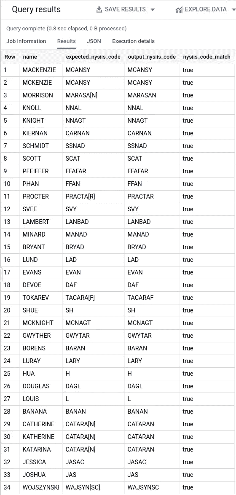
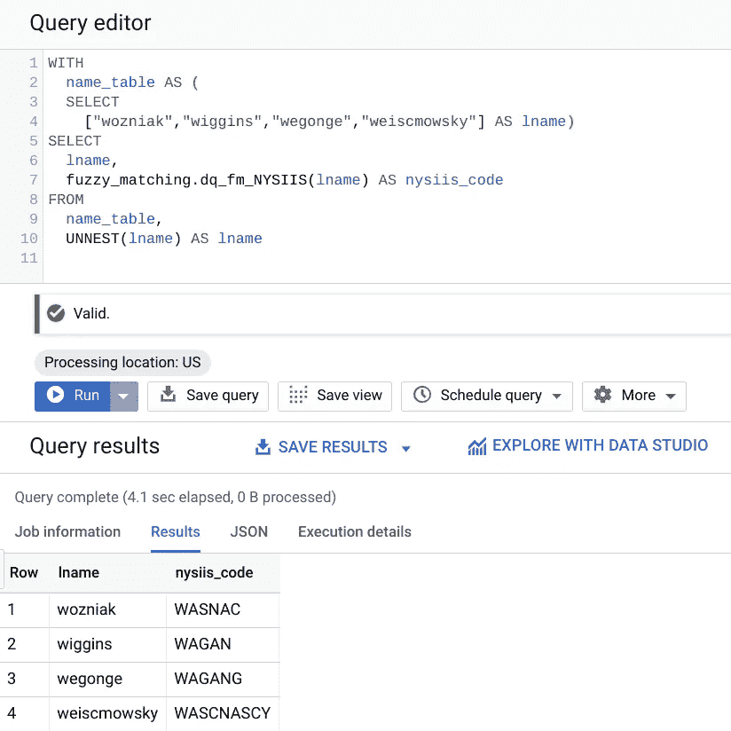

# BigQuery 模糊匹配之旅——3/1，∞) — NYSIIS

> 原文：<https://medium.com/google-cloud/a-journey-into-bigquery-fuzzy-matching-3-of-1-nysiis-d4d75c61af42?source=collection_archive---------0----------------------->

这是一个正在进行的系列的一部分，一定要检查其他文章！

*   【BigQuery 模糊匹配之旅—1/1，∞) — Soundex
*   【BigQuery 模糊匹配之旅——2/1，∞) —更多 Soundex 和 Levenshtein 距离

在前两篇文章中，我们讨论了 Soundex 和它撒下的大网，这导致了许多误报。这个问题已经存在了一段时间，正如 Soundex 所表明的那样，它伴随着妥协，工程师们一直在寻找调整算法的方法，以针对不同的用途进行编码。让我们看看如何实现其中的一个， [NYSIIS](https://en.wikipedia.org/wiki/New_York_State_Identification_and_Intelligence_System) ！

# 纽约时报

纽约州身份识别和情报系统开发于 20 世纪 70 年代，此后成为纽约州刑事司法服务部门的一部分(该算法通常仍被称为 NYSIIS)。它扩展了欧洲和西班牙姓氏的语音编码，因此通常比标准的 Soundex 具有更高的匹配准确度。算法逻辑很好[在线文档](https://commons.apache.org/proper/commons-codec/apidocs/org/apache/commons/codec/language/Nysiis.html)。

以下供参考:

> 1 —转码名称的第一个字符:
> 
> MAC*→*MCC
> KN*→*NN
> K*→*C
> PH*→*FF
> PF*→*FF
> SCH*→*SSS。
> 
> 2 —对名称的最后几个字符进行代码转换:
> 
> EE，即 *→* Y
> DT，RT，RD，NT，ND *→* D。
> 
> 3-密钥的第一个字符=名称的第一个字符。
> 
> 4-在以下规则中，对名称的字符执行扫描，从第二个字符开始，每次递增一个字符:
> 
> EV *→* AF、else A、E、I、O、U*→*A
> Q*→*G
> Z*→*S
> M*→*N
> KN*→*N、else K*→*C
> SCH*→*SSS
> PH
> 
> 5-如果最后一个字符是 S，则删除它。
> 
> 6-如果最后一个字符是 AY，则替换为 y。
> 
> 7-如果最后一个字符是 A，则删除它。
> 
> 8-折叠所有重复字符串
> 
> 9-添加名称的原始第一个字符作为密钥的第一个字符

好的，这个比原来的 Soundex 多了几个步骤。为了简单一点，让我们把它分成不同的部分。

第 1 步和第 2 步是最容易合并到 SQL UDF 中的。特定于 NYSIIS 的一系列辅助 UDF 函数我们将用 *dq_hf_nysiis_* 作为前缀，这样我们以后可以很容易地找到它们。一般的帮助函数将继续以 *dq_hf_gh_* 为前缀。

```
CREATE OR REPLACE FUNCTION
dq.dq_hf_nysiis_step1_transcodefirstlast (instring string) AS (
/*
 * (Helper) Data Quality Function - NYSIIS
 * input: String to transcode.
 * returns: String with the first characters and last
 *   characters transcoded for the first step in NYSIIS.
 */
CONCAT(
  CASE
    WHEN STARTS_WITH(instring, "MAC") 
      THEN CONCAT("MCC", SUBSTR(instring, 4, LENGTH(instring)-5))
    WHEN STARTS_WITH(instring, "KN") 
      THEN CONCAT("NN", SUBSTR(instring, 3, LENGTH(instring) - 4))
    WHEN STARTS_WITH(instring, "K") THEN 
      CONCAT("C", SUBSTR(instring, 2, LENGTH(instring) - 3))
    WHEN STARTS_WITH(instring, "PH") 
      THEN CONCAT("FF", SUBSTR(instring, 3, LENGTH(instring) - 4))
    WHEN STARTS_WITH(instring, "PF") 
      THEN CONCAT("FF", SUBSTR(instring,3, LENGTH(instring) - 4))
    WHEN STARTS_WITH(instring, "SCH") 
      THEN CONCAT("SSS", SUBSTR(instring, 4, LENGTH(instring) - 5))
  ELSE
    SUBSTR(instring, 1, LENGTH(instring) - 2)
  END
  ,
  CASE
    WHEN (SUBSTR(instring, -2) = "EE") 
      OR (SUBSTR(instring, -2) = "IE" ) 
      THEN "Y"
    WHEN (SUBSTR(instring, -2) = "DT") 
      OR (SUBSTR(instring, -2) = "RT")
      OR (SUBSTR(instring, -2) = "RD") 
      OR (SUBSTR(instring, -2) = "NT")
      OR (SUBSTR(instring, -2) = "ND") 
      THEN "D"
  ELSE
    SUBSTR(instring, -2)
  END
)
);
```

从这里开始，我们希望继续操作第二个字符，但是仍然希望保留键的第一个字符。因为我们还没有可以存储变量的过程化脚本语言，所以我们需要弄清楚如何通过表达式来维护它。让我们将它们分开，存储在一个数组中，并根据需要传递。下面是一个通用的帮助器函数，它将创建这样一个数组，并检查处理单个字符串的能力。

```
CREATE OR REPLACE FUNCTION
  dq.dq_hf_gh_SplitFirstCharacter(instring STRING) AS(
/*
 * (Helper) Data Quality Function
 * dq_hf_gh_SplitFirstCharacter
 * input: Any string to split.
 * returns: Array with the first character, followed by
 *   the remaining characters.
 */
IF
  (LENGTH(instring) <= 1,
    [instring, ''],
    [SUBSTR(instring, 1, 1),
      SUBSTR(instring, 2, LENGTH(instring))]) );
```

让我们进入第四步，这是最重要的一步。虽然出于性能原因，我希望在 SQL UDF 中实现这一点，但是有太多的条件逻辑使得这成为可能，所以就用 JavaScript 吧！让我们创建一个封装该逻辑的助手函数。

```
CREATE OR REPLACE FUNCTION
  dq.dq_hf_nysiis_step4_transcodemain (inarray ARRAY<STRING>)
  RETURNS ARRAY<STRING>
  LANGUAGE js AS """
/*
 * (Helper) Data Quality Function - NYSIIS
 * dq_hf_nsiis_step4_transcodemain
 * input: ARRAY[0] is the first character of the string.
 *        ARRAY[1] is the rest of the string.
 * output: ARRAY[0] is the first character of the original string.
 * output: ARRAY[1] has the main transcoding of the string remainder.
 */
instring = inarray[1];
var i;
var toReturn = "";
for(i = 0; i < instring.length; i++){
  switch(instring.charAt(i)){
    case 'E':
      if(i + 1 < instring.length && instring.charAt(i + 1) == 'V'){
        toReturn += 'AF';
        i++;
      }
      else{
        toReturn += 'A';
      }
      break;
    case 'A':
      toReturn += 'A';
      break;
    case 'I':
      toReturn += 'A';
      break;
    case 'O':
      toReturn += 'A';
      break;
    case 'U':
      toReturn += 'A';
      break;
    case 'Q':
      toReturn += 'G';
      break;
    case 'Z':
      toReturn += 'S';
      break;
    case 'M':
      toReturn += 'N';
      break;
    case 'K':
      if (i + 1 < instring.length && instring.charAt(i + 1) == 'N'){
        toReturn += 'N';
        i++;
      }
      else{
        toReturn += 'C';
      }
      break;
    case 'S':
      if(i + 2 < instring.length && instring.charAt(i + 1) == 'C' &&
        instring.charAt(i + 2) == 'H'){
          toReturn += 'SSS';
          i++;
          i++;
      }
      else{
        toReturn += 'S';
      }
      break;
    case 'P':
      if(i + 1 < instring.length && instring.charAt(i + 1) == 'H'){
        toReturn += 'FF';
        i++;
      }
      else{
        toReturn += 'P';
      }
      break;
    case 'H':
      if((i - 1 > -1 && ['a', 'e', 'i', 'o', 'u']
        .indexOf(instring.charAt(i - 1).toLowerCase()) == -1) ||
        (i + 1 < instring.length && ['a', 'e', 'i', 'o', 'u']
        .indexOf(instring.charAt(i + 1).toLowerCase()) == -1)){
          toReturn += toReturn.charAt(toReturn.length - 1);
      }
      else{
        toReturn += 'H';
      }
      break;
    case 'W':
      if(i - 1 > -1 && ['a', 'e', 'i', 'o', 'u'].
        indexOf(instring.charAt(i - 1).toLowerCase()) !== -1){
          toReturn += toReturn.charAt(toReturn.length - 1);
      }
      else{
        toReturn += 'W';
      }
      break;
    default:
      toReturn += instring.charAt(i);
      break;
  }
}
outArray = [inarray[0], toReturn];
return outArray;
"""
```

我们现在处于最后冲刺阶段。让我们删除同时重复的字符(借用之前实现 Soundex 的 helper 函数)，并将数组重构为一个字符串。

```
CREATE OR REPLACE FUNCTION
  dq.dq_hf_nysiis_DedupCombine (inarray ARRAY<STRING>) AS(
/*
 * (Helper) Data Quality Function
 * dq_hf_nysiis_DedupCombine
 * input: Array with starting character, and converted string.
 * returns: String with the first character combined with
            the string removed of repeating characters.
 */
CONCAT(
  inarray[OFFSET(0)],
  dq.dq_hf_gh_RemoveDuplicateChars(
    inarray[OFFSET(1)]))
)
```

步骤 5、6 和 7 是我们需要做的最后几个代码转换，所以让我们将其封装在自己的 UDF 中。要做到这一点，我们首先要创建一个通用的助手函数，它将在字符串末尾寻找一个字符模式，并用另一个字符模式替换它。

```
CREATE OR REPLACE FUNCTION
  dq.dq_hf_gh_ReplaceEndWith(
    instring STRING,
    tofind STRING,
    toreplace STRING) AS(
/*
 * (Helper) Data Quality Function
 * dq_hf_gh_ReplaceEndWith
 * input: Any string to clean up.
          Any string to look for.
          Any string to replace at the end.
 * returns: Looks for the tofind string at the end and
     then replaces it with the toreplace string.
 */
IF
  (ENDS_WITH(instring, tofind),
    CONCAT(SUBSTR(instring, 1, LENGTH(instring) - LENGTH(tofind)), toreplace),
    instring) );
```

下一位将利用新函数根据步骤 5、6 和 7 替换字符。

```
CREATE OR REPLACE FUNCTION
  dq.dq_hf_nysiis_step8_clean_up_ends(instring STRING) AS(
/*
 * (Helper) Data Quality Function
 * dq_hf_nysiis_step8_clean_up_ends
 * input: String to check the ends of.
 * returns: String after removing the S at the end,
 *   replacing AY with Y,
 *   and removing A.
 */
dq.dq_hf_gh_ReplaceEndWith(
  dq.dq_hf_gh_ReplaceEndWith(
    dq.dq_hf_gh_ReplaceEndWith(instring,'S',''),
  'AY','Y'),
'A','')
);
```

让我们把这些按顺序包装起来，创建我们闪亮的新的 NYSIIS 函数。我们在逻辑中增加的一个额外的例子是长度为 1 的字符串。在这些情况下，唯一完成的代码转换是步骤 1 中的 *K → C* ，如果不是，就返回原始字母。放在这里是有意义的，这样就把整个流程短路了，不浪费处理时间。

```
CREATE OR REPLACE FUNCTION
  dq.dq_fm_NYSIIS(instring STRING) AS (
/*
 * Data Quality Function - Fuzzy Matching
 * dq_fm_NYSIIS
 * input: String to encode.
 * returns: NYSIIS code of the string.
 */
IF (LENGTH(instring) = 1,
  IF (instring = "K", "C", instring), (
    dq.dq_hf_nysiis_step8_clean_up_ends(
      dq.dq_hf_nysiis_DedupCombine(
        dq.dq_hf_nysiis_step4_transcodemain(
          dq.dq_hf_gh_SplitFirstCharacter(
            dq.dq_hf_nysiis_step1_transcodefirstlast(
              UPPER(instring)) 
          )
        )
      )
    )
  )
)
);
```

这应该会导致一个绿色的勾号，也应该会引发喜悦！

所以让我们试一试。首先，让我们测试一下算法是否有效。我取了一系列的名字，通过 web 上的 NYSIIS 的一个[实现手动运行它们来得到结果。我对它们进行了比较，看看我们的 BigQuery 实现是否与预期的 NYSIIS 代码匹配。我试图建立一系列的名字来测试尽可能多的代码转换步骤。](http://www.dropby.com/NYSIIS.html)

```
WITH
  input_data AS (
  SELECT
    ["MACKENZIE,MCANSY","MCKENZIE,MCANSY",
    "MORRISON,MARASA[N]","KNOLL,NNAL",
    "KNIGHT,NNAGT","KIERNAN,CARNAN",
    "SCHMIDT,SSNAD","SCOTT,SCAT",
    "PFEIFFER,FFAFAR","PHAN,FFAN",
    "PROCTER,PRACTA[R]","SVEE,SVY",
    "LAMBERT,LANBAD","MINARD,MANAD",
    "BRYANT,BRYAD","LUND,LAD",
    "EVANS,EVAN","DEVOE,DAF",
    "TOKAREV,TACARA[F]","SHUE,SH",
    "MCKNIGHT,MCNAGT","GWYTHER,GWYTAR",
    "BORENS,BARAN","LURAY,LARY",
    "HUA,H","DOUGLAS,DAGL",
    "LOUIS,L","BANANA,BANAN",
    "CATHERINE,CATARA[N]","Katherine,CATARA[N]",
    "Katarina,CATARA[N]","Jessica,JASAC",
    "joshua,JAS","Wojszynski,WAJSYN[SC]"] AS names),
  main_data AS (
  SELECT
    UPPER(SPLIT(names)[OFFSET(0)]) AS name,
    SPLIT(names)[OFFSET(1)] AS expected_nysiis_code,
    dq.dq_fm_NYSIIS(SPLIT(names)[OFFSET(0)])
      AS output_nysiis_code
  FROM
    input_data,
    UNNEST(names) AS names)
SELECT
  *,
  REGEXP_REPLACE(expected_nysiis_code, r'[\[\]]', '') =
    output_nysiis_code AS nysiis_code_match
FROM
  main_data
```

我们得到以下结果，并且它们是匹配的！



再次取得巨大成功！

所以总的来说，实现看起来是有效的。如果您想知道`expected_nysiis_code`列上的括号是什么，那是因为最初的 NYSIIS 算法有 6 个字符的限制，这是现在大多数工具中的默认长度。但是，没有理由不使用全部内容，所以括号中的字母只是前六个字符后的附加字母。

在这个系列的第一部分的最后，当我们实现 Soundex 时，我们注意到有时它不会那么准确。例如，Wozniak、Wiggins、Wegonge 和 Weiscmowsky 都有相同的 Soundex 代码 W252。那么纽约时报给了我们什么呢？



啊，这还差不多！

看起来我们得到了比 Soundex 返回的更精确的答案。这很好，因为这意味着我们的名字越来越精确，因此应该得到更好的分组。

不幸的是，这个脚本比我希望的要长一些，也更复杂一些。总的来说，我尽可能多地使用 SQL UDFs 和标准 SQL。它有助于更清晰的查询，允许更好的调试和自省，但它也运行在核心数据处理引擎中，而 JavaScript UDF[需要在 Google V8](https://developers.googleblog.com/2015/08/breaking-sql-barrier-google-bigquery.html) 上运行。虽然这些都是经过高度优化的引擎，但出于性能原因，我更愿意尽量减少外部流程。这里我们必须使用 JavaScript，因为我们确实需要像变量和 for 循环这样的东西，而 BigQuery 还没有自己的过程化脚本逻辑。但是，如果有一天真的发生了，也许有必要重新审视这一切，看看我们能否重构和优化这一切。

从这里开始，我想为多标准匹配组添加其他属性，如邮政编码，敬请关注！