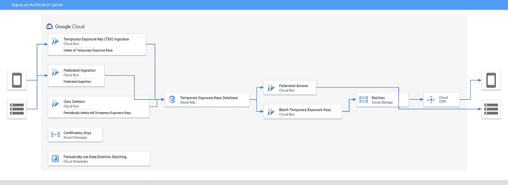

# 看一下开源暴露通知参考服务器

> 原文：<https://medium.com/google-cloud/a-look-at-the-open-source-exposure-notification-reference-server-44fe53f4e8d2?source=collection_archive---------1----------------------->

今年 4 月，谷歌和苹果宣布联合开发应用编程接口，利用蓝牙低能耗(ble)技术帮助减少导致新冠肺炎病毒的传播。作为这一更广泛努力的一部分[多种资源](https://www.google.com/covid19/exposurenotifications/)已被用于协助卫生保健当局迅速采取行动。例如，Google 发布了一个参考 Android 应用程序、使用暴露通知 API 的附加服务条款、加密方法的规范等等。我，[和谷歌](https://github.com/google/exposure-notifications-server/graphs/contributors)的许多其他人一起，一直在创建一个曝光通知服务器的开源参考实现，并想详细说明这是如何工作的。

与 Android 和 iOS 客户端一起工作的参考服务器向实施者展示了如何创作和部署后端，以利用新添加的 BLE 接口与移动应用程序配对。[参考服务器源代码](https://github.com/google/exposure-notifications-server)可在 GitHub 上与 Android 应用程序的现有[参考设计一起获得，两者都在 Apache 2.0 许可下获得许可。](https://github.com/google/exposure-notifications-android)

参考服务器实施由多个组件组成，这些组件一起用于接受、验证和存储来自经验证的移动设备的临时暴露密钥(tek)。它定期生成并签署增量文件，这些文件稍后将由客户端下载，以执行设备上的密钥匹配算法，该算法确定两个设备是否非常接近。服务器组件是无状态的，因此它们可以根据需求独立扩展。

该存储库还包含一组[terra form 配置](https://github.com/google/exposure-notifications-server/blob/master/docs/deploying.md)，以便于部署。虽然我们一直在使用 Google 云服务，但参考服务器通过本机使用 Kubernetes 或与 Anthos 结合使用，被设计为与平台无关，因此它可以部署在任何云提供商或内部基础架构上。

## 服务概述

仔细看一下实现，参考服务器由几个高级组件组成。每个组件都是一个 Google Cloud Run 容器，数据存储在 Google Cloud SQL 上托管的 PostgreSQL 数据库中。为了浏览这些组件，我将按照用户交互来分组，从自愿共享临时暴露密钥(tek)开始。

*曝光通知服务器架构图*

## 临时曝光密钥接受

暴露通知服务器的主要工作是接受来自移动设备的确诊用户的 tek，通过设备证明 API 验证来自移动应用的那些密钥，并将那些密钥存储在数据库中。当手机应用程序的用户接受测试并被告知诊断结果为阳性时，他们可以选择通过应用程序共享他们的暴露密钥。当这完成时，服务器接受用户的 tek 并短时间存储它们，以便其他设备可以下载它们并确认它们是否与这些键进行了交互。

## 生成供移动设备下载的批量密钥

下载 TEKs 的用户数量将超过上传密钥的用户数量。虽然不是每个用户都需要上传 tek，但该应用程序的每个用户都需要接收自愿上传的 tek。由于每个用户都将下载完整的 tek 集，我们可以进一步优化这一流程，以实现更好的规模。

服务器不是频繁地查询数据库，而是周期性地生成供客户端设备下载的增量文件，以执行在移动设备上运行的密钥匹配算法。增量文件必须用私钥进行数字签名，以便可以验证它们是否来自服务器。相应的公钥被单独推送到移动设备以用于该验证。

参考设计使用 CDN 进行公钥分发，并由 blob 存储提供支持，以便更好地扩展。将下载放在 CDN 后面，而不是通过数据库查询来访问，这大大降低了数据库的负载。

## 清理旧的临时曝光密钥和批次

参考服务器的最后一个必要功能是清理陈旧数据。由于该系统的存在有助于通知用户可能暴露于导致新冠肺炎的病毒，因此没有必要长时间维护这些数据。14 天后，钥匙和批次被清理。这有几个目的。

1.  它确保了即使持有的密钥不能被个人识别，服务器也能保存本服务所需的最少量的信息。
2.  它有助于控制数据的总体大小。随着时间的推移，这应该有助于保持查询性能和所需的存储相当一致。

## 附加组件和增强功能

我们使用参考服务器的目标是为卫生当局提供一个起点。虽然参考服务器本身是一个完整的实现，但我们小心地使其易于扩展。事实上，已经存在许多组件的附加提供者。例如，如果您无法使用 Google Cloud services，如 Google Cloud Storage，[会提供 blob 存储接口的附加实现](https://github.com/google/exposure-notifications-server/blob/master/internal/storage/filesystem_storage.go)。

## 验证阳性诊断

当前的暴露通知服务器发布协议不验证请求。为确保请求来自已暴露的个人，应使用验证服务器来证明诊断来自管辖区内的公共卫生机构。虽然我们还没有公布验证测试的参考资料，但可以在 [GitHub 库](https://github.com/google/exposure-notifications-server/blob/master/docs/design/verification_protocol.md)中找到设计和协议。

## 部署秘密管理

虽然 tek 是匿名的，但是仍然需要秘密来操作暴露服务，例如控制数据库访问、提供授权凭证以及管理用于签名下载内容的私钥。

这不是必需的，但强烈建议这样做。默认情况下，我们利用谷歌云秘密管理器。参考服务器包括额外的[秘密管理系统](https://github.com/google/exposure-notifications-server/tree/master/internal/secrets)的实现。

## 联盟

我们投入时间的另外一个组件是联合的概念。很有可能，邻近的卫生保健当局可能希望共享他们从用户那里收集的 tek。

例如，想象一组相邻的州、省或国家，它们之间的旅行很常见。通过共享 TEKs，它让用户更好地理解他们的交互。虽然这在人们不跨越司法管辖区的环境中是不必要的，但至少在某种程度上，这是许多人不旅行所不可避免的。

## 作为一个全球社区走到一起

从来没有像现在这样重要的时刻来作为一个全球社区走到一起。这就是为什么我们将这种保护隐私的服务器实现提供给卫生当局、政府、审计人员和研究人员。在发布这个开源代码的过程中，我们的目标是让开发人员能够利用这个参考实现快速入门，并减缓新冠肺炎的传播。工作仍在进行中，并正在添加更多的功能。随着这项工作的继续发展，您可以[跟踪项目](https://github.com/google/exposure-notifications-server/)并阅读[参考文档](https://google.github.io/exposure-notifications-server)以获取最新信息。

*原载于 2020 年 6 月 10 日*[*https://chriswilcox . dev*](https://chriswilcox.dev/blog/2020/06/10/A-look-at-the-open-source-Exposure-Notification-reference-server.html)