# Apache Atlas 和 Google Data Catalog 的元数据比较

> 原文：<https://medium.com/google-cloud/a-metadata-comparison-between-apache-atlas-and-google-data-catalog-7e1ad391b4c2?source=collection_archive---------0----------------------->

## 了解元数据在两个系统上的结构。

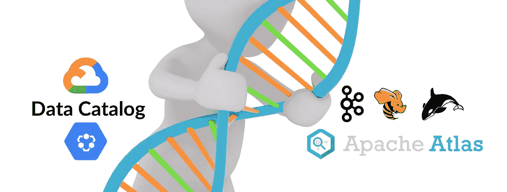

在 [Canva](https://www.canva.com/) 上创建的图像。

> ***声明:所有观点仅代表本人……****。* ***它们来自于参与开发完全可操作的示例连接器的经验，可用在:***[***github***](https://github.com/GoogleCloudPlatform/datacatalog-connectors)***上。***

如果您错过了任何关于如何将元数据摄取到数据目录中的最新帖子，请查看以下内容: [Looker](/google-cloud/google-cloud-data-catalog-and-looker-integration-4ebefdef6a34) 、 [RDBMS](/google-cloud/google-cloud-data-catalog-integrate-your-on-prem-rdbms-metadata-468e0d8220fb) 、 [Tableau](/google-cloud/google-cloud-data-catalog-and-tableau-integration-204c1d17cc62) 、 [Hive](/@mesmacosta/google-cloud-data-catalog-live-sync-your-on-prem-hive-server-metadata-changes-4f5e661626d8) 。

# 一百万美元的问题

数据目录通常由元数据集合定义，并结合了数据管理和搜索工具。这使组织能够快速发现、了解和管理他们的所有数据。

现在是**百万美元问题**。

## 你如何组织你的元数据？

## 谷歌数据目录

将其核心元数据定义为:

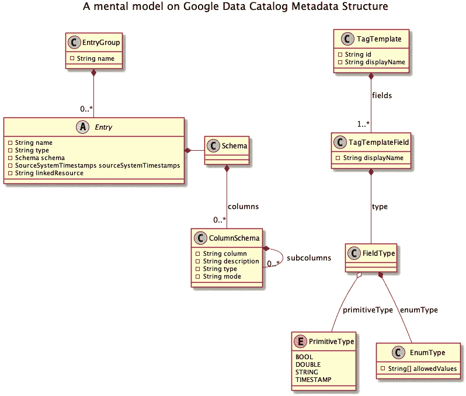

基于[GCP-datacatalog-diagrams](https://github.com/ricardolsmendes/gcp-datacatalog-diagrams)的元数据心智模型

Google 数据目录带有预定义的结构来表示元数据。如果内置属性不够，用户可以使用模板为他们的资产添加额外的属性。

让我们理解图表的每个主要组成部分。

*   **条目组**

条目组将相关条目保存在一起，通过使用[云身份和访问管理](https://cloud.google.com/iam/docs)，我们甚至可以指定可以在该条目组中创建、编辑和查看条目的用户。

值得一提的是，Data Catalog 会自动为大查询条目和发布/订阅主题创建一个条目组。

以一个条目组为例，显示了属于**表**条目组的一些被摄取的条目:

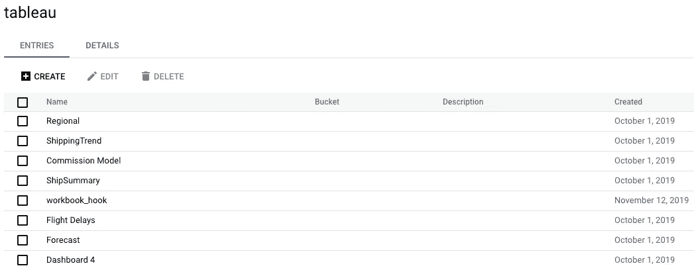

数据目录条目组 UI-显示 Tableau 条目组

> 有关这些的更多详细信息，请查看[表格](/google-cloud/google-cloud-data-catalog-and-tableau-integration-204c1d17cc62)连接器。

*   **条目**

本地数据目录实体代表资产的技术元数据。带有预定义的字段，根据其`type`进行更改。

这意味着一个 *BigQuery 表*的一些字段将与代表 *PubSub 主题*、的字段不同，尽管它们中的大部分是通用的。

它甚至允许用户使用[自定义条目](https://cloud.google.com/data-catalog/docs/how-to/custom-entries)创建自己的条目类型。就像我们在上面看到的 Tableau **、**中的那些。

现在让我们来看看大查询中的一个条目:

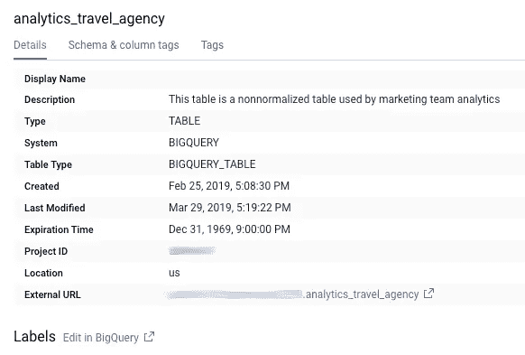

大型查询表

我们将在后面详述**标签**和**模式**标签的用途。

*   **标签模板**

数据目录提供了一个*模板*机制，您可以在其中创建元数据的表示。举一个简单的例子来说明:

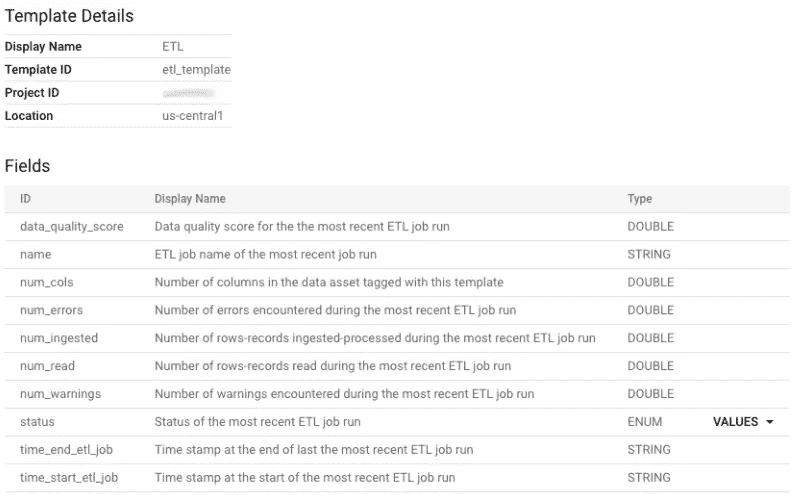

模板示例

这个模板包含了我们在本文开始时谈到的**发现**、**理解**和**管理**流程的有用属性。

我们可以使用它们来对我们的资产进行分类，例如，对所有具有`failed`状态的表进行搜索和故障排除，或者为数据质量分数低于`5`的表的 ETL 管道阻塞作业添加一些自动化。

请和我呆在一起，了解我们稍后如何与他们一起创建`tags`。

咖啡时间

> 在短暂的咖啡休息后，让我们继续讨论 Apache Atlas。

## 阿帕奇地图集

将其核心元数据定义为:

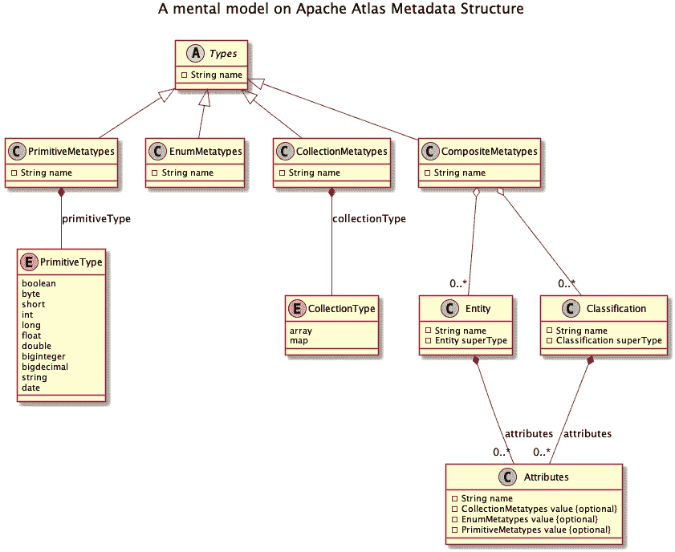

Apache Atlas 元数据心理模型

Atlas 允许用户为他们想要管理的元数据对象定义一个模型。该模型由称为`types`的定义组成。

`type`表示定义元数据对象属性的一个或一组属性。

*—嘿 Marcelo，我们能把一个* `*type*` *和任何一个 Google 数据目录对象进行比较吗？* —对不起！这不是一个公平的比较，如果你看看心理模型，层次是不同的！但是让我们深入挖掘，我们会发现一些相似之处。

> 有两种**复合元类型** : Struct 和 Relationships，这超出了本文的范围。在撰写本文时，Google 数据目录不支持沿袭，所以我们不使用关系。
> 
> 如果你正在使用`struct`类型，我很想知道你的用例，也许可以改进这篇文章。

现在让我们来理解图上的每个主要组件。

*   **原语和枚举元类型**

想想任何编程语言，这些都是最基本的`types`，你可以在创建你的实体和分类属性时使用。

*   **集合元类型**

这就是事情变得有趣的地方，你可以使用由`primitive`和`enum`类型组成的`arrays`和`maps`结构。

假设您在 Atlas 中有一个表，该表肯定会包含一些列。所以在这里，您可以将列表示为一个`array`元类型。

*   **复合元类型**

这里有两个最重要的单元，实体和分类。

*   **实体**

我告诉过你我们会找到相似之处，Atlas 中的实体接近我们所说的 Google 数据目录中的条目。

它们代表资产的技术元数据，区别在于没有预定义的字段。

Gif 来自 [giphy](https://giphy.com/gifs/MCZ39lz83o5lC/links)

> 听起来很可怕，对吧？这给用户带来了很大灵活性，但也带来了复杂性，所以要小心使用。

幸运的是，Atlas 为各种 Hadoop 和非 Hadoop 元数据提供了一些预定义的实体类型，您甚至可以通过运行它们的 [quick_start](https://atlas.apache.org/#/Installation) 来获取样本模型和数据。

此外，实体类型可以从其他类型扩展，称为`superTypes`，因此您可以从祖先那里接收属性。让我们看一个例子:

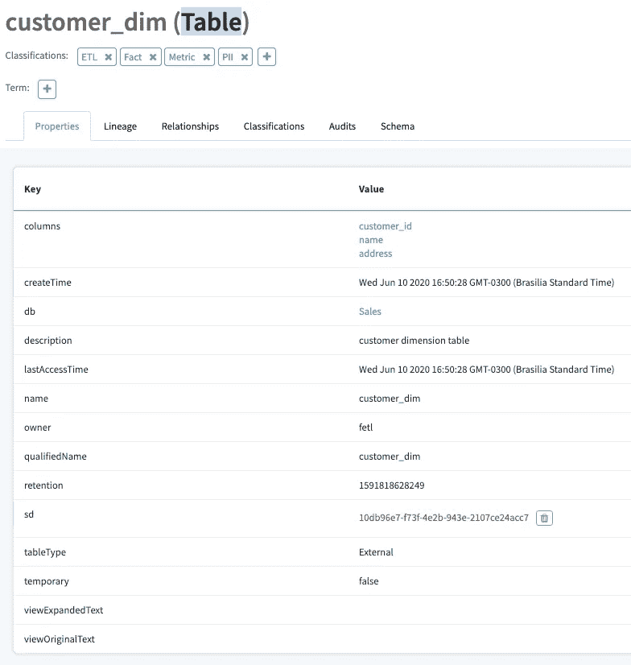

图集表格示例

该图显示了名为`customer_dim`的表实体的属性。

如果我们查看祖表，我们会得到这样的层次结构:**表**->-**数据集**->-**资产**->-**引用**。

以及我们所看到的属性，都是这种层次结构的组合。

请记住，**数据集**是最重要的类型之一——根据 [Atlas 文档](https://atlas.apache.org/1.1.0/TypeSystem.html) : *“数据集应该有一个模式”——*允许我们稍后在其上添加分类。

*   **分类**

你还记得谷歌数据目录模板吗？我们可以说分类和它们真的很像。

就像模板一样，实体可以与分类相关联，从而更容易发现和管理。

作为 Atlas 实体，我们在创建分类时拥有相同的属性和`superTypes`能力。

为了展示 Google 数据目录模板中的分类是如何相似，我们将创建一个名为 ETL 治理的模板。

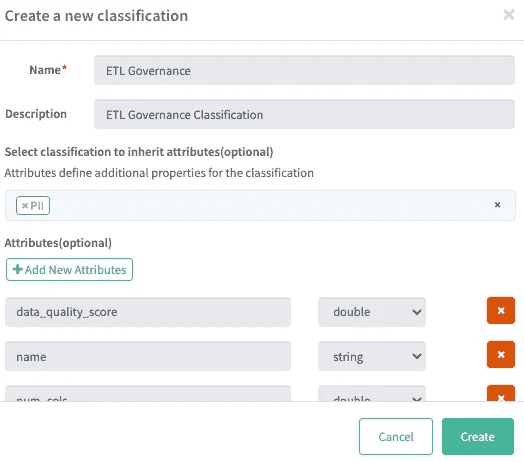

ETL 分类创建

这里的不同之处在于，我们添加了`PII`超类型。

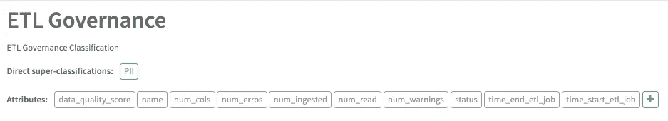

分类已创建

## 分类和标签

我们谈到了分类和模板，但是我们如何应用它们呢？

*   **谷歌数据目录**

Google 数据目录使用标签将模板应用于条目。

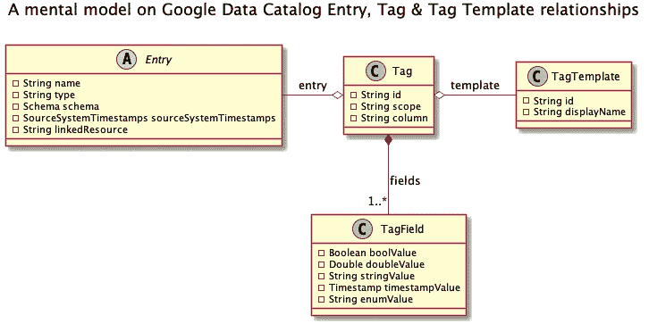

基于[GCP-data catalog-diagrams](https://github.com/ricardolsmendes/gcp-datacatalog-diagrams)的元数据标签心智模型

标签看起来是这样的:

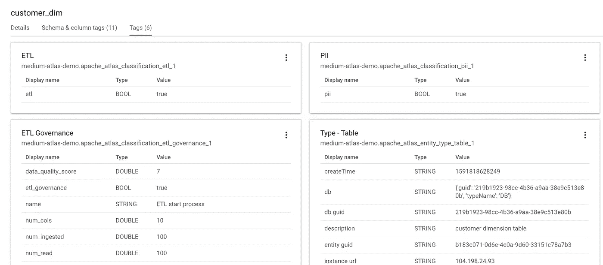

带有一些标签的 Google 数据目录条目

如果你还记得开头的`ETL`例子，让我们用它来搜索:

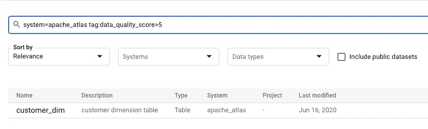

显示返回条目的搜索

因此，使用标签，我们可以获得丰富的搜索功能，从整体上增强我们的元数据管理流程。

接下来，我们将看到相同的特性如何在 Apache Atlas 中工作。

*   **阿帕奇图集**

Apache Atlas 没有创建不同的对象，如标签，它使用相同的分类对象将它们应用于实体。

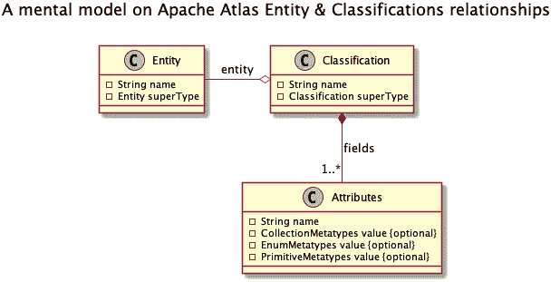

元数据分类心理模型

这是附加到实体的分类的样子:

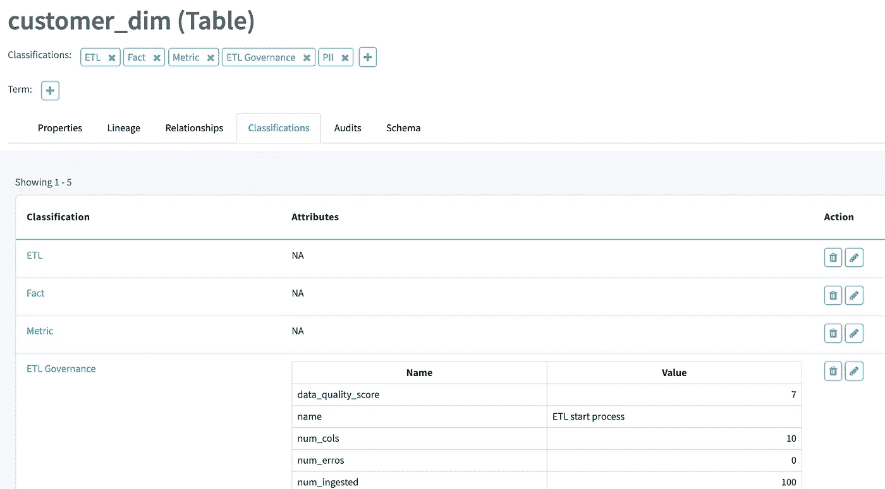

带有一些分类的 Apache Atlas 实体

现在让我们做同样的搜索:

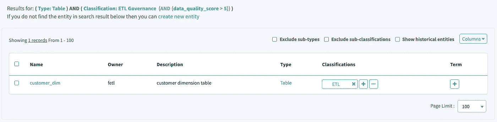

显示返回条目的搜索

太好了！所以说到底，Google 数据目录和 Apache Atlas 的核心功能是相似的。

# 最后的比较

最后，我们将把文章中看到的元数据对象并排放在一起。

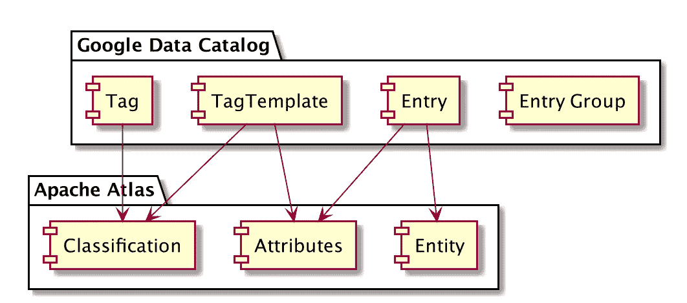

Google 数据目录和 Apache Atlas 比较

*   `Entry Groups`在 Apache Atlas 中没有相关对象。您可以使用[词汇表](https://atlas.apache.org/1.0.0/Glossary.html)，在 Atlas 中对您的资产进行分组，但是它们超出了本文的范围，并且它们有更广泛的用途。
*   `Entries`被映射到`Entities`和`Attributes`的组合。
*   `TagTemplates`被映射到`Classifications`和`Attributes`的组合。
*   `Tags`应用于`Entities`时映射到`Classifications`。

嘿，马塞洛，现在告诉我哪一个是最好的？

不好意思！这不是博客文章，但我可以说的是，谷歌数据目录是一个完全管理和无服务器的产品，其中 Apache Atlas 你必须自己管理。

# 结束语

在本文中，我们比较了 Apache Atlas 和 Google Data Catalog 如何组织它们的元数据。我们可以看到，许多概念是相似的，因为这些都是良好的元数据管理过程的必要条件。

您在 Google Data Catalog 中看到的资产是使用 [Apache Atlas 连接器](https://github.com/GoogleCloudPlatform/datacatalog-connectors-hive/tree/master/google-datacatalog-apache-atlas-connector)摄取的，请继续关注我的下一篇文章，在那里我将展示如何执行连接器进行完全和增量摄取！干杯！

# 参考

*   **谷歌数据目录文档**:【https://cloud.google.com/data-catalog】T4
*   **数据目录连接器 GitHub**:[https://GitHub . com/Google cloud platform/Data Catalog-connectors](https://github.com/GoogleCloudPlatform/datacatalog-connectors)
*   **Apache Atlas 安装指南**:[https://atlas.apache.org/#/Installation](https://atlas.apache.org/#/Installation)
*   **阿帕奇阿特拉斯型系统**:[https://atlas.apache.org/1.1.0/TypeSystem.html](https://atlas.apache.org/1.1.0/TypeSystem.html)
*   **Apache Atlas 连接器:**
    [https://github . com/Google cloud platform/data catalog-connectors-hive/tree/master/Google-data catalog-Apache-Atlas-connector](https://github.com/GoogleCloudPlatform/datacatalog-connectors-hive/tree/master/google-datacatalog-apache-atlas-connector)