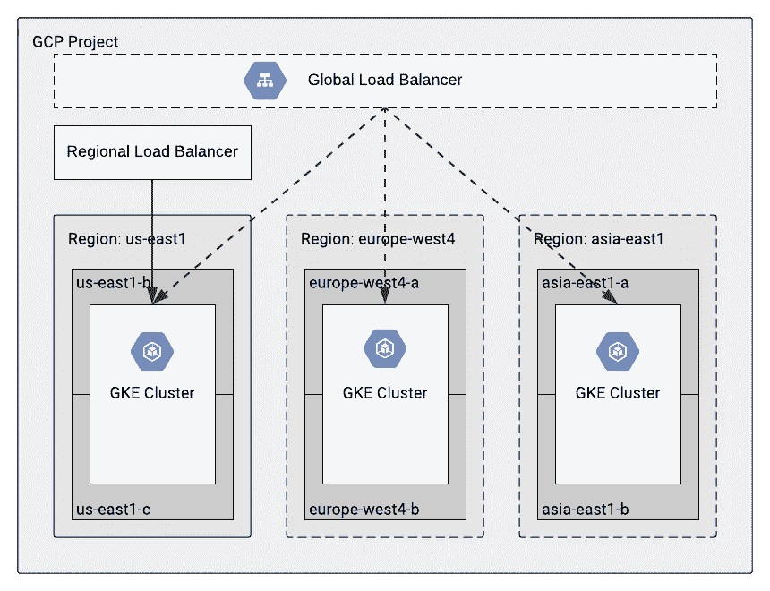
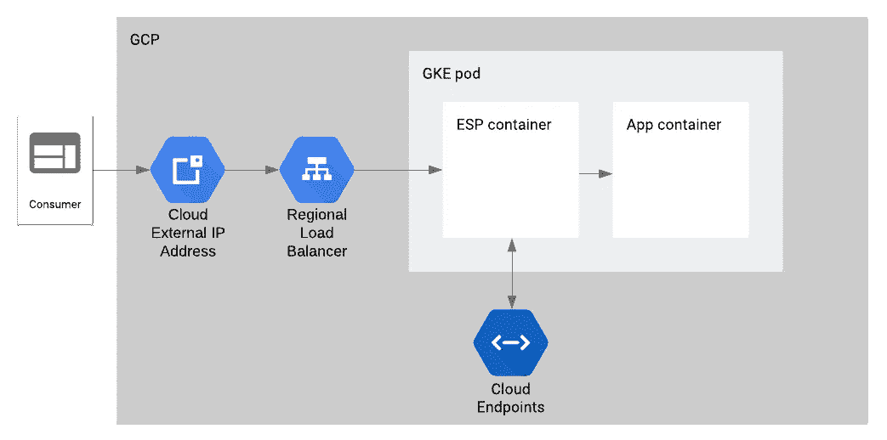
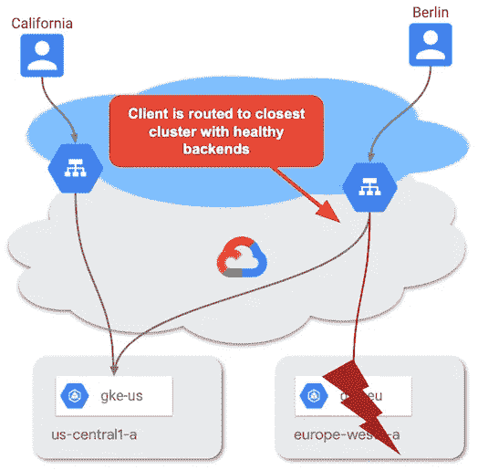
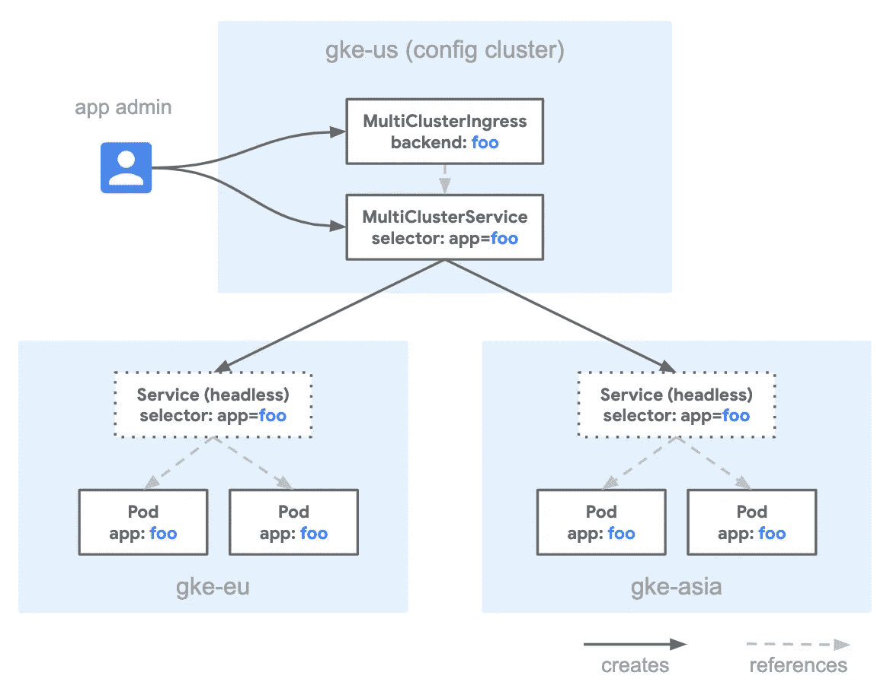
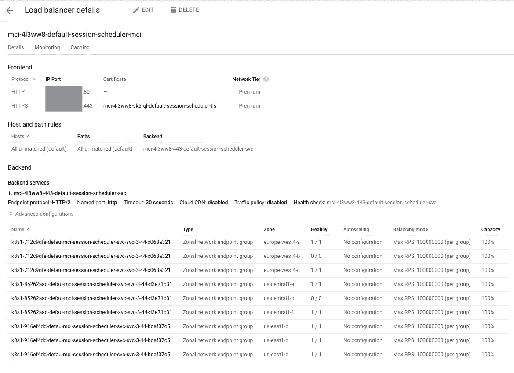

# GKE 上的多集群 gRPC 架构

> 原文：<https://medium.com/google-cloud/a-multi-cluster-grpc-architecture-on-gke-365bbd757df?source=collection_archive---------0----------------------->

这篇文章解释了如何在不同地区的许多 GKE 集群中对 gRPC 应用程序进行负载平衡，以提高性能和可用性。

# 语境

[Kaggle](https://kaggle.com) 的后端团队负责制作 [Kaggle 笔记本](https://www.kaggle.com/kernels)，一个托管数据科学环境，快速可靠。它同时提供几千台笔记本电脑。

在过去的一年中，该团队一直致力于重新设计整个堆栈。目标是让产品以更好的性能和可靠性保持可伸缩性。

新的架构由微服务组成，使用 [gRPC](https://grpc.io/) 作为主要的通信机制。他们部署在谷歌 Kubernetes 引擎上( [GKE](https://cloud.google.com/kubernetes-engine) )。



从一个区域性 GKE 集群(实线)到多集群(虚线)

最初，我们使用单个 GKE 集群，但现在我们扩展到在世界许多地区使用多个集群。这项工作将进一步帮助我们的用户获得更好的性能，并使我们的产品具有更好的可用性。

这篇文章的其余部分解释了我们如何将我们的主 API(调度程序，它根据用户请求调度新的 Kaggle 笔记本)从单个集群转移到多集群。

# 单个集群的设置

我们将从查看为单个集群设置调度器 API 所需的几个组件开始:云端点和健康检查。

## 云端点

[云端点](https://cloud.google.com/endpoints)是一款帮助部署、保护和监控 API 的产品。

我们使用它主要是因为它的认证特性。它还提供监控、日志记录和配额管理，无需额外设置。



云端点和 ESP 容器

从技术上讲，可扩展服务代理( [ESP](https://cloud.google.com/endpoints/docs/openapi/specify-proxy-startup-options) )容器处理传入的请求，并将经过身份验证的请求转发给主应用程序容器。云端点管理 ESP 配置。

让我们将单集群设置的云端点配置放在一边(我们将在多集群设置中回到这一点)，并将重点放在这个 pod 的 Kubernetes 部署配置上。

```
spec:
  containers:
  - name: esp
    image: gcr.io/endpoints-release/endpoints-runtime:1
    args: [
      "--ssl_port=443",
      "--service=SERVICE_NAME.endpoints.PROJECT_ID.cloud.goog",
      "--rollout_strategy=managed",
      "--backend=grpc://127.0.0.1:8091"
    ]
    ports:
    - containerPort: 443
    volumeMounts:
    - mountPath: /etc/nginx/ssl
      name: nginx-ssl
      readOnly: true
  - name: session-scheduler
    image: gcr.io/PROJECT_ID/session-scheduler:ENV
    ports:
    - containerPort: 8091
  volumes:
  - name: nginx-ssl
    secret:
      secretName: nginx-ssl
```

在这个设置中有两个容器:ESP 容器和主应用程序容器。ESP 容器在 [`ssl_port`](https://cloud.google.com/endpoints/docs/openapi/enabling-ssl) 上接受请求，然后将经过身份验证的请求转发给主应用程序容器(`backend`)。该卷包含来自 Kubernetes secret 的 SSL 密钥和证书。

按照本[教程](https://cloud.google.com/endpoints/docs/grpc/get-started-kubernetes-engine)为单个集群在 GKE 上设置 gRPC 的云端点。对于单个区域集群，选择一个 LoadBalancer 类型的[服务。](https://cloud.google.com/kubernetes-engine/docs/how-to/exposing-apps#creating_a_service_of_type_loadbalancer)

## 健康检查

对于单集群设置，在让负载平衡器选择这个 pod 之前，您需要确保应用程序正确地服务于流量。

为了实现这一点，我们首先将 [gRPC 健康检查协议](https://github.com/grpc/grpc/blob/master/doc/health-checking.md)集成到 protobuf 中，并在我们的应用程序中实现它。

其次，我们修改了云端点配置，将 HTTP 代码转换为 gRPC 代码。我们在这里做的关键事情是添加健康 API，使用 [http 规则](https://cloud.google.com/endpoints/docs/grpc-service-config/reference/rpc/google.api#google.api.HttpRule)对该 API 进行代码转换，并允许对健康检查端点进行未注册的调用。

```
type: google.api.Service
config_version: 3
name: SERVICE_NAME
title: Kaggle Session Scheduler
endpoints:
- name: SERVICE_NAME
  target: IP_ADDRESS
apis:
- name: APPLICATION_API
- name: **grpc.health.v1.Health**
usage:
  rules:
  - selector: "*"
    allow_unregistered_calls: false
  - selector: "**grpc.health.v1.Health.Check**"
    allow_unregistered_calls: true
authentication:
  providers:
  - id: customer
    issuer: SERVICE_ACCOUNT
    jwks_uri: [https://www.googleapis.com/robot/v1/metadata/x509/SERVICE_ACCOUNT](https://www.googleapis.com/robot/v1/metadata/x509/SERVICE_ACCOUNT)
  rules:
  - selector: "*"
    requirements:
      - provider_id: customer
  - selector: grpc.health.v1.Health.Check
    allow_without_credential: true
http:
  rules:
  - selector: **grpc.health.v1.Health.Check**
    get: **/v1/health**
```

最后，我们为 ESP 容器配置了就绪性和活性探测器。为此打开了`http_port`。

```
spec:
  containers:
  - name: esp
    image: gcr.io/endpoints-release/endpoints-runtime:1
    args: [
      "--ssl_port=443",
      "**--http_port=9000**",
      "--service=SERVICE_NAME.endpoints.PROJECT_ID.cloud.goog",
      "--rollout_strategy=managed",
      "--backend=grpc://127.0.0.1:8091"
    ]
    ports:
    - containerPort: 443
    **- containerPort: 9000
    livenessProbe:
      httpGet:
        path: /v1/health
        port: 9000
    readinessProbe:
      httpGet:
        path: /v1/health
        port: 9000**
    volumeMounts:
    - mountPath: /etc/nginx/ssl
      name: nginx-ssl
      readOnly: true
```

使用这种配置，探测器不仅检查 ESP 容器是否在为流量提供服务，还检查应用程序容器是否在响应。

注意，探测器还应该检查`SERVING`状态，或者确保健康检查端点以错误状态响应。

# 多个集群的设置

让我们来看看这篇文章的本质:在许多集群上部署这个应用程序。



集群故障转移

这将改善:

*   可用性:通过增加总有一个集群/ GCP 区域能够满足请求的概率
*   性能:通过更接近消费者的服务请求

## Anthos 的入口

谷歌云最近发布了用于 Anthos (测试版)的“[入口”，这是一个用于 GKE 集群的云托管多集群入口控制器。这为我们提供了一个单一的 HTTP 负载平衡器，其中不同区域的多个 GKE 集群作为 LB 后端。这一切都是通过部署和管理 GCP 负载平衡器的 MultiClusterIngress 和 MultiClusterService 资源来控制的。](https://cloud.google.com/kubernetes-engine/docs/how-to/ingress-for-anthos)

团队从设置和注册集群开始，然后在入口配置集群中启用 API。配置集群是在全球范围内部署入口构造的集中位置。



配置群集、多群集回归和多群集服务

第一个构造是 **MultiClusterIngress** ，它定义了要使用的协议终止和全局 IP 地址。

```
apiVersion: networking.gke.io/v1beta1
kind: MultiClusterIngress
metadata:
  name: session-scheduler-mci
  annotations:
    networking.gke.io/static-ip: GLOBAL_IP_ADDRESS
spec:
  template:
    spec:
      backend:
        serviceName: session-scheduler-svc
        servicePort: 443
      tls:
      - secretName: session-scheduler-tls
```

**MultiClusterService** 定义了要在 Kubernetes 集群中创建的服务。重要的部分是:`HTTP2`应用协议和后端配置的定义。目标端口是电潜泵容器的`ssl_port`。

```
apiVersion: networking.gke.io/v1beta1
kind: MultiClusterService
metadata:
  name: session-scheduler-svc
  annotations:
    beta.cloud.google.com/backend-config: '{"ports": {"ssl":"session-scheduler-svc-backend"}}'
    networking.gke.io/app-protocols: '{"ssl":"HTTP2"}'
spec:
  template:
    spec:
      selector:
        app: session-scheduler
      ports:
      - name: ssl
        protocol: TCP
        port: 443
        targetPort: 443
```

**BackendConfig** 用于定义健康检查端点。注意，我们使用 ESP 容器的`HTTPS`端点，它同时服务于 gRPC 和转换后的 HTTP 健康端点。

```
apiVersion: cloud.google.com/v1beta1
kind: BackendConfig
metadata:
  name: session-scheduler-svc-backend
spec:
  healthCheck:
    requestPath: /v1/health
    type: HTTPS
```

在黄金集群中应用这两个构造之后，[检查状态](https://cloud.google.com/kubernetes-engine/docs/how-to/ingress-for-anthos#verifying_status)，直到创建了负载平衡器。



负载平衡器状态

# 结论

在应用程序的早期阶段，在特定区域使用单个 GKE 集群可能就足够了。但是当您需要提高服务的性能和/或可用性时，您应该考虑扩展到许多集群和区域。

在您弄清楚 gRPC 的健康检查策略后，Anthos 产品的 Ingress 使这一步变得非常简单。诀窍是使用 ESP 容器的`ssl_port`。