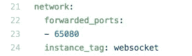
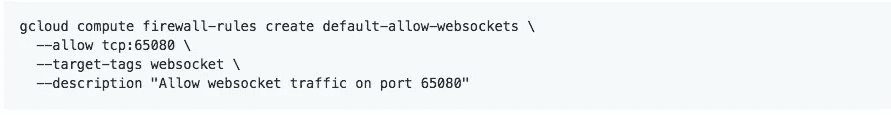

# 一个节点。Google App Engine 上的 JS Websocket 服务器

> 原文：<https://medium.com/google-cloud/a-node-js-websocket-server-on-google-app-engine-c6c32a486e9a?source=collection_archive---------0----------------------->

最近我实现了一个 websocket 服务器来演示一些 iOS 特性。该服务器最初在我的本地端运行良好。经过一些测试后，我决定将 websocket 服务器迁移到 google 云平台，以获取公共 ip 用于演示目的。

这是我第一次使用应用引擎，它真的花了我很多时间。

以下是将 web 套接字部署到 GAE 的一些简单步骤。

首先，注册谷歌云平台，现在它提供 300 次免费试用来测试它的云服务。

注册后，点击 App Engine，一步一步运行官方快速入门教程。

好的。现在，我们能够将 node.js 项目部署到 App Engine。

然后，从以下位置克隆一个 websocket 示例:

[https://github . com/Google cloud platform/nodejs-docs-samples/tree/master/app engine/web sockets](https://github.com/GoogleCloudPlatform/nodejs-docs-samples/tree/master/appengine/websockets)

这是谷歌的一个例子。它展示了如何在 app engine 上实现 websocket。

所以，我们在 gcloud 控制台中克隆项目并部署，一切都会好的？

不。我们需要一些修改。

首先修改 app.yaml:

> #vm:对
> 
> 环境:伸缩

并且请注意这个文件的结尾:

这部分很重要。

然后，通过 README 中列出的命令为您的防火墙启用端口 65080

在此之后，只需部署到应用程序引擎，一切都会很好。

部署后，我们将获得如下 URL:

[https://{项目](https://{project)名称}.appspot.com

> **将 https 替换为 http** ，因为 App Engine 上的 websocket 现在不支持安全模式。

然后，启动以 ***http*** ://开头的新网址，现在就试试 websocket 吧！

## 注意:在我的测试中，App Engine 预览模式不适用于 websocket。