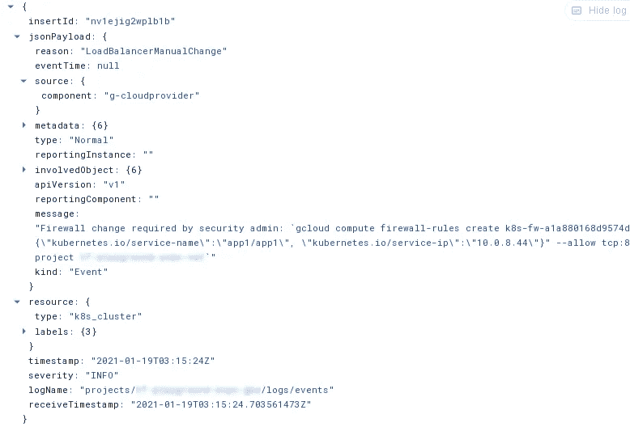
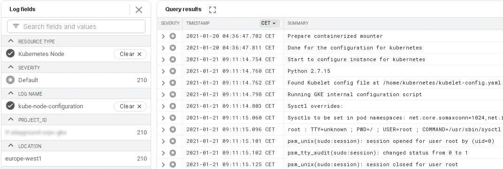
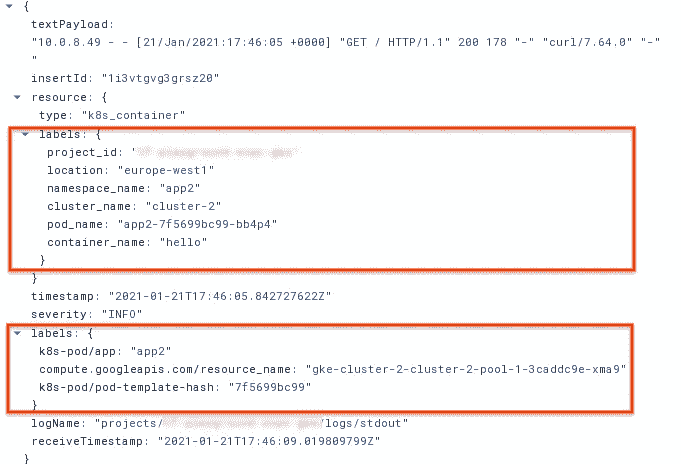
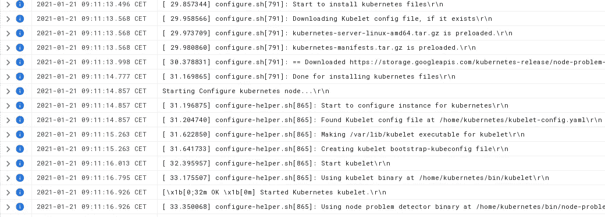

# GKE 原木快速入门

> 原文：<https://medium.com/google-cloud/a-quick-gke-logs-primer-a978f60daa7?source=collection_archive---------0----------------------->

使用 GKE 时，一个不可避免的话题是如何利用其与谷歌云运营的整合。这是一个重要的话题，不仅对于计划将多租户集群及其安装到 GCP 基金会的客户来说如此，对于排除单个集群或部署的故障来说也是如此。

一旦对不同类型的日志和资源有了清晰的了解，将 GKE 日志记录的范围缩小到表面审计、安全和健康信号并不像看起来那么难。这篇文章将为您提供一个快速入门，希望足以让您开始并消除处理 GKE 日志的最初痛苦。

开始之前有一点需要注意:讨论登录 GKE 的不同选项超出了本文的范围，我们假设您的集群已经启用了[登录到云操作](https://cloud.google.com/stackdriver/docs/solutions/gke/installing)(这是新集群的默认设置)。

# 日志名称和资源

在处理实际的日志之前，让我们快速回顾一下我们将在[日志查询](https://cloud.google.com/logging/docs/view/advanced-queries)中用来隔离特定信息的两个关键字段。

我最喜欢的领域是`[logName](https://cloud.google.com/logging/docs/reference/v2/rest/v2/LogEntry#FIELDS.log_name)`，尤其是在处理一般级别的日志时(例如，当设置组织接收器时，或者像我们在这里所做的那样，计算出什么信息最终在哪里)。该字段是唯一的句柄，用于标识特定日志流的“资源名称”,并允许您清晰、快速地隔离属于单一日志类型(审核、实例日志等)的记录组。).

另一个非常有用的字段当然是`resource`，特别是`[resource.type](https://cloud.google.com/logging/docs/reference/v2/rest/v2/MonitoredResource#FIELDS.type)`属性，它允许过滤特定 GCP 资源(集群、实例等)发出的记录。).

我们将在查询中使用一些其他字段，当然，GKE 日志记录代理还包括日志记录中的资源和 Kubernetes 元数据，这些元数据可以在过滤器中使用，但是基本的内容已经完成，让我们开始查看实际的日志。

## 活动日志

最重要的当然是[审计日志家族](https://cloud.google.com/logging/docs/audit)中的活动日志，它不能被禁用，并跟踪所有改变资源状态的操作。这是第一个(通常也是唯一一个)导出到本地系统或出于存档目的而存储的日志，因为它跟踪了谁(哪个身份)何时在哪个资源上做了什么(创建、修改或删除)。

活动日志通常通过特定项目的`logName`过滤器进行查询:

```
logName="projects/myprj/logs/cloudaudit.googleapis.com%2Factivity"
```

或者通过`[log_id](https://cloud.google.com/logging/docs/view/advanced-queries#log_id)`功能:

```
log_id("cloudaudit.googleapis.com/activity")
```

对于 GKE，活动日志包含两个独立的信息流

*   在 GCP 集群资源上完成的操作(创建集群等。)
*   在集群“内部”的 Kubernetes 对象上完成的操作

第一个信息流是所有其他 GCP 资源共有的，而第二个信息流是 GKE 特有的，通过利用 [Kubernetes 审计政策](https://cloud.google.com/kubernetes-engine/docs/concepts/audit-policy)来实现。简单地说，集群中修改 Kubernetes 对象的任何操作都会在活动日志中产生一个日志条目，而读取操作会被记录到数据访问日志中，但前提是它在项目级别被特别启用。

这在实践中意味着，考虑到 Kubernetes 集群的非常动态的性质，其中控制器不断地操纵对象，一旦您开始使用 GKE，您的超级重要的活动日志的大小至少会膨胀一个数量级，这对日志导出(特别是在本地系统是目标的情况下)和分析有明显的影响。

这里是`resource.type`字段发挥作用的地方，它允许我们将活动日志分成两个独立的流:

*   GCP 资源视图，过滤`gke_cluster`资源类型，以及
*   Kubernetes 视图，过滤`k8s_cluster`资源类型

例如，如果您只想在审核日志导出中包括群集资源级别的事件，而排除群集内部的审核事件，则可以使用此筛选器:

```
log_id("cloudaudit.googleapis.com/activity")
resource.type != "k8s_cluster"
```

为了隔离与 Kubernetes 对象相关的集群内部审计事件，匹配的过滤器当然是:

```
log_id("cloudaudit.googleapis.com/activity")
resource.type="k8s_cluster"
```

这种区别非常重要，我经常看到客户实现它，因为它允许您限制审计导出的大小，并确保它只包含资源级事件，同时仍然能够为特定于 Kubernetes 的审计事件运行并行查询或接收器。

对于 Kubernetes 审计事件，还需要考虑一点:上面的过滤器选择所有修改集群对象的**操作，包括由系统组件进行的操作。如果这不是您想要的(并且通常没有给出它们的详细程度)，可以在执行操作的身份上添加一个额外的过滤器，以便只包括用户或机器身份:**

```
log_id("cloudaudit.googleapis.com/activity")
resource.type="k8s_cluster"
NOT protoPayload.authenticationInfo.principalEmail: "system"
```

最后一个有用的过滤器允许选择导致身份验证失败的操作:

```
log_id("cloudaudit.googleapis.com/activity")
resource.type="k8s_cluster"
protoPayload.authenticationInfo.principalEmail="system:anonymous"
```

我们对 GKE 活动日志的概述到此结束。如果您需要更多的粒度来显示审计日志中的特定事件，我们的文档中使用日志浏览器 页面的 [*访问审计日志*](https://cloud.google.com/kubernetes-engine/docs/how-to/audit-logging#example_filters_for_your_admin_activity_log) 和 [*示例查询有几个查询示例。现在让我们来看看更具体的 GKE 日志。*](https://cloud.google.com/logging/docs/view/query-library-preview#kubernetes-filters)

# 事件日志

您可能知道，*“Kubernetes 事件是提供集群内部正在发生的事情的洞察力的对象，例如调度程序做出了什么决定，或者为什么一些 pods 被逐出节点”*。事件是了解集群内部发生的事情的重要方式，因此毫不奇怪，云操作为它们提供了特定的日志类型，并在 Kubernetes OSS 文档中有一个[专用页面(引用了上面的引文)。](https://kubernetes.io/docs/tasks/debug-application-cluster/events-stackdriver/)

该过滤器允许隔离 GKE 事件:

```
logName="projects/myprj/logs/events
```

或者更简单地说:

```
log_id("events")
```

该日志的用途与通过`kubectl`使用 Kubernetes events 几乎相同，并具有云操作提供的额外优势:更大的保留策略、通过 Logs Explorer 的可搜索性/聚合性、导出自定义事件指标(并可能设置警报)的能力等。

一些事件特定于 GKE，并通知管理员潜在的配置问题。例如，当 GKE 服务代理无法为新的负载平衡器创建防火墙规则时(这在严格控制的共享 VPC 设置中很常见)，会创建一个事件并将相应的警告记录到事件日志中，以便管理员可以运行等效的命令。这是一个例子:



# 节点日志

运行在 GKE 节点上的服务(kubelet，[节点问题检测器](https://cloud.google.com/container-optimized-os/docs/how-to/monitoring)，容器运行时等)。)发出它们自己的日志，这些日志被捕获并存储，每个日志都有一个对应于组件名的单独的日志名，并且都使用相同的资源类型`k8s_node`。

您可以查看资源上的聚合节点组件日志过滤:

```
resource.type="k8s_node"
```

或者在他们的`logName`上过滤单个日志:

```
log_id("kubelet")
```

当然，您可以组合不同的过滤器，通过实例 id、标签等来缩小特定节点的范围。这是查看`kube-node-configurator`日志的一个例子:



# 集装箱日志

容器`stdout`和`stderr`流被捕获到两个独立的日志中，资源类型为`k8s_container`:

```
log_id("stdout")
```

和

```
log_id("stderr")
```

每个日志记录中的 Resource 和 Kubernetes 标签允许轻松地深入到特定的名称空间、应用程序、容器等。stdout 日志记录如下所示:



# 实例日志

除非遇到配置问题，否则这可能不是非常重要，但这里仍然值得一提的是[串行控制台日志](https://cloud.google.com/compute/docs/instances/viewing-serial-port-output)，其中 GKE 节点像任何其他计算引擎虚拟机一样存储串行控制台输出(当然，除非您明确禁用了它)。

它的过滤器是:

```
log_id("serialconsole.googleapis.com/serial_port_1_output")
```

如果需要隔离特定节点的日志，当然可以使用它的实例 id:

```
log_id("serialconsole.googleapis.com/serial_port_1_output")
resource.labels.instance_id="2139255898313623576"
```

该日志中特定于 GKE 的信息与 Kubelet 引导进程相关，它有助于缩小与 IAM 或服务帐户配置错误相关的问题，这些问题有时会导致节点无法在集群中注册。希望这不是您每天都需要做的事情，但是当您这样做时，类似于下图所示的查询可能会为您指出正确的方向:



另一个值得指出的与实例相关的日志是 [Linux 审计日志](https://cloud.google.com/kubernetes-engine/docs/how-to/linux-auditd-logging)，它可以在基于容器优化操作系统的节点上被可选地启用。

我们只触及了 GKE 日志的表面，但希望这能让您快速了解从哪里入手，理解您的集群行为。