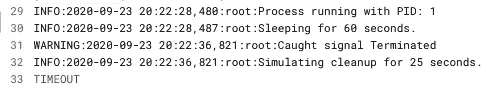
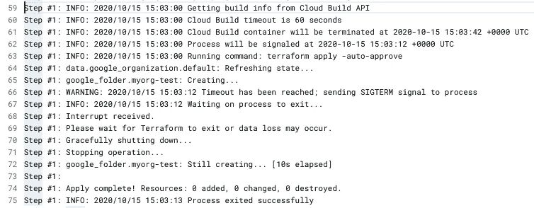

# 谷歌云构建中的平台安全网

> 原文：<https://medium.com/google-cloud/a-safety-net-for-terraform-in-google-cloud-build-1ca10259b344?source=collection_archive---------0----------------------->

您是否曾经不得不从持续集成系统(如 [Google Cloud Build](https://cloud.google.com/cloud-build) )中运行 Terraform 来手动修复您的基础架构部署？

如果是这样，你知道这并不有趣——这只是一堆苦差事。

Terraform 是一个有状态的应用程序——也就是说，它在一个被 Terraform 称为[状态](https://www.terraform.io/docs/state/index.html)文件的文件中保存了它在整个生命周期中管理的资源的记录，该文件被保存到一个[后端](https://www.terraform.io/docs/backends/index.html)。为了防止多个并发的 Terraform 部署相互冲突，它使用了一个[锁](https://www.terraform.io/docs/state/locking.html)来确保一次只能运行一个 Terraform 部署。这实现了部署之间的一致性，防止了竞争情况，并确保 Terraform 创建的资源在其整个生命周期中继续由 it 管理，正如您(可能)所希望的那样。

但是，如果 Terraform 在更新其状态文件并释放锁之前被终止，会发生什么呢？

这就是我所说的辛苦——这就是你来的原因。

通常，需要用`terraform force-unlock`命令手动解除锁定，然后重新运行`terraform apply`。在最后一次失败运行期间创建的资源可能会被孤立，因为它们可能没有被写入状态文件，并且在这种情况下，仍然不受 Terraform 的管理。

由于各种原因，我经历过无数次这样的经历，我相信许多其他 Terraform 用户也有过这样的经历。我已经通过小心不要强制退出或意外终止 Terraform 中期部署来降低风险。最近，一位客户在从 Google Cloud Build 运行部署时遇到了这种情况:他们的构建超时，孤立了资源，锁定了状态，并导致他们跳入手动纠正问题。我能理解他们的沮丧。感觉我们可以做得更好。虽然这可能可以通过延长构建超时来解决，但我认为这种情况需要一种更微妙的方法。

由于各种原因，在 Terraform 部署过程中可能会出现构建超时，但一个常见且完全合理的解释是云提供商的控制平面出现了某种减速。有时，由于各种原因，操作时间比您预期的要长，而部署可能只持续几分钟，但运行时间可能是预期的数倍。有很多合理的理由来限制您的构建时间——比如对开发人员的快速反馈，或者开发团队的迭代部署——并且理想情况下，您希望您的构建超时能够适应更短(但仍然合理)的部署长度。

为了解决 Google Cloud Build 中的这个具体问题，我写了一个 [Google Cloud Build 命令包装器](https://github.com/angstwad/google-cloud-build-command-wrapper)，并在 GitHub 上开源了它。如果你有兴趣了解更多，继续阅读；否则，跳到 GitHub repo，阅读文档，然后开始！

# Google 云构建超时

为了编写命令包装器，我需要理解当构建超时时 Google Cloud Build 的行为。我编写了一个快速的 [Python 脚本](https://gist.github.com/angstwad/1ad43131231ee0cb928ccde11604f9d0)来模拟一个长时间运行的命令，捕捉每个有效信号，并将其记录到控制台。为了模拟 Terraform 在捕捉到类似`SIGTERM`的信号时的行为，该脚本还运行了一个模拟清理操作。

运行这个程序时，我发现云构建作业被发送了一个`SIGTERM`,正如人们合理预期的那样，触发了模拟清理阶段。不幸的是，不久之后，容器被强制终止。

这对 Terraform 来说是个坏消息，也是为什么命令包装器是必要的。

运行信号捕捉器的云构建。清理开始了，但是容器几乎立即被强制终止。

# 请看命令包装器

该实用程序旨在成为仅在云构建步骤中运行的非交互式命令的精简包装器。它只需要一些信息:构建 ID 和项目 ID。它访问云构建 API 来描述当前的构建，检查您的超时值、构建开始时间，并启动一个计时器，该计时器在预计强制终止构建的指定时间*之前触发。当计时器触发时，它会向包装的进程发送一个信号。默认情况下，这个信号是`SIGTERM`。*

当 Terraform 收到这个信号时，它会停止创建新的资源。正在进行的操作被允许完成，但是 Terraform 转移了它的焦点，优雅地终止正在运行的部署以更新它的状态并释放状态锁。

它没有解决核心问题——超时才是真正的问题——但是它确实给了你一个安全网，可以说，减轻了强制终止的全部后果。

Terraform 优雅地终止了 Google Cloud Build 的中期部署

# 最后的想法

虽然将构建超时延长到一个合理的长度仍然是一个好的做法，但命令包装器提供了一个额外的保护层，以确保构建步骤有足够的时间来优雅地退出、保持状态、释放锁，并以最少的工作量再次运行，并且在理想情况下，为工程师节省一点时间来完成更重要的工作。