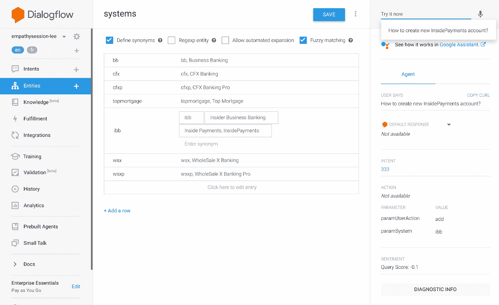

# 从 Dialogflow 聊天机器人中的无头 CMS 获取数据的简单解决方案

> 原文：<https://medium.com/google-cloud/a-simple-solution-for-fetching-data-from-a-headless-cms-in-a-dialogflow-chatbot-6edfa7c5e4c7?source=collection_archive---------0----------------------->

经常有人问我，为什么 Dialogflow 没有 CMS？因此，非技术人员可以修改 webhook 实现答案，而不必训练模型或使用 Dialogflow 控制台。问题是，Dialogflow 可以与您喜欢的任何内容集成。

在[我的 Dialogflow，Django，Angular 示例](https://github.com/savelee/kube-django-ng/)中，我使用 Django 作为 CMS 来导入用户帐户。事实上，我正在使用 Django Rest 模块，通过 Rest API 与 Django 通信。

在本教程中，我将利用一个无头的 CMS[神智清醒](https://www.sanity.io/)。

你可以使用任何 CMS，甚至是 Wordpress，但是如果有(现成的)REST APIs 可以使用，事情会变得更简单。这是一个无头 CMS 可以做得很好的。它将内容从网页中分离出来，以便在各种环境中重用，如移动应用程序或聊天机器人。

# **对话流**

为了准备包含动态内容的 Dialogflow，让我们创建一些实体和意图。

此示例创建了一个多语言帮助台聊天机器人。在 Dialogflow 设置面板中，我启用了以下两种语言:**英语**和**法语**。

在实体屏幕中，我创建了两个实体:**系统**和**用户操作**。

**Systems** 保存了一串计算机系统名称，它们都映射到一个键。例如 **InsidePayments** 属于实体**系统**中的 **ibb** 键。



对话流实体

实体 **useractions** 包含用户操作，如**删除、添加、编辑**。

对于我的 CMS 中的每个内容项目，我需要创建一个训练短语的意图。这里有一个意向名称的例子: **333** 。它有一堆训练短语，比如:

**“如何在 TopMortgage 中编辑新账户”。**

这个意图包含 2 个必需的参数，需要填充这些参数，以便过滤 CMS 内容项。**参数用户操作** & **参数系统**。


带有必需参数的对话流意图

您需要确保所有需要从 CMS 获取信息的意图都启用了 **webhook 实现**:


对话流部分到此结束。现在让我们转向理智。

# 头脑清楚

我正在我的本地主机上安装 Sanity，因为我将只使用 Sanity Studio 来编写内容项。如果您想向您的(非技术)客户交付这个环境，您可以在计算引擎 Node.js VM 上安装 Sanity。

1.  安装健全性

```
sudo npm install -g @sanity/clisanity init
```

使用 Google 帐户、Github 或您自己的电子邮件帐户登录。单击命令行上显示的链接，并接受条款和条件:


2.回到命令行:

**提供项目名称**:聊天机器人 CMS

**默认数据集配置** : Y

**输出路径** : /home/admin/chatbotcms

**模式**:无

**添加样品**:否

3.让我们修改健全模式:

```
cd /home/admin/chatbotcms/schemasnano schema.js
```

粘贴并保存以下内容:

Schema.js

```
nano simpleresponse.js
```

粘贴并保存以下内容:

简单响应. js

4.开始理智

```
cd chatbotcmssanity start
```

5.导航到 [http://localhost:3333](http://localhost:3333)

点击**意向> +**

添加内容页面:

这里，坚持对话流映射很重要。

*   注意意图名称(id)与对话流中的意图名称 **333** 相同！
*   系统名(paramSystem)映射到**系统**中的对话流实体键 **ibb**
*   用户动作(paramUserAction)映射到对话框流实体键**在**用户动作**中添加**

对于其余的这一项需要有一个可读的标题，将在理智可见。和 2 个聊天机器人响应。一份英文，一份法文:


您可以创建多个内容项目。对于每个用户操作和系统组合，都有自己的项目。

现在让我们查询我们的数据:

6.点击健全菜单中的**视觉**

使用下面的 [GROQ](https://www.sanity.io/docs/groq) 查询来获取所有简单的响应项:

```
*[_type == ‘simpleresponse’]
```


使用以下查询来过滤特定 intent name (id)和参数**param system**&**param user action**上的项目。作为输出，我们只显示英语语言的响应:

```
*[_type == ‘simpleresponse’ &&id == $id&& paramUserAction == $paramUserAction&& paramSystem == $paramSystem]{responseEn}
```

参数:

```
{“id”: “333”,“paramUserAction”: “add”,“paramSystem”: “ibb”}
```

注意结果:


好了，内容已经呈现了。我们可以通过 **GROQ** 查询来过滤内容。剩下唯一要做的就是在 Dialogflow 中实现 webhook fulfillment 代码，它可以运行这个查询，但是通过 slot filling 使用 Dialogflow 提供的参数。

# **对话流**

在 Dialogflow 行内编辑器中，我们可以使用以下代码:

使用下面的 **package.json** :

package.json

以及下面的 **index.js** :

索引. js

这段代码实现了健全的 NPM 客户端。您需要指定 Sanity 项目 ID 和数据集名称。(如果您丢失了这些，可以在 Sanity 安装文件夹 **sanity.json** 中找到)。这样它就知道查询属于您的项目的内容项。

Sanity 客户端方法: **client.fetch()** 使用 Dialogflow 代理提供的参数获取 GROQ 查询。

在 Firebase Cloud 函数中，它实现了 Dialogflow 代理，并从 Dialogflow 代理中检索参数和代理区域设置。正确的意图将由这些代码行来匹配:

```
let intentMap = new Map();intentMap.set(‘333’, responses);agent.handleRequest(intentMap);
```

需要记住的唯一重要的事情是，这些行需要在 **client.fetch** 的解析承诺内，否则您可能会遇到时间问题，因此 Dialogflow 返回匹配的意图，而没有 CMS 结果。

现在，您可以在 Dialogflow 控制台中测试您的表达式:


基于代理的语言环境，它将从 headless Sanity CMS 内部的数据中返回选择的语言项。

好了，这里有一个简单的解决方案，可以从 Dialogflow 聊天机器人中的 headless CMS (Sanity)获取数据！