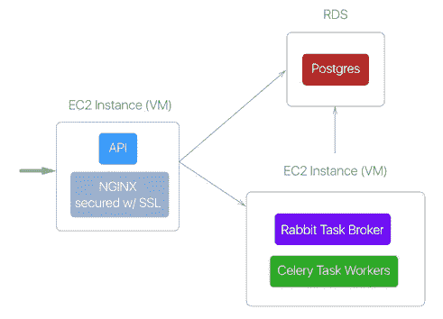
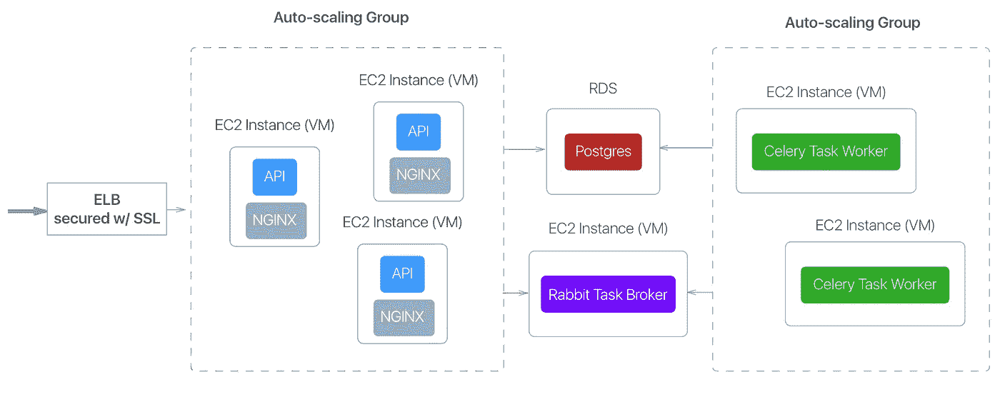
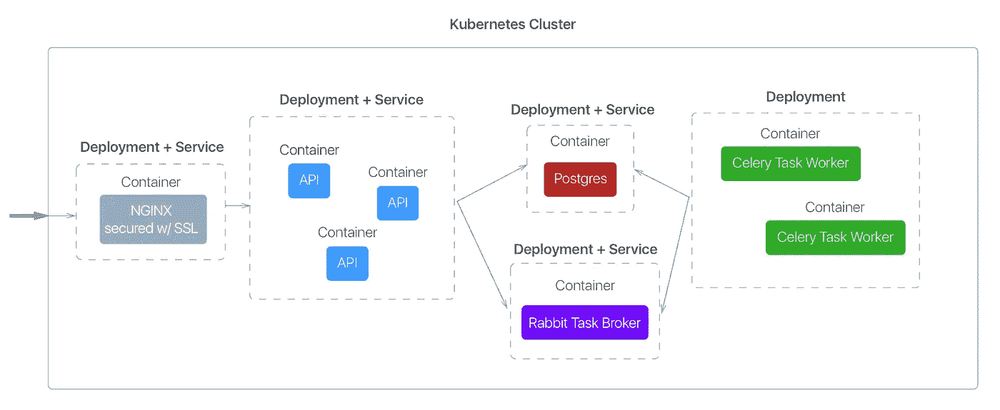

# 基础设施容器化生存指南—第 1 部分:为什么要转换？

> 原文：<https://medium.com/google-cloud/a-survival-guide-for-containerizing-your-infrastructure-part-1-why-switch-8e8dee9fc66?source=collection_archive---------0----------------------->

阅读:我们如何通过仅用 7 天时间从亚马逊网络服务(AWS)切换到谷歌云平台(GCP)上的 Docker 容器，将服务器成本削减了 75%，并极大地简化了我们的持续集成和部署(CI/CD)。

*为什么你会想读这篇文章:*

1.  您希望确信您的基础设施使用/切换到 Docker/Kubernetes 的优点。
2.  您希望在 AWS 或 Heroku 账单上省钱(我们将 AWS 账单削减了 75%！)
3.  您即将开始从 AWS 过渡到 GCP，或者正在开始一个新项目，并希望在这个过程中节省一些时间和头痛。

怀疑？你应该害怕！一开始我也是…

> 声明:我绝不是 devops 专家。以下是我作为一名全栈开发人员一头扎进新领域的经历，特别是 Docker、Kubernetes 和 GCP 的谷歌容器引擎(GKE)。我写这篇文章的主要原因是为了展示这些新工具是多么容易使用，以及我能够多快地迁移我们的生产架构。我欢迎任何更正、编辑和建议！

# 为什么要集装箱化？

微服务风靡一时(至少今年如此)，容器在使其可行方面发挥了重要作用。阅读微服务的[优点](http://martinfowler.com/articles/microservices.html)和[缺点](http://martinfowler.com/articles/microservice-trade-offs.html)，或者如果你是这个话题的新手，听听[这个伟大的 a16z 播客](http://a16z.com/2016/09/01/microservices/)。但是，即使您不想将您的整体应用程序分解成微服务，为您的应用程序的主要架构组件(您的 API、前端 web 应用程序、异步任务工作器、缓存等)利用容器仍然可以提供一些大的优势。那么到底什么是容器呢？

> 容器(n):一个密封的软件包，可以快速启动，以标准化的方式运行，本质上是无状态的。

容器易于分发，因为它们封装了所有的依赖项，并且可以快速启动/关闭。与虚拟机不同，它们实际上不是完整的操作系统(事实上，多个容器可以在同一个操作系统上运行)。他们避免**网络** **冲突**因为每个容器都有自己的 IP 地址，他们避免**版本** **冲突**因为每个容器只打包*它需要的*库依赖项。

> 例如:如果你熟悉 python，你会知道 virtualenvs 对于在同一个系统上运行多个 python 应用以避免库版本冲突是至关重要的。有了 containers **,您可以告别 virtualenvs** ,因为您将为每个 python 应用程序创建不同的容器，每个容器安装自己的依赖项。容器是虚拟的。

不过在我看来，真正的优势在于 Kubernetes，这是一个开源系统，旨在协调你闪亮的新容器之间的**创建、生命周期和** **通信。**

## 话太多了…给我看看图片！

在我们深入 Kubernetes 之前，让我们先回顾一下您可能熟悉的设置。下面是 AWS 上的一个示例设置，在 EC2 实例上 NGINX 后面有一个 Django API，另一个实例接受异步任务(Rabbit broker + Celery workers ),并且都可以访问 Amazon 关系数据库服务(RDS)上的 Postgres 数据库。

AWS 上的简单设置

如果您是一家没有多少 devops 经验的小型创业公司，那么您设置 API 组件的思维过程可能如下所示:

*   步骤 1: 登录 AWS web 控制台，通过选择一个基本 linux 映像并指定实例大小来启动一个新的 EC2 实例。**注意:您每月的账单很大程度上取决于您选择的实例大小。**
*   步骤 2: SSH 进入实例并安装所需的包(例如 NGINX、python、django)，然后克隆 repo 的主分支并启动服务。
*   第三步:祈祷你的实例永远不会关闭，祈祷你永远不需要改变你的实例的大小，祈祷你的团队中没有人在没有将它记录在“那一个服务器配置 google doc”中的情况下对实例进行配置改变。

**%$ & #！我们有流量，需要规模化！**

*   第 4 步:右键单击您的实例并“启动更多这样的实例”，然后重复第 2 步。手动创建一个弹性负载平衡器，并向其中添加 API 实例。
*   第五步:迅速意识到这是不可持续的，并开始阅读关于自动配置服务器的 Chef 和进行代码部署和新版本发布的 Ansible 和 AWS CloudFormation 的文章，这些文章让你的拼凑架构更具声明性。

如果你最终成功了，你可能会得到如下结果。这种设置并不简单，如果在实际需要之前就构建，那肯定是大材小用:

AWS 上的期望状态

此时，由于 EC2 实例未得到充分利用，您可能会**扔掉辛苦赚来的现金**……特别是如果您像我们一样，制作了保守的大型实例，这样您就不必在以后经历垂直扩展的麻烦。

未充分利用您的 EC2 实例

听起来熟悉吗？就我个人而言，我对 Chef、Ansible 和 AWS 工具集的了解远远超过了我的预期，这让我有这样的感觉:

在 AWS 上配置 EC2 实例是什么感觉

# 更好的方法

好消息是有希望！**仅用了 7 天(和漫长的夜晚)**我就能够(a)复制我们现有的部署架构，并且(b)通过容器化我们的设置来大幅改进它。当然，[我的创业公司](https://Tripstr.com)最近被 GCP 创业项目[接受，所以我们有很强的动力去转换(免费 GCP 积分！).事后看来，无论如何都是值得的。](https://cloud.google.com/developers/startups/)

下面是在谷歌容器引擎(GKE)上使用 Kubernetes 的相同设置:

*   **可伸缩性是默认的。**联网、负载平衡和复制是 Kubernetes 上的*一等公民* 。**部署**指定要复制的 Docker 映像、复制次数，并定义测试容器就绪性的端点。服务除了定义要公开的端口(内部或外部)之外，还处理部署的负载平衡。

> 想让 6 个 API 容器在线，而不是 3 个？用“副本:6”修补您的部署配置，然后给自己来一杯冷饮。甚至还有对自动缩放的支持。

*   **资源效率。**你可以看到每个主要组件都被转换成了一个容器。与其猜测每个组件的资源需求，不如将整个集群(您在上面看到的一切)视为一个以简单声明格式定义的*单个逻辑单元* 。然后，您决定向整个集群授予多少资源(vCPUs 的数量和大小),这些资源将在整个集群中平均分配给各个容器。**这一根本性转变包含了我们大部分的成本节约。**
*   **简化的持续集成和部署(CI/CD)。**通过将必要的依赖项和应用程序代码打包到容器中，*您完全不需要学习复杂的工具，如 Chef(用于服务器配置)和 Ansible(用于代码部署)！*将一个简单的部署脚本放入 CircleCI，该脚本(1)使用您最新的应用程序代码构建一个容器映像，以及(2)修补您的 Kubernetes 配置以指向新的容器映像，瞧，您的新映像将在您的容器车队中推广。

> 你是一个 Heroku 用户吗？你在想“但是我付钱给 Heroku 让他帮我管理这一切！”是的，Heroku 提供了自动的可扩展性和无缝的部署管道。但我相信你也知道，你为它们支付了额外费用。我没有足够的数据来支持它，但是我冒昧地猜测，通过转换成容器，您会看到类似的(如果不是更大的)成本节约，并且最终您会得到更多的灵活性。

请记住，上面的示例只是将主要组件转换为容器…合乎逻辑的下一步是为每个组件提供完整的微服务。但是一旦你在 GKE，这就变成了应用层的挑战。

当然，细节是魔鬼，学习一个新系统从来都不容易**，但是一旦你掌握了它，你就会开始有这样的感觉:**

在 GKE 上配置 Kubernetes 是什么感觉

总有不好的一面。消除状态是容器化的最大原因之一，但有时你的手是被迫的。在我们的例子中，我们之前一直使用专门配置的 Postgres 数据库，并安装了 PostGIS 以满足我们的地理空间需求。Google 的支持团队推荐了一个运行 Postgres 的 Docker 容器，该容器附带了一个持久磁盘作为持久卷(Kubernetes 术语)。从哲学上来说，就是感觉不对！当然，我们可以尝试转换到 Google Cloud SQL 这样的服务，但我们的目标是尽可能少地重构应用程序(从而节省时间和金钱)。到目前为止，这对我们来说是有效的。

公平地说，我应该注意到 AWS 也有一个[容器服务](https://aws.amazon.com/ecs/)，你可以在这里读到它和 GKE [之间的一些区别。但这就是容器的美妙之处…如果 AWS 为我们提供了足够强大的动力来转换，这应该是相对简单的。](https://www.quora.com/Whats-the-difference-between-Kubernetes-and-AWS-EC2-Container-Service-What-are-they-each-used-for-Pros-Cons)

# **回顾:集装箱运输在 GKE 的主要优势**

1.  **便携。**任何运行 Docker 引擎的系统都可以以完全相同的方式运行你的容器**，无论是在 GKE、AWS 还是在你的个人笔记本电脑上。你甚至可以用一个叫做 minikube 的东西在你的笔记本电脑上复制你的整个 Kubernetes 配器…这非常了不起。这意味着(a)对您的部署更有信心,( b)对任何其他支持容器的基础设施提供商来说，切换成本可以忽略不计。**
2.  **陈述性的。**以一种简单的、声明性的格式定义你的架构的状态(容器、网络、可伸缩性的数量)，学习曲线相对较小。避免学习 Chef 和 Ansible 等复杂的 devops 工具，**停止手动配置服务器。**
3.  **高效。**在集群级与单个组件级定义您的系统资源需求可以显著节约成本并降低复杂性。
4.  **成熟。** *等一下……一个全新的技术怎么可能成熟？诚然，Kubernetes 相对较新，但谷歌已经在这些工具中倾注了几十年从自己的后端系统中学习的经验。以伐木为例。在默认情况下(没有自定义配置)，来自所有容器的 stdout 和 stderr 在 Google Cloud Logging 上以**漂亮的、聚合的、带标签的格式**显示。我在几秒钟内就从“好了，是时候考虑对所有这些容器进行日志记录了”的想法变成了“天哪，我的日志记录已经比以往任何时候都好了”。*

部署软件可能是产品运输中最令人生畏的部分之一。您的目标是在新功能上线时消除意外，无论您是部署较小的副本更改还是推出全新的功能。同样，您需要准备好与您的用户群无缝扩展。我曾多次为自己的初创公司运送产品，从个人经验来看，我可以说集装箱化是一个巨大的飞跃，即使你刚刚开始一个全新的项目。

准备好转换了吗？请稍后回来阅读第 2 部分:技巧、窍门和陷阱。

*如果您喜欢，请点击💚所以其他人会在媒体上看到这个。*

