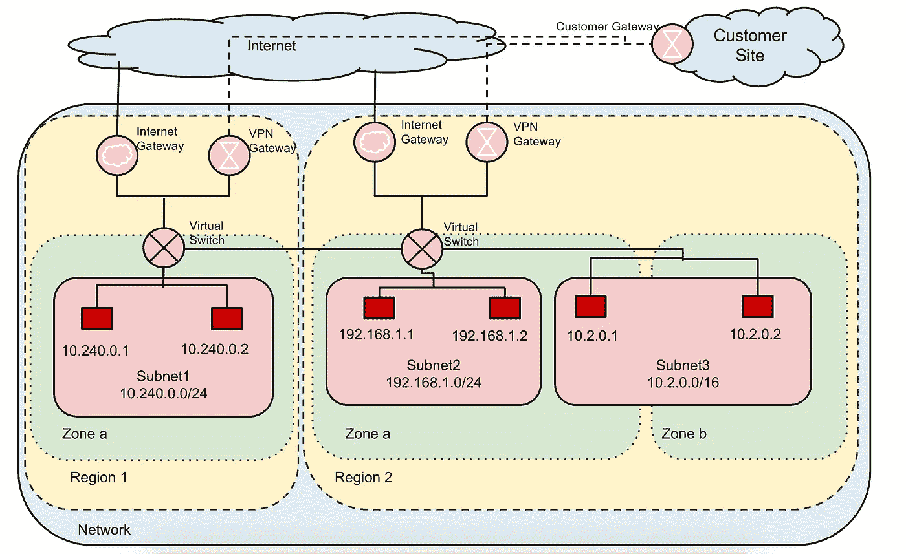

# 谷歌云平台的 a 到 Z 个人选择— F 代表防火墙

> 原文：<https://medium.com/google-cloud/a-to-z-of-google-cloud-platform-a-personal-selection-f-is-for-firewalls-3e45852630c9?source=collection_archive---------0----------------------->

我是深度防御的坚定信徒，在这篇文章中，我只想谈谈计算引擎防火墙，这是在 GCP 上使用计算引擎时的一个关键部分。

我假设您知道防火墙通常是如何在内部实施的，即通过实施一组规则来管理哪些流量可以在子网和互联网之间流动，哪些流量不可以在子网和互联网之间流动，这些规则根据端口、协议以及源和目标子网或 IP 地址来允许或禁止流量通过防火墙。

GCP 防火墙实际上在应用上非常相似，因为防火墙与网络相关联，所以 GCP 项目中的每个网络都有自己的防火墙来控制连接。

所有 GCP 项目都有一个默认网络，并有一个关联的默认防火墙规则。此默认防火墙具有以下规则:

***默认-允许-内部***

允许网络上实例之间的任何协议和端口的网络连接。

**默认-允许-ssh**

允许通过 TCP 端口 22 从任何源到网络上任何实例的 SSH 连接。

***默认-允许-rdp***

允许通过 TCP 端口 3389 从任何来源到网络上任何实例的 RDP 连接。

***默认-允许-icmp***

允许 ICMP 流量从任何来源流向网络上的任何实例

然而，当您创建新网络时，没有防火墙规则允许任何类型的连接。因此，在创建一个新网络之后，您需要[创建防火墙规则](https://cloud.google.com/compute/docs/networking#addingafirewall)来允许它与您的实例进行任何形式的连接。

实例必须与网络相关联，因此默认情况下，与该网络相关联的防火墙规则适用于该网络中的实例。如果您没有使用— network 标志明确说明实例应该部署到的网络，实例将被部署(或关联，这取决于您希望如何学究—在讨论这个问题时，部署对我来说听起来更自然)到默认的网络和连接中，并遵守与此相关的防火墙规则。

*注意:您可以向默认网络添加额外的防火墙规则*

默认情况下，一个 GCP 项目最多有 5 个网络(您可以通过提出配额请求来增加)，每个网络可以有多个相关联的防火墙规则。

GCP 也有[子网络](https://cloud.google.com/compute/docs/subnetworks#subnet_network)的概念。这允许您将您的网络划分为具有非重叠 [RFC1918](https://tools.ietf.org/html/rfc1918) 范围的块(子网)，即您可以在单个网络中定义和管理的私有 IPv4 地址范围。一个项目最多可以有 100 个子网，这些子网可以按照您认为合适的方式进行排列，即全部在一个网络中，或者分布在多个网络中(总共最多 5 个网络)

由于我不想转移话题谈论子网(我知道得太晚了！)希望文档中的下图能让您了解如何在区域边界内和跨区域边界配置子网。

我还建议在计划如何使用计算引擎配置任何应用程序之前，花点时间通读子网上的[文档，以防你想利用这个特性。](https://cloud.google.com/compute/docs/subnetworks#subnetworks)

子网不会改变我已经描述的防火墙规则的工作方式，但是您可能会问，如果这些规则适用于网络，您如何应用特定于子网的防火墙规则。标签就是答案！使用标记意味着您可以通过有选择地只允许某些实例进行通信，在子网之间创建额外的隔离。如果您安排子网中的所有实例共享同一个标记，您可以在防火墙规则中指定该标记，以模拟每个子网的防火墙。例如，如果您有一个名为 subnet-a 的子网，您可以用标记 my-subnet-a 标记 subnet-a 中的所有实例，并在防火墙规则目标标记中使用该标记或将其用作源范围。这些文档通过一个[很好的例子](https://cloud.google.com/compute/docs/subnetworks#subnetworks_and_firewall_rules)展示了使用带有防火墙规则的标签和子网