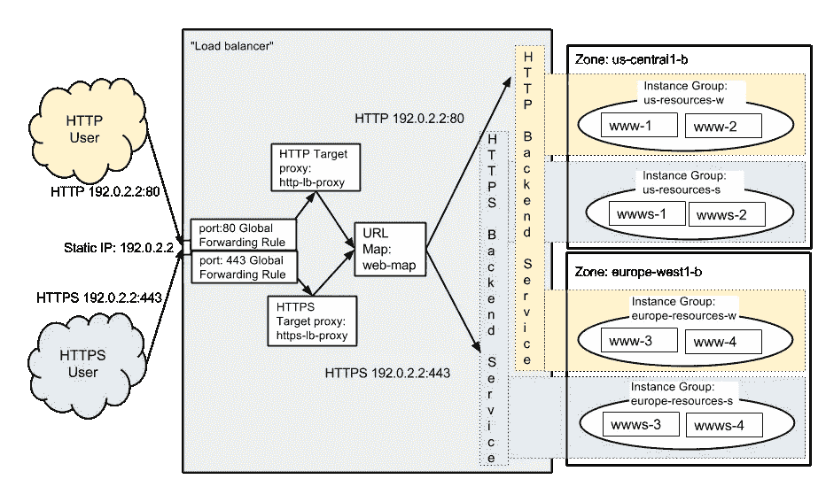
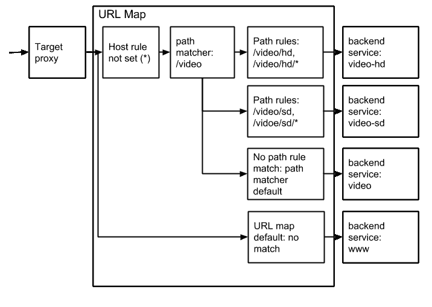

# Google 云平台的 a 到 Z 个人精选— G —全局负载均衡

> 原文：<https://medium.com/google-cloud/a-to-z-of-google-cloud-platform-a-personal-selection-g-global-load-balancing-82e1b8550298?source=collection_archive---------0----------------------->

在设计全球可访问的应用程序时，我遇到的两个最常见的难题是，如何确保在前端负载平衡服务横向扩展时不会出现与 DNS 传播相关的奇怪现象，以及如何将最终用户定向到离他们最近的区域的服务。目标是解决这两个问题，而不必在基础设施服务上花费过多的精力来解决它们。

我喜欢的是，使用 GCP 负载平衡，这些问题大多是现成的。(正如我所知道的每种情况一样，也有极端情况！)

具体来说，下面的负载平衡组件很好地解决了这个问题(尽管乍一看文档中的图表，它看起来可能比实际情况更复杂！)

*   全局转发规则
*   URL 映射
*   后端服务

要了解这些服务如何优雅地解决问题，我们首先需要了解负载平衡组件如何协同工作，因此我只是从文档中摘录了 GCP 负载平衡如何工作的描述:

1.  一个 [**全局转发规则**](https://cloud.google.com/compute/docs/load-balancing/http/global-forwarding-rules) 将传入的请求定向到一个 [**目标 HTTP(s)代理**](https://cloud.google.com/compute/docs/load-balancing/http/target-proxies) 。
2.  目标 HTTP(s)代理对照 [**URL 映射**](https://cloud.google.com/compute/docs/load-balancing/http/url-map) 检查每个请求，以确定请求的适当 [**后端服务**](https://cloud.google.com/compute/docs/load-balancing/http/backend-service) 。
3.  后端服务根据其连接的后端的服务容量、区域和实例健康状况，将每个请求定向到适当的后端。使用 HTTP [**健康检查**](https://cloud.google.com/compute/docs/load-balancing/health-checks) 或 HTTPS 健康检查来验证每个后端实例的健康状况。如果后端服务被配置为使用后者，请求将在到达后端实例的途中被加密。

现在，您已经了解了流程，让我们简单介绍一下我在开始时提到的组件，看看它们如何帮助解决我描述的棘手问题。

[全局转发规则](https://cloud.google.com/compute/docs/load-balancing/http/global-forwarding-rules)提供单个全局 IP 地址，这意味着当负载平衡器扩展时，IP 地址不会发生变化，从而避免了 DNS 传播问题。医生非常清楚地解释了我刚才吐出的血液流:

[后端服务](https://cloud.google.com/compute/docs/load-balancing/http/backend-service)是*的一个*集中式服务，管理一组[处理用户请求的实例](https://cloud.google.com/compute/docs/instance-groups/)。(在试图描述这一点时，医生可能会遇到有点笨拙的 imho)。该服务知道哪些实例是可用的和健康的，它们可以处理的流量，以及它们当前正在处理多少流量。

好吧，但是为什么我要叫他们出来？文件上说你可以在特定的区域配置后端，但关键是这些区域可以在不同的区域。是的，它内置于开箱即用的负载平衡服务中，允许您在特定地区和区域设置后端服务，然后使用 url 映射的魔力，您现在可以将流量定向到适当的后端，即将欧洲用户定向到欧洲地区的后端服务，将美国用户定向到美国地区的后端服务

在设置跨区域设置时，您所关心的是将用户引导到最近的区域，那么概括地说，您需要采取的步骤是:

1.  在您想要的区域中的分区中设置您的实例和实例组(我将跳过配置健康检查等细节，这是所需步骤的总结！)
2.  设置防火墙规则
3.  设置保留的静态全局 IP 地址
4.  创建具有关联全局转发规则的负载平衡器
5.  关联 IP 地址
6.  设置协议和证书
7.  为每个区域创建两个后端，并添加到负载平衡器

就是这样！这个场景真的就这样了。如果您的用户在使用负载平衡器时来自欧洲，那么他们将被定向到欧洲的实例，而来自美国的用户将被定向到美国的实例

一步一步的演练见[这里](https://cloud.google.com/compute/docs/load-balancing/http/cross-region-example)

但是 URL 映射呢？他们在那里施展魔法，但在这种情况下，默认的 URL 映射会为您处理这些问题，因此除了设置后端服务之外，您实际上不需要做任何特殊的事情，这并不复杂(请看示例)

使用下面的 gcloud 命令，您可以看到确实有一个默认的 URL 映射:

```
$ gcloud compute url-maps list
```

官方文档中的这张图片以图形方式展示了所有这些是如何组合在一起的:



所以你可以看到 URL 地图真的很时髦，而且它是所有酷的魔法真正发生的地方(反正我是这么认为的)。在我在这篇文章中谈论的场景中，细节是如此抽象，以至于你甚至不知道 URL 映射在那里做它的事情。

在许多情况下，虽然您想要进行更复杂的路由，但是您需要使用 [URL 映射资源](https://cloud.google.com/compute/docs/reference/latest/urlMaps)来配置 URL 映射，这些资源是您在创建 URL 映射时需要使用的属性

但是我觉得下面的图片简洁地展示了当你需要建立基于内容的规则时，URL 映射是如何工作的，而不是挠头。



希望这篇文章有助于理解 GCP 的负载平衡产品如何以一种非常优雅的方式解决一个难题。