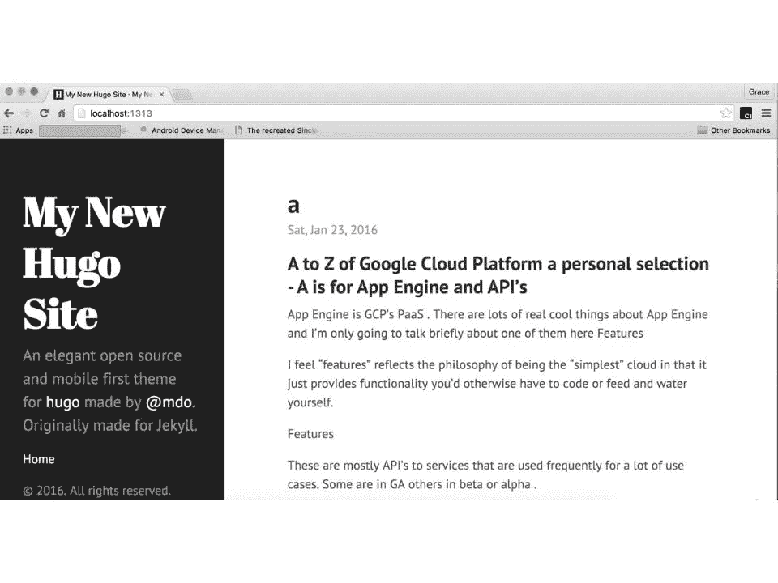
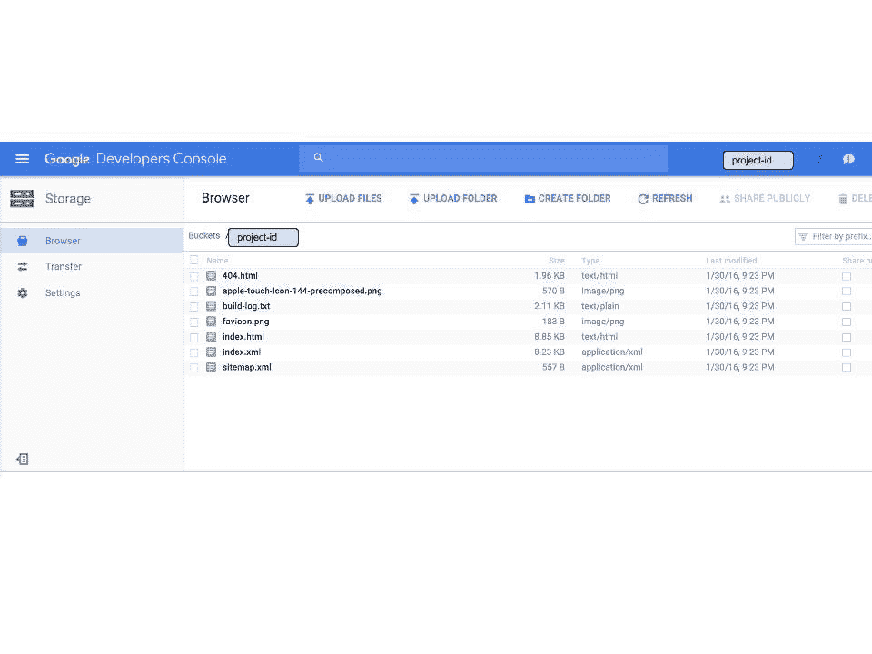

# 谷歌云平台的 a 到 Z 个人选择——H——托管静态网站

> 原文：<https://medium.com/google-cloud/a-to-z-of-google-cloud-platform-a-personal-selection-h-hosting-static-sites-1d0db2eb5d89?source=collection_archive---------1----------------------->

许多网站不需要网络服务器，因此也不需要相关的计算服务，因为服务器端基本上没有移动部件。因此，使用谷歌云存储(GCS)进行托管是一个理想的用例。

GCS imho 上托管的静态网站的优势包括:

*   表演
*   几乎没有运营开销
*   托管平台内置的可扩展性

在谷歌云存储(GCS)上托管一个静态站点可以归结为 5 个步骤:

1.  使用您选择的编辑器创建您的内容
2.  创建一个云存储桶
3.  设置一个 CNAME 记录，指向新创建的存储桶
4.  将您的内容上传到此桶
5.  使存储桶可公开浏览

如需完整浏览，请查看[文档](https://cloud.google.com/storage/docs/website-configuration?hl=en)。看看这篇关于在 GCS 上主持 [BaindAid 30](http://googlecloudplatform.blogspot.co.uk/2015/04/BandAid-30-on-Google-Cloud-Platform-Theres-more-than-one-way-to-skin-a-Web-server.html) 之旅的文章是如何从经济学角度来看的，值得一读。

很简单，但是我真正想谈论的是如何持续更新你的网站，也就是说，用构建和部署你的代码的方式来创建你的静态网站。

然后，我意识到，如果我试图把所有的内容都塞进一篇帖子里，我就会打破我自己强加的每一条规则，所以我将不得不分两部分来做这件事，并在本系列的后半部分回到第 2 部分。好的，继续…

使用静态生成器是能够进行持续更新的方法。

当我想到静态网站生成器时，我会想到一个通过将 [markdown](https://en.wikipedia.org/wiki/Markdown) 文件转换成 html 来自动创建完整静态网站的系统。系统通常有一个本地服务器，所以你可以实时看到你所做的改变。有很多静态站点生成器，当我在 github 上搜索静态站点生成器时，发现了 1744 个库。

我遇到的最流行的发电机往往是[杰基尔](http://jekyllrb.com/)、[雨果](https://gohugo.io/)或[幽灵](https://ghost.org/)中的一种

它们都按照我前面描述的方式生成页面。你选择一个而不是另一个的原因取决于什么样的“独特”特征对你来说是重要的。互联网上有很多帖子可以帮助你做出决定。

我要用 Hugo 帮我生成一个静态站点。我过去已经使用过 jekyll 和 ghost，但我喜欢 Hugo 是用 go 编写的，所以不需要太多依赖(Jekyll 需要 ruby 和 ghost node.js)。有了 Hugo，我可以直接下载二进制文件，不需要其他任何东西，所以我认为这是最干净的方法(这只是我的个人偏好，不过你可以自己决定使用哪个生成器)

好了，现在我已经设置好了我的 bucket，我现在需要在我的本地机器上安装 Hugo，创建一个文件夹来存储我的站点的文件，使用 Hugo 来生成我的站点的结构，创建一些内容，然后将文件上传到 GCS。

这最后一部分确实需要几分钟，取决于你有多少内容。扩展这 5 个步骤，我们现在有 8 个步骤

1.  创建一个云存储桶
2.  设置一个 CNAME 记录，指向新创建的存储桶
3.  安装 hugo
4.  生成本地文件结构
5.  使用您选择的编辑器创建内容
6.  使用本地 Hugo 服务器预览内容
7.  将您的内容上传到您的桶中
8.  使存储桶可公开浏览

然后，每当你做更新的时候，你真的冲洗并且重复步骤 5 到 7，并且运行本地 Hugo 服务器意味着你能在本地观看实时更新

下图显示了推送到我的桶中的内容。

如果你想从头到尾了解如何使用 HUGO 和 GCS 来充实 8 个步骤，请阅读 moxie.io 的这篇[好文章](http://www.moxie.io/post/static-websites-with-hugo-on-google-cloud-storage/)

很好，我听到你说，但是为什么是两个部分呢？

首先，我觉得停在这里是一个自然的突破，因为它显示了你可以多么快地开始托管自己的静态站点，因此是系列中的一个独立条目。这两部分中的下一部分是关于在这个基础上构建的。

其次是协作。以上对于单个创作者来说已经足够好了，但是当你有多个内容创作者时，这就变得不可行了。

第三，我也承认它给了我 J！

在接下来的部分(J 所以不要等太久！)我将使用 Jenkins 演示如何建立一个可以被多个贡献者使用的发布管道。我将解释如何将生成网站内容的本地文件夹推送到位于 GCP 的[云仓库](https://cloud.google.com/tools/cloud-repositories/docs/)。