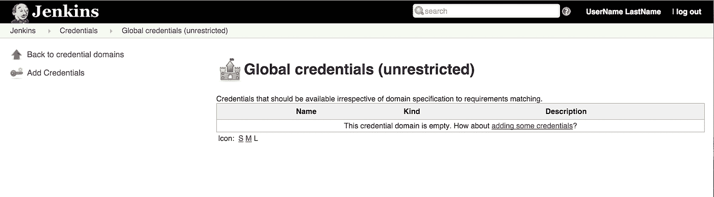
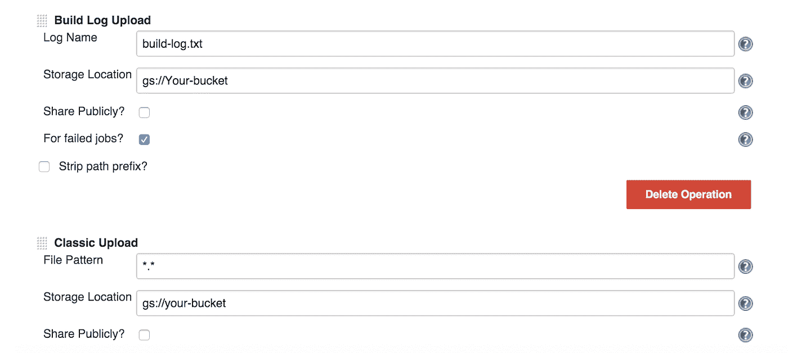

# 谷歌云平台的 a 到 Z 个人精选——J 代表詹金斯

> 原文：<https://medium.com/google-cloud/a-to-z-of-google-cloud-platform-a-personal-selection-j-is-for-jenkins-7a718d1f458?source=collection_archive---------0----------------------->

Jenkins 非常受欢迎，毫不奇怪，您可以轻松地将 Jenkins(和 Git)用作 CI/CD 管道的一部分，目标是在 GCP 计算服务(即计算引擎、应用引擎和容器引擎)上部署。

正如我想指出的，GCS(云存储)也是一个有效的目标，我将在这篇文章的后半部分详细介绍它！

有很多插件是专门针对 GCP 的，在这篇文章的第一部分，我所做的就是把它们和一些真正有用的插件(比如 Docker 的插件)聚集在一起。

要将 Jenkins 与您的 CI/CD 部署管道集成，您需要使用一系列专门针对 Google 云平台的插件。

如果你知道我遗漏了什么插件，请让我知道，这样我就可以随时更新列表。

[Google Container Registry Auth 插件](https://wiki.jenkins-ci.org/display/JENKINS/Google+Container+Registry+Auth+Plugin) —该插件提供凭证提供者使用 Google 云平台 OAuth 凭证(由 [Google OAuth 凭证插件](https://wiki.jenkins-ci.org/display/JENKINS/Google+OAuth+Plugin)提供)从[Google Container Registry(GCR)](https://cloud.google.com/tools/container-registry/)访问 Docker 图像

[Google 云存储插件](https://wiki.jenkins-ci.org/display/JENKINS/Google+Cloud+Storage+Plugin?focusedCommentId=73532097#comment-73532097) —该插件提供了“Google 云存储上传程序”后构建步骤，用于将构建工件发布到 Google 云存储

[Google OAuth 插件](https://wiki.jenkins-ci.org/display/JENKINS/Google+OAuth+Plugin) —该插件实现了 OAuth 凭证接口，用于向 Jenkins 显示 Google 服务帐户

[Google Source 插件](https://wiki.jenkins-ci.org/display/JENKINS/Google+Source+Plugin) —提供凭证提供者使用 Google 云平台 OAuth 凭证(由 [Google OAuth 凭证插件](https://wiki.jenkins-ci.org/display/JENKINS/Google+OAuth+Plugin)提供)从[https://source.developer.google.com](https://source.developer.google.com/)以及 [https://*.googlesource.com 访问源代码。](https://*.googlesource.com.)支持 [Google OAuth 凭证插件](https://wiki.jenkins-ci.org/display/JENKINS/Google+OAuth+Plugin)提供的两种凭证

[谷歌部署管理器插件](https://wiki.jenkins-ci.org/display/JENKINS/Google+Deployment+Manager+Plugin)。—提供使用[Google Cloud Deployment Manager](https://cloud.google.com/deployment-manager/)在 Jenkins jobs 中创建和删除 GCP 资源的能力

[Google 元数据插件](https://wiki.jenkins-ci.org/display/JENKINS/Google+Metadata+Plugin) —为构建生命周期中的步骤提供一个基本框架，以便将 JSON 可序列化的元数据附加到构建中

docker 镜像[这里的](https://github.com/GoogleCloudPlatform/jenkins-gcp-leader)可以用来创建一个 jenkins docker 实例，上面描述的插件会自动安装

Jclouds 插件这个插件提供了在 JClouds 支持的任何云提供商上启动 jenkins slaves 的能力。你可以用它来旋转运行在谷歌计算引擎上的詹金斯奴隶

还有一系列以 Docker 和 kubernetes 为中心的插件也值得配置:

[Kubernetes 插件](https://wiki.jenkins-ci.org/display/JENKINS/Kubernetes+Plugin) —允许您使用由 Kubernetes 管理的多个 docker 主机来动态配置一个从机(使用 Kubernetes 调度机制来优化负载)，运行一个构建，然后拆除该从机。

Docker 插件:

[Docker 构建步骤插件](https://wiki.jenkins-ci.org/display/JENKINS/Docker+build+step+plugin) —这个插件允许添加各种 [Docker](https://www.docker.com/) 命令到你的工作中作为构建步骤

docker 插件 —使用 Docker 主机动态提供一个从服务器，运行一个构建，然后拆除该从服务器。

[CloudBees Docker 定制构建环境插件](https://wiki.jenkins-ci.org/display/JENKINS/CloudBees+Docker+Custom+Build+Environment+Plugin)——让您配置您的构建在 Docker 容器内运行

[Jenkins 工作流插件](https://wiki.jenkins-ci.org/display/JENKINS/Workflow+Plugin) —一种基于 Groovy 的领域特定语言(DSL)，允许创建脚本化的工作流步骤

或者

[CloudBees Docker 工作流插件](http://documentation.cloudbees.com/docs/cje-user-guide/docker-workflow.html) —这提供了一种方便的领域特定语言(DSL ),用于从工作流脚本中执行连续部署管道中一些最常用的 Docker 操作。

好的，如果你一直在关注这个系列，你会知道我说过我会在这里结束托管静态站点的话题。因此，尽管上面关于插件的部分可以作为一个独立的条目来阅读，就像本系列前面的条目一样，这篇文章的其余部分假设你已经阅读或者至少熟悉 [H](/google-cloud/a-to-z-of-google-cloud-platform-a-personal-selection-h-hosting-static-sites-1d0db2eb5d89#.jtlk8d1v8) 的条目。这是一个实际操作的演练，所以如果你真的想继续下去，你可能想等到你坐在一台机器前再阅读这篇文章的其余部分。

*注意，从现在开始，如果你决定跟随*，我会做一些假设

*   *您已经拥有一个 GCP 帐户，并且安装了 g cloud command SDK*
*   *您已经设置了一个静态站点生成器，并设置了一个网站桶(出于本演练的目的，您不需要设置 DNS CNAME 记录来跟踪)。*
*   你知道如何使用 Jenkins，你不必知道，但我不会花时间谈论基础知识，而是专注于建立渠道所需的步骤。
*   *你对 git* 很熟悉
*   *请注意，这将产生费用，因此如果您不打算保留配置，请关闭/删除您的项目。*

如果你打算继续下去，我建议你先创建一个新项目。

通过键入以下命令检查您正在使用的项目，确保您使用的是正确的项目:

```
$ gcloud config list
```

如果它不是正确的项目，然后键入

```
$ gcloud config set project your-project-id
```

**使用您的内容和云存储库配置 Git**

这些步骤假设你正在使用 Hugo，因为这就是我所使用的，但是你可以使用任何你想要的静态站点生成器。您只需要调整下面的说明，以反映您的内容的位置

如果您还没有建立一些网页，那么请花时间使用静态站点生成器来创建一些本地页面。在 [H](/google-cloud/a-to-z-of-google-cloud-platform-a-personal-selection-h-hosting-static-sites-1d0db2eb5d89#.jtlk8d1v8) 的条目中，我讨论了使用 Hugo 来完成这个任务。

注意:使用 hugo 命令 sans server 将在您的工作目录中的一个公共文件夹中创建内容

接下来要做的事情是配置 [git](http://git-scm.com/) (详细安装 git 的细节已经超出了这篇破规则文章的范围，请点击相关链接)

切换到 Hugo 工作目录，通过输入以下命令初始化 public 文件夹中的 git

```
$ git init public
```

然后

```
$ cd public
```

登录云平台开发控制台

当您创建一个项目时，您会自动获得对云存储库的访问权。这个库需要初始化，所以从工具下的侧菜单选择开发，然后源代码。


单击“开始”按钮

选择将代码从本地 Git 存储库推送到您的云存储库


在公共文件夹中，按照如上所示的说明进行操作。

注意:这样做将重新初始化 g it，这样它将与你的云仓库同步。

对各种问题进行适当的回答

确保您为下面的两个问题选择了以下内容(这是因为我们的本地公共文件夹中已经有内容)

选择要使用的配置:

[1]使用新设置重新初始化此配置[默认]

[2]创建新配置

请输入您的数字选择:1

这个项目有一个或多个关联的 git 存储库。

选择 git 存储库克隆到您的本地机器:

[1][默认]

[2]不要克隆

请输入您的数字选择:2

然后使用 git 添加并提交文件


然后使用下面的命令将更改推送到您的远程存储库(在本例中是使用 git add 命令添加的所有文件)

```
$ git push --all google
```

现在，如果您查看存储库，您会看到您推送的文件。


**创建一个用于托管静态网站的桶**

创建一个目标存储桶来托管您的静态网站。有关讨论，请参见本系列中的 [H](/google-cloud/a-to-z-of-google-cloud-platform-a-personal-selection-h-hosting-static-sites-1d0db2eb5d89#.jtlk8d1v8) 条目。

出于本演练的目的，我们不需要设置 CNAME，因为这是我们正在查看的管道机制。

创建一个桶

在这个阶段让它空着

**设置 Jenkins 使用 GCP 资源**

首先，在这个阶段，我希望你熟悉詹金斯，因为它的用户界面无处不在，找到正确的地方做事情会令人沮丧，所以在这一部分有很多截图！

当你设置你的 Jenkins 实例时，一个重要的警告是立即更改密码(是的，我是故意这么说的)试着不要把自己锁在外面，因为我已经有一段时间没碰过 JENKINS 了..随便说说:-)

GCP 在 github 上发表了一篇文章，详细介绍了如何设置一个[高可用的 Jenkins 配置](https://github.com/GoogleCloudPlatform/kube-jenkins-imager)。正如我所熟悉的，我用它启动了一个 jenkins 服务器。你可能会发现使用[的 bitnami jenkins 图像](https://cloud.google.com/launcher/solution/bitnami-launchpad/jenkins?q=jenkins)更简单。

不管您决定如何部署 jenkins，我下面概述的 jenkins 配置步骤都应该可以工作，但是我还没有测试 bitnami 映像，所以不要引用我的话:-)

一旦你让詹金斯开始

记下您的云存储库 url，或者在控制台的存储库设置页面上打开一个选项卡

启动詹金斯图像。

一旦准备好使用

登录

注意:这两种方法都已经安装了所需的插件，所以您需要做的只是配置它。

首先创建一个凭证，方法是单击左侧导航中的凭证链接，然后单击全局凭证链接，再单击“添加一些凭证如何？”环



单击确定

从元数据中选择 Google 服务帐户


如果看到，请单击“创建新作业”,或者单击左侧导航中的“新建项目”。选择自由式项目，在项目框中输入作业名称


在源代码管理下，选择 Git 并从存储库设置页面粘贴到您的存储库 URL 中


配置构建后步骤，如下所示:



因此，在这个阶段，我们在您的存储库中有您的网页(和构建日志。对于生产环境，您会将日志推送到不同的存储桶，而您的存储桶是空的。

现在，从新创建的 jobs 页面中选择 build now。

假设您已经遵循了构建工件上面的步骤，在本例中，hugo 工作文件夹的 public 文件夹中的文件已经被复制到您之前创建的 bucket 中。

通过查看 Google 云存储上传报告以及 bucket 本身，您可以看到从 jenkins 内部复制到 bucket 的内容


现在您已经有了一些内容，您可以配置 bucket 来服务静态页面，如本系列中 H 的文章中所讨论的

Jenkins 可以设置为轮询任何更改，并自动将更改推送到目标桶，或者您可以调用手动构建和推送。

您可能需要做一些调整，但是您应该看到在您的公共文件夹中创建额外的文件，执行 git commit & push，然后手动或自动触发构建，更新的文件被推送到您的目标 bucket。

将 jenkins 和云存储库添加到您的管道中，您可以:

*   像对待提供版本控制和回滚到特定时间点的能力的代码一样对待网站内容。
*   现在，您可以轻松地添加贡献者，您需要授予他们访问项目的权限，这样他们就可以使用 git 来保持本地副本同步，并将更改推送到存储库。