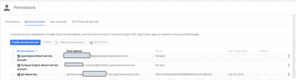

# 谷歌云平台的 a 到 Z 个人选择——K 代表键

> 原文：<https://medium.com/google-cloud/a-to-z-of-google-cloud-platform-a-personal-selection-k-is-for-keys-10bc0cdf7e47?source=collection_archive---------1----------------------->

对于 K，我想触及一些关键的相关主题。

当使用 GCP 时，您不可避免地要使用 API 密钥、用于登录的 SSH 密钥以及用于加密静态数据的加密密钥。因此，我将在这里谈一谈这些(虽然我只是触及表面！)

默认情况下，Compute Engine 会对所有静态数据进行加密，并为您管理这种加密，而无需您执行任何其他操作。有各种各样的原因，我不会在这里深入讨论您可能想要使用自己的加密密钥。

但是密钥管理很难，您需要确保您有适当的流程来管理以下事项:

*   密钥存储
*   密钥分发
*   密钥撤销
*   密钥旋转
*   保护密钥不被未授权用户使用
*   密钥恢复

我不打算讨论这些问题，因为这超出了讨论范围，而且有大量的文章讨论这些问题以及解决这些问题的方法。

关于密钥管理系统，我只是想让你知道，假设你有一个合适的密钥管理系统，你实际上可以带自己的钥匙(BYOK)和 GCP 一起使用。阅读[此处](https://cloud.google.com/compute/docs/disks/customer-supplied-encryption)了解如何在 GCE 中使用您自己的密钥，或[此处](https://cloud.google.com/storage/docs/encryption)了解在 GCS 中使用相同密钥的详细信息。

现在看起来是一个接触 SSH 以及如何添加和删除 GCE 实例的额外 SSH 键的好地方，看两种不同的方法(我知道我知道！) .

**宋承宪**

默认情况下，项目所有者和编辑可以 SSH 到 GCE 实例中，但是您可能希望在实例上为其他用户或应用程序使用额外的 SSH 密钥。你可以用 GCP 做到这一点，这里有记录。

做这件事时，我想提请注意几点:。

*   计算引擎通过向项目元数据添加公钥来管理 SSH 密钥。项目元数据应用于项目中的所有实例，因此向项目元数据中添加一个公共密钥将赋予该密钥对项目中所有实例的 SSH 访问权限
*   将 SSH 密钥添加到元数据时，您将负责分发、撤销、恢复、循环等

您还可以将单个的[用户帐户](https://cloud.google.com/compute/docs/access/user-accounts/)添加到您的项目中，如果您使用

```
gcloud beta compute users create [USERNAME — owner user@example.com]
```

要创建用户帐户，请使用以下命令

```
gcloud beta compute ssh [USERNAME@]INSTANCE
```

这将自动为该帐户生成一个公钥/私钥对，并允许您登录。

(注意，您也可以通过使用 API 调用或控制台来完成上述 gcloud 命令所做的事情)

请注意，这与我之前谈到的场景不同，在这个场景中，它使用用户帐户登录到实例，而前一个场景使用 gcloud compute ssh 命令，该命令使用[元数据 ssh 密钥](https://cloud.google.com/compute/docs/instances/managing-ssh-keys)，忽略任何用户帐户。

您可以使用以下命令轻松删除帐户并撤销 SSH 访问权限:

```
gcloud beta compute users delete USERNAME
```

要删除用户

和

```
gcloud beta compute users remove-keys [USERNAME]
```

撤销帐户的所有公钥

那么，在什么情况下应该使用一种方法而不是另一种方法呢？我认为元数据方法非常适合那些希望对项目中的每个实例使用 SSH 密钥的场景，而第二种方法对于用户访问项目中较小的一组实例来说无疑是一种非常好的方法。

无论如何，在这一点上提到 GCP 命令行工具 [gcloud](https://cloud.google.com/sdk/gcloud/) 对我来说是有意义的。这允许您从命令行管理 GCP 资源。

它使用了 [oauth 2.0](https://developers.google.com/identity/protocols/OAuth2) (在那个链接中有一些很好的图表，它们比我解释 oauth 2.0 如何工作要好得多)。这里很好地描述了实际流程[。如果您想知道 oauth 流创建的凭证在哪里，它们在~/中。配置/gcloud](https://cloud.google.com/compute/docs/gcloud-compute/#auth)

**API 凭证**

[服务帐户](https://cloud.google.com/compute/docs/authentication)是特殊的帐户，可以将访问范围缩小到您需要的 GCP 资源。至关重要的是，这些帐户的密钥管理可以由 GCP 管理，GCP 管理密钥轮换，当您的应用程序在 GCE 和 GAE 上运行时，这是您应该采用的方法(它无缝地工作)

但是，如果您需要从本地或其他云访问 GCP 资源，那么您需要[创建并下载密钥](https://cloud.google.com/storage/docs/authentication#generating-a-private-key)。

私钥可以 JSON 和 PKCS12 格式下载。与密钥相关联的是一些附加信息，即电子邮件地址和客户端 ID。如果查看控制台，您会看到与生成的密钥相关联的标识符:



关于密钥管理的常见警告适用

我不想对服务帐户不公，但是我想说花一点时间阅读和理解关于使用[服务帐户](https://cloud.google.com/compute/docs/api/how-tos/authorization)来授权对 GCP API 的请求。

对于需要使用自己的密钥来加密和解密数据的情况，服务帐户和自带密钥的组合可能是实现这一点的方法。服务帐户与 GCP 资源通信，并使用您自己的密钥来加密和解密数据。

我要感谢我的同事 Vic @vicnastea，他好心地帮我审阅了这篇文章。印象深刻的是，他也没有抱怨我对字母“z”的回避😃